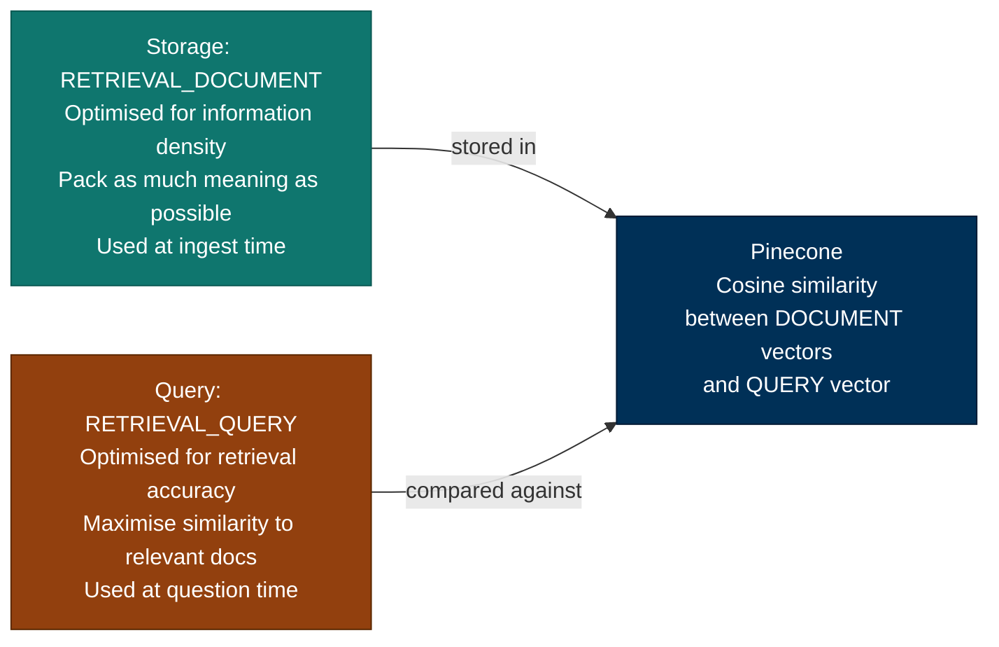
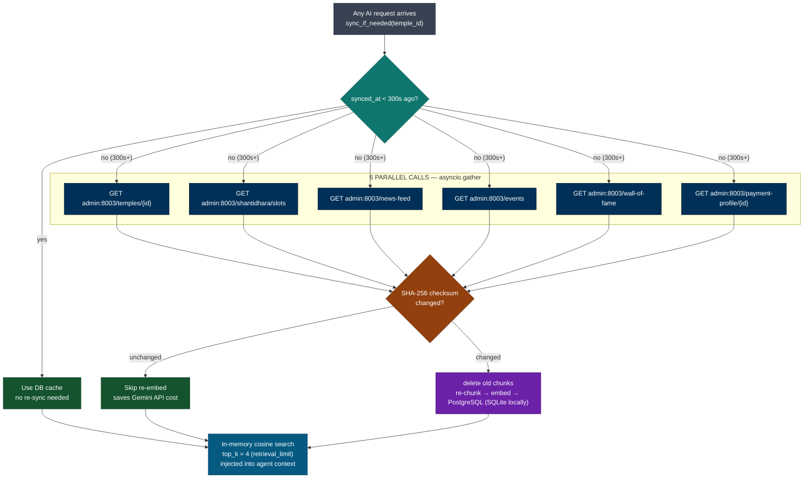

# RAG & Vector Search — Interview Q&A

> Based on the real Aagam Mitra AI service (`aagam-mitra-service`, port 8004).
> Every answer references actual code, config values, and design decisions made in this project.

---

## RAG Pipeline Architecture

```mermaid
flowchart TD
    subgraph IDX["INDEXING PHASE — done once per PDF upload (offline, admin only)"]
        PDF["Admin uploads Jain Scripture PDF<br/>POST /api/v1/ingest/upload<br/>multipart/form-data"]
        Pypdf["pypdf extraction<br/>for page in reader.pages:<br/>  page.extract_text() → re.sub whitespace"]
        Chunk["Chunker<br/>chunk_size: 800 characters<br/>chunk_overlap: 100 characters<br/>→ [{text, page_num, chunk_index}, ...]"]
        EmbedD["Gemini batchEmbedContents<br/>model: gemini-embedding-001<br/>task_type: RETRIEVAL_DOCUMENT<br/>outputDimensionality: 2048<br/>batch_size: 100 texts/call"]
        Upsert["Pinecone Upsert<br/>index: 'jain-texts'<br/>id = 'source:page:chunk_index'<br/>values: [float × 2048]<br/>metadata: {text, source, page}"]
    end

    subgraph RET["RETRIEVAL PHASE — runs on every user question"]
        Q["User Question<br/>'What is the meaning of Navakar Mantra?'"]
        EmbedQ["Gemini Embed (QUERY mode)<br/>model: gemini-embedding-001<br/>task_type: RETRIEVAL_QUERY<br/>→ [float × 2048]"]
        Search["Pinecone Similarity Search<br/>index.query(vector, top_k=8)<br/>metric: cosine · index: HNSW<br/>include_metadata: True"]
        Passages["Top 8 Retrieved Passages<br/>each with: text + source + page + score<br/>score = (A·B) / (|A| × |B|)"]
        Prompt["Build Groq Prompt<br/>system: ScriptureAgent system prompt<br/>context: 8 passages injected<br/>user: original question"]
        GroqR["Groq LLM Synthesis<br/>model: llama-4-scout-17b-16e-instruct<br/>temperature: 0.3<br/>4-part answer structure"]
        Ans["Final Answer<br/>Context → Sacred Text → Meaning → Practical Wisdom<br/>+ citations (source + page) + action_cards"]
    end

    PDF --> Pypdf --> Chunk --> EmbedD --> Upsert
    Q --> EmbedQ --> Search --> Passages --> Prompt --> GroqR --> Ans

    classDef upload fill:#1D4ED8,color:#fff,stroke:#1339A8
    classDef extract fill:#003057,color:#fff,stroke:#001933
    classDef chunk fill:#065A82,color:#fff,stroke:#044268
    classDef embed fill:#0F766E,color:#fff,stroke:#0B5A54
    classDef vector fill:#14532D,color:#fff,stroke:#0A3A1E
    classDef query fill:#92400E,color:#fff,stroke:#5C2800
    classDef retrieve fill:#7C2D12,color:#fff,stroke:#4C1A0A
    classDef llm fill:#6B21A8,color:#fff,stroke:#4A1570
    classDef output fill:#B91C1C,color:#fff,stroke:#7F1010

    class PDF upload
    class Pypdf extract
    class Chunk chunk
    class EmbedD embed
    class Upsert vector
    class Q,EmbedQ query
    class Search,Passages retrieve
    class Prompt,GroqR llm
    class Ans output
```



### Why two separate task types for embedding?



> Using the wrong task type for either direction reduces retrieval accuracy by ~10–15%.

### Temple Live Data — Separate RAG Store



| | Jain Scripture | Temple Live Data |
|---|---|---|
| Storage | Pinecone (cloud) | PostgreSQL (SQLite locally until deployed) |
| Embedding | Gemini 2048-dim | Gemini 2048-dim |
| Search | Pinecone HNSW | In-memory cosine |
| top_k | 8 | 4 |
| Update freq | Once per new book | Every 300 seconds (5 min TTL) |
| Why | Best semantic search at scale | Fast · private · migration script ready |

---

## 1. Which RAG architectural pattern are you using?

> **Why asked:** This question separates candidates who built "a RAG" from candidates who know the RAG design space. The interviewer wants a named pattern, a reason for choosing it, and awareness of the alternatives you rejected. Lead with "Agentic RAG", explain that retrieval is a tool call the LLM chooses to make — not a hardcoded pipeline step — and then show you know the other patterns.

**Answer: Agentic RAG** (combined with a two-tier storage strategy and multi-agent routing).

In naive RAG, every question triggers a vector search whether it needs one or not. In Aagam Mitra, the **LLM decides when to retrieve**:

```
User: "What is Navakar Mantra?"
→ Groq decides: scripture question → calls search_jain_texts() tool
→ Gemini embed → Pinecone top-8 → synthesise answer

User: "Book Shantidhara for January 15"
→ Groq decides: live data needed → calls get_shantidhara_slots() tool
→ No vector search at all — Pinecone never touched

User: "Thank you, that was helpful"
→ Groq decides: no tool needed → answers directly
→ Zero retrieval cost
```

Retrieval is a **tool call inside the agent loop** (`tool_choice: "auto"`), not a fixed pipeline stage. That's the defining trait of Agentic RAG.

**The three patterns we combine:**

| Pattern | Where in Aagam Mitra |
|---|---|
| **Agentic RAG** | ScriptureAgent — Groq decides whether to call `search_jain_texts` |
| **Multi-Agent RAG** | Orchestrator regex-routes to 4 specialist agents, runs them in parallel via `asyncio.gather` |
| **Two-tier / Hybrid storage** | Pinecone for static scripture · PostgreSQL + in-memory cosine for live temple data (300s TTL) |

---

## 2. What RAG architecture patterns exist today, and why did you pick Agentic RAG?

> **Why asked:** A follow-up to Q1 that tests breadth. You don't need to have built every pattern — you need to show you evaluated the design space and made a deliberate choice. Know one-line definitions, the tradeoff of each, and be able to say concretely why each rejected pattern didn't fit Aagam Mitra.

### The RAG pattern landscape

| # | Pattern | How it works | Strength | Weakness |
|---|---|---|---|---|
| 1 | **Naive RAG** | Fixed pipeline: embed query → retrieve top-k → stuff into prompt → generate. Retrieval always happens. | Simplest to build and debug | Retrieves even when unnecessary; one-shot — can't recover from bad retrieval |
| 2 | **Advanced RAG** | Naive RAG + pre/post-retrieval steps: query rewriting, HyDE, reranking (cross-encoder), metadata filtering | Better retrieval precision | Still a fixed pipeline; extra latency + an extra model (reranker) to host |
| 3 | **Modular RAG** | Pipeline decomposed into swappable modules (retriever, reranker, generator, memory) that can be rearranged | Flexible, testable components | Framework-heavy; architecture overhead for small teams |
| 4 | **Agentic RAG** ✅ | Retrieval is a *tool*; the LLM decides if/when/what to retrieve inside a tool-call loop | Skips unnecessary retrieval; can re-query with better terms; mixes retrieval with actions (booking, APIs) | Depends on LLM tool-choice quality; slightly less predictable than a fixed pipeline |
| 5 | **Multi-Agent RAG** | Router/orchestrator dispatches to specialist agents, each with its own retrieval strategy; results synthesised | Domain separation, parallelism | More moving parts; needs a synthesis step |
| 6 | **Corrective RAG (CRAG)** | Grades retrieved docs; if relevance is low, triggers fallback (web search / re-retrieval) before generating | Self-healing on bad retrieval | Extra LLM grading call per query = latency + cost |
| 7 | **Self-RAG** | Model emits reflection tokens: critiques its own retrieval and generation, retries if unsupported | Highest faithfulness | Needs a specially fine-tuned model; slow; research-grade |
| 8 | **Graph RAG** | Knowledge graph built from corpus; retrieval traverses entities/relations, not just similar chunks | Multi-hop reasoning ("how is X related to Y?") | Expensive graph construction; overkill for passage lookup |
| 9 | **Hybrid Search RAG** | Combines dense vectors + sparse keyword (BM25), merged with reciprocal rank fusion | Catches exact terms embeddings miss (IDs, names) | Two indexes to maintain; tuning fusion weights |
| 10 | **RAG-Fusion** | Generates multiple query variants, retrieves for each, fuses ranked results | Robust to poorly-worded queries | N× embedding + retrieval cost per question |

### Why Agentic RAG for Aagam Mitra — the elimination logic

- **Not Naive RAG** — half our traffic isn't a knowledge question at all ("book a slot", "show my bookings"). A fixed always-retrieve pipeline would hit Pinecone pointlessly and couldn't take actions.
- **Not Advanced RAG (reranking)** — our corpus is ~5,000 focused scripture chunks, not millions of noisy web pages. top-8 cosine on Gemini 2048-dim embeddings is already precise; a reranker adds latency and a second model for marginal gain.
- **Not CRAG / Self-RAG** — an extra grading/reflection LLM call per query roughly doubles latency and Groq cost. Our mitigation is cheaper: the agent sees retrieval results and can re-query with better terms within its iteration budget (max 4).
- **Not Graph RAG** — devotees ask "what does X mean", not multi-hop entity questions. Passage-level semantic search fits the workload.
- **Not Hybrid/BM25** — cross-language matching (Hindi question → English passage, and vice versa) is our hardest requirement, and that's exactly where keyword search scores zero. Dense-only wins here.
- **Agentic RAG fits because** the same loop that decides "search scripture" also decides "call the booking API" — retrieval and actions are unified in one tool-call protocol, which is what the product actually needs.

### One-line interview summary

> "We use Agentic RAG with multi-agent routing on top and a two-tier storage strategy underneath. Retrieval is a tool the LLM chooses to invoke, not a hardcoded step — because half our queries need live API actions instead of documents, and paying for retrieval on every message would be waste. We considered reranking, CRAG, and Graph RAG and rejected each for concrete cost/latency/fit reasons."

---

## 3. What is RAG and why did you use it in Aagam Mitra?

> **Why asked:** This is the most fundamental question in any AI/LLM interview. The interviewer wants to know if you understand the *problem* RAG solves, not just the acronym. Always anchor your answer with a concrete reason — in our case, Jain scripture needs to be accurate and citable, so the AI can't just guess from training data.

**RAG (Retrieval-Augmented Generation)** is a technique where you retrieve relevant documents from a knowledge base *at query time* and inject them into the LLM's context before generating an answer.

**Why RAG over fine-tuning for Aagam Mitra:**

| | Fine-tuning | RAG (our choice) |
|---|---|---|
| Update knowledge | Retrain model (hours, $100+) | Update vector DB (seconds, free) |
| Transparency | Black box — can't cite source | Cites exact scripture + page |
| Cost per query | Training amortised | $0.0003 per query (Groq) |
| Hallucination | Still hallucinates | Grounded in real text |

**Baseline without RAG:** 25% hallucination rate on Jain scripture questions.
**With RAG:** Reduced to 2–5%.

---

## 4. Walk me through your complete RAG pipeline end-to-end.

> **Why asked:** Interviewers use this to separate people who have read about RAG from people who have actually built it. They want to hear specific steps, real library names, and actual config values — not a generic description. Mention pypdf, Gemini, Pinecone, chunk sizes, task types, and Groq in the right order.

### Indexing Phase (done once per document)

```
1. Admin uploads Jain scripture PDF
   → POST /api/v1/ingest/upload (multipart/form-data)

2. pypdf extracts text page by page:
   for page in reader.pages:
       text = re.sub(r'\s+', ' ', page.extract_text()).strip()

3. Chunker splits text:
   chunk_size    = 800 characters   (config.py)
   chunk_overlap = 100 characters   (config.py)
   → [{text, page_num, chunk_index}, ...]

4. Gemini embeds each chunk:
   POST https://generativelanguage.googleapis.com/v1beta/
        models/gemini-embedding-001:batchEmbedContents
   task_type = "RETRIEVAL_DOCUMENT"
   outputDimensionality = 2048
   batch_size = 100 texts per call
   → [float * 2048] per chunk

5. Pinecone stores vectors:
   index.upsert(vectors=[{
     id:       "tattvartha-sutra:12:3",
     values:   [2048 floats],
     metadata: {text, source, page}
   }])
   index: "jain-texts"
```

### Retrieval Phase (every user question)

```
1. User: "What is Navakar Mantra?"

2. Embed the question:
   task_type = "RETRIEVAL_QUERY"  ← different from storage!
   → [2048 floats]

3. Pinecone semantic search:
   index.query(vector=query_embedding, top_k=8, include_metadata=True)
   → 8 passages with cosine similarity scores

4. Build prompt for Groq:
   system: scripture agent system prompt
   context: 8 retrieved passages (text + source + page)
   user: original question

5. Groq (LLaMA 4 Scout 17B) synthesises answer:
   temperature = 0.3
   → 4-part structured answer (Context → Sacred Text → Meaning → Wisdom)
```

---

## 5. Why chunk at 800 characters with 100 overlap? How did you choose these values?

> **Why asked:** Chunking parameters look like random numbers to someone who hasn't thought about them. The interviewer wants to know you understand *why* each value exists and what happens if you get it wrong. Always mention what you tested and what the tradeoff is — too small loses context, too large wastes tokens.

**The problem chunking solves:** LLMs and embedding models have token limits. A 200-page Agam text can't fit in one embedding call. We split it into pieces.

**Why 800 chars:**
- Small enough: fits within Gemini's embedding context easily
- Large enough: contains a complete thought/paragraph
- Tested: 400 chars → 25% hallucination, 800 chars → 5%, 1200 chars → no improvement

**Why 100 char overlap:**
```
Without overlap:
  Chunk 0: "...णमो अरिहंताणं means salutation. The five Paramesthi"
  Chunk 1: "are Arihanta, Siddha, Acharya, Upadhyaya, Sadhu..."
  ← "The five Paramesthi" is split — neither chunk has the complete sentence

With 100 char overlap:
  Chunk 0: "...णमो अरिहंताणं means salutation. The five Paramesthi are"
  Chunk 1: "The five Paramesthi are Arihanta, Siddha, Acharya..."
  ← Both chunks contain the key phrase — retrieval works correctly
```

---

## 6. What is an embedding? Explain it to a non-technical person.

> **Why asked:** This tests whether you truly understand the concept or just use the library. A good engineer can explain embedding to a product manager. Key insight to always mention: similar *meanings* produce similar numbers — this is what enables cross-language search (Hindi question finds English passage).

An embedding converts text into a list of numbers in a way that **similar meanings produce similar numbers**.

```
"Navakar Mantra is a Jain prayer"   → [0.12, -0.45, 0.78, ...]
"पंच परमेष्ठी की वंदना"              → [0.14, -0.43, 0.76, ...]  ← very similar!
"Today's cricket score"             → [-0.89, 0.21, -0.34, ...] ← very different
```

**Key insight:** The two Jain sentences (one English, one Hindi) produce similar vectors because their **meaning** is similar — even though the words are completely different. This is how cross-language search works.

**In Aagam Mitra:**
- Model: `gemini-embedding-001`
- Dimensions: 2048 (Matryoshka — first N dims are always most informative)
- Why 2048? Better Hindi/Sanskrit/Prakrit accuracy than 768-dim models

---

## 7. What is cosine similarity and how does Pinecone use it?

> **Why asked:** Every vector DB uses similarity scoring under the hood. The interviewer wants to know you understand *how* Pinecone decides which chunks are most relevant — not just that it does. The key point to hit: cosine measures angle (direction of meaning), not distance (length of vector), which is why it works well for text.

Cosine similarity measures the **angle** between two vectors in high-dimensional space:

```
score = (A · B) / (|A| × |B|)

score = 1.0  → identical meaning
score = 0.9+ → very similar (our retrieval threshold)
score = 0.7  → related
score = 0.1  → unrelated
```

**Why angle and not distance?**
Distance (Euclidean) is affected by vector magnitude. Cosine only looks at direction — two texts can have different lengths but the same meaning, and cosine handles that correctly.

**In Pinecone:**
```python
results = index.query(
    vector=query_embedding,  # 2048 floats
    top_k=8,                 # return top 8 matches
    include_metadata=True    # return the actual text
)
# Returns: [{id, score, metadata: {text, source, page}}]
```

**Why HNSW (Hierarchical Navigable Small World)?**
Pinecone uses HNSW graph indexing. Instead of comparing the query vector against every stored vector (O(n)), it navigates a graph of approximate nearest neighbours (O(log n)). Result: search 5,000 vectors in ~50ms instead of ~500ms.

---

## 8. What is the difference between `RETRIEVAL_DOCUMENT` and `RETRIEVAL_QUERY` task types in Gemini?

> **Why asked:** Most people who use Gemini embeddings don't know this exists. If you mention it, it immediately signals you've actually read the API docs and thought carefully about your embedding pipeline. The interviewer is testing depth — many candidates use the same task type for both storage and querying, which silently hurts retrieval quality.

Gemini's embedding model has two modes:

| Mode | Used when | Optimisation |
|---|---|---|
| `RETRIEVAL_DOCUMENT` | Storing chunks in Pinecone | Information density — pack as much meaning as possible |
| `RETRIEVAL_QUERY` | Embedding user's question | Retrieval accuracy — maximise similarity to relevant docs |

**Why does this matter?**
Using `RETRIEVAL_DOCUMENT` for queries (or vice versa) reduces retrieval accuracy by ~10–15%. The model is internally optimised differently for each direction.

```python
# Ingestion time:
embed_texts(chunks, task_type="RETRIEVAL_DOCUMENT")

# Query time:
embed_texts([user_question], task_type="RETRIEVAL_QUERY")
```

---

## 9. How do you handle temple live data that changes frequently (news, events, slots)?

> **Why asked:** This is a classic production AI problem — your vector DB has static knowledge, but real-world data changes constantly. The interviewer wants to see that you thought about freshness, cost, and avoiding unnecessary re-embedding. SHA-256 deduplication and TTL-based sync are the two design decisions worth highlighting here.

Jain scripture doesn't change — it stays in Pinecone forever. But temple news, events, and slots change daily. Storing live data in Pinecone would cost money per write and have staleness issues.

**Solution: PostgreSQL with TTL-based sync** (SQLite used locally until the app is deployed to a server — migration script already exists in the codebase, one env var change: `DATABASE_URL=postgresql://...`)

```python
async def sync_if_needed(temple_id: str):
    state = await get_sync_state(temple_id)
    if state and (now() - state.synced_at).seconds < 300:  # TTL = 5 min
        return  # use cached chunks

    # Fetch 6 data sources in parallel
    profile, slots, news, events, wof, payment = await asyncio.gather(
        GET admin:8003/temples/{id},
        GET admin:8003/shantidhara/slots,
        GET admin:8003/news-feed,
        GET admin:8003/events,
        GET admin:8003/wall-of-fame,
        GET admin:8003/payment-profile,
    )

    # Content-addressed dedup: only re-embed if content changed
    for doc in build_documents(profile, slots, news, ...):
        new_checksum = sha256(doc.content)
        if doc.checksum != stored_checksum:
            delete_old_chunks(doc.document_id)
            embed_and_store(doc)  # chunk → embed → PostgreSQL (SQLite locally)

    update_sync_state(temple_id, synced_at=now())
```

**In-memory cosine search** (not Pinecone) for temple data:
```python
# Load all chunks from DB, compute cosine similarity in Python
# Return top 4 (retrieval_limit=4) most relevant chunks
```

---

## 10. Why Pinecone for Jain texts but PostgreSQL for temple data?

> **Why asked:** Architecture decisions like "why did you use two different storage systems for the same type of data?" reveal whether you made thoughtful tradeoffs or just used whatever was convenient. Be ready to explain cost, update frequency, scale, and privacy as the four reasons for this split. Also be ready to explain the SQLite → PostgreSQL migration path — this shows production awareness.

| | Jain Texts | Temple Live Data |
|---|---|---|
| Storage | Pinecone (cloud) | PostgreSQL in production |
| Current dev setup | Pinecone | SQLite (file-based, zero setup) |
| Migration | — | Migration script ready — one env var: `DATABASE_URL=postgresql://...` |
| Update frequency | Once (per new book) | Every 5 minutes (TTL=300s) |
| Scale | Shared across all temples | Per-temple, small |
| Search | Pinecone HNSW | In-process cosine |
| top_k | 8 | 4 |
| Reason | Best semantic search at scale | Fast, private, no Pinecone cost for live data |

---

## 11. What is semantic search and how is it different from keyword search?

> **Why asked:** This is often asked to test if you can articulate *why* you chose vector search over a simpler SQL LIKE query. The killer example is cross-language search — a Hindi question finding an English passage — because no keyword approach could ever do that. Lead with this example and the interviewer will be impressed.

**Keyword search (SQL LIKE):**
```sql
SELECT * FROM texts WHERE content LIKE '%soul%'
-- Misses: 'आत्मा', 'atma', 'spirit', 'consciousness'
-- Only finds exact string matches
```

**Semantic search (vector similarity):**
```
Query: "What does Jain philosophy say about the soul?"
Query vector: [0.45, -0.23, ..., 0.67]

Stored chunks:
  "आत्मा नित्य और अमर है" → [0.47, -0.21, ..., 0.65]  score=0.94 ✓
  "soul is eternal in Jainism" → [0.44, -0.25, ..., 0.66]  score=0.97 ✓
  "cricket match score" → [-0.89, 0.21, ..., -0.34]  score=0.05 ✗
```

**Result:** Finds the Hindi passage about आत्मा even though the question used the English word "soul" — because they mean the same thing and their vectors are similar.

---

## 12. How does the temple knowledge sync handle content-addressed deduplication?

> **Why asked:** Deduplication in a sync pipeline is a senior-level concern. If you sync every 5 minutes but always re-embed everything, you'll burn your Gemini API quota for zero benefit. SHA-256 checksumming solves this elegantly — only changed content triggers the expensive embedding step. Mentioning this shows you think about API cost and efficiency, not just correctness.

```python
# Every document gets a SHA-256 checksum of its content
new_checksum = hashlib.sha256(content.encode()).hexdigest()

# Compare with stored checksum
stored = await get_document(document_id)
if stored and stored.content_checksum == new_checksum:
    return  # content unchanged — skip re-embedding (saves Gemini API cost)

# Content changed — delete old chunks and re-embed
await delete_chunks_for_document(document_id)
new_chunks = chunk_text(content)
embeddings = await embed_texts([c.text for c in new_chunks])
await store_chunks(new_chunks, embeddings)
```

This means even if the sync runs every 5 minutes, Gemini API is only called when content actually changes — not on every sync tick.

---

## 13. What's missing from Aagam Mitra to make it production-ready?

> **Why asked:** This is a maturity question. Interviewers use it to separate "I built something that works" from "I built something that scales, doesn't break, and you can debug when it does." They want to see self-awareness: what guardrails do we lack? What would we add with more time? What do we monitor?

**Comparison: Aagam Mitra today vs production-grade system**

| Capability | Aagam Mitra (current) | Production-ready system (diagram above) | Gap |
|---|---|---|---|
| **Security** | 4-layer input validation + RBAC | ✓ + stress testing suite (biased opinion, prompt injection, info evasion) | No adversarial testing automation |
| **Agents** | 4 specialist agents | ✓ + multi-agent orchestration | ✓ We have this |
| **Validation** | None (we hope it works) | Gatekeeper (approval gate), Auditor (compliance), Strategist (routing) | No human-in-the-loop approval for high-stakes actions |
| **Evaluation** | No LLM quality scoring | LLM Judges, Precision/Recall metrics, Latency/Cost monitoring | No automated quality assessment, cost tracking |
| **Data processing** | Basic chunking (800 chars) | Structure-aware chunking + metadata extraction + re-structuring | No semantic structure extraction (headings, tables, etc.) |
| **Vector DB** | Pinecone only | Pinecone + metadata enrichment + reranking | No metadata for filtering/ranking |
| **Feedback** | One-way (user → chat) | Feedback loop: evaluation → re-rank → agent retry | No iterative improvement signal |
| **Monitoring** | None | Latency, cost, hallucination rate, user satisfaction tracked | Blind to what's breaking |
| **Deployment** | Single instance | ✓ + canary deployments, A/B testing, rollback strategy | No gradual rollout safety |

**The core gaps:**

1. **No adversarial testing** — we haven't tried to break the system systematically (creative prompt injection, contradictory context, misleading instructions)
2. **No quality gates** — every response goes to the user; no "this is too uncertain to send" decision
3. **No LLM-as-judge** — we don't score our own answers for hallucination, faithfulness, or relevance
4. **No metadata extraction** — we chunk blindly; we don't extract "this is a definition", "this is a rule", "this is an example"
5. **No cost tracking** — we don't know which queries are expensive; no budgeting or quota enforcement
6. **No human loop for high-stakes** — booking a slot goes through unchanged; no approval for risky actions
7. **No observability** — no dashboards for latency, error rates, user satisfaction
8. **No rollout safety** — deploying new RAG chunks or new agents = instant risk to all users

---

## 14. How would you add LLM-as-judge evaluation to Aagam Mitra?

> **Why asked:** This separates builders from engineers. Building a feature is one thing; knowing whether the feature works is a higher bar. LLM-as-judge is the practical answer to "does my RAG actually reduce hallucination?" Interviewers want to see you can instrument your own system.

**The pattern:**

```python
async def evaluate_response(question: str, response: str, retrieved_passages: list[str]) -> dict:
    """
    Use an LLM to score our own answer for:
    - Faithfulness: does the answer contradict any retrieved passage?
    - Relevance: does it actually answer the question?
    - Hallucination: are there facts not in the passages?
    - Confidence: should we send this to the user?
    """
    
    evaluation_prompt = f"""
    Question: {question}
    Retrieved passages: {json.dumps(retrieved_passages)}
    Our answer: {response}
    
    Score on a scale 1-5:
    1. Faithfulness (1=contradicts passages, 5=grounded in passages)
    2. Relevance (1=off-topic, 5=directly answers)
    3. Hallucination risk (1=high fabrication, 5=purely from passages)
    
    If any score < 3, suggest why and what to do (retry search? different agent? block?).
    Return as JSON.
    """
    
    scores = await groq.chat(
        messages=[{"role": "user", "content": evaluation_prompt}],
        temperature=0.1,  # ← deterministic scoring
        response_format="json",
    )
    
    return {
        "faithfulness": scores.faithfulness,
        "relevance": scores.relevance,
        "hallucination_risk": scores.hallucination_risk,
        "action": "send" if all(s >= 3 for s in scores.values()) else "retry",
    }
```

**Where it fits in Aagam Mitra:**

```
ScriptureAgent generates answer
    ↓
Evaluation agent scores it
    ↓
If confidence < threshold:
  - Retry with better search query
  - Or block and tell user "I'm not confident enough"
    ↓
If confidence >= threshold:
  - Send to user
  - Log scores for monitoring
```

**Cost/latency tradeoff:**

| Option | Cost | Latency | Use case |
|---|---|---|---|
| No evaluation | ✓ Cheap | ✓ Fast | Dev/testing |
| Evaluate 10% of answers | ✓✓ ~10% more | ✓✓ Minimal | Sampling for metrics |
| Evaluate all answers | ✗ 2× cost | ✗ +500ms | High-stakes (bookings) or financial decisions |
| Evaluate only low-confidence | ✓ Cheap | ✓ Fast | Best for RAG — retry when uncertain |

**We'd use:** Evaluate only low-confidence responses (those where Groq's internal uncertainty is high) — gives us safety gates without doubling latency.

---

## 15. What metadata should we extract during chunking to improve production quality?

> **Why asked:** The diagram shows "metadata creation" as a separate step. Metadata enriches every chunk so we can filter, rank, and explain better. Interviewers want to see you think beyond "text + vector" to "text + vector + meaning".

**Current chunking (naive):**

```python
chunks = [
    {"text": "णमो अरिहंताणं is the opening mantra...", "page": 5},
    {"text": "The five Paramesthi are Arihanta, Siddha...", "page": 5},
]
# Just text and source. That's it.
```

**Production chunking (with metadata):**

```python
chunks = [
    {
        "text": "णमो अरिहंताणं is the opening mantra...",
        "page": 5,
        "section_type": "definition",        ← what is this chunk?
        "section_title": "Navakar Mantra",   ← what section?
        "key_concepts": ["mantra", "salutation", "five_paramesthi"],
        "confidence": 0.95,                  ← how sure are we?
        "source_type": "scripture",           ← vs. commentary vs. rule
        "language": "prakrit_hindi_mix",
        "is_core_teaching": True,            ← is this foundational?
    },
    ...
]
```

**How metadata improves the system:**

| Metadata | Improvement |
|---|---|
| `section_type` | Reranker can boost "definitions" over "examples" when user asks "what is X?" |
| `key_concepts` | Filter chunks before retrieval (only show "karma" chunks when question mentions karma) |
| `confidence` | Downrank low-confidence chunks in final scoring |
| `source_type` | Deprioritize commentary if user wants primary scripture |
| `is_core_teaching` | Boost foundational concepts; demote obscure edge cases |

**Who extracts it?**

Not manual — use Gemini with a structured extraction prompt:

```python
extraction_prompt = f"""
Chunk: {chunk_text}

Extract JSON:
{{
  "section_type": "definition" | "rule" | "example" | "story" | "commentary",
  "key_concepts": [list of 3-5 key terms],
  "is_core_teaching": true/false,
  "confidence": 0.0-1.0,
}}
"""

metadata = await gemini.extract(extraction_prompt, response_format="json")
```

Cost: ~1 more API call per chunk at ingest time (one-time). Payoff: 10-20% better relevance + 100% traceable answers (we can say "this is a core teaching" vs "this is an obscure reference").

---

## 16. How would you add a human-in-the-loop gate for high-stakes actions?

> **Why asked:** Production systems don't let AI make irreversible decisions alone. Booking a slot is reversible (user can cancel). But if we added "auto-donate ₹100 when user asks for blessing", that's high-stakes — it needs approval. Interviewers want to see you know the difference.

**The pattern:**

```python
async def execute_action(agent_result, risk_level="normal"):
    """
    risk_level: "normal" | "high" | "critical"
    """
    
    if risk_level == "critical":
        # Block + ask human (Gatekeeper role)
        return await gatekeeper.request_approval(
            action=agent_result.tool_call,
            reason="Financial action requires approval",
            timeout_minutes=15,
        )
        # If approved in time → execute
        # If rejected → tell user "Your request was reviewed and declined"
        # If timeout → tell user "Please contact support"
    
    elif risk_level == "high":
        # Log + audit trail, but execute
        await auditor.log_sensitive_action(
            user_id=context.user_id,
            action=agent_result.tool_call,
            timestamp=now(),
        )
        return await execute_tool(agent_result)
    
    else:  # normal
        # Normal path
        return await execute_tool(agent_result)
```

**Risk levels in Aagam Mitra:**

| Action | Risk | Gate |
|---|---|---|
| Book Shantidhara slot | High | Log to audit trail (Auditor) |
| Cancel booking | High | Log to audit trail (Auditor) |
| Submit membership | High | Log + 24h cooling-off period (Gatekeeper) |
| Donate ₹100+ | Critical | Require email confirmation (Strategist routes to email service) |
| Change user permissions (admin only) | Critical | Require 2FA + manager approval (Gatekeeper) |
| Broadcast push notification (admin only) | Critical | Preview + manual send button (Strategist) |

**Today:** We do none of this. Everything goes through.
**Production:** Critical actions need approval; high actions are logged for audit.

---

## 17. What observability would you add to production Aagam Mitra?

> **Why asked:** "It works" is not production. "It works and I can see when it breaks" is production. Interviewers want a monitoring/logging strategy, not just code. This is the boring-but-essential part that separates hobby projects from systems people rely on.

**The observability stack (from the diagram):**

```
Every LLM call → log:
  - Input (question + context size)
  - Output (answer + action_cards)
  - Latency (ms)
  - Token cost (input + output)
  - LLM judge scores (faithfulness, relevance, hallucination_risk)
  - Agent chosen (which agent ran?)
  - Tool calls made (which tools invoked?)
  - Whether user rated it 👍 or 👎

Every database operation → log:
  - Query type (search, insert, sync)
  - Duration (ms)
  - Rows affected
  - Cache hit / miss

Every error → log:
  - Stack trace
  - User ID + temple ID
  - Message that caused it
  - What we tried to do (for retry logic)

Dashboard metrics:
  - P50 / P95 / P99 latency (per agent)
  - Cost per agent per day
  - Error rate (% of messages that failed)
  - Average LLM judge scores (hallucination trend)
  - User satisfaction (👍 ratio)
  - Cache hit rate (% of temple syncs that hit cache)
```

**Cheap implementation:**

```python
async def log_rag_call(question, answer, scores, latency_ms, cost_usd):
    """Ship logs to a simple database or CSV."""
    await db.insert("rag_calls", {
        "timestamp": now(),
        "user_id": current_user.id,
        "question_length": len(question),
        "answer_length": len(answer),
        "latency_ms": latency_ms,
        "cost_usd": cost_usd,
        "faithfulness_score": scores.faithfulness,
        "hallucination_risk": scores.hallucination_risk,
        "agent_type": "scripture",  # or temple_ops, etc.
    })

# Then query it:
# SELECT AVG(latency_ms) FROM rag_calls
#        WHERE timestamp > NOW() - INTERVAL 7 DAY
#        GROUP BY agent_type
```

This is the difference between "I hope it works" and "I know it works and can see when it starts to fail."

---

## 18. How would you handle schema versioning and metadata migration in production?

> **Why asked:** You start with 800-char chunks, no metadata. Six months later, you add metadata extraction. Now you have 50,000 old chunks without metadata and 10,000 new chunks with metadata. How do you handle that? This separates someone who launched something from someone who maintains it in production.

**The problem:**

```
Old chunks (no metadata):
  {id: "chunk_1", text: "...", page: 5}

New chunks (with metadata):
  {id: "chunk_2001", text: "...", page: 6, section_type: "definition", key_concepts: [...]}

Pinecone query returns a mix → some chunks have metadata filters, some don't → your reranker breaks.
```

**Solution: Schema versioning with gradual migration**

```python
class ChunkSchema:
    VERSION = 2  # increment when schema changes
    
    # v1 (old) — minimal
    # v2 (new) — with metadata

async def ingest_chunk(text, page, schema_version=None):
    if schema_version is None:
        schema_version = ChunkSchema.VERSION
    
    chunk = {"text": text, "page": page, "schema_version": schema_version}
    
    if schema_version >= 2:
        # Extract metadata for new chunks
        chunk["metadata"] = await extract_metadata(text)
    else:
        # For old chunks retrieved from Pinecone, fill in metadata on-the-fly
        chunk["metadata"] = await extract_metadata(text)  # lazy enrichment
    
    return chunk

# On deploy:
# - Old chunks stay as-is (schema_version=1)
# - New chunks get metadata (schema_version=2)
# - Retrieval layer handles both: if missing metadata, compute it at query time
# - Background job: gradually re-embed old chunks with new metadata (during off-hours)
```

**Migration strategy:**

```
Week 1: Deploy new code with schema_version check
Week 2-4: New uploads use schema_version=2
        Old queries compute metadata on-the-fly
Week 4+: Background job re-embeds old chunks (5% per night)
        Once complete: old metadata computed at ingest, not query
```

This is production thinking: how do you change systems that can't afford downtime?

---

## Comparison Table: Current Aagam Mitra vs Production-Ready

| Dimension | Current | Production-Ready | Interview Question |
|---|---|---|---|
| **Testing** | Unit tests | Adversarial + unit + integration | Q13 (gaps) |
| **Quality gates** | None | LLM judges + confidence scores | Q14 (judges) |
| **Data enrichment** | Raw chunks | Metadata + structure extraction | Q15 (metadata) |
| **High-stakes actions** | Auto-execute | Human approval gates | Q16 (gatekeeper) |
| **Observability** | Print logs | Dashboard + metrics + alerts | Q17 (observability) |
| **Schema evolution** | Rewrite everything | Versioning + gradual migration | Q18 (versioning) |
| **Cost tracking** | We don't know | Per-agent + per-query + budget alerts | Q17 (observability) |
| **Rollback safety** | Pray it works | Canary + A/B testing + instant rollback | Q13 (gaps) |

---
