# MyTemple — Architecture Diagrams

> Full system architecture · every service · every data flow  
> Source: `MyTemple_Architecture_Doc.pptx` · Updated June 2026

---

## Figure 1 · Full System Architecture

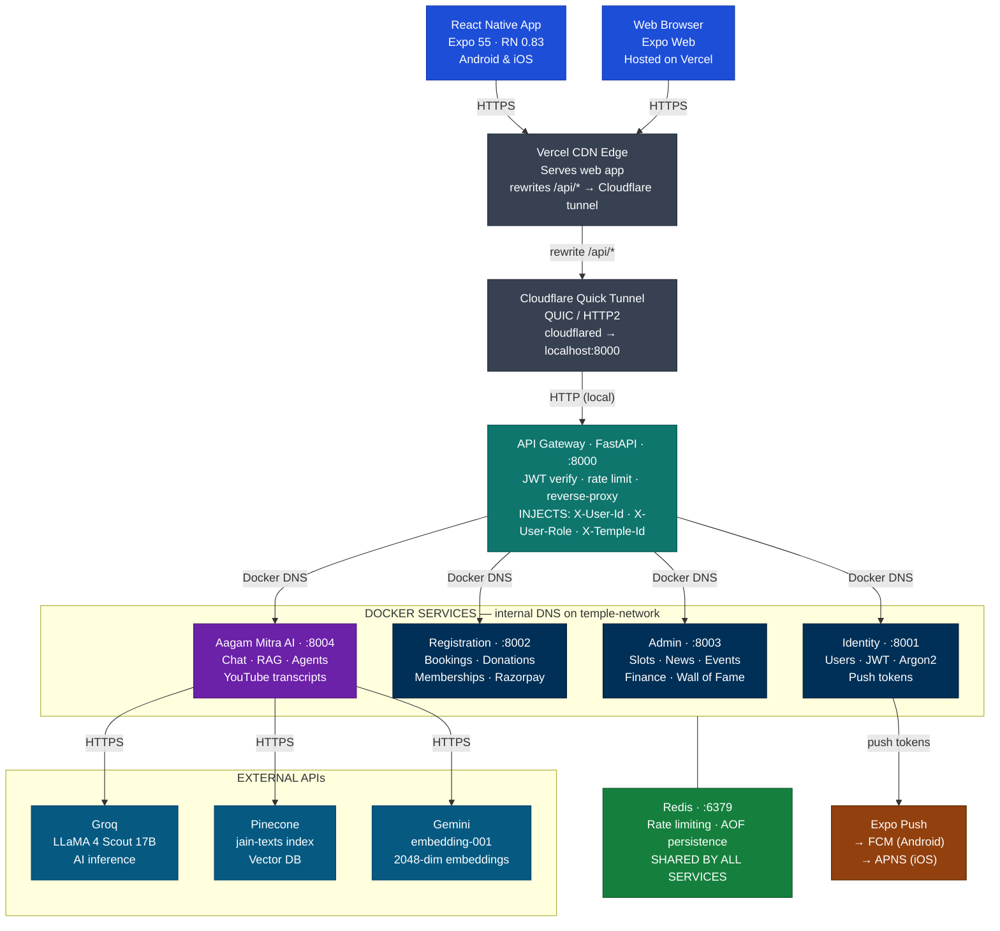

---

## Figure 2 · Request Flow — Phone to Backend

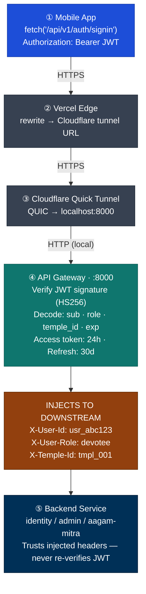

---

## Figure 3 · Agent Orchestration Flow

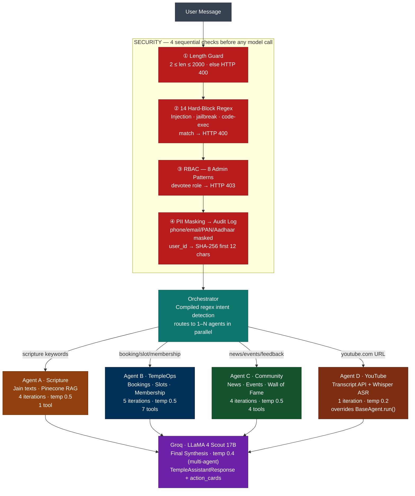

---

## Figure 4 · RAG Pipeline — Indexing & Retrieval

```mermaid
flowchart TD
    subgraph IDX["INDEXING PHASE — done once per PDF upload"]
        PDF["Admin uploads Jain Scripture PDF<br/>POST /api/v1/ingest/upload"]
        Pypdf["pypdf extraction<br/>page.extract_text() → clean whitespace"]
        Chunk["Chunker<br/>chunk_size: 800 chars<br/>chunk_overlap: 100 chars"]
        EmbedD["Gemini Embedding<br/>gemini-embedding-001<br/>task_type: RETRIEVAL_DOCUMENT<br/>2048-dim · batch 100/call"]
        Upsert["Pinecone Upsert<br/>index: 'jain-texts'<br/>id = source:page:chunk<br/>metadata: {text, source, page}"]
    end

    subgraph RET["RETRIEVAL PHASE — every user question"]
        Q["User Question<br/>'What is Navakar Mantra?'"]
        EmbedQ["Gemini Embed (QUERY)<br/>task_type: RETRIEVAL_QUERY<br/>→ [float × 2048]"]
        Search["Pinecone Query<br/>index.query(vector, top_k=8)<br/>cosine similarity · HNSW index"]
        Passages["8 Retrieved Passages<br/>text + source + similarity score"]
        GroqR["Groq Synthesis · temp 0.3<br/>LLaMA 4 Scout 17B<br/>4-part answer: Context → Sacred Text<br/>→ Meaning → Practical Wisdom"]
        Ans["Final Answer + citations + action_cards"]
    end

    PDF --> Pypdf --> Chunk --> EmbedD --> Upsert
    Q --> EmbedQ --> Search --> Passages --> GroqR --> Ans

    classDef upload fill:#1D4ED8,color:#fff,stroke:#1339A8
    classDef process fill:#003057,color:#fff,stroke:#001933
    classDef vector fill:#065A82,color:#fff,stroke:#044268
    classDef llm fill:#6B21A8,color:#fff,stroke:#4A1570
    classDef output fill:#14532D,color:#fff,stroke:#0A3A1E

    class PDF upload
    class Pypdf,Chunk process
    class EmbedD,Upsert,EmbedQ,Search,Passages vector
    class GroqR llm
    class Ans output
```

---

## Figure 5 · YouTube Transcript Pipeline

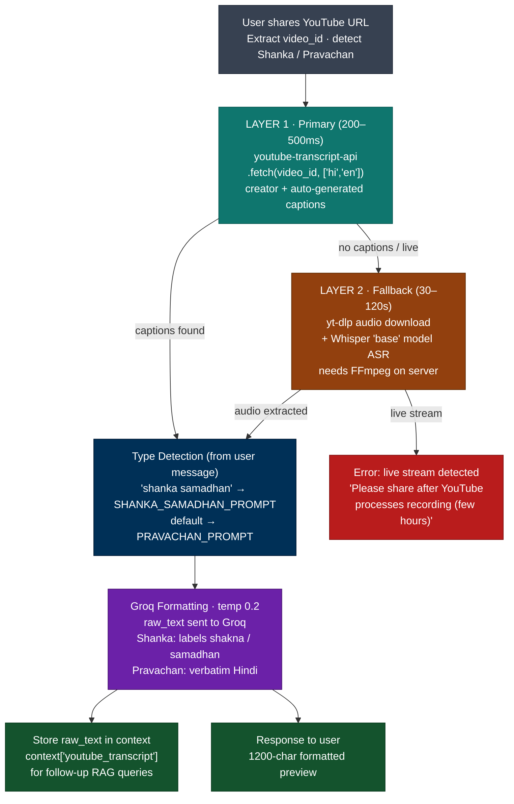

---

## Figure 6 · 4-Layer Security Gate

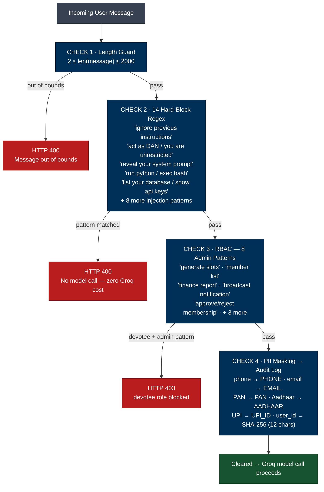

---

## Figure 7 · Groq Tool-Call Loop (Per Agent)

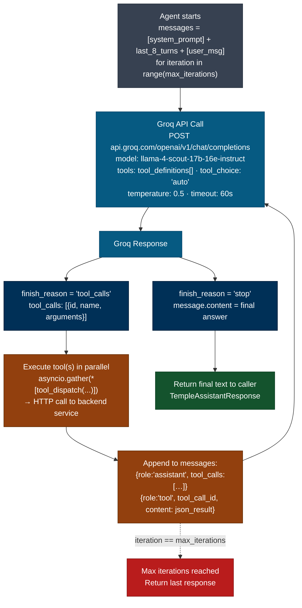

---

## Figure 8 · Agent Swimlanes — All 4 Agents

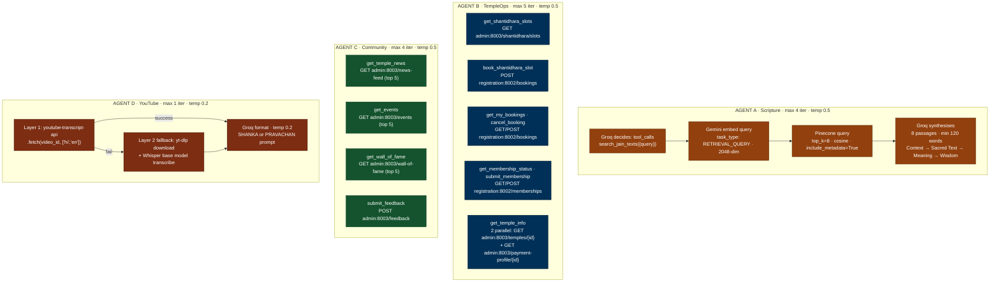

---

## Figure 9 · Temple Knowledge Sync (Live RAG)

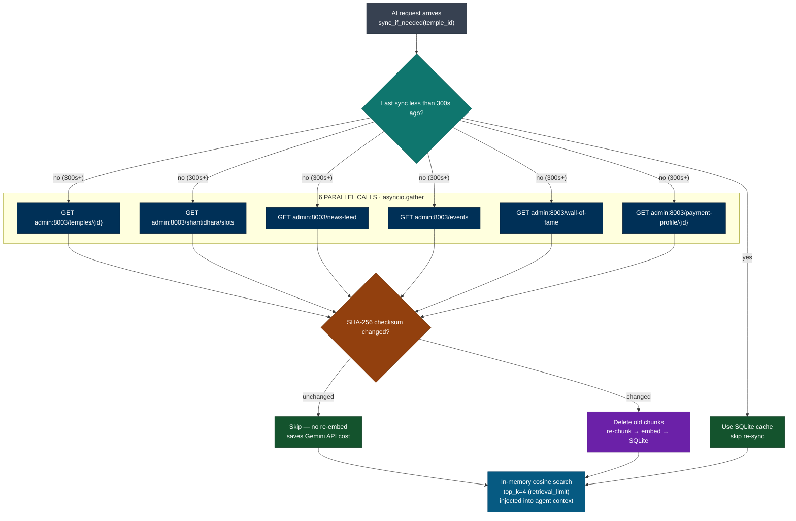

---

## Figure 10 · Database Schema — Aagam Mitra

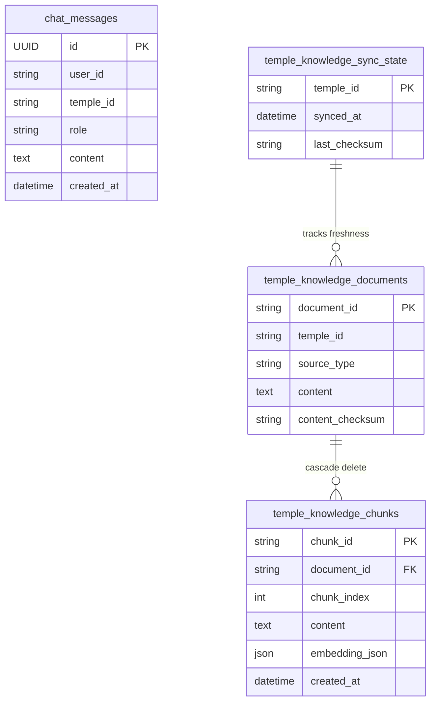

---

## Figure 11 · Response Assembly

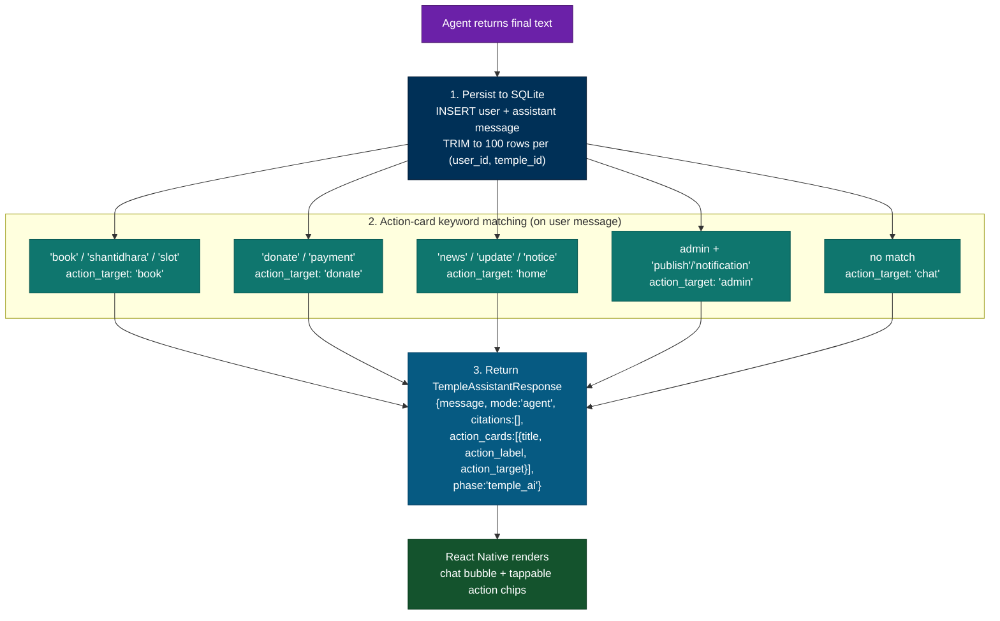

---

## Configuration Reference

| Setting | Default | File |
|---|---|---|
| groq_model | meta-llama/llama-4-scout-17b-16e-instruct | aagam-mitra/config.py |
| groq_temperature | 0.5 | aagam-mitra/config.py (BaseAgent) |
| pinecone_index_name | jain-texts | aagam-mitra/config.py |
| chunk_size_characters | 800 | aagam-mitra/config.py |
| chunk_overlap_characters | 100 | aagam-mitra/config.py |
| retrieval_limit | 4 | aagam-mitra/config.py (temple knowledge) |
| sync_ttl_seconds | 300 | aagam-mitra/config.py |
| upstream_timeout_seconds | 45.0 | aagam-mitra/config.py |
| upstream_retry_attempts | 4 | aagam-mitra/config.py |
| ACCESS_TOKEN_EXPIRE_HOURS | 24 | identity .env |
| REFRESH_TOKEN_EXPIRE_DAYS | 30 | identity .env |

## Groq Temperature Map

| Location | Temp | Reason |
|---|---|---|
| BaseAgent (all specialist agents) | 0.5 | Balanced — settings.groq_temperature |
| rag.py (legacy scripture RAG) | 0.3 | Conservative — factual scripture |
| assistant.py (temple data) | 0.3 | Conservative — live data |
| orchestrator.py (multi-agent synthesis) | 0.4 | Combining multiple agent outputs |
| youtube.py (transcript formatting) | 0.2 | Must stay faithful to source text |

## Security Pattern Counts

| Layer | Count | Action on Match |
|---|---|---|
| Hard-block (input guardrails) | 14 regex | HTTP 400 — no LLM call |
| Admin-only RBAC | 8 regex | HTTP 403 — devotee blocked |
| Soft-warn (logged only) | 3 regex | Logged, not blocked |
| PII masking | 7 regex | Replaced with [PHONE], [EMAIL] etc. |
| Hardened system prompt | 5 rules | Injected into every Groq call |
