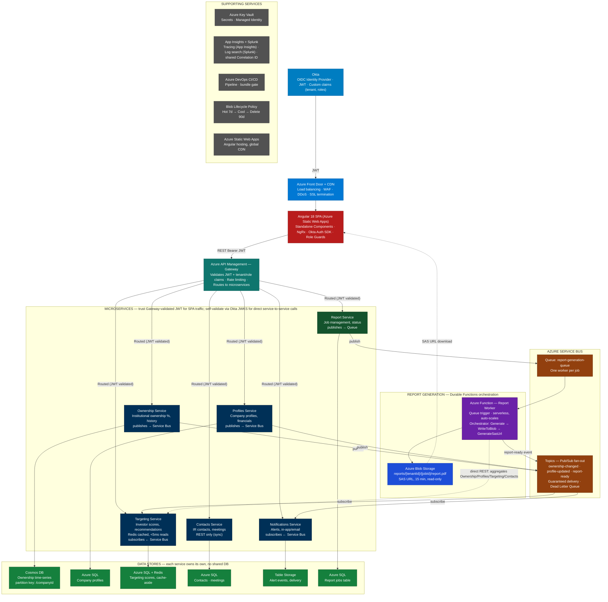

# Azure Services Revision — Capital Access Story

This is the running revision log for the Capital Access interview-prep series. Every Azure service is explained *through* the Capital Access project — never in the abstract — because that's the framing that holds up under interview follow-ups. Each section below follows the same pattern we used while working through it: the story/problem inside Capital Access that needed this service, the core concept explained simply, the Azure Portal steps to actually see/configure it, and the interview Q&A that came out of it.

Progress so far: **5 of 13 services covered.**

| # | Service | Status |
| --- | --- | --- |
| 1 | Okta (Identity / OIDC) | ✅ Covered |
| 2 | Azure Service Bus | ✅ Covered |
| 3 | Azure Functions | ✅ Covered |
| 4 | Azure Durable Functions | ✅ Covered |
| 5 | Azure Cosmos DB | ✅ Covered |
| 6 | Azure SQL | ⏳ Planned |
| 7 | Azure Database for PostgreSQL | ⏳ Planned |
| 8 | Azure Redis Cache | ⏳ Planned |
| 9 | Azure Blob Storage | ⏳ Planned |
| 10 | Azure Key Vault | ⏳ Planned |
| 11 | Azure App Insights (+ Splunk for log search) | ⏳ Planned |
| 12 | Azure Front Door | ⏳ Planned |
| 13 | Azure Static Web Apps | ⏳ Planned |

---

## The Capital Access System — Full Picture

Before the per-service deep dives, this is the system every topic plugs into. Keep this diagram in your head — every answer should be able to point back to a box in it.



The story in one breath: a user logs in through **Okta**, hits the SPA through **Front Door**, and every SPA request is routed through the **Azure API Management Gateway**, which validates the JWT and tenant/role claims once and routes to the right microservice — individual services trust that for SPA traffic but still self-validate the JWT via Okta's JWKS for direct service-to-service calls (defense-in-depth). Ownership and profile changes fan out through **Service Bus Topics** to whoever cares. Report requests go through a **Service Bus Queue** to a single **Azure Function**, which has grown into a **Durable Functions** orchestration so the multi-step PDF pipeline survives crashes. Each microservice owns its own store, and **Cosmos DB** specifically holds the high-volume ownership time-series data because of its write pattern and partition-key fit.

---

## 1. Okta (Identity / OIDC)

**The Capital Access problem it solves:** 2,500+ corporate IR teams need to log in, and the platform needs to know not just *who* they are but *which company* they belong to and *which modules* their company has paid for — without the frontend ever touching a password.

**Core idea:** Okta is the Identity Provider. OAuth2 answers "what can this app do on the user's behalf," OIDC adds the identity layer ("who is this user"). Okta issues a JWT carrying custom claims — `tid` (tenant ID) and `roles` — that the Angular app and every microservice both trust. Tokens live in memory only, never localStorage, because localStorage is readable by any injected script (XSS). Silent renewal fires 5 minutes before expiry via the refresh token, invisibly. If that fails, the app falls back to a full redirect to Okta's hosted login page. PKCE protects the Authorization Code flow since there's no server-side secret in a SPA.

**What we did to understand it:** walked the full login sequence — redirect to Okta → token receipt → decode JWT claims → HTTP interceptor attaching `Authorization: Bearer` on every call → 401 handling (refresh once, then force logout) → Role Guards reading the `roles` claim to gate Angular routes. Then compared it against the SAML flow Capital Access used to run, to frame *why* the migration happened (XML vs JWT, server session vs stateless, coarse vs fine-grained claims).

**Portal / practical steps to revisit:**
- In the Okta Admin console: Applications → your app → check the **Sign On** tab for the configured grant type (Authorization Code + PKCE) and redirect URIs.
- Security → API → Authorization Servers → default server → Claims tab — this is where `tid` and `roles` are added as **custom claims**, scoped to the access token.
- Directory → People / Groups — groups map to the `roles` claim via a claim rule (`roles` = list of group names the user belongs to).
- Use a JWT decoder (jwt.io) on a real issued token to actually see `tid`, `roles`, `iss`, `exp` — this is the single fastest way to make the abstract claim discussion concrete.

**Anchor Q&A:**
- OAuth2 vs OIDC — authorisation vs authorisation+identity.
- Why memory over localStorage — XSS surface.
- What PKCE prevents — authorization code interception without the original code verifier.
- How the SAML→Okta migration was de-risked — per-tenant feature flags, one client at a time, instant rollback per tenant without a platform-wide outage.

---

## 2. Azure Service Bus

**The Capital Access problem it solves:** when the Ownership Service updates institutional ownership %, two completely unrelated services — Targeting and Notifications — both need to react, without Ownership Service knowing they exist. Separately, when a report job is submitted, exactly one worker should generate it — never zero, never two.

**Core idea:** two different messaging patterns living in the same broker. **Topics** are pub/sub — one message, every Subscription gets its own independent copy (used for `ownership-changed`, fan-out to Targeting + Notifications). **Queues** are point-to-point — one message, exactly one consumer (`report-generation-queue`, because generating the same report twice is wasteful and wrong). Every Queue and every Subscription has a **Dead Letter Queue** automatically attached — a message that fails past Max Delivery Count gets parked there instead of blocking everything behind it. Real consumers use **Peek-Lock**: the message is locked but not deleted until you explicitly call Complete, so a crash mid-processing just releases the lock and the message comes back for another attempt.

**What we did to understand it:** traced the literal event path — Ownership Service writes to Cosmos DB, then publishes `OwnershipChanged` to a Topic; Targeting and Notifications each have their own Subscription and react independently; if Targeting is down, the event waits, it isn't lost. Then did the Queue side the same way — Report Service publishes to a Queue, the Function picks it up under Peek-Lock, and we walked through what happens if the Function crashes mid-job (lock expires, delivery count increments, message comes back; after Max Delivery Count it's dead-lettered).

**Portal / practical steps to revisit:**
- Azure Portal → Service Bus namespace → **Queues** / **Topics** blade — open `report-generation-queue`, check **Active message count**, **Dead-letter message count**.
- Open a Topic → **Subscriptions** tab — see each subscriber (Targeting, Notifications) as its own Subscription object with its own message count, independent of the others.
- Service Bus Explorer (built into the Portal, under a Queue/Subscription) — lets you **Peek** messages without consuming them, and manually move/resubmit messages from the Dead Letter sub-queue.
- Metrics blade — Incoming/Outgoing message count, and Dead-letter count, both useful for the "how would you diagnose a stuck job" scenario question.

**Anchor Q&A:**
- Queue vs Topic — task (exactly once) vs event (fan-out).
- What happens on consumer crash — Peek-Lock expiry, redelivery, eventual DLQ.
- At-least-once, not exactly-once — why consumers must be idempotent.
- Adding a brand-new subscriber service with zero changes to the publisher — just add a Subscription.

---

## 3. Azure Functions

**The Capital Access problem it solves:** report generation is bursty — heavy at 9am market open, idle by 3pm. Running an always-on server to handle that load wastes money 80% of the time.

**Core idea:** a Function is a piece of code with exactly one **trigger** (what causes it to run — here, `ServiceBusTrigger` on `report-generation-queue`). On the **Consumption** plan it scales to zero when idle and the scale controller spins up parallel instances automatically as queue depth grows — no autoscale rules to write by hand. The trade-off is **cold start** (first instance after idle time takes a moment to spin up), which is invisible here because the whole report pipeline is already async and polled. The project uses the **isolated worker model** (function code runs in its own process, talks to the host over gRPC) rather than in-process, which decouples the .NET version from the host and is the model Microsoft is investing in.

**What we did to understand it:** distinguished trigger vs input/output binding, walked Consumption vs Premium vs Dedicated and *why* Consumption fits this specific bursty workload, and used the "function is timing out on a very large report" scenario to bridge into why this single Function eventually became a Durable Functions orchestration (next section).

**Portal / practical steps to revisit:**
- Function App → Functions blade → open the queue-triggered function → **Monitor** tab to see invocation history, duration, and any failures.
- Function App → Configuration → check `AzureWebJobsStorage` (the storage account backing the Functions runtime) and any app settings pulled from Key Vault.
- Scale tab (on a Consumption/Premium plan) — shows current instance count, useful for visualising the "queue has 50 messages → multiple instances spin up" story.
- Application Insights tab on the Function App — links straight into distributed tracing for a single invocation, which connects directly to the App Insights deep dive still ahead.

**Anchor Q&A:**
- Trigger vs binding.
- Why isolated worker model over in-process.
- Cold start — what it is, why it doesn't matter for this specific workload.
- When you'd reach for Premium or Dedicated instead of Consumption.

---

## 4. Azure Durable Functions

**The Capital Access problem it solves:** the Report Worker grew from one step into three (generate → upload to Blob → produce a SAS URL). A plain Function is stateless — if it crashes between step 2 and step 3, you lose everything and start the whole report over, including the part that already finished.

**Core idea:** Durable Functions adds a checkpointed workflow on top of plain Functions using **event sourcing**, not snapshots. Every time the orchestrator `await`s something (an Activity call, a timer, an external event), the framework writes that step's result to a History log in Storage, then *replays the orchestrator function from the top* when it wakes up — already-completed steps return their cached result instantly, only the first not-yet-completed step actually executes. This is why orchestrator code must be deterministic (no `DateTime.Now`, no real I/O directly inside it — push that into an Activity). The trigger function itself just calls `ScheduleNewOrchestrationInstanceAsync` and returns immediately; it doesn't hold a Service Bus lock open for the whole pipeline.

**What we did to understand it:** walked the "host crashes right after WriteToBlob, before GenerateSasUrl" scenario step by step — naming explicitly which steps replay from cached history (Generate, WriteToBlob) and which one actually executes for the first time (GenerateSasUrl). Also covered fan-out/fan-in (generating report sections in parallel) and `WaitForExternalEvent` (pausing for a manager's approval) as patterns the same framework supports without extra infrastructure.

**Portal / practical steps to revisit:**
- Storage account backing `AzureWebJobsStorage` → Tables — find the **Instances** / **History** table and look at a real orchestration instance's recorded events (this makes "event sourcing" concrete instead of theoretical).
- Durable Functions extension exposes an HTTP status-check endpoint automatically (the built-in async-HTTP-API pattern) — useful to mention when asked how a client polls a long-running orchestration.
- Application Insights → search by the orchestration instance ID to see the Activity calls as a trace, same tracing surface as plain Functions.

**Anchor Q&A:**
- What problem does Durable solve that a plain Function doesn't.
- How does the orchestrator "remember" — event sourcing + replay, by name.
- Why no `DateTime.Now`/`Guid.NewGuid()` directly in the orchestrator.
- The crash-recovery scenario — walk it step by step.

---

## 5. Azure Cosmos DB

**The Capital Access problem it solves:** the Ownership Service handles institutional ownership percentages for thousands of companies, updated continuously, with a schema that can vary slightly between data providers. Almost every real query is "give me the history for one company" — a profile that doesn't fit a fixed relational table well.

**Core idea:** Cosmos DB is a globally distributed, multi-model PaaS database — you provision throughput (**RU/s**, Request Units, a normalized cost unit covering CPU/memory/IO) rather than servers. Capital Access uses the **Core (SQL) API**. The single most consequential design decision is the **partition key** — chosen as `/companyId` because that's the real query pattern, keeping a company's full history in one logical partition (cheap reads) and avoiding a hot partition that would happen if you partitioned by `quarter` instead (every company's quarter-end write would pile onto one partition). Consistency is **Session** — read-your-own-writes without paying cross-region Strong-consistency latency, which ownership reporting doesn't need. Writes use `UpsertItemAsync` rather than `CreateItemAsync` specifically because Service Bus delivers at-least-once — an upsert makes redelivery naturally idempotent instead of throwing a 409 Conflict.

**What we did to understand it:** worked through the cost hierarchy (point read cheapest → single-partition query → cross-partition query/aggregate most expensive), the "teammate suggests partitioning by quarter instead" scenario to nail down *why* the key matters, and the Change Feed as the right answer to "show ownership changes across all companies in the last 24 hours" instead of an expensive ad-hoc cross-partition scan.

**Portal / practical steps to revisit:**
- Cosmos DB account → Data Explorer → open `OwnershipDb` / `OwnershipHistory` → **Items** view, and actually look at the partition key value (`companyId`) on a real document.
- Data Explorer → **Query Stats** on a query you run — shows the actual RU charge, the fastest way to see "cross-partition query costs more" for yourself instead of taking it on faith.
- Metrics blade → Normalized RU Consumption and 429 (throttled requests) charts — this is exactly what you'd check first in the "RU spike, reports timing out" scenario.
- Settings → Scale & Settings on the container — where autoscale vs manual throughput is configured, and where you'd see the partition key is fixed and uneditable after creation.

**Anchor Q&A:**
- Why Cosmos for Ownership but Azure SQL for Profiles — write pattern + schema flexibility vs relational structure + joins.
- How the partition key was chosen, and why it can't be "simplified" later.
- Point read vs query cost, in RU terms.
- The redelivery-causes-duplicate-write scenario — Upsert over Create.

---

## Interview Rounds — Additional Q&A

*Sourced from live interview rounds: Wipro (R1, R2), Decos Global (R1), HCL (R1), Virtusa (R1). Framed through the Entity Management System project (Grant Thornton, healthcare domain).*

### Which Azure services have you used, hands-on?

- **Azure App Service** — hosts the .NET Core Web API; deployment slots (staging → production swap) for zero-downtime releases.
- **Azure Static Web Apps** — hosts the Angular SPA.
- **Azure SQL Database** — managed SQL Server, with geo-redundant backups, long-term retention, and Query Performance Insight.
- **Azure Functions** — serverless event-driven background processing (Timer trigger for scheduled recalculations, HTTP trigger for lightweight webhook endpoints, Service Bus trigger for async event processing).
- **Azure Service Bus** — async messaging between services; Topics + Subscriptions for fan-out (one event → multiple subscribers, e.g. Notification + Audit).
- **Azure Blob Storage** — document storage (PDFs, Excel uploads); SAS tokens for time-limited client-direct upload URLs.
- **Azure Cosmos DB** — semi-structured/unstructured JSON data where schema flexibility and low-latency global reads mattered more than relational integrity.
- **Azure Key Vault** — connection strings and JWT signing keys, retrieved via Managed Identity — no secrets in code or pipeline variables.
- **Azure DevOps** — CI/CD: build → unit test → publish artifact → deploy to staging → smoke test → swap to production.
- **Application Insights** — distributed tracing, custom events, performance counters, availability (ping) tests, alert rules on P95 latency.
- **Azure API Management** — gateway for microservices: auth, rate limiting, routing.
- **Azure Container Registry / Container Apps** — Docker image storage and serverless container hosting (an alternative to full AKS when you don't need Kubernetes-level control).

---

### Azure Functions vs Web API — when do you choose which, and HTTP vs Timer trigger?

**Web API**: always-on, synchronous, zero cold start — best for real-time, user-facing requests.

**Azure Functions**: serverless, event-triggered, auto-scales for bursty workloads, lower infrastructure overhead — ideal for background/async work. Trade-off: cold-start latency on the first invocation after idle.

What introduced the need for Functions on the Entity Management System: shareholding recalculation was CPU-intensive and needed to run **without** blocking the main upload API's response — Functions decoupled that background work and triggered it automatically on a data event, instead of tying up a Web API request thread.

- **HTTP Trigger** — invoked by an HTTP request; behaves like a lightweight serverless endpoint (webhooks, on-demand actions).
- **Timer Trigger** — runs on a CRON schedule (e.g., `0 */5 * * * *` = every 5 minutes); used for scheduled jobs like cleanup or report generation.
- **Service Bus Trigger** — fires when a message lands on a queue/topic; the main pattern used for the recalculation pipeline below.

```csharp
// Service Bus-triggered Function — decouples recalculation from the upload API
[FunctionName("RecalculateShareholding")]
public async Task Run(
    [ServiceBusTrigger("shareholding-events", Connection = "ServiceBusConn")]
    ShareholdingEventMessage message,
    ILogger log)
{
    log.LogInformation($"Processing batch {message.BatchId} for {message.EntityIds.Count} entities");

    var results = await _shareholdingService.RecalculateAsync(message.EntityIds);
    await _auditService.LogBatchAsync(message.BatchId, results);

    var breaches = results.Where(r => r.ExceedsThreshold);
    if (breaches.Any())
        await _notificationService.SendBreachAlertsAsync(breaches);
}

// Simpler HTTP-triggered Function — add-customer webhook style endpoint
[FunctionName("AddCustomer")]
public static async Task<IActionResult> Run(
    [HttpTrigger(AuthorizationLevel.Function, "post", Route = "customers")] HttpRequest req,
    ILogger log)
{
    string body = await new StreamReader(req.Body).ReadToEndAsync();
    var customer = JsonConvert.DeserializeObject<Customer>(body);
    // save logic here
    return new OkObjectResult(customer);
}
```

Why a Function over a background thread inside the API: it auto-scales with queue depth (10 queued uploads → 10 parallel Function instances), gets Service Bus's built-in retry policy (exponential backoff, dead-letter after N attempts) for free, fully decouples the upload API (which can return `202 Accepted` immediately), and is billed only for actual execution time.

---

### How do you deploy an Azure Function?

Two paths depending on stage: an Azure DevOps YAML pipeline for production, and Azure Functions Core Tools for local/dev quick fixes.

```yaml
# azure-pipelines.yml (simplified)
- task: DotNetCoreCLI@2
  inputs:
    command: publish
    projects: '**/ShareholdingFunction.csproj'
    arguments: '--configuration Release --output $(Build.ArtifactStagingDirectory)'

- task: AzureFunctionApp@1
  inputs:
    azureSubscription: 'Prod-Service-Connection'
    appType: functionApp
    appName: 'shareholding-func-prod'
    package: '$(Build.ArtifactStagingDirectory)/**/*.zip'
```

Non-secret config lives in the Function App's Configuration blade; secrets (Service Bus connection string, SQL connection) live in Azure Key Vault, retrieved via Managed Identity — never in code or pipeline variables. Post-deploy, verify with the Application Insights Live Metrics stream (invocations firing correctly) and an alert rule (failure rate > 5% in 5 minutes → email).

---

### Cosmos DB vs SQL Server — when do you pick which?

*(See the [Azure Cosmos DB](#5-azure-cosmos-db) section above for the full Capital Access ownership-data deep dive — this is the condensed interview-answer version.)*

**SQL Server**: relational, structured schema, ACID transactions, vertical scaling — the right default for anything with strong relational integrity requirements (financial transactions, entity/shareholding core data).

**Cosmos DB**: NoSQL, schema-less JSON documents, global distribution, horizontal auto-scaling, multi-model, extremely low latency at global scale — used where schema flexibility and low-latency reads mattered more than relational joins (e.g., denormalized read models, activity feeds).

---

### A deploy causes cascading failures across dependent services, and rolling back isn't safe because the DB schema already moved forward — what do you do?

**First action: contain the blast radius, not fix the root cause.**

**Minute 0–2 — stop the bleeding**: swap the App Service deployment slot back to the previous stable slot. This only works if the schema migration was **additive** (new columns with defaults, nothing dropped/renamed) — the old code can tolerate additive changes. If slot swap isn't viable, scale instance count down to reduce concurrent failures and free DB connections.

**Minute 2–4 — find the cascade source**: Application Insights → Failures blade, sorted by exception count, to find the *first* exception in the chain (the root cause) rather than chasing the downstream 503s it caused. Check the Service Bus dead-letter queue separately if async consumers are also failing.

**Minute 4–7 — schema compatibility check**: confirm new columns have defaults so old code reads don't fail; if a column was renamed/dropped, a compatibility view (`CREATE VIEW v_OldName AS SELECT new_col AS old_col ...`) lets old code keep working.

**Minute 7–10 — stabilize and communicate**: monitor the error rate after the slot swap; if it's dropping, hold and apply the real hotfix in the new slot; post a timestamped status update to the incident channel.

**Why App Insights Live Metrics first, not Azure Monitor**: App Insights gives request-level detail with stack traces and a dependency map in one blade — in a cascading failure you need to know *where in the call chain it broke first*, which is exactly what the Dependencies view shows (e.g., 100% failing SQL calls vs a healthy Service Bus, pointing straight at the DB layer).

**The underlying principle this all rests on**: schema migrations should be backward-compatible by design — "expand" in one deploy (add the column, keep the old one working), "contract" in a later deploy (remove the old column) once nothing depends on it anymore. This exact incident is the reason that pattern exists.

---

## How we're working through each topic (the pattern so far)

1. **Explain** — the concept, framed entirely through the Capital Access problem it solves, not in the abstract.
2. **Your doubts / Q&A** — you ask whatever doesn't click, we resolve it before moving on.
3. **Azure Portal walkthrough** — where to actually go and look at the thing (blades, metrics, explorers) so it's not purely theoretical.
4. **Interview Q&A, including scenario-based** — both the "explain X" questions and the "what would you do if Y broke" questions.
5. **Update the docs** — both `capital-access-interview-story.html` (styled, full version) and `capital-access-interview-story.md` (GitHub-readable twin) get the new section, plus this revision file gets updated.

Next up: **Azure SQL** and **Azure Database for PostgreSQL**, covered together since they sit side by side in the architecture.
