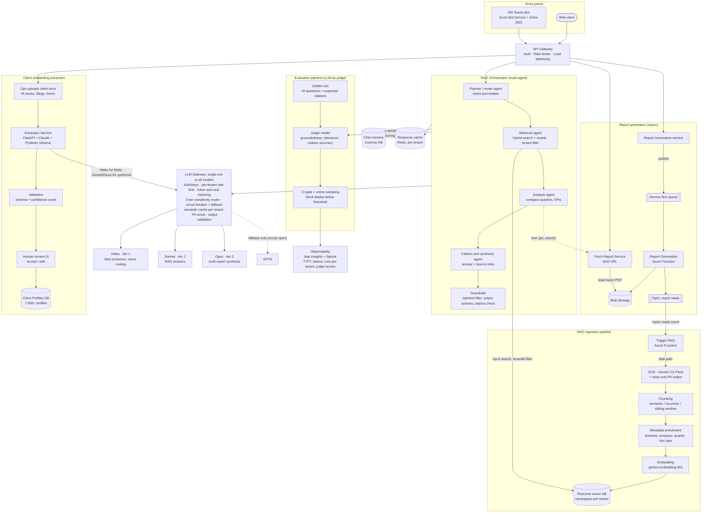

# AI Report Analytics & Client Onboarding — Principal Architect Grill (Q&A Bank)

**Project:** AI-Powered Report Analytics (multi-agent RAG in MS Teams) + Client Onboarding Automation (Claude-powered extraction)
**Persona:** Architect track — Capital Access, S&P Global
**Interview:** 30 Sept 2026
**Architecture diagram:** [Excalidraw room](https://excalidraw.com/#room=9fb970273da3b28e42b3,gBt8LaXPVZMJEG3py3kwWg)

> **How to use this file:** Read the "Say this" part out loud — interviews are spoken. "Key points" is what the panel is listening for. "Trap" is where interviewers push next. Answers are verbal theory — no code needed.

---

## Table of Contents

- [Architecture diagram](#architecture)
- [0. The 60-second architecture pitch](#pitch)

**Part A — Foundational design decisions**
1. [Walk me through your architecture end to end.](#q1)
2. [An analyst asks about the Q2 report 20 seconds after it was generated. What do they actually get?](#q2)
3. [Should "report ready" fire when the PDF lands, or when the report is searchable? How does the orchestrator know ingestion state?](#q3)
4. [Pinecone is eventually consistent. How do you guarantee the next question sees freshly upserted vectors?](#q4)
5. [Why do you OCR a PDF your own system generated?](#q5)
6. [Why multi-agent instead of a single agent with tools?](#q6)
7. [Why Pinecone and not Azure AI Search or pgvector, when you are an Azure shop?](#q7)
8. [Why Gemini for OCR and embeddings but Claude for generation? Isn't three vendors a liability?](#q8)
9. [Why Azure Functions for ingestion? What happens to a 200-page PDF?](#q9)
10. [Why build an LLM gateway instead of calling models directly?](#q10)

**Part B — RAG and LLM quality**
11. [How do you chunk financial reports, especially tables?](#q11)
12. [Why hybrid search plus reranking instead of pure vector search?](#q12)
13. [How does the system know "the Q2 report" means a specific document, across a multi-turn chat?](#q13)
14. [How do you stop the LLM from getting numbers wrong in a financial answer?](#q14)
15. [How exactly do you compute groundedness, relevance and citation accuracy? Isn't LLM-as-judge biased?](#q15)
16. [Your judge scores an answer as fully grounded, but it's wrong. How is that possible and how do you catch it?](#q16)
17. [How does the 3-tier router decide a request is "simple" vs "complex"? What if it misroutes?](#q17)
18. [You need to change the embedding model. What's your migration plan?](#q18)
19. [How did you measure "2–3 hours down to 10 minutes"? Defend the 5x number.](#q19)
20. [What does one query cost, and how do you control it?](#q20)

**Part C — Distributed systems**
21. [Claude goes down mid-stream while answering. What does the user see? Is the fallback answer trustworthy?](#q21)
22. [Where did you choose consistency and where availability? Walk me through CAP per component.](#q22)
23. [There's a network partition between Azure and Anthropic / Pinecone. What degrades and what keeps working?](#q23)
24. [Where does your system need consensus or leader election, and how do you get it without running Raft yourself?](#q24)
25. [Two Function instances process the same report at the same time. What breaks? How do you prevent split-brain?](#q25)
26. [How do you partition data — Pinecone, Cosmos DB — and what happens with a whale tenant like JPMorgan?](#q26)
27. [Walk me through every cache in your system and how each is invalidated.](#q27)
28. [Quarter-end: thousands of users ask the same question the moment reports land and Redis is cold. What happens?](#q28)
29. [Is this multi-region? Active-active or active-passive? Where does Pinecone live?](#q29)
30. [Report v1 and v2 of the same quarter are both in flight. How do you avoid last-writer-wins corruption?](#q30)

**Part D — Microservices and DDD**
31. [What are your bounded contexts?](#q31)
32. [Give me a domain event and an integration event from your system. What's the difference?](#q32)
33. [Is each agent its own microservice? Why or why not?](#q33)
34. [A client offboards and demands full deletion. Walk me through deleting data across every store.](#q34)
35. [Onboarding spans extraction, validation, review, and profile creation. How do you handle a failure midway? Saga?](#q35)
36. [Report Generation writes metadata and publishes an event. What if it crashes between the two?](#q36)
37. [Who owns "report metadata and ingestion status"? Which service is the source of truth?](#q37)
38. [Isn't the shared LLM gateway a distributed-monolith risk and a single point of failure?](#q38)

**Part E — Event-driven architecture**
39. [Ingestion runs twice for the same report. How are your consumers idempotent?](#q39)
40. [Do you need message ordering? Where and how do you get it on Service Bus?](#q40)
41. [A corrupt PDF keeps failing ingestion. Walk me through your DLQ strategy and replay.](#q41)
42. [You need to add a field to the "report ready" event. How do you evolve the schema without breaking consumers?](#q42)
43. [What goes in the event payload? Why not put the report in the message?](#q43)
44. [Why a queue for report generation but a topic for "report ready"?](#q44)
45. [Quarter-end surge: 2,500 tenants generate reports in the same hour. How does the pipeline cope?](#q45)
46. [How do you present eventual consistency to the user so it doesn't look like a bug?](#q46)

**Part F — Operations and failure scenarios**
47. [Claude latency jumps from 3s to 40s. Walk me through how that cascades — and how you stop it.](#q47)
48. [How exactly is your circuit breaker configured for LLM calls?](#q48)
49. [How does rate limiting work — per user, per tenant, and against provider quotas? Noisy neighbour?](#q49)
50. [Teams expects a fast response but your answer takes 8 seconds. How do you handle the timeout budget?](#q50)
51. [What's your disaster recovery plan? RPO and RTO per store. What is the true source of truth?](#q51)
52. [How do you trace one question across bot, orchestrator, agents, gateway, and providers? What do you log?](#q52)
53. [Break down end-to-end latency. Where's the bottleneck and what did you do about it?](#q53)
54. [An agent gets stuck in a loop and burns tokens. How do you prevent runaway cost?](#q54)
55. [The provider silently updates the model and answer quality drops. How do you detect it?](#q55)
56. [How do you deploy a prompt or model change safely and roll it back?](#q56)

**Part G — Security and multi-tenancy**
57. [Walk me through tenant isolation end to end, starting from a Teams message.](#q57)
58. [Someone uploads an onboarding document containing a prompt injection. What happens?](#q58)
59. [You're sending client data to external LLM providers. How do you handle PII, MNPI, and data residency?](#q59)
60. [Tenant isolation isn't enough — some users shouldn't see some reports. How do you enforce document-level permissions in RAG?](#q60)
61. [How do you manage secrets and keys across three model providers?](#q61)
62. [LLM output is rendered in Teams. What output-handling risks exist?](#q62)

**Part H — Client onboarding extraction**
63. [Walk me through the extraction service. Why Python FastAPI in a .NET shop?](#q63)
64. [LLMs don't produce calibrated confidence. So what is your "confidence score" really?](#q64)
65. [How did you process 7,500+ profiles without hitting rate limits or blowing the budget?](#q65)
66. [Two documents give different AUM figures for the same client. What does the system do?](#q66)
67. [How is the human review queue designed, and does reviewer feedback improve the system?](#q67)
68. [The same client gets onboarded twice under slightly different names. How do you prevent duplicates?](#q68)

**Part I — Curveballs and leadership**
69. [If you rebuilt this from scratch, what would you change?](#q69)
70. [What's the biggest weakness in your design right now?](#q70)
71. [Traffic goes 10x. What breaks first?](#q71)
72. [The CFO says cut LLM cost 50% next quarter. What do you do?](#q72)
73. [Why didn't you fine-tune a model instead of RAG?](#q73)
74. [Why build this at all instead of buying Copilot Studio or a managed agent platform?](#q74)
75. [Explain the business value to a non-technical executive in one minute.](#q75)
76. [Why not just give both reports to ChatGPT? And if chunks go to third-party LLMs anyway, how is that compliant?](#q76)
77. [Your web app uses Okta. Why does the Teams bot use Entra SSO and not Okta?](#q77)

**Part J — Deployment, MLOps and LLMOps**
78. [You don't train models. So what does MLOps mean for your system? What exactly do you version?](#q78)
79. [Walk me through the CI/CD pipeline for the AI services.](#q79)
80. [How are the services hosted and the infrastructure deployed?](#q80)
81. [How do you test LLM components in a pipeline when outputs are non-deterministic?](#q81)
82. [You can't use production client data in dev and test. How do you build realistic environments?](#q82)
83. [How do you ship a new embedding model or chunking strategy to production?](#q83)
84. [A provider announces your model version is deprecated in 90 days. What's your process?](#q84)
85. [How do you roll back — and is rolling back a prompt the same as rolling back code?](#q85)
86. [How do you A/B test a new prompt or model in production?](#q86)
87. [What does production monitoring look like for an LLM system — what is "drift" here?](#q87)
88. [How do you deploy the Teams bot itself? Anything unusual compared to a web app?](#q88)
89. [Who is allowed to change a production prompt, and how is that governed and audited?](#q89)
90. [If you had to self-host a small open-weights model — for MNPI or cost — how would you deploy and operate it?](#q90)
91. [Running evals with an LLM judge on every build costs money. How do you keep CI cost under control?](#q91)
92. [A prompt change passed CI but production answer quality dropped. What happened and what do you change?](#q92)

---

## Architecture diagram

> Live, editable version: [Excalidraw room](https://excalidraw.com/#room=9fb970273da3b28e42b3,gBt8LaXPVZMJEG3py3kwWg). Below is the same architecture in Mermaid, which GitHub renders inline. Solid arrows = request/data flow, dashed arrows = tool call or fallback.

[⬆ Back to top](#top)

---

## 0. The 60-second architecture pitch

**Say this:**
"The system has two AI capabilities on one shared platform. First, **report analytics**: IR teams ask questions about their historical reports directly in Microsoft Teams. A multi-agent orchestrator — planner, retrieval, analysis, citation-and-synthesis, and guardrails — retrieves from a Pinecone index with tenant isolation and returns answers with citations. That cut analysis from 2–3 hours to about 10 minutes. Second, **client onboarding**: a FastAPI service uses Claude with strict schemas to extract company info, IR contacts, financials, sector and AUM from client documents, with validation and a human review step — so onboarding went from days of data entry to minutes of review across 7,500+ profiles.

Underneath, reports are generated asynchronously through Service Bus and Azure Functions, stored in Blob, and a 'report ready' event triggers ingestion — OCR, chunking, metadata enrichment, embeddings, Pinecone. All model calls go through one **LLM gateway** that does per-tenant rate limiting, cost metering, a 3-tier complexity router — Haiku for simple extraction, Sonnet for RAG answers, Opus for multi-report synthesis — plus circuit breakers with fallback. An evaluation pipeline scores groundedness, relevance and citation accuracy and gates deployments."

[⬆ Back to top](#top)

---

# Part A — Foundational design decisions

### Q1. Walk me through your architecture end to end.

**Say this:** Use the pitch above, then walk one request: "A user in Teams asks a question → Azure Bot Service, Entra SSO gives me the user identity → API Gateway validates the token, maps the Entra tenant to our internal tenant ID, applies rate limits → orchestrator runs input guardrails, then the planner extracts intent and entities like period and report type → retrieval agent runs hybrid search in Pinecone with a hard tenant and period filter, reranks → analysis agent compares periods, calling tools like Fetch Report Service when it needs the full document → synthesis agent writes the answer with citations → output guardrails verify citations and schema → streamed back to Teams. Answers are sampled into the evaluation pipeline."

**Key points:**
- Separate the **write path** (generate → store → ingest) from the **read path** (ask → retrieve → answer). Interviewers like CQRS thinking.
- Name where tenant identity enters (Entra token) and where it is enforced (gateway, retrieval filter, cache keys).

**Trap:** "Guardrails at the end?" — No. Input guardrails run **first**, before any retrieval or tool call. Output guardrails run **last**. Say both.

[⬆ Back to top](#top)

---

### Q2. An analyst asks about the Q2 report 20 seconds after it was generated. What do they actually get?

**Say this:** "Most likely stale data or nothing — and I'd call that out as a real race in the design. 'Report generated' and 'report searchable' are two different states. After the PDF lands in Blob, the ingestion chain — topic, trigger function, OCR, chunking, embedding, upsert — takes tens of seconds to a few minutes. The dangerous outcome isn't 'no answer', it's retrieval matching **Q1 chunks**, because Q1 and Q2 'top holders' text is semantically almost identical. The model then presents Q1 numbers as Q2 — with citations — and the groundedness judge passes it, because the answer is faithful to the retrieved context. The context was just the wrong period."

**How it's fixed:**
1. The planner extracts the **period and report identity** and passes them as a **hard metadata filter** — a Q2 question can never match Q1 chunks.
2. The orchestrator checks **ingestion status** for that report. If not yet indexed: tell the user "Q2 is still being indexed, about a minute", **or** fall back to reading the report directly via Fetch Report Service (long-context path, slower but correct).
3. Better still: notify the user only when the report is searchable (Q3).

**Trap:** "Compare with the last generated report" is wrong — if Q1 was regenerated three times, "last generated" is a Q1 variant. Compare with the **previous fiscal period, same tenant and report type, latest published version**. You need a period/version identity model, not "latest by timestamp".

[⬆ Back to top](#top)

---

### Q3. Should "report ready" fire when the PDF lands, or when the report is searchable? How does the orchestrator know ingestion state?

**Say this:** "Two events, two audiences. `ReportGenerated` fires when the PDF is in Blob — the user can download it. `ReportIndexed` fires when ingestion completes — only then does the Teams experience say 'you can now ask questions about it'. The orchestrator knows state from a **report catalog** — a small table, for example in Cosmos DB or Azure SQL, keyed by tenant, report ID, and version, with an `ingestionStatus` field: Pending, Processing, Indexed, Failed, plus chunk count and index version. The ingestion function updates it; the orchestrator reads it before retrieval."

**Key points:**
- The status must be updated **after** the upsert is confirmed (and ideally verified — Q4), not when the function starts.
- `Failed` must be visible to the user and to ops (DLQ alert), not silent.
- This does not make generation synchronous — it just makes the second state explicit.

**Trap:** "Who owns that table?" → The Knowledge/Search bounded context owns ingestion status. Reporting owns report metadata. See Q37.

[⬆ Back to top](#top)

---

### Q4. Pinecone is eventually consistent. How do you guarantee the next question sees freshly upserted vectors?

**Say this:** "I don't mark a report as `Indexed` the moment the upsert call returns. After upserting, the ingestion function does a **freshness check** — it queries or fetches a known chunk ID for that report version and confirms it's visible, with a short retry and backoff. Only then does it write `Indexed` and emit `ReportIndexed`. That gives effective read-your-writes for the user without needing strong consistency from Pinecone."

**Key points:**
- Deterministic chunk IDs (tenant : report : version : chunk number) make the check cheap and upserts idempotent.
- If the check times out, status stays `Processing` and the orchestrator uses the direct-read fallback.
- Freshness lag in managed vector DBs is usually seconds, but you design for the worst case, not the average.

**Trap:** "What if a stale **old** version is still visible after re-generation?" → Filter by `version = current` in the query, and delete old-version vectors asynchronously **after** the new version is confirmed indexed (never before — that creates a gap with zero results).

[⬆ Back to top](#top)

---

### Q5. Why do you OCR a PDF your own system generated?

**Say this:** "Honestly, for reports we generate ourselves, OCR is the wrong path — it's lossy, slow and costs money per page. Report Generation built that PDF from structured data. The better design ingests the **structured source** — the JSON or the dataset behind the report — and renders it into clean text and markdown tables for chunking, with exact numbers and no OCR errors. OCR is justified for **external documents**: scanned filings, client-uploaded decks, legacy PDFs from before the platform existed. So I'd split ingestion into two lanes: a structured lane for our own reports and an OCR lane for third-party documents."

**Key points:**
- Shows you challenge your own design — a principal-level trait.
- Structured lane also enables **exact numeric answers via tools** (Q14).

**Trap:** "Then why did you build it with OCR?" → Be honest: the first version treated all documents uniformly to ship fast; the historical archive was PDFs only. The structured lane is the improvement roadmap. Never pretend a trade-off was a masterstroke.

[⬆ Back to top](#top)

---

### Q6. Why multi-agent instead of a single agent with tools?

**Say this:** "Multi-agent is justified here because the steps have different needs: the planner needs speed and runs on a small model; retrieval is mostly deterministic code; analysis needs strong reasoning over numbers; synthesis needs citation discipline. Separating them lets me route each to the right model tier, test and evaluate each independently, and put guardrails between them. But I keep it **orchestrated, not free-form** — a planner with a bounded set of agents and a maximum step count, not agents chatting to each other open-endedly."

**Key points:**
- Cost and latency of multi-agent: every hop is an LLM call. Say that you parallelise where possible (retrieval for two periods in parallel) and skip agents for simple questions.
- A single agent with tools is simpler and is the right default for simple Q&A — the planner can short-circuit to that path.

**Trap:** "Isn't multi-agent just hype here?" → Agree that it's often over-used; justify with the per-step model routing and independent evaluation, and show the short-circuit path.

[⬆ Back to top](#top)

---

### Q7. Why Pinecone and not Azure AI Search or pgvector, when you are an Azure shop?

**Say this:** "Pinecone gave us managed serverless scaling, fast approximate nearest-neighbour search, and namespaces for tenant isolation with zero ops. The trade-offs are real: it's another vendor outside our Azure boundary, data leaves our cloud perimeter, and it's another contract and security review. Azure AI Search would give hybrid keyword-plus-vector search and a semantic reranker natively, inside Azure with private endpoints — if I were deciding again for a strictly regulated tenant set, Azure AI Search is a strong candidate. pgvector is great when vectors must be joined with relational data and volume is moderate, but at millions of chunks with many tenants it needs more tuning."

**Key points:** Criteria — data residency/private networking, hybrid search support, tenant isolation model, scale, ops burden, cost, and team skills.

**Trap:** "So you picked wrong?" → "I picked for speed of delivery and scale; the gateway and retrieval abstraction mean swapping the store is a re-index, not a rewrite."

[⬆ Back to top](#top)

---

### Q8. Why Gemini for OCR and embeddings but Claude for generation? Isn't three vendors a liability?

**Say this:** "Each was chosen on a benchmark for its task: the Gemini Flash-class model was strong and cheap for OCR over complex PDF layouts, Gemini embeddings scored well on our retrieval golden set, and Claude was strongest on grounded synthesis and structured extraction. The liabilities are real: three data-processing agreements, three sets of rate limits, three outage surfaces, and cross-cloud data egress. The gateway contains that — one place for keys, routing, metering and fallback."

**Key points:**
- **Embedding choice is the stickiest decision** — switching means re-embedding everything (Q18). Generation models are easy to swap; embeddings are not.
- Data governance: all providers under zero-retention / enterprise terms, ideally via private cloud offerings rather than public endpoints (Q59).

**Trap:** "If Gemini embeddings go down, can users still ask questions?" → Query embedding is on the read path. Mitigation: cache query embeddings, keyword-only fallback (BM25) with a degraded-quality banner. You cannot fall back to a *different* embedding model for queries — the vectors wouldn't be comparable.

[⬆ Back to top](#top)

---

### Q9. Why Azure Functions for ingestion? What happens to a 200-page PDF?

**Say this:** "Functions fit event-driven, bursty ingestion — they scale out on queue depth and cost nothing when idle. But execution time limits matter: the Consumption plan caps executions at around 10 minutes, so a 200-page OCR in one function call is a risk. I use **Durable Functions fan-out/fan-in**: the orchestrator splits the document into page batches, fans out OCR activities in parallel, fans in, then chunks and embeds. Each activity is small, retryable, and checkpointed, so a failure on page 140 retries only that batch. On Premium or Flex plans the time limit is higher, but fan-out is still better for latency."

**Key points:** Also mention cold starts on the trigger function (use Premium/pre-warmed instances if ingestion latency matters for the Q2 race).

**Trap:** "Durable Functions replay — any gotchas?" → Orchestrator code must be deterministic; all I/O and LLM calls live in activities, never in the orchestrator function.

[⬆ Back to top](#top)

---

### Q10. Why build an LLM gateway instead of calling models directly?

**Say this:** "Without it, every service embeds a vendor SDK, its own retry logic, and its own API keys — you get vendor lock-in, inconsistent resilience, no single view of cost, and keys scattered everywhere. The gateway gives one internal API and centralises: auth and key management, per-tenant rate limits and token budgets, the complexity router, circuit breakers and fallback, the semantic cache, PII scrubbing, and token and cost metering per tenant. A model swap becomes a config change."

**Key points:** On Azure, API Management already offers AI-gateway capabilities — token limits, token metrics, semantic caching, backend pools with circuit breakers. Build only what APIM doesn't cover (e.g., the complexity router).

**Trap:** "Single point of failure?" → See Q38.

[⬆ Back to top](#top)

---

# Part B — RAG and LLM quality

### Q11. How do you chunk financial reports, especially tables?

**Say this:** "Chunking strategy depends on document structure, which is why the diagram lists semantic, recursive and sliding-window. For narrative sections, I chunk on headings — section-aware recursive chunking — with a small overlap so an idea split across a boundary isn't lost. **Tables are never split mid-row**: each table becomes a chunk rendered as markdown with the header row repeated, plus a short generated caption like 'Top 10 institutional holders, Q2 2026, % of shares outstanding'. Every chunk carries metadata: tenant, report ID, version, period, section, page number — the page number is what makes citations clickable."

**Key points:**
- Parent-child retrieval: embed small chunks for precision, return the parent section for context.
- Bad chunking is the #1 cause of the "title matched but the answer is five sections down" failure.

**Trap:** "How do you choose chunk size?" → Empirically, against the retrieval golden set (recall at k), not by folklore.

[⬆ Back to top](#top)

---

### Q12. Why hybrid search plus reranking instead of pure vector search?

**Say this:** "Vector search is good at meaning but weak at exact tokens — tickers, fund names, fiscal periods like 'Q2 FY26', numbers. Keyword search (BM25) is the opposite. Hybrid runs both and fuses the results, typically with reciprocal rank fusion. Then a **reranker** — a cross-encoder or a small model — re-scores the top 30–50 candidates against the actual question and keeps the best 5–8. That fixes 'similar but not relevant' and cuts redundant near-duplicate chunks, which also saves prompt tokens."

**Key points:** Reranking adds latency (~100–300 ms, illustrative) — worth it for quality; skip for simple lookups.

**Trap:** "Does Pinecone do BM25?" → It supports sparse-dense hybrid vectors; alternatively Azure AI Search does hybrid natively. Know which one you'd use.

[⬆ Back to top](#top)

---

### Q13. How does the system know "the Q2 report" means a specific document, across a multi-turn chat?

**Say this:** "The planner does **entity extraction and query rewriting**. It resolves 'Q2 report' to period Q2 of the current fiscal year, report type, and the latest published version for this tenant, using the report catalog. In a multi-turn chat, a follow-up like 'and how does that compare to last year?' is rewritten into a standalone query — 'compare top 10 holders Q2 FY26 vs Q2 FY25' — using the conversation memory in Cosmos DB. The resolved entities become hard metadata filters, not just words in the prompt."

**Key points:** If the reference is ambiguous (two Q2 reports: board report and ownership report), **ask a clarifying question** instead of guessing.

**Trap:** "Why keep full chat history?" → You keep a summarised memory plus recent turns to fit the context window; the rewrite step uses it so retrieval stays accurate.

[⬆ Back to top](#top)

---

### Q14. How do you stop the LLM from getting numbers wrong in a financial answer?

**Say this:** "Three layers. First, **numbers come from tools, not generation** — for comparisons like 'change in holdings Q1 to Q2', the analysis agent calls a deterministic function over structured data and the LLM only narrates the result. Second, **retrieval of exact figures** — tables are chunked intact with period metadata. Third, **post-generation verification** — the output guardrail extracts every number in the answer and checks it appears in the cited chunk or tool result; if a number can't be traced, the answer is blocked or flagged."

**Key points:** LLMs are unreliable at arithmetic; never let them compute percentages or deltas that matter.

**Trap:** "What if the source itself has an OCR error?" → That's why the structured lane (Q5) matters for our own reports.

[⬆ Back to top](#top)

---

### Q15. How exactly do you compute groundedness, relevance and citation accuracy? Isn't LLM-as-judge biased?

**Say this:**
- **Groundedness:** break the answer into individual claims; a judge model checks each claim against the retrieved context; score = supported claims ÷ total claims.
- **Relevance:** does the answer address the question asked — judged against the question, scored 1–5, calibrated with examples.
- **Citation accuracy:** partly **deterministic** — does the cited chunk actually exist and contain the cited number or phrase? Only the semantic part ("does this source support this sentence?") uses the judge.

"On bias: judges favour longer answers and answers from their own model family, and they drift. So I calibrate the judge against ~50 human-scored examples and track agreement, use a different model family as judge than the one being evaluated, use rubric-based scoring with examples rather than open-ended 'rate 1 to 5', and re-calibrate when the judge model changes."

**Key points:** Golden set of real IR questions with expected answers and expected sources; run in CI on every prompt/model change and on a sample of live traffic.

**Trap:** "How big is the golden set?" → Start 100–200 cases covering question types and tenants; grow it from production failures and reviewer corrections.

[⬆ Back to top](#top)

---

### Q16. Your judge scores an answer as fully grounded, but it's wrong. How is that possible and how do you catch it?

**Say this:** "Groundedness only measures faithfulness to the **retrieved** context, not correctness. If retrieval returned the wrong period, a stale version, or another report type, the answer is perfectly grounded and still wrong. You catch it by evaluating **retrieval separately**: did the retrieved chunks match the expected report, period and version? That's a retrieval-level metric — context precision and recall against the golden set. In production, a check that all cited chunks match the entities the planner resolved — if the question was about Q2 and a citation points to Q1, flag it."

**Key points:** Split evaluation into **retrieval quality** and **generation quality**. Most "hallucinations" in RAG are actually retrieval failures.

[⬆ Back to top](#top)

---

### Q17. How does the 3-tier router decide a request is "simple" vs "complex"? What if it misroutes?

**Say this:** "The route is decided by **task type first, then signals**. Task types are known at design time: single-field extraction goes to Haiku, RAG Q&A to Sonnet, multi-report synthesis to Opus. For open chat, a cheap classifier — Haiku itself or rules — looks at signals: number of reports or periods referenced, whether comparison or reasoning is required, and context size. Guardrails on top: prompts over a token ceiling are routed down for cost, and when the premium tier is slow the router sheds load to a faster tier."

**Misroute handling:** "Escalation on low quality — if a Haiku extraction fails schema validation or returns low-confidence fields, the request is retried once on Sonnet. Misroutes are measured: I track escalation rate per task type, and the golden set is run per tier so we know each tier's quality floor."

**Trap:** "Doesn't escalation double the cost?" → Only for the small fraction that fails; overall cost is still far lower than sending everything to the top tier. Show you've thought in fractions, not absolutes.

[⬆ Back to top](#top)

---

### Q18. You need to change the embedding model. What's your migration plan?

**Say this:** "Vectors from different embedding models are not comparable, so it's a full re-index — treated like a blue-green deployment. Create a new index, re-embed all chunks from the **source of truth** (Blob and the chunk store — not from the old vectors), dual-write new ingestion to both indexes during migration, run the retrieval golden set against the new index, then flip a config alias so queries use the new index and query embeddings use the new model — together, atomically. Keep the old index for a rollback window, then delete."

**Key points:** Cost and time of re-embedding millions of chunks — batch it, throttle it, and schedule outside quarter-end.

**Trap:** "What must flip together?" → The query-embedding model and the index. Flipping one without the other returns garbage.

[⬆ Back to top](#top)

---

### Q19. How did you measure "2–3 hours down to 10 minutes"? Defend the 5x number.

**Say this:** "Baseline came from timing IR analysts on a standard task set — for example 'compare top holder changes across the last four quarterly reports and summarise drivers' — done manually by opening PDFs and building a summary. Then the same tasks with the Teams assistant, including the time to verify citations. The ~10 minutes includes the human verification step — that's important, because the claim is time-to-trusted-answer, not time-to-first-output."

**Key points:** Be ready to say how many analysts/tasks were measured and that it's a median, not the best case. Don't inflate — interviewers probe numbers.

[⬆ Back to top](#top)

---

### Q20. What does one query cost, and how do you control it?

**Say this (illustrative math):** "A typical RAG answer is about 6–10k input tokens — system prompt, rewritten query, 5–8 reranked chunks — and 500–1,000 output tokens. At Sonnet-class pricing of roughly \$3 per million input and \$15 per million output, that's about 3–5 cents per answer; planner calls on Haiku are a fraction of a cent. Controls: the router, reranking to send fewer but better chunks, **prompt caching** of the static system prompt and tool definitions, response caching per tenant, per-tenant token budgets at the gateway, and cost-per-tenant dashboards with alerts."

**Trap:** "What's your most expensive query type?" → Multi-report Opus synthesis — so it's reserved for explicit comparison requests and capped by a token ceiling.

[⬆ Back to top](#top)

---

# Part C — Distributed systems

### Q21. Claude goes down mid-stream while answering. What does the user see? Is the fallback answer trustworthy?

**Say this:** "Mid-stream failure is the hard case — the user has already seen half an answer. I don't splice a second model's continuation onto the first; I show 'the answer was interrupted, regenerating' and restart the request on the fallback tier. The fallback isn't automatically trustworthy: prompts don't transfer cleanly between models, so each tier has its **own prompt template** and has passed the golden set. If a tier hasn't passed evaluation for a task type, it's not eligible as a fallback for that task — I'd rather return 'assistant at capacity, try again shortly' than a wrong financial answer."

**Key points:** Fallback order is per task type. The final tier is a cached answer or a graceful message — never silent degradation.

[⬆ Back to top](#top)

---

### Q22. Where did you choose consistency and where availability? Walk me through CAP per component.

**Say this:**
- **Onboarding profile writes** (Client Profiles DB): **consistency**. A wrong or duplicated profile is worse than a delayed one — reject or queue during a partition.
- **Report catalog / ingestion status**: consistency for writes (optimistic concurrency with ETags), because it gates what users are told.
- **Q&A read path**: **availability** with explicit staleness. If the newest report isn't indexed, answer from what is indexed **and say so**, or fall back to direct read.
- **Caches**: availability — if Redis is down, bypass it and absorb the latency.
- **Chat memory (Cosmos DB)**: session consistency is enough — a user reads their own writes within a session.

**Key points:** CAP only matters during partitions; in normal operation it's the PACELC trade-off — latency vs consistency. Say PACELC; it signals depth.

[⬆ Back to top](#top)

---

### Q23. There's a network partition between Azure and Anthropic / Pinecone. What degrades and what keeps working?

**Say this:**
- **Anthropic unreachable:** circuit breaker opens, the router falls back to the next eligible tier (e.g., another provider), otherwise a graceful message. Onboarding extraction jobs are async — they stay on the queue and retry with exponential backoff; no user is waiting.
- **Pinecone unreachable:** retrieval is impossible. Options: keyword-only search if a secondary index exists, or the direct-read path for a single named report via Fetch Report Service (long-context, slower, costlier). Ingestion pauses; messages stay on Service Bus and DLQ only after max delivery attempts — so nothing is lost.
- **What never breaks:** report generation and download — they don't depend on AI services. That separation is deliberate.

**Trap:** "Do your retries make the partition worse when it heals?" → Exponential backoff with **jitter** and retry budgets, so thousands of clients don't reconnect at the same instant.

[⬆ Back to top](#top)

---

### Q24. Where does your system need consensus or leader election, and how do you get it without running Raft yourself?

**Say this:** "I need 'exactly one worker owns this' in three places: one instance ingesting a given report version, one instance running a scheduled job like nightly re-indexing or cache warming, and one writer updating a report's status. I don't run a consensus protocol — I borrow it from managed services that implement it internally:
- **Service Bus peek-lock** gives exclusive ownership of a message while locked; **sessions** give exclusive ownership of a whole session, such as all events for one report.
- **Blob leases** give leader election for singleton jobs — Azure Functions timer triggers already use blob leases to run as a singleton.
- **Cosmos DB optimistic concurrency** with ETags makes status updates compare-and-set."

**Trap:** "Locks expire. Then what?" → See Q25 — fencing.

[⬆ Back to top](#top)

---

### Q25. Two Function instances process the same report at the same time. What breaks? How do you prevent split-brain?

**Say this:** "It happens when a long OCR run outlives the message lock — the lock expires, Service Bus redelivers the message, and a second instance starts while the first is still running. Both upsert vectors and both update status — you can get duplicate chunks or a stale instance overwriting a newer result. Defences, in layers:
1. **Lock renewal** — the Functions runtime auto-renews locks up to a configured maximum; set it above the worst-case processing time, or better, keep each unit of work short using Durable fan-out.
2. **Idempotent writes** — deterministic chunk IDs mean both instances write the same vector IDs; duplicates collapse.
3. **Fencing** — every write carries the report **version**; the status update is a conditional write ('set Indexed only if current version ≤ mine', using ETags). A zombie instance working on an old version can't overwrite newer state."

**Key points:** The term **fencing token** is what the interviewer is fishing for.

[⬆ Back to top](#top)

---

### Q26. How do you partition data — Pinecone, Cosmos DB — and what happens with a whale tenant like JPMorgan?

**Say this:**
- **Pinecone:** a **namespace per tenant**. Queries physically only search that tenant's vectors — isolation and performance, and tenant deletion becomes 'drop namespace'. Metadata filters (period, report type, version) apply within the namespace.
- **Cosmos DB chat memory:** partition key is tenant ID + conversation ID (hierarchical partition keys) so a large tenant's data spreads across physical partitions and one conversation stays together.
- **Whale tenants:** they get dedicated rate-limit budgets so they can't starve others, may warrant a dedicated index or pod, and are the first to watch for hot partitions. Size the partition key so no single logical partition exceeds limits.

**Trap:** "Namespace per tenant for 2,500+ tenants — any limits?" → Check the provider's namespace limits per index; if needed, shard tenants across multiple indexes with a tenant→index routing table.

[⬆ Back to top](#top)

---

### Q27. Walk me through every cache in your system and how each is invalidated.

**Say this:**
1. **Response cache (Redis, per tenant):** key = tenant + normalised question + resolved entities + **report version**. Invalidated implicitly — a new report version changes the key — plus explicit eviction on `ReportIndexed` events.
2. **Semantic cache (gateway):** only for **generic, entity-free** questions ("what does 'free float' mean?"). Never for entity questions — "Vanguard's stake" and "BlackRock's stake" are ~0.99 similar with different answers. Always tenant-scoped. TTL-bound.
3. **Query-embedding cache:** embedding of a normalised query; safe to cache long, invalidated only when the embedding model changes.
4. **Provider prompt cache:** static system prompt and tool definitions first in the prompt so the provider's prefix cache hits; no invalidation logic needed.
5. **Chat memory** is state, not cache.

**Key points:** Every cache key that touches client data includes **tenant ID**. Cross-tenant cache leakage is a data breach, not a bug.

[⬆ Back to top](#top)

---

### Q28. Quarter-end: thousands of users ask the same question the moment reports land and Redis is cold. What happens?

**Say this:** "Without protection, a cache stampede — every request misses and hits the LLM at once, which blows provider rate limits and cost. Defences: **request coalescing** — identical in-flight requests (same tenant, same key) wait on the first one's result; **proactive warming** — on `ReportIndexed`, precompute the standard questions every IR team asks ('top holder changes', 'new entrants') for that tenant in the background; and **rate limits** at the gateway as the last line. If Redis itself is down, bypass it — but coalescing in-process still protects the LLM."

[⬆ Back to top](#top)

---

### Q29. Is this multi-region? Active-active or active-passive? Where does Pinecone live?

**Say this:** "The core app follows the platform's pattern: active-passive across two Azure regions with geo-redundant storage. The AI read path is **active-passive** too — active-active would require vector indexes and chat memory replicated with conflict handling, which isn't justified for an assistant that can degrade gracefully. Pinecone lives in a single region close to our primary Azure region; the DR plan is to **rebuild** the index in the secondary region from Blob, because vectors are derived data. The LLM providers are multi-region on their side; our gateway can target a secondary endpoint or region."

**Trap:** "How long is that rebuild?" → Be honest: hours for a full re-embed, so the assistant has a longer RTO than core reporting — that's an explicit, agreed business decision. Could pre-provision a warm standby index if the RTO must be shorter.

[⬆ Back to top](#top)

---

### Q30. Report v1 and v2 of the same quarter are both in flight. How do you avoid last-writer-wins corruption?

**Say this:** "Every report has a monotonic **version number** assigned at generation. Ingestion processes carry it end to end: chunk IDs include the version, status updates are conditional on version, and queries filter on 'latest indexed version'. If v1's ingestion finishes after v2's — out of order — its conditional status write fails because v2 is already current, and its vectors are cleaned up as superseded. Never use wall-clock timestamps to decide 'latest' across instances — clocks skew."

[⬆ Back to top](#top)

---

# Part D — Microservices and DDD

### Q31. What are your bounded contexts?

**Say this:**
- **Reporting** — generating and storing reports; owns report metadata.
- **Knowledge / Search** — ingestion, chunking, indexing, retrieval; owns chunks, vectors, ingestion status.
- **Conversation** — Teams interaction, chat memory, orchestration of agents.
- **Client Onboarding** — document intake, extraction, validation, review workflow.
- **Client Profile** — the authoritative client record (7,500+ profiles).
- **AI Platform** — the LLM gateway, routing, evaluation. A **generic/supporting subdomain**, not core business.

**Key points:** The core domain is IR insight and client data quality; the AI platform is a supporting capability. Say "ubiquitous language": "report version", "period", "indexed" mean the same thing everywhere.

[⬆ Back to top](#top)

---

### Q32. Give me a domain event and an integration event from your system. What's the difference?

**Say this:** "A **domain event** is internal to a bounded context and can carry rich internal detail — e.g., inside Onboarding, `FieldExtractionCompleted` or `ReviewApproved`. An **integration event** crosses context boundaries, is a published contract, and must be stable and minimal — e.g., `ReportGenerated` from Reporting to Knowledge, or `ClientProfileCreated` from Onboarding to Client Profile and downstream CRM. Integration events carry IDs, version and a pointer (claim check), not internal structures, and they're versioned because other teams depend on them."

**Trap:** "Why not just publish domain events externally?" → It couples consumers to your internal model; every refactor becomes a breaking change.

[⬆ Back to top](#top)

---

### Q33. Is each agent its own microservice? Why or why not?

**Say this:** "No. Agents are **modules inside the orchestrator service**, not separate deployables. They share a request, a context window and a latency budget of a few seconds; network hops between them would add latency and failure modes with no independent scaling benefit. What *is* separate is anything with a different scaling or ownership profile: the LLM gateway (shared platform), ingestion (bursty, event-driven), Fetch Report Service (owned by Reporting)."

**Key points:** Microservice boundaries follow bounded contexts and scaling needs, not code units.

[⬆ Back to top](#top)

---

### Q34. A client offboards and demands full deletion. Walk me through deleting data across every store.

**Say this:** "Database-per-service makes this a distributed operation, so it's orchestrated as a **saga** triggered by a `TenantOffboarded` integration event. Every context that holds tenant data subscribes and deletes its own: Blob (reports, uploaded docs), Pinecone (drop the tenant namespace), Cosmos (chat memory by partition), Redis (tenant-prefixed keys), Client Profile, review queues, and evaluation datasets that contain that tenant's samples. Each confirms completion back; the saga tracks status and alerts on anything outstanding. Also: logs and traces must not have stored raw prompts with that tenant's data, or must be purged, and LLM providers must be under zero-retention terms."

**Key points:** Namespace-per-tenant pays off here — one call instead of filtering millions of vectors. Backups: document the retention window after which deleted data ages out.

[⬆ Back to top](#top)

---

### Q35. Onboarding spans extraction, validation, review, and profile creation. How do you handle a failure midway? Saga?

**Say this:** "It's a long-running workflow with a human step, so an **orchestrated saga** — implemented with Durable Functions or a workflow state table — not a distributed transaction. States: Uploaded → Extracted → Validated → InReview → Approved → ProfileCreated → Synced. Each step is idempotent and retryable. Compensation: if profile creation succeeds but the downstream CRM sync fails permanently, we don't delete the profile — we mark it 'sync pending' and retry or alert, because the profile itself is correct. If a reviewer rejects, the workflow ends in Rejected with the reason, and extracted data is retained for audit."

**Trap:** "Orchestration or choreography?" → Orchestration here — the flow has a human step and needs visible state for ops; choreography would scatter that state across services.

[⬆ Back to top](#top)

---

### Q36. Report Generation writes metadata and publishes an event. What if it crashes between the two?

**Say this:** "That's the dual-write problem. If it saves metadata and crashes before publishing, ingestion never starts — a silent gap. The fix is the **transactional outbox**: write the report metadata and the outgoing event into the same database transaction; a relay publishes outbox rows to Service Bus and marks them sent. At-least-once delivery results, which is why consumers are idempotent (Q39). A lighter alternative for a Blob-centric flow is reacting to Blob-created events via Event Grid — but then the event lacks business context, so I prefer the outbox."

**Key points:** Also a **reconciliation job**: periodically find reports with status Generated but no Indexed after N minutes and re-publish. Belt and braces.

[⬆ Back to top](#top)

---

### Q37. Who owns "report metadata and ingestion status"? Which service is the source of truth?

**Say this:** "Two owners, two facts. Reporting owns *report* metadata — tenant, period, type, version, Blob location — and is the source of truth for 'which reports exist'. Knowledge owns *ingestion* state — chunk count, index version, status — the source of truth for 'what's searchable'. The orchestrator reads both: Reporting's catalog to resolve 'the Q2 report', Knowledge's status to know if it's queryable. Knowledge keeps a local read model of report metadata built from `ReportGenerated` events, so it doesn't call Reporting synchronously on every query."

[⬆ Back to top](#top)

---

### Q38. Isn't the shared LLM gateway a distributed-monolith risk and a single point of failure?

**Say this:** "It's a shared **platform capability**, like an API gateway — the risk is coupling and outage blast radius. Mitigations: it's stateless and horizontally scaled across zones; it has a stable, versioned API so services don't co-deploy with it; business logic stays out of it — it knows about models, budgets and routing, never about reports or clients; and callers have **timeouts and their own fallback behaviour** if the gateway is unavailable. Bulkheads inside it — separate connection pools and budgets for interactive Q&A vs batch onboarding — so a batch job can't starve live users."

[⬆ Back to top](#top)

---

# Part E — Event-driven architecture

### Q39. Ingestion runs twice for the same report. How are your consumers idempotent?

**Say this:** "At-least-once delivery is a given, so every consumer is idempotent by design:
- **Natural idempotency:** deterministic chunk IDs — tenant, report, version, chunk number — so re-upserting overwrites the same vectors instead of adding duplicates.
- **Processed-message check:** the consumer records event ID + version in a processed table; a redelivered event that's already Indexed is acknowledged and skipped.
- **Conditional state transitions:** Processing → Indexed only if current state allows it.
- Service Bus **duplicate detection** on message ID catches publisher-side duplicates within its window, but it doesn't replace consumer idempotency."

**Trap:** "What if re-chunking produces a different number of chunks?" → Old chunks beyond the new count become orphans. Delete by version prefix after the new set is confirmed.

[⬆ Back to top](#top)

---

### Q40. Do you need message ordering? Where and how do you get it on Service Bus?

**Say this:** "Global ordering — no; it kills throughput. **Per-entity ordering** — yes, for events about the same report (Generated v1, Generated v2, Deleted). Service Bus **sessions** with session ID = report ID give FIFO and exclusive processing per report while different reports process in parallel. Where ordering can't be guaranteed, version numbers make consumers order-tolerant — an older version arriving late is ignored."

[⬆ Back to top](#top)

---

### Q41. A corrupt PDF keeps failing ingestion. Walk me through your DLQ strategy and replay.

**Say this:** "Classify failures. **Transient** (provider 429/5xx, timeouts) → retry with backoff. **Permanent** (corrupt file, unsupported format, schema violation) → dead-letter immediately with a reason, don't burn retries. Service Bus dead-letters automatically after max delivery count. Ops gets an alert with the report ID and failure reason; the catalog marks it `Failed` so the user sees 'this report couldn't be indexed' instead of silence. Replay is a controlled tool: fix the cause, then resubmit selected DLQ messages — safe because consumers are idempotent."

**Key points:** Monitor DLQ **depth and age**, not just count. A DLQ nobody watches is a data-loss mechanism.

[⬆ Back to top](#top)

---

### Q42. You need to add a field to the "report ready" event. How do you evolve the schema without breaking consumers?

**Say this:** "Integration events are contracts. Rules: **additive changes only** within a version — new optional fields; consumers are **tolerant readers** that ignore unknown fields. Breaking changes — renaming, removing, changing meaning — get a new event version (`ReportGenerated.v2`) published side by side with v1 until all consumers migrate, then v1 is retired. Use a standard envelope (CloudEvents-style: type, version, source, ID, time) and a schema registry or contract tests in CI so producers can't ship a breaking change unnoticed."

[⬆ Back to top](#top)

---

### Q43. What goes in the event payload? Why not put the report in the message?

**Say this:** "Messages carry IDs and pointers — tenant, report ID, version, Blob URI, content hash — the **claim-check** pattern. Reasons: broker size limits, cost, and security — the payload in a message is copied into DLQs and logs. The consumer fetches the Blob using its own identity (managed identity), so access control stays at the storage layer."

[⬆ Back to top](#top)

---

### Q44. Why a queue for report generation but a topic for "report ready"?

**Say this:** "Report generation is a **command** — one job, exactly one worker should do it → queue (competing consumers). 'Report ready' is an **event** — a fact that several independent parties care about: ingestion, notifications, audit, cache warming → topic with a subscription per consumer, each with its own retry and DLQ. Adding a new consumer never touches the publisher."

[⬆ Back to top](#top)

---

### Q45. Quarter-end surge: 2,500 tenants generate reports in the same hour. How does the pipeline cope?

**Say this:** "The queue absorbs the burst — that's its job. Functions scale out on queue depth, but the real bottleneck is **downstream quotas**: OCR and embedding rate limits and Pinecone write throughput. So I cap concurrency deliberately (max scale-out and batch sizes) to stay under provider limits rather than hammering them into 429s. Prioritise: interactive Q&A traffic has a separate budget from bulk ingestion, and premium tenants or explicitly requested reports can go to a priority queue. The user-facing promise becomes 'indexed within X minutes at quarter-end', measured and alerted on."

**Key points:** Backpressure = bounded concurrency + queue buffering + honest SLAs. Scaling out without limits just moves the failure to the provider.

[⬆ Back to top](#top)

---

### Q46. How do you present eventual consistency to the user so it doesn't look like a bug?

**Say this:** "Make the state visible. The Teams assistant says 'Q2 report is being indexed — about 2 minutes. I can answer from Q1 now, or read the Q2 PDF directly (slower).' Answers show which report version they're based on in the citations. When indexing completes, a proactive Teams message says 'Q2 is ready for questions'. Eventual consistency becomes a bug only when it's invisible."

[⬆ Back to top](#top)

---

# Part F — Operations and failure scenarios

### Q47. Claude latency jumps from 3s to 40s. Walk me through how that cascades — and how you stop it.

**Say this:** "The cascade: orchestrator requests hold connections and threads longer → pools exhaust → new requests queue → Teams times out and users retry → retries multiply load on an already-slow provider → the gateway's shared pools starve the onboarding batch too. Stopping it:
1. **Timeouts** tuned to the interactive budget, not provider defaults.
2. **Circuit breaker** trips on latency (P95 over threshold), not only errors → route to fallback tier.
3. **Bulkheads** — separate pools for interactive vs batch.
4. **Retry budgets and jitter** — interactive retries capped, no retry storms.
5. **Load shedding** — when saturated, return a fast 'at capacity' instead of a slow failure.
6. **Deadline propagation** — if the user's deadline has passed, downstream calls are abandoned, not completed for nobody."

[⬆ Back to top](#top)

---

### Q48. How exactly is your circuit breaker configured for LLM calls?

**Say this:** "Per **provider + model + region** — one slow deployment shouldn't trip all of them. Trip conditions: failure ratio over a sampling window (for example, 50% over 30 seconds with a minimum throughput so a handful of calls can't trip it), and slow-call ratio — latency counts as failure. **429s are treated differently** from 5xx: a 429 means 'slow down' — honour Retry-After and shift traffic, don't declare the provider dead. Open state: route to fallback. After a cooldown, half-open lets a few canary calls through; success closes the circuit. In .NET this is Polly resilience pipelines; at the edge, APIM backend circuit breakers."

[⬆ Back to top](#top)

---

### Q49. How does rate limiting work — per user, per tenant, and against provider quotas? Noisy neighbour?

**Say this:** "Three layers. **Per user** at the API gateway — abuse protection, requests per minute. **Per tenant** — token budgets, not just request counts, because one request can be 500 tokens or 50,000; tiered by subscription. **Global against provider quotas** — our organisation's provider limits (requests and tokens per minute) are shared by every tenant, so the gateway allocates that capacity with priorities: interactive > onboarding batch > re-indexing. Noisy neighbour: a whale tenant hits its own budget and gets downgraded or queued; it can never consume the shared provider quota. Over-budget behaviour is **downgrade, not fail** — route to a cheaper tier — except for abuse, which gets a 429."

[⬆ Back to top](#top)

---

### Q50. Teams expects a fast response but your answer takes 8 seconds. How do you handle the timeout budget?

**Say this:** "Acknowledge fast, deliver progressively. The bot acknowledges the incoming activity immediately and does the work asynchronously. The user sees a typing indicator, then a **streamed** response — Teams supports streamed bot messages — or a placeholder message that's updated when the answer is ready. For long analyses, like a four-quarter comparison, it becomes an async job: 'working on it', then a proactive message with the result. Internally, a latency budget is split across stages — guardrails, planning, retrieval, generation — and each stage has its own timeout."

[⬆ Back to top](#top)

---

### Q51. What's your disaster recovery plan? RPO and RTO per store. What is the true source of truth?

**Say this:** "Classify data as **source** vs **derived**.
- **Source:** Blob (reports, uploaded documents) — geo-redundant storage, soft delete, versioning; the most important RPO. Client Profiles DB — geo-replicated with point-in-time restore. Chat memory — continuous backup; losing a few minutes is acceptable.
- **Derived:** Pinecone vectors, caches, eval results — all rebuildable from source. The DR strategy for vectors is **rebuild**, with a longer RTO (hours) that's agreed with the business, or a warm standby index if needed.
- The AI assistant has a longer RTO than core reporting on purpose — users can still generate and download reports during an AI outage.
Run DR drills — an untested restore is a hope, not a plan."

[⬆ Back to top](#top)

---

### Q52. How do you trace one question across bot, orchestrator, agents, gateway, and providers? What do you log?

**Say this:** "One **correlation / trace ID** created at the bot and propagated everywhere — OpenTelemetry with W3C trace context, into Application Insights, with Splunk for log search. Each agent step and each LLM call is a span with: model, tier, prompt template version, input/output tokens, latency, TTFT, cost, cache hit, retrieved chunk IDs, and guardrail decisions. What I **don't** log by default: raw prompts and answers containing client data — those are either redacted or stored in a restricted, short-retention store for debugging and evaluation, because logs are the most common place PII leaks from."

**Dashboards:** cost per tenant, P95 latency and TTFT per tier, fallback rate, cache hit rate, judge scores over time, escalation/thumbs-down rate, DLQ depth, ingestion lag (Generated → Indexed).

[⬆ Back to top](#top)

---

### Q53. Break down end-to-end latency. Where's the bottleneck and what did you do about it?

**Say this (illustrative):** "Roughly: gateway and guardrails ~100 ms, planner on Haiku ~300–500 ms, query embedding ~100 ms, hybrid search ~100–200 ms, rerank ~200 ms, synthesis on Sonnet — time to first token ~1 s, full answer 4–7 s. **Generation dominates**, and output length drives it, because output tokens are generated one at a time. Optimisations: stream to cut perceived latency; cap output length; fewer but better chunks via reranking so prefill is smaller; prompt caching for the static prefix; run independent retrievals in parallel; skip the planner for obvious single-intent questions; response cache for repeated questions."

[⬆ Back to top](#top)

---

### Q54. An agent gets stuck in a loop and burns tokens. How do you prevent runaway cost?

**Say this:** "Hard limits, enforced in code, not in the prompt: a maximum number of steps per request, a maximum tool calls per step, a per-request token budget and wall-clock deadline, and detection of repeated identical tool calls. On limit breach, the orchestrator stops and returns the best partial answer with a note, and emits a metric. Per-tenant daily budgets at the gateway are the backstop, and cost-spike alerts page someone."

[⬆ Back to top](#top)

---

### Q55. The provider silently updates the model and answer quality drops. How do you detect it?

**Say this:** "First, **pin model versions** — use dated snapshot model IDs, not floating aliases, so upgrades are our decision. Second, continuous evaluation: a daily run of the golden set plus judge scoring on sampled production answers, with alerts on drift. Third, user signals: thumbs-down rate and escalation-to-human rate per tier. When we do upgrade, it goes through the same CI eval gate and a canary (Q56)."

[⬆ Back to top](#top)

---

### Q56. How do you deploy a prompt or model change safely and roll it back?

**Say this:** "Prompts are **versioned artifacts** in the repo, not strings edited in a portal. A change triggers the eval gate in CI — golden set plus judge, weighted score must stay above threshold and no regression on critical cases. Then canary via feature flags: 5% of traffic, compare judge scores, latency, cost and thumbs-down against control, then ramp. Rollback is a flag flip back to the previous prompt/model version. Every logged answer records the prompt and model version, so incidents can be tied to a specific change."

[⬆ Back to top](#top)

---

# Part G — Security and multi-tenancy

### Q57. Walk me through tenant isolation end to end, starting from a Teams message.

**Say this:** "Identity comes from Entra SSO in Teams → the gateway validates the token and maps the Entra tenant and user to our internal tenant ID and roles — **from the token, never from the request body or the prompt**. The tenant ID then scopes every layer: the Pinecone namespace, metadata filters, Cosmos partition, every cache key, tool calls — tools receive tenant ID injected by code, the LLM never supplies it — and cost metering. The LLM is treated as an untrusted component: even a fully prompt-injected model can't widen its data scope because scope is enforced outside it."

**Trap:** "What if two S&P client firms share a Teams tenant?" → Unlikely but possible for consultants; the mapping is user → client tenant with explicit entitlements, not Entra tenant = client tenant blindly.

[⬆ Back to top](#top)

---

### Q58. Someone uploads an onboarding document containing a prompt injection. What happens?

**Say this:** "Indirect injection is the real threat here — the attack text arrives inside documents, not from the user. Defences: document content is always wrapped as **data** in delimited sections with instructions that content is untrusted; extraction uses **structured output against a strict schema**, so the model can only emit field values, not actions; the extraction service has **no tools** that can send, delete or modify anything; values are validated (format, ranges, cross-checks); and a human reviews before anything becomes a profile. An injected 'set AUM to 1 trillion' fails validation or gets caught in review; an injected 'email the contact list' has no tool to act on."

[⬆ Back to top](#top)

---

### Q59. You're sending client data to external LLM providers. How do you handle PII, MNPI, and data residency?

**Say this:** "Classify first. Published historical reports are low risk. Onboarding documents contain PII (IR contacts). Pre-release material would be MNPI. Controls: enterprise agreements with **zero data retention** and no training on our data; prefer private-cloud access paths — model access through our cloud provider's managed offering with private networking — over public endpoints; PII redaction before embedding and before non-essential model calls; region selection to meet residency requirements; and a rule that MNPI never goes to any external endpoint without legal sign-off."

[⬆ Back to top](#top)

---

### Q60. Tenant isolation isn't enough — some users shouldn't see some reports. How do you enforce document-level permissions in RAG?

**Say this:** "Permissions become part of retrieval. Each chunk carries access metadata — for example, the report's visibility group or classification — and the retrieval filter includes the user's entitlements, resolved from their roles at query time. Security filtering happens **before ranking**, never 'retrieve then let the LLM decide'. When entitlements change often, I keep ACLs in a fast lookup and filter on group IDs rather than re-indexing chunks on every permission change."

[⬆ Back to top](#top)

---

### Q61. How do you manage secrets and keys across three model providers?

**Say this:** "Only the gateway holds provider keys, stored in Key Vault and read via managed identity — no service has a provider key. Keys are rotated on a schedule with two active keys to allow zero-downtime rotation. Where the provider supports it, keyless auth via Entra/managed identity is preferred. Egress from the gateway goes only to allow-listed provider endpoints."

[⬆ Back to top](#top)

---

### Q62. LLM output is rendered in Teams. What output-handling risks exist?

**Say this:** "Treat output as untrusted: sanitise markdown and adaptive card content, allow only links to our own domains — injected content could try to render a phishing link or an image URL that exfiltrates data through query parameters. Validate structured output against schemas before rendering. And never execute or forward anything the model generated without validation."

[⬆ Back to top](#top)

---

# Part H — Client onboarding extraction

### Q63. Walk me through the extraction service. Why Python FastAPI in a .NET shop?

**Say this:** "Flow: document uploaded → stored in Blob → extraction job queued → FastAPI service pulls it, parses or OCRs it, and calls Claude through the gateway with a **strict schema per field group** — company info, IR contacts, financials, sector, AUM — using Pydantic models so outputs are validated types, not free text. Simple fields go to Haiku; synthesis like a sector classification rationale or business summary goes to Sonnet or Opus. Validated output lands in the review queue. Python was chosen because the document-processing and LLM ecosystem is richest there; it's isolated behind an API and a queue, so the rest of the .NET platform doesn't care what language it's in."

**Trap:** "Doesn't a second language stack raise operational cost?" → Yes — mitigated by the same container, CI/CD, observability and security baseline as .NET services.

[⬆ Back to top](#top)

---

### Q64. LLMs don't produce calibrated confidence. So what is your "confidence score" really?

**Say this:** "Correct — asking the model 'how confident are you' is not reliable. Our confidence is a **computed** score from signals: schema validation passed; format checks (email, phone, currency); cross-source agreement — the same value found in two documents; self-consistency — two extraction passes agree; presence of a supporting quote from the source for that field; and business-rule plausibility (AUM within sane range for the firm type). Fields that fail signals are flagged for review, and thresholds were tuned against reviewer decisions."

[⬆ Back to top](#top)

---

### Q65. How did you process 7,500+ profiles without hitting rate limits or blowing the budget?

**Say this:** "It's a batch workload, so treat it like one: queue-based with bounded concurrency sized to provider limits; the provider's **batch API** where latency doesn't matter — typically at a significant discount; Haiku for the bulk of simple fields; prompt caching for the shared schema and instructions; idempotent jobs with checkpoints so a failure resumes rather than restarts; and a separate budget from interactive traffic so the backfill never degrades live users."

[⬆ Back to top](#top)

---

### Q66. Two documents give different AUM figures for the same client. What does the system do?

**Say this:** "Don't let the model pick silently. Extract both values **with their sources and dates**; apply a precedence rule (most recent audited source beats marketing deck); if values still conflict beyond a tolerance, flag the field for review showing both values and citations side by side. The reviewer's decision is recorded with the reason — that becomes training data for improving the rules."

[⬆ Back to top](#top)

---

### Q67. How is the human review queue designed, and does reviewer feedback improve the system?

**Say this:** "The review UI shows each field with its extracted value, confidence signals, and the highlighted source snippet — reviewers verify, not re-type, which is where 'days to minutes' comes from. High-confidence fields can be bulk-approved; flagged fields need an explicit decision. Every correction is stored — field, original value, corrected value, reason — and feeds back: new golden-set cases, prompt and rule fixes, and threshold tuning. Correction rate per field is a quality metric we track."

[⬆ Back to top](#top)

---

### Q68. The same client gets onboarded twice under slightly different names. How do you prevent duplicates?

**Say this:** "Entity resolution before profile creation: normalise names (legal suffixes, punctuation), match on strong identifiers first — LEI, registration number, domain, CIK where available — then fuzzy name plus address matching. Candidates above a threshold go to review as 'possible duplicate of X'. Profile creation itself is idempotent on the resolved entity key, so a retried workflow can't create a second record."

[⬆ Back to top](#top)

---

# Part I — Curveballs and leadership

### Q69. If you rebuilt this from scratch, what would you change?

**Say this:** "Three things. One — a structured ingestion lane for our own reports instead of OCR-ing our own PDFs. Two — an explicit report catalog with ingestion status and a `ReportIndexed` event from day one, which removes the generated-vs-searchable race. Three — I'd evaluate Azure AI Search more seriously for hybrid search inside our Azure boundary. And I'd build the evaluation golden set **before** the first feature, not alongside it."

**Why this answer works:** it shows self-critique with specifics, not "nothing".

[⬆ Back to top](#top)

---

### Q70. What's the biggest weakness in your design right now?

**Say this:** "Freshness and correctness of period-specific answers. Similarity search on quarterly reports is dangerous because every quarter looks alike — the system is only as correct as its entity resolution and metadata filters. That's where I've invested: hard period filters, ingestion status checks, and a citation-period guard in the output checks."

[⬆ Back to top](#top)

---

### Q71. Traffic goes 10x. What breaks first?

**Say this:** "Not our services — they scale horizontally. **Provider quotas** break first: token-per-minute limits across the shared organisation account. Then cost. Then Pinecone query throughput for whale tenants. Plan: negotiate higher quotas and multi-deployment/multi-region capacity; more caching and warming; push more traffic to smaller tiers after verifying quality; and per-tenant budgets so growth in one tenant doesn't starve others."

[⬆ Back to top](#top)

---

### Q72. The CFO says cut LLM cost 50% next quarter. What do you do?

**Say this:** "Measure first — cost per tenant, per task type, per tier — then attack the biggest lines: re-route more tasks to cheaper tiers where the golden set proves quality holds; batch API for all offline work; prompt caching for static prefixes; smaller retrieved context via better reranking; response caching and proactive warming for the common quarterly questions; and trimming output length. Each change goes through the eval gate so we're cutting cost, not quality. Report cost per resolved question, not just total spend."

[⬆ Back to top](#top)

---

### Q73. Why didn't you fine-tune a model instead of RAG?

**Say this:** "Fine-tuning teaches style and behaviour, not reliable facts — and our facts change every quarter. RAG gives current data, citations for trust, tenant isolation, and deletion — you can't delete one client's data from model weights. Fine-tuning could still help later for narrow tasks, like a small model for field extraction to cut cost, but not as the knowledge store."

[⬆ Back to top](#top)

---

### Q74. Why build this at all instead of buying Copilot Studio or a managed agent platform?

**Say this:** "Buy where it's commodity, build where it's differentiating. Teams hosting, identity and the bot channel are bought. The differentiating parts are domain-specific: period-aware retrieval over IR reports, numeric verification, client-data extraction schemas and review workflow, strict per-tenant isolation for 2,500+ issuers, and cost control per tenant. Managed platforms were evaluated; the gaps were control over retrieval, evaluation, and tenant isolation. The architecture keeps options open — the gateway and retrieval layer can sit behind a managed front end if that changes."

[⬆ Back to top](#top)

---

### Q75. Explain the business value to a non-technical executive in one minute.

**Say this:** "IR teams used to spend hours digging through past reports to answer questions from their CEO or board. Now they ask in Teams and get an answer in minutes, with links to the exact page it came from, so they can trust it. For onboarding, instead of staff typing client details from documents for days, the system fills in the profile and a person just reviews it — minutes instead of days, across 7,500+ clients. Both are built to protect each client's data and to keep AI costs under control."

[⬆ Back to top](#top)

---

### Q76. Why not just give both reports to ChatGPT or Claude? What value does your app add? And if chunks go to third-party LLMs anyway, how is that compliant?

**Say this — concede first:** "For a one-off comparison of two PDFs you already have, a general assistant is fine. If that were the whole use case, this app shouldn't exist. Our users had three problems it doesn't solve."

**Then the value:**
1. **Finding the right data is the hard part, not comparing.** Real questions span many periods, report types and versions — "how has our top-holder base shifted over 8 quarters, and which of those funds did we meet?" That needs retrieval across hundreds of documents, resolving "Q2" to the right version, and joining live ownership and meeting data that isn't in any PDF. You can't paste 30 forty-page reports into a chat — and even if it fits, long-context quality drops and cost explodes. Most of the 2–3 hours saved was **finding and assembling**, not comparing.
2. **Compliance — enterprise controls instead of shadow IT** (see follow-up below).
3. **Board-grade numbers.** A general model reads tables imperfectly and does its own arithmetic. We compute changes deterministically from structured data, verify every number against its source, and cite report, version and page. One wrong ownership percentage in a board pack is a credibility incident.
4. **Connected to live data** — reports joined with ownership, peers and meeting history.
5. **Workflow and consistency** — inside Teams, proactive "Q2 is ready" notifications, the same answer to the same question across the team, and quality measured by the evaluation pipeline.

**Principal-level finish:** "The moat around the chat UI is shrinking — Copilot and Claude now connect to enterprise data. The durable value is governed retrieval, domain logic and verified numbers, so I'd expose our retrieval and analysis as a tool — for example an MCP server — that any assistant the client prefers can use securely. The value is the platform, not the chat box."

**Follow-up trap: "But your chunks go to third-party LLMs too — how is that compliant?"**

Concede: yes, data leaves the app. **Compliance is not zero egress** — by that definition running on Azure would be non-compliant too. It means data leaves **under controls**:

| Control | Consumer chatbot (personal account) | Our app |
|---|---|---|
| Contract | Personal terms; may be retained or used for training depending on settings; no DPA | Enterprise API terms: no training, **zero data retention** by agreement, signed DPA, vendor security review |
| Path | Public internet to vendor | Through the cloud provider's managed model service (e.g., Bedrock, Azure AI Foundry, Vertex) over **private networking**, **region-pinned** |
| Minimisation | Whole report uploaded | Only top-k relevant chunks, **PII redacted**, one tenant; numbers computed in-house so the model often sees aggregates |
| Classification | Anything can be pasted, including pre-release material | Data-class → model-tier policy; **MNPI never goes to an external endpoint** — in-tenant/self-hosted model or not processed |
| Access control | None | Entra identity, tenant isolation, document-level permissions before retrieval |
| Audit | None | Every call logged: who, what data, which model, when |
| Deletion | Copies in personal chat history | Offboarding deletes across stores; vendor retains nothing |

**Say this:** "Yes, retrieved chunks go to an external model — the claim isn't that data never leaves, it's that it leaves under enterprise controls: contractual no-training and zero retention, private networking in an approved region, minimum necessary data with PII redacted, classification so MNPI never goes out, and every call access-controlled and audited. An analyst pasting a report into a personal chatbot has none of that — same reason the firm can use Azure but staff can't email client files to a personal Gmail."

**Honesty point (credibility):** "If the firm licensed an enterprise edition of ChatGPT or Claude with equivalent terms, the compliance gap largely closes — then our value rests on retrieval across periods and versions, verified numbers, live-data joins and workflow. Compliance is a strong reason, not our only moat."

[⬆ Back to top](#top)

---

### Q77. Your web app uses Okta. Why does the Teams bot use Entra SSO and not Okta?

**Say this:** "Teams authenticates users with their **employer's Entra ID** — JPMorgan's or BNY's Microsoft 365 tenant, not ours. Silent SSO in a Teams bot, with no login prompt, requires Entra tokens; Okta can't do that inside Teams. But Okta remains the source of truth for Capital Access entitlements. We link the two: a one-time Okta sign-in maps the user's Entra identity to their Capital Access account and tenant. After that, Entra proves **who** they are and Okta decides **what they can see** — checked on every request, so deprovisioning takes effect immediately. Where client IT allows, I'd prefer federating Okta with the client's Entra so linking is automatic."

**Key points — it's not Entra vs Okta, they do different jobs:**

| | Entra ID | Okta |
|---|---|---|
| Role | Proves who the user is **in Teams** (their employer's identity) | Says who they are **in Capital Access** (tenant, roles, entitlements) |
| Owned by | The client's IT | S&P |
| Used for | Silent sign-in to the bot | Authorisation decisions |

**How they connect:**
1. Bot receives the Teams SSO **Entra token**; validates issuer and audience (multi-tenant app registration); records Entra tenant ID + user object ID.
2. **Account linking** — first time only, the user signs into Okta through a sign-in card; the bot stores (Entra tenant, user ID) → (Okta user, Capital Access tenant). Silent afterwards.
3. Each request: the gateway resolves the link and enforces **Okta-derived entitlements**.
4. Alternative: Okta federated with the client's Entra (client Entra as an external identity provider in Okta) makes linking automatic — depends on each client's IT, so manual linking is the safe default.

**Traps:**
- **"Can you use Entra tenant ID as the client tenant ID?"** — No. Consultants, shared tenants and M&A break that assumption. Always go through the explicit link and entitlements.
- **"User leaves the client firm — does the bot still answer them?"** — No. Entitlements are checked against Okta per request (or cached with a short TTL), never baked into the link permanently. Their Entra account is also disabled by the client, and the client's Conditional Access policies (MFA, device compliance) apply in Teams automatically.
- **"Why not just use Okta via a sign-in card and skip Entra SSO?"** — Valid option: one identity system, simpler model, at the cost of an extra sign-in prompt and more frequent re-authentication inside Teams. Trade-off is user friction vs identity-stack simplicity.

> **Before the interview:** confirm which flow you actually built — Entra SSO + Okta linking, or Okta-only via sign-in card — and describe that one. Don't claim the other.

[⬆ Back to top](#top)

---

# Part J — Deployment, MLOps and LLMOps

### Q78. You don't train models. So what does MLOps mean for your system? What exactly do you version?

**Say this:** "Since we consume foundation models rather than train them, it's **LLMOps**: the 'model' is really a **system configuration**, and every part of it that changes behaviour is a versioned artifact, deployed and rolled back like code. That's more than people expect:
- **Prompts** — system prompts, agent prompts, per-tier templates.
- **Model identifiers** — pinned, dated model versions per task and per tier, plus the fallback order.
- **Tool schemas** — the function definitions agents can call.
- **Retrieval config** — top-k, hybrid weights, reranker, filters.
- **Ingestion config** — OCR model, chunking strategy and sizes, metadata schema, **embedding model** — together these define an **index version**.
- **Guardrail rules** — injection classifier, output schemas, numeric-verification rules.
- **Evaluation assets** — golden set, judge prompts, thresholds.
All of it lives in Git, goes through PR review and the eval gate, and every logged answer records which versions produced it."

**Trap:** "Where do prompts live — in code or a prompt management tool?" → In Git as versioned files, loaded by configuration; a registry or portal is fine for experimentation, but production prompts must be reviewable, diffable and tied to a release.

[⬆ Back to top](#top)

---

### Q79. Walk me through the CI/CD pipeline for the AI services.

**Say this:** "Same Azure DevOps backbone as the rest of Capital Access, with one extra quality gate.
1. **PR stage:** build, lint, unit tests on deterministic code (chunking, parsers, routing rules, validators), contract tests for event schemas and tool schemas, security scanning (dependencies, secrets, containers), and a **fast eval subset** (~50 critical golden cases) if prompts, models or retrieval config changed.
2. **Merge → Dev:** infrastructure as code (Bicep or Terraform) applied, services deployed, integration tests against real dependencies with dev keys.
3. **Staging:** **full golden-set evaluation** with LLM-as-judge, load test against provider rate limits, cost-per-query check against budget.
4. **Production:** canary — deployment slots for Functions and App Service, revisions with traffic splitting for containers — plus feature flags in Azure App Configuration for prompt and model switches; automatic rollback on error rate, latency, cost or judge-score regression."

**Key points:** The eval gate blocks the release exactly like a failing unit test would. Quality is a release criterion, not a dashboard someone looks at later.

[⬆ Back to top](#top)

---

### Q80. How are the services hosted and the infrastructure deployed?

**Say this:** "All infrastructure is code — Bicep or Terraform modules per component, parameterised per environment, deployed by the pipeline, never by hand in the portal. Hosting follows the workload: the orchestrator and gateway as stateless containers or App Service with autoscale; ingestion and report generation on Azure Functions (Durable for long documents); the FastAPI extraction service as a container — Container Apps or AKS — scaled on queue depth. Secrets are in Key Vault accessed by managed identity; network access to Pinecone and model providers goes through private endpoints where available and egress allow-lists otherwise."

**Trap:** "Why containers for FastAPI but Functions for ingestion?" → Extraction is a long-running Python service with heavy dependencies and steady batch load — containers fit. Ingestion is bursty and event-triggered — Functions fit.

[⬆ Back to top](#top)

---

### Q81. How do you test LLM components in a pipeline when outputs are non-deterministic?

**Say this:** "Layered, from cheap and deterministic to expensive and statistical:
1. **Unit tests** for everything deterministic — chunkers, parsers, routing rules, schema validators, numeric verification.
2. **Mocked LLM tests** — the gateway is stubbed with recorded responses, so orchestration logic, retries, fallbacks and error paths are tested deterministically and for free.
3. **Structural assertions** on real calls — valid JSON against the schema, citations present and resolvable, no forbidden content — not exact string matches.
4. **Golden-set evaluation** with the judge — scored, thresholded, compared to the previous release.
5. **Adversarial suite** — prompt-injection samples, out-of-scope questions, cross-tenant probes, 'delete everything' style requests; must refuse or stay in scope.
Cost control: a small critical subset on every PR, the full suite nightly and before release, and cached results when nothing relevant changed."

[⬆ Back to top](#top)

---

### Q82. You can't use production client data in dev and test. How do you build realistic environments?

**Say this:** "Client data never leaves production. Dev and test use **synthetic tenants** — generated reports with realistic structure and fake companies, holders and contacts — plus publicly available filings for realism. The golden set is built from production failure patterns but **anonymised** before it leaves prod, or the full eval runs **inside** the production boundary against a restricted eval tenant. Each environment has separate provider keys, quotas and budgets, so a runaway test can't eat production capacity."

**Trap:** "Then how do you debug a production-only issue?" → Traces carry chunk IDs and versions, not raw content; engineers with approved access investigate inside prod through the restricted store, with access logged.

[⬆ Back to top](#top)

---

### Q83. How do you ship a new embedding model or chunking strategy to production?

**Say this:** "It's an **index release**, not a code release, because it changes every stored vector. Pipeline: provision a new index version; re-ingest from source (Blob and structured data) with the new config in a throttled background job; dual-write new reports to both indexes during migration; run the retrieval golden set on the new index — recall and precision must beat or match the old one; then flip the **index alias and query-embedding model together** via configuration; keep the old index for a rollback window; delete it after. Quarter-end is a change freeze for this."

**Key points:** Ingestion config + embedding model + index = one versioned unit. See also [Q18](#q18).

[⬆ Back to top](#top)

---

### Q84. A provider announces your model version is deprecated in 90 days. What's your process?

**Say this:** "We expect this — providers retire model versions routinely — so it's a runbook, not a fire drill. Track deprecation dates for every pinned model in a register. For the replacement: run the golden set per task type on the new model with its own tuned prompt, compare quality, latency and cost; **shadow-test** it on sampled live traffic — responses scored but not shown to users; then canary behind a feature flag and ramp. The gateway makes it a configuration change; the evaluation is the real work, and it takes weeks, not days — which is why the register gives us lead time."

[⬆ Back to top](#top)

---

### Q85. How do you roll back — and is rolling back a prompt the same as rolling back code?

**Say this:** "No — each artifact rolls back differently:
- **Code:** swap deployment slots or shift traffic back to the previous revision — seconds.
- **Prompt or model switch:** flip the feature flag back to the previous version — seconds, no redeploy.
- **Index / embedding change:** flip the alias back to the old index — possible only because we kept it.
- **Database schema:** expand-and-contract migrations, so the previous code version still works with the new schema; destructive changes only after the old version is gone.
- **Event schema:** additive only; old consumers keep working.
- **Durable Functions orchestrations:** in-flight instances must finish on the version they started — use orchestration versioning or a side-by-side deployment rather than changing orchestrator code under running instances."

[⬆ Back to top](#top)

---

### Q86. How do you A/B test a new prompt or model in production?

**Say this:** "Feature flags assign a percentage of traffic — sticky per user or per conversation so one user doesn't flip between variants mid-chat. Both variants log prompt and model versions on every trace. Compare on quality (judge scores on sampled answers, thumbs-down and escalation rate), latency (TTFT, total), and cost per answer. Decide on a pre-agreed metric and sample size, not on eyeballing a few answers. Regulated or high-risk task types — anything feeding board reports — get shadow testing first rather than live exposure."

[⬆ Back to top](#top)

---

### Q87. What does production monitoring look like for an LLM system — what is "drift" here?

**Say this:** "Three kinds of drift, each with its own signal:
- **Input drift** — users start asking new kinds of questions (e.g., ESG questions the golden set doesn't cover). Signal: intent-classifier distribution changes and rising 'I couldn't find that' rates. Action: add cases to the golden set, extend retrieval.
- **Retrieval drift** — new report formats or template changes break chunking. Signal: falling retrieval scores, fewer citations per answer, ingestion chunk-count anomalies.
- **Model / quality drift** — provider-side changes or prompt edits. Signal: judge scores on sampled traffic, thumbs-down and escalation rates.
Plus the operational set: TTFT and latency per tier, fallback rate, cache hit rate, cost per tenant, ingestion lag from Generated to Indexed, DLQ depth. Alerts go to on-call with runbooks."

[⬆ Back to top](#top)

---

### Q88. How do you deploy the Teams bot itself? Anything unusual compared to a web app?

**Say this:** "Two layers. The **bot backend** is an ordinary service behind the gateway — deployed through the normal pipeline with slots and canaries, invisible to Teams. The **Teams app package** — the manifest with the bot ID, commands and permissions — is different: each client's Teams admin must approve and publish it to their organisation's app catalog, or it's distributed through the Teams store after Microsoft validation. So backend changes ship any time, but **manifest changes** — new commands, new permissions — need re-approval by every client's IT and roll out slowly. Design implication: keep the manifest stable and put behaviour in the backend, gated by feature flags."

[⬆ Back to top](#top)

---

### Q89. Who is allowed to change a production prompt, and how is that governed and audited?

**Say this:** "Prompts are production code: changes go through a PR with review by the owning team, the eval gate, and release approval — no editing prompts live in a portal. High-impact task types — onboarding extraction, board-report answers — need sign-off from the product owner as well. Every change is traceable: Git history shows who changed what and why, the release records which prompt versions shipped, and every answer's trace records the versions used. That's what lets us answer an auditor's question like 'which prompt produced this answer on 3 March?'"

[⬆ Back to top](#top)

---

### Q90. If you had to self-host a small open-weights model — for MNPI or cost — how would you deploy and operate it?

**Say this:** "It becomes classic MLOps plus GPU operations. Serve with an inference engine built for LLMs — such as vLLM — which handles continuous batching and KV-cache efficiency, on a GPU node pool (e.g., AKS) inside our network. Choose the smallest model and quantisation that passes the golden set for that task. Scale on queue depth and GPU utilisation; keep a warm minimum because model load times are long. Register it in the gateway as just another tier, with the same circuit breaker, metering and evaluation as external models. Versioning: model weights and serving config pinned and stored in our registry, deployed blue-green because swapping a model in place drops in-flight requests. Trade-off to state clearly: full data control and predictable cost at high volume, in exchange for GPU capacity planning and an on-call burden we don't have with managed APIs."

[⬆ Back to top](#top)

---

### Q91. Running evals with an LLM judge on every build costs money. How do you keep CI cost under control?

**Say this:** "Tier the evaluation by what changed. Code-only changes that don't touch prompts, models, retrieval or tools skip the LLM eval entirely — deterministic tests are enough. Prompt or config changes run the critical subset on the PR and the full set before release. Cache results keyed by the versions of everything that affects the output, so unchanged cases aren't re-scored. Use a cheaper judge for coarse checks and the strong judge only for borderline or critical cases. Track eval cost as its own budget line — it's small next to the cost of shipping a regression to board-level users."

[⬆ Back to top](#top)

---

### Q92. Walk me through a bad release: a prompt change passed CI but production answer quality dropped. What happened and what do you change?

**Say this (structure as an incident review):**
1. **Detect:** judge scores on sampled production traffic and thumbs-down rate fell after the canary ramped — alert fired.
2. **Mitigate:** flip the feature flag back to the previous prompt version — seconds, no redeploy.
3. **Diagnose:** traces show the drop is concentrated in one question type — say multi-period comparisons — which the golden set under-represented, so CI passed on average while failing a slice.
4. **Fix the system, not just the prompt:** add those production cases to the golden set; report eval scores **per question type**, not only as one average; make the canary compare per-slice metrics before ramping.
5. **Blameless write-up** shared with the team.

**Key points:** An average score hides slice regressions. Saying "we added per-slice gating" signals mature LLMOps thinking.

[⬆ Back to top](#top)

---

## Night-before checklist

- [ ] Say the 60-second pitch out loud three times, timed.
- [ ] Be able to explain the **generated vs searchable race** (Q2–Q4) without notes — it's the likely opener.
- [ ] Know your own numbers: 5x, 2–3 hrs → 10 min, 7,500+ profiles, three tiers — and how each was measured.
- [ ] For deployment questions, remember the LLMOps line: *prompts, model IDs, retrieval and ingestion config, and eval sets are all versioned artifacts — each with its own rollback path.*
- [ ] Memorise the phrases that signal depth: *fencing token, transactional outbox, claim check, tolerant reader, sessions for per-entity ordering, PACELC, bulkheads, deadline propagation, retrieval vs generation evaluation, prompt caching, batch API.*
- [ ] For every "why X" question: criteria → decision → trade-off → what you'd revisit. Never defend a choice as perfect.

[⬆ Back to top](#top)

*Last updated: 28 Sept 2026 | Companion to [capital-access-interview-story.md](capital-access-interview-story.md)*
