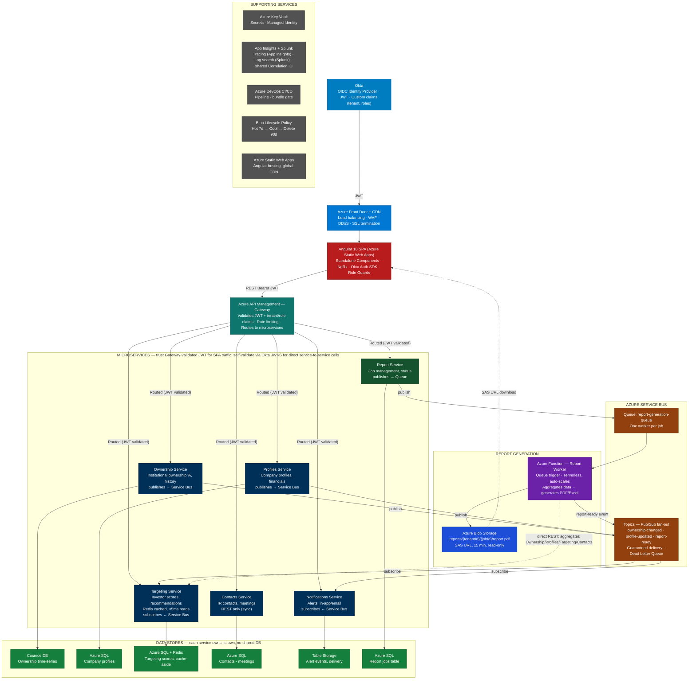
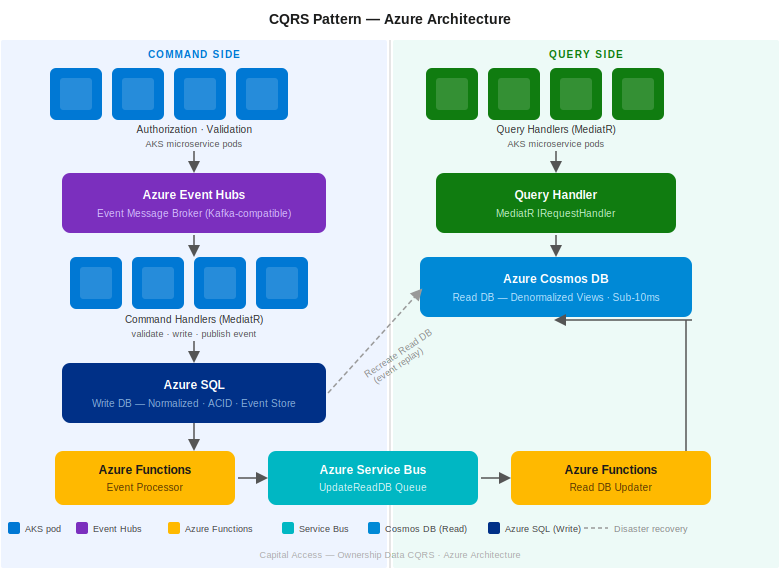

# Capital Access — Interview Story | S&P Global

## What is Capital Access?

**Capital Access** is S&P Global Market Intelligence's enterprise SaaS workflow platform for Investor Relations (IR) teams at publicly listed companies. Corporate IR officers use it to identify and target the right institutional investors, manage investor engagement and communications, monitor shareholder ownership, and measure IR programme effectiveness — all on a single platform. It is positioned under S&P's *Issuer Solutions* division.

> ⚠️
> **Key distinction for interviews:** Capital Access serves **corporate issuers** (public company IR teams), not institutional investors or buy-side firms. The IR team at, say, a FTSE 100 company logs in to find which hedge funds or mutual funds are likely buyers of their stock, then manages outreach and tracks results inside Capital Access.

| Module | What IR teams do |
| --- | --- |
| **Investor Targeting & Engagement** | Identify compatible institutional investors (by mandate, style, geography); run targeted outreach campaigns; track engagement |
| **Stock Surveillance / Capital Insight** | Real-time, self-service surveillance of ownership trends — who is buying, selling, likely to change position |
| **Capital Access Mail** | Purpose-built IR communication platform with seamless Outlook & Gmail sync, mass email to investor lists, and engagement analytics (opens, clicks) |
| **Shareholder Ownership Analytics** | Track institutional ownership %, historical trends by quarter, peer benchmarking, ownership change alerts |
| **IR CRM (BD Corporate)** | Investor contact management, meeting scheduling (roadshows, NDRs), relationship history, bulk profile management |
| **AI Textual Analytics** | Input earnings call scripts or investor communications; receive AI-generated sentiment scores and early feedback signals |
| **ESG & Governance Analytics** | Sustainability Fit Metric, Fund ESG Weighted Average — helps IR teams align sustainability narrative with investor priorities |
| **Reporting** | Board-level IR reports, Historical Ownership Report with trend analysis, customisable data-point-level layouts |

Capital Access integrates data from **S&P Capital IQ Pro** and **Visible Alpha** for financial intelligence, and syncs communications with **Outlook** and **Gmail** via Capital Access Mail.

2,500+ Corporate Issuers
8+ Feature Modules
Multi-tenant SaaS
Azure Hosted

> ℹ️
> **Why this matters for interviews:** Capital Access is not a simple CRUD app. It serves regulated public companies and their IR programmes with strict security (multi-tenant data isolation), high availability, performance requirements (real-time surveillance), and AI-driven analytics. That context makes your work on OIDC, microservices architecture, and multi-tenancy highly meaningful.

> 🗣️ **Say this:**
>
> Capital Access is a web platform used by Investor Relations (IR) teams in public companies. It helps them find and connect with investors, track who owns their company's shares, and manage investor communication — all in one place. The platform is used by over 2,500 companies worldwide and uses S&P Global data such as Capital IQ Pro and Visible Alpha.
>
> I work as a Lead Software Development Engineer on the frontend using Angular 18. I also work with Azure-based microservices, Okta authentication, and CI/CD pipelines.

## How to Explain the Full Project Flow Verbally (Interview Script)

**What is Capital Access:**
"Capital Access is an enterprise SaaS platform built by S&P Global for Investor Relations teams at publicly listed companies. Think of it as a CRM plus data intelligence platform — a corporate IR officer logs in and can see which institutional investors own their company's shares, identify new investors to target, manage meetings and roadshows, send communications, and generate board-level reports. It serves over 2,500 corporate clients and is a multi-tenant cloud platform hosted entirely on Azure."

**How a user logs in — Authentication flow:**
"When a user opens the application, they're redirected to Okta — our identity provider. Okta handles the login and issues a JWT token. What makes this interesting is that the JWT carries custom claims — specifically a tenant ID and the user's roles. The tenant ID is critical because this is a multi-tenant system — every API call must be scoped to the correct client's data, and the tenant ID in the token ensures that."

**How the frontend works:**
"The frontend is an Angular 18 single page application hosted on Azure Static Web Apps, which gives us global CDN distribution. Before the request even reaches our application, it passes through Azure Front Door, which handles load balancing, WAF protection, DDoS mitigation, and SSL termination. So the user gets a fast, secure experience from the edge before touching our backend at all."

**The API Gateway — single entry point:**
"Every API call from the Angular app goes to Azure API Management — our gateway. The SPA never talks directly to individual microservices. The gateway does three things: first, it validates the JWT token against Okta's public keys. Second, it checks the tenant and role claims — so a user from one company cannot access another company's data even if they have a valid token. Third, it applies rate limiting per tenant and routes the request to the correct downstream microservice."

**The Microservices:**
"Behind the gateway we have six microservices — each owns its own domain and its own database. We have an Ownership Service that tracks institutional ownership percentages and history, a Profiles Service for company financial data, a Targeting Service that scores and recommends investors, a Contacts Service for managing IR relationships and meetings, a Notifications Service for alerts, and a Reports Service that manages report generation jobs.

An important architectural decision here is that each service has its own database — they don't share one. The Ownership Service uses Cosmos DB because ownership data is high-volume time-series that changes constantly. The Targeting Service uses Azure SQL plus Redis because targeting scores are read very heavily and we cache them in Redis for sub-millisecond reads. Notifications uses Azure Table Storage because it's high-volume event writes that are cheap to store and query by user and time range."

**Async communication — Service Bus:**
"Services communicate asynchronously through Azure Service Bus Topics using a pub/sub pattern. For example — when the S&P data feed updates ownership data for a company, the Ownership Service saves it to Cosmos DB and publishes an OwnershipChanged event to a Service Bus Topic. The Targeting Service subscribes to that topic and recalculates its investor scores. The Notifications Service also subscribes and fires alerts to users who have set up ownership change alerts. The Ownership Service doesn't know or care that these other services exist — it just publishes the event. This is the pub/sub pattern — one event, many independent reactions, completely decoupled."

**Report generation — async queue flow:**
"Report generation is a special case because it's a long-running operation — generating a PDF report can take 30 to 60 seconds. So when a user requests a report, the Report Service doesn't process it synchronously. It puts a job message on a Service Bus Queue and immediately returns a job ID to the user. An Azure Function picks up the message from the queue, calls the Ownership, Profiles, Targeting, and Contacts services directly to aggregate the data, generates the PDF, and stores it in Azure Blob Storage. Once done, it publishes a report-ready event back to Service Bus, the Notifications Service alerts the user, and the Angular app downloads the report via a time-limited SAS URL — valid for 15 minutes, read-only. The user never waits on the screen — they get notified when it's ready."

**Caching — Redis:**
"Targeting scores are expensive to compute — they run through an ML scoring model on S&P's data. But the UI requests them constantly. So we use a cache-aside pattern with Redis. Every request checks Redis first — if the score is there, it comes back in under 5 milliseconds. If not, we fetch from Azure SQL, cache it in Redis with a one-hour TTL, and return it. When an OwnershipChanged event arrives, the Targeting Service invalidates the Redis key so the next request gets a fresh score. This gives us performance without serving stale data."

**Observability — App Insights and Splunk:**
"For observability we use two tools working together — Application Insights and Splunk, tied by a single Correlation ID. Every request gets a Correlation ID when it enters the system, and that ID travels across every service call and every Service Bus message. Application Insights gives us the distributed trace timeline — which service called which, how long each hop took, where an exception was thrown. Splunk gives us the log content — the full structured logs across all services searchable in one place. When something goes wrong in production, I take the Correlation ID, search it in Splunk, and I can see every log line from every service that touched that request — all in one view."

**One-line summary to close:**
"So in summary — Angular SPA on CDN, Azure Front Door for edge protection, APIM as the single gateway for auth and routing, six microservices each with their own database, async pub/sub via Service Bus for decoupled communication, Azure Functions for long-running report generation, Redis for performance-critical caching, and App Insights plus Splunk for full observability."

---

## Your Role & Ownership

You joined as **Lead Software Development Engineer** in December 2024. Your ownership spans three distinct areas:

| Area | What you own | Impact |
| --- | --- | --- |
| **Feature Development** | Angular 18 front-end features across 8+ modules | 2,500+ corporate IR teams consume what you build |
| **Authentication** | Full OIDC flow — token refresh, silent renewal, role-scoped access | Security foundation for the entire SaaS product |
| **Platform Modernisation** | Legacy webpack → Angular 18 standalone component migration | 30% bundle reduction, faster build pipeline |

> ✅
> **How to frame your seniority:** You are not just implementing tickets. You contribute to front-end technical decisions — performance strategy, accessibility standards (WCAG 2.1), multi-tenant architecture, and CI/CD deployment gates. This is lead-level ownership.

## Architecture Overview



| Service | Owns | Database | Why this DB? |
| --- | --- | --- | --- |
| **Ownership Service** | Institutional ownership % by company, quarterly history, change events | Azure Cosmos DB | High-volume time-series data — ownership changes constantly, needs fast writes and flexible schema per quarter |
| **Profiles Service** | Company profiles — financials, sector, market cap, IR team contacts | Azure SQL | Structured relational data, strong consistency, complex queries across company attributes |
| **Targeting Service** | Investor targeting scores, peer benchmarking, recommendations | Azure SQL + Redis Cache | Scores are read heavily by the UI — Redis caches top-N targeting results per company for sub-millisecond reads |
| **Contacts Service** | IR contacts, investor contacts, meeting history, relationships | Azure SQL | Relational by nature — contacts belong to companies, meetings belong to contacts |
| **Notifications Service** | Ownership change alerts, price movement alerts, delivery status | Azure Table Storage | High-volume write of alert events (cheap, scalable), reads are by user/timerange (partition key fits) |
| **Engagement & Activity Service** | IR engagement lifecycle — meetings, roadshows, outcomes, follow-up tasks, sentiment scores | Azure SQL (EF Core 8, Code-First) | Deeply relational data (Activity → Attendees → FollowUpTasks), complex aggregate queries for board reporting, ACID transactions for status transitions, EF Core migrations as CI/CD deployment step |

> ℹ️
> **The Angular SPA talks to a single API Gateway, not directly to individual microservices.** Every request from the SPA carries the Bearer JWT and is sent to the Gateway's URL. The Gateway (Azure API Management) validates the JWT signature against Okta's JWKS, checks the tenant and role claims, applies rate limiting, and routes the request to the correct downstream microservice. Individual microservices trust the Gateway for SPA-originated traffic and don't need to re-implement that check on every request. The exception is service-to-service traffic that bypasses the Gateway entirely — for example the Report Worker (Azure Function) calling Ownership/Profiles/Targeting/Contacts directly to aggregate data — those calls still validate the JWT independently against Okta's JWKS as a defense-in-depth measure, since they're not coming through the Gateway's boundary.

## Service-to-Service Communication Patterns

The architecture diagram shows the SPA → Gateway → services path and the Service Bus fan-out clearly, but it deliberately doesn't draw a separate arrow for every direct service-to-service call — that would turn the diagram into spaghetti. There are really three distinct patterns in play, and which one applies depends on what kind of communication it is.

| Pattern | Where it's used | How it works | Trust / auth model |
| --- | --- | --- | --- |
| **Synchronous direct REST** | Report Worker (Azure Function) → Ownership, Profiles, Targeting, Contacts — aggregating data to build one report | The Function calls each service's REST endpoint directly, bypassing the Gateway entirely, and waits for the response before moving to the next step | Each call carries the JWT that originated the report request; since it didn't come through the Gateway, the receiving service validates that JWT itself against Okta's JWKS (defense-in-depth) |
| **Asynchronous pub/sub (Service Bus Topics)** | Ownership changes → Targeting + Notifications; profile updates → Targeting; report-ready → Notifications | Publisher fires one event to a Topic; every Subscription on that Topic gets its own independent copy — publisher and subscribers never call each other directly | No per-request JWT check between services — trust is the Service Bus namespace boundary itself (network/IAM), with tenant ID carried inside the event payload and re-validated wherever it's used downstream |
| **Task queue (Service Bus Queue)** | Report Service → report-generation-queue → Azure Function | Exactly one worker instance picks up and processes each queued job message | Same trust model as Topics — tenant ID and requesting user's context travel inside the queued message, not as a live JWT on a direct call |

> ℹ️
> **Why direct REST for the Report Worker specifically:** by the time the Function runs, it already has the full request context (tenant, jobId, which company) and needs synchronous answers right now to assemble one report — there's no "event" to publish, just data it needs to fetch immediately from four different owners. Pub/sub is reserved for the opposite case: multiple independent consumers reacting to a state change without being coupled to the producer or to each other.

## CQRS Pattern — Ownership Data

Capital Access uses CQRS (Command Query Responsibility Segregation) in the Ownership and Engagement services to solve a concrete read/write contention problem.



### The Problem

At quarter-end, regulatory filings (13-F, EDGAR) are ingested in bulk — thousands of `UpdateOwnership` commands per minute. At the same time, institutional clients are actively reading the Ownership Dashboard. Without CQRS, both workloads hit the same Azure SQL database: write lock contention makes every dashboard read slow or time out exactly when clients need the data most.

### The Solution — Two Models, Two Databases

```
WRITE SIDE (Azure SQL):
  Commands → Command Handler (MediatR) → validates → writes to Azure SQL
  → publishes OwnershipUpdatedEvent to Azure Service Bus

EVENT PIPELINE (async, ~100–500ms lag):
  Azure Service Bus Queue → Azure Functions (Read DB Updater)
  → projects to Cosmos DB in UI-optimized document shape

READ SIDE (Cosmos DB):
  Query Handler (MediatR) → point-read from Cosmos DB by tenantId partition key
  → sub-10ms response, zero joins, no contention with write side
```

### Commands and Queries

| Side | Examples |
|------|----------|
| Commands → Azure SQL | `UpdateOwnership`, `CreateEngagement`, `AddToTargetingList` |
| Queries → Cosmos DB | `GetOwnershipDashboard`, `GetEngagementReport`, `GetTargetingList` |

### AWS → Azure Service Mapping

| AWS (original diagram) | Azure equivalent |
|------------------------|-----------------|
| Apache Kafka | Azure Event Hubs (Kafka-compatible) |
| Lambda (Event Processor) | Azure Functions |
| SQS Queue | Azure Service Bus Queue |
| Lambda (Read DB Updater) | Azure Functions (Service Bus trigger) |
| Read DB (DynamoDB) | Azure Cosmos DB |
| Write DB | Azure SQL |
| Microservice pods | AKS pods |

### Eventual Consistency — How We Handle It

The Cosmos DB read model is typically 100–500ms behind the write side. The UI shows a **"Last updated: 10:00:00"** timestamp on the dashboard so clients know the data age — it's a transparency feature, not a bug. For compliance or audit use cases where strong consistency is required, we read directly from Azure SQL.

If Cosmos DB is ever corrupted or needs rebuilding, we replay all events from the Azure SQL event store — the dashed "Recreate Read DB" flow in the diagram.

### Interview Line

> "We use CQRS in Capital Access specifically because of quarter-end bulk ingestion from regulatory filings. At quarter-end we're processing thousands of ownership updates per minute. If reads and writes shared the same Azure SQL database, lock contention would kill dashboard performance exactly when institutional clients need it most. So the write side commits to Azure SQL and publishes a domain event. An Azure Function picks that event off a Service Bus queue and projects it into a Cosmos DB document — pre-shaped with company names already joined in, sorted shareholders, everything the dashboard needs. When the Angular dashboard loads, it hits Cosmos DB via a partition-key point read — sub-10 milliseconds, completely isolated from the write storm happening on Azure SQL. The trade-off is eventual consistency — typically a few hundred milliseconds. We surface that as a 'last updated' timestamp on the UI."

---

## Logging & Observability — App Insights + Splunk

Two tools, two different jobs, tied together by one Correlation ID.

```
App Insights (distributed tracing / APM):
  Auto-instruments each microservice via its SDK
  On every incoming request, reads or creates a Correlation ID (W3C Trace Context header)
  That same Correlation ID is propagated on every downstream call the service makes —
    both synchronous REST calls AND Service Bus messages
  Gives you: the trace TIMELINE — which service called which, how long each hop took,
    where an exception was thrown, dependency call latency (e.g. SQL query took 120ms)

Splunk (centralized log aggregation):
  Every microservice ships structured logs (info/warn/error + payload context)
  Each log line is stamped with the SAME Correlation ID that App Insights is propagating
  Gives you: the actual LOG CONTENT — full request/response bodies, custom log
    messages, stack traces — searchable across every service in one query
  Also where ops dashboards and alerting live (error rate spikes, DLQ growth, etc.)

In practice, debugging a production issue:
  1. User reports a problem around a specific time / for a specific report job
  2. Pull the Correlation ID from the App Insights trace (or from the initial log line)
  3. Search that Correlation ID in Splunk → every log line, every service, one place
  4. Cross-reference back to App Insights if you need the TIMING view (which hop was slow)
    vs. Splunk for the CONTENT view (what exactly did each service log)
```

> ℹ️
> **Why both, not just one:** App Insights is excellent at "what's slow and where" — the trace graph — but it isn't built as a general-purpose log search tool across arbitrary structured fields. Splunk is excellent at "search everything, build a dashboard, alert on a pattern" but doesn't give you the automatic distributed-trace timeline out of the box. Using both, joined by a shared Correlation ID, gives you both views without forcing one tool to do the other's job.

Not all communication is synchronous. When ownership data changes, multiple downstream services need to react. We use **Azure Service Bus Topics** (pub/sub model) for this.

```
Example: S&P data feed updates ownership percentages for APPLE INC

Ownership Service:
  → updates Cosmos DB ✅
  → publishes "OwnershipChanged" event to Service Bus Topic

Subscribers receive their own copy (pub/sub, not queue):
  Targeting Service     → recalculates investor targeting scores for AAPL
  Notifications Service → checks user alert preferences → sends email/in-app alert

The Ownership Service does not know or care that Targeting and Notifications exist.
If a new "Analytics Service" is added tomorrow, it just subscribes to the topic.
Zero changes to Ownership Service.

This is the Pub/Sub pattern: one event → many independent reactions.
```

> ℹ️
> **Dead Letter Queue:** If Targeting Service is down when the event arrives, Azure Service Bus holds it in a Dead Letter Queue. When the service recovers, it processes the backlog. No ownership change is ever lost — guaranteed delivery.

```
Problem:
  Targeting scores are expensive to compute (ML scoring model runs on S&P's data)
  But the UI requests them constantly — every time a user opens an investor targeting page

Solution: Cache-Aside Pattern with Redis
  Request arrives → check Redis for cached score
  Cache HIT  → return in < 5ms ✅
  Cache MISS → fetch from Azure SQL → compute/enrich → store in Redis (TTL: 1 hour) → return

Invalidation:
  When OwnershipChanged event arrives (Service Bus) → Targeting Service
  → recomputes score → writes new score to Azure SQL → INVALIDATES Redis key
  → next request gets fresh score from SQL, re-caches it
```

```
Angular 18 SPA (Azure Static Web Apps)
├── Standalone Components (no NgModules — enables per-component tree-shaking)
├── Lazy-loaded Feature Modules
│   ├── Ownership Module        → calls Ownership Service
│   ├── Profiles Module         → calls Profiles Service
│   ├── Targeting Module        → calls Targeting Service (Redis-backed, fast)
│   ├── Contacts Module         → calls Contacts Service
│   ├── Notifications Module    → calls Notifications Service
│   └── 5+ more feature modules
├── Shared Core
│   ├── OktaAuthService         → wraps okta-auth-js, manages token lifecycle
│   ├── HTTP Interceptor        → attaches Bearer JWT to all outbound calls
│   ├── Role Guard              → decodes JWT roles claim, protects routes
│   ├── Tenant Config Service   → loads tenant feature flags after login
│   └── WCAG 2.1 component lib  → accessible data grids, modals, charts
├── NgRx Store
│   ├── Auth slice              → user identity, roles, tenant
│   ├── Feature slices          → one per lazy module, loaded on demand
│   └── UI slice                → loading states, notifications
└── Azure DevOps CI/CD
```

| Technology | Used for | Why chosen |
| --- | --- | --- |
| Okta | Identity / OIDC | Enterprise IdP, MFA, custom JWT claims, okta-auth-js SDK for Angular |
| Azure API Management (Gateway) | Single entry point for the SPA | Centralised JWT/tenant-claim validation, rate limiting, and routing instead of duplicating auth logic in every service for SPA-originated traffic |
| Azure Service Bus | Async inter-service events | Pub/Sub Topics, guaranteed delivery, Dead Letter Queue, native Azure |
| Azure Cosmos DB | Ownership time-series | Horizontally scalable, flexible schema, fast writes for high-volume financial data |
| Azure SQL | Profiles, Contacts, Targeting | Relational structure, ACID transactions, rich querying |
| Azure Redis Cache | Targeting score caching | Sub-millisecond reads, cache-aside pattern, TTL-based auto-expiry |
| Azure Blob Storage | Reports, exports, documents | Cheap, scalable object storage for non-queryable binary files |
| Azure Key Vault | Secrets management | No connection strings in code or config files — services fetch secrets at runtime |
| Azure App Insights | Distributed tracing / APM | Auto-instruments each service, propagates Correlation ID (W3C Trace Context), gives the timing/dependency view of one request across services |
| Splunk | Centralized log aggregation | Every service ships structured logs tagged with the same Correlation ID — the first place engineers search during an incident, across all services in one query |
| Azure Front Door | CDN + WAF + load balancing | Global edge, DDoS protection, SSL termination at the edge |
| Azure Static Web Apps | Hosting Angular SPA | Built-in CDN, CI/CD integration, free SSL, global distribution |
| Azure Functions | Report Worker (serverless) | Queue-triggered, auto-scales to queue depth, no idle server cost, aggregates data from all services and generates PDF/Excel reports |
| Azure Durable Functions | Multi-step report pipeline orchestration | Checkpointed, crash-safe workflow (generate → blob upload → SAS URL) without hand-rolled progress tracking |

## Report Generation Architecture

Capital Access clients — IR teams, investment banks — need to generate ownership reports, shareholder analytics reports, investor targeting summaries, and board-pack exports. These are not instant: they require pulling data from multiple services, generating a formatted PDF or Excel, and making it available for download. The key design decision is **async generation** — never block the user while a report builds.

```
STEP 1 — USER TRIGGERS REPORT
  Angular UI → POST /api/reports
              { reportType: "ownership-analysis", companyId: "AAPL", quarter: "Q2-2025" }
              Report Service saves job → DB: { jobId: "rpt-001", status: "PENDING" }
              Returns immediately → { jobId: "rpt-001" }   ← no waiting ✅

STEP 2 — JOB QUEUED (Azure Service Bus Queue — NOT a Topic)
  Report Service → publishes message to [report-generation-queue]
  Message: { jobId: "rpt-001", reportType, companyId, tenantId, requestedBy }

  WHY A QUEUE, NOT A TOPIC?
  Report generation is a TASK — exactly ONE worker should process each job.
  A Topic would fan-out to all subscribers → every worker generates the same report → wasteful.
  Queue = one message, one consumer. ✅

STEP 3 — WORKER PICKS UP JOB (Azure Function — Queue Trigger)
  Azure Function triggered automatically when message arrives in queue
  Serverless: scales out to N parallel instances if 50 reports queued simultaneously
  Updates job status → "IN_PROGRESS"

STEP 4 — DATA AGGREGATION (calls multiple microservices)
  Azure Function calls:
    Ownership Service  → ownership % history for AAPL, Q1–Q4 2025
    Profiles Service   → company profile, financials, sector, IR team
    Targeting Service  → current investor targeting scores and recommendations
    Contacts Service   → IR contacts for the report footer / distribution list
  Aggregates all data in memory → report data model ready

STEP 5 — REPORT GENERATION
  PDF:   uses document generation library (e.g. iTextSharp / QuestPDF / SSRS template)
  Excel: uses EPPlus / ClosedXML to build formatted workbook
  Output: byte[] of the generated file

STEP 6 — UPLOAD TO AZURE BLOB STORAGE
  Path: reports/{tenantId}/{jobId}/ownership-analysis-AAPL-Q2-2025.pdf
  Azure Blob Storage → object stored ✅
  Job record updated → { status: "COMPLETED", blobPath: "reports/..." }

STEP 7 — NOTIFY USER
  Azure Function publishes "ReportReady" event → Azure Service Bus Topic
  Notifications Service subscribes → sends in-app notification + email
  "Your Ownership Analysis report for AAPL is ready. Click to download."

STEP 8 — SECURE DOWNLOAD
  User clicks download → Angular calls GET /api/reports/rpt-001/download
  Report Service generates a SAS URL (Shared Access Signature):
    - Time-limited: expires in 15 minutes
    - Read-only: cannot write or delete
    - Scoped to exactly that blob: reports/{tenantId}/{jobId}/...
  Returns SAS URL to Angular → browser downloads directly from Blob Storage
  Blob Storage never publicly accessible — only via SAS URL
```

> ℹ️
> **Report generation is bursty.** At 9am when markets open, many IR teams trigger reports simultaneously. At 3pm it's quiet. A dedicated always-on VM or container wastes money 80% of the time. Azure Functions scale to zero when idle and spin up parallel instances automatically when the queue has 50 messages. Cost-efficient + elastic — no manual scaling configuration needed.

```
Option A — Polling (what we use for simplicity):
  Angular UI polls GET /api/reports/{jobId}/status every 3 seconds
  { status: "PENDING" } → { status: "IN_PROGRESS" } → { status: "COMPLETED" }
  On COMPLETED → show download button
  Simple to implement. Fine for reports that take 10–30 seconds.

Option B — SignalR (real-time push, more complex):
  Azure SignalR Service pushes status update directly to the Angular client
  No polling — notification arrives the instant the report is ready
  Better UX for longer reports (minutes), more infrastructure to manage
  Trade-off: added Azure SignalR dependency vs. polling simplicity
```

> ⚠️
> **Blob Storage is private — no public URLs.** A SAS (Shared Access Signature) URL is a cryptographically signed URL that grants time-limited, permission-scoped access to a specific blob. We generate it server-side (Report Service has the storage account key in Key Vault). The client gets a URL that works for 15 minutes then expires. Even if the URL leaks, it becomes useless after expiry. This means: no proxy cost (file streams direct from Blob Storage to browser), no auth header needed on the download request, and the blob remains private at all times.

```
Angular SPA
    │  POST /reports (async, returns jobId immediately)
    ▼
Report Service ──────────────────────► Azure SQL (jobs table: jobId, status, blobPath)
    │
    │ publish to queue
    ▼
[Azure Service Bus Queue: report-generation-queue]
    │
    │ Queue Trigger (auto-scales)
    ▼
Azure Function (Report Worker)
    ├── calls Ownership Service  ──► Cosmos DB
    ├── calls Profiles Service   ──► Azure SQL
    ├── calls Targeting Service  ──► Azure SQL + Redis
    └── calls Contacts Service   ──► Azure SQL
    │
    │ generates PDF / Excel bytes
    ▼
Azure Blob Storage  ←── uploads file (private container)
    │
    │ updates job status + blob path
    ▼
Azure SQL (jobs table: status=COMPLETED)
    │
    │ publishes "ReportReady" event
    ▼
Azure Service Bus Topic ──► Notifications Service ──► email + in-app alert
    │
    │ user clicks download
    ▼
Report Service generates SAS URL (15 min, read-only, single blob)
    │
    ▼
Browser downloads directly from Blob Storage via SAS URL ✅
```

**Q: Q: Why a Queue for report generation but a Topic for ownership change events?**

Answer:
        The fundamental difference is whether the message is a *task* or an *event*. Report generation is a task — "generate this specific report once, exactly one worker should do it." A Queue ensures exactly one consumer picks up each message. If I used a Topic, every subscribed worker instance would generate the same report — wasteful and wrong. An ownership change is an event — "something happened, tell everyone who cares." Multiple services (Targeting, Notifications) each need their own independent copy to react to. Topic fan-out is exactly right for that. Same Azure Service Bus, different pattern — Queue for tasks, Topic for events.

> 💡 This directly maps to the Queue vs Pub/Sub distinction — a perfect chance to show depth.

**Q: Q: What happens if the Azure Function crashes mid-report generation?**

Answer:
        Azure Service Bus handles this with message lock and retry. When the Function picks up a message, Service Bus locks it — no other consumer can claim it. If the Function crashes before completing, the lock expires after a configurable timeout (e.g. 5 minutes). Service Bus automatically re-delivers the message to another Function instance. We handle this safely because Step 4 (data aggregation) and Step 5 (PDF generation) are pure computation — no side effects. The only side-effecting steps are the Blob upload and the DB status update at the end. If those didn't happen, the retry will redo them cleanly. After a configured max retry count, the message moves to the Dead Letter Queue for manual inspection.

**Q: Q: How do you prevent one tenant's report job from seeing another tenant's data?**

Answer:
        The tenant ID is embedded in the Service Bus message from the original request, and it came from the validated JWT — so it's trustworthy. The Azure Function includes the tenant ID in every downstream API call. Each microservice filters all data by tenant ID at the query level. The Blob Storage path is scoped under the tenant ID: reports/{tenantId}/{jobId}/.... The SAS URL is generated for that exact blob path only. So even if someone guessed another tenant's jobId, the SAS URL would be for their tenant's path, which wouldn't match.

**Q: Q: How long are generated reports stored? What's your retention strategy?**

Answer:
        Azure Blob Storage Lifecycle Management policies handle this automatically. Reports are stored in Hot tier for 7 days — within that window, SAS URLs can be regenerated on demand if the user wants to re-download. After 7 days, the policy automatically moves blobs to Cool tier (cheaper storage, same access). After 90 days, blobs are deleted — clients are expected to save reports locally if they need them longer. This is a business decision, not a technical constraint, but the Lifecycle Management policy enforces it with zero application code.

## OIDC Authentication with Okta — Deep Dive

This is the most technically rich part of your S&P work. Expect detailed follow-up here. Be confident — you implemented the full auth flow.

> ℹ️
> OAuth2 = authorisation framework (who can access what). OIDC = adds identity layer on top (who are you). For Capital Access, you need both — authenticate the user AND control what data/features they see based on their role and client subscription. OIDC gives you both in one flow. Okta is the Identity Provider — it handles the OIDC protocol, MFA, session management, and token issuance.

```
1. USER OPENS APP
   Angular SPA loads → checks for valid access token in memory
   No token / token expired → initiate OIDC login

2. LOGIN REDIRECT
   App redirects → Okta-hosted login page
   User authenticates (password + MFA if enforced by Okta policy)
   Okta issues: ID Token + Access Token + Refresh Token

3. TOKEN RECEIVED
   App receives tokens via redirect callback
   ID Token  → decode claims: user identity, name, email, tenant/org ID
   Access Token → short-lived (60 min), sent in Bearer header on every API call
   Refresh Token → long-lived, used to get new access token silently

4. SILENT RENEWAL (the tricky part)
   Access token expires → BEFORE expiry, app silently requests new token
   Uses Okta's refresh token flow (or silent SSO via hidden iframe)
   User sees nothing — seamless experience
   Angular Timer service triggers renewal at (expiry - 5 minutes)

5. ROLE-SCOPED ACCESS CONTROL
   Access token contains "groups" or custom "roles" claim (configured in Okta)
   e.g. roles: ["capital_access.investor_targeting", "capital_access.reporting"]
   Angular Route Guard reads roles claim
   Routes not in the user's role list → redirect to Unauthorised page
   10+ feature modules each have their own role guard

6. HTTP INTERCEPTOR
   Every outbound HTTP call → interceptor attaches "Authorization: Bearer {token}"
   On 401 → interceptor attempts token refresh via Okta → retry original request once
   On second 401 → force logout
```

> ⚠️
> **Never store tokens in localStorage.** localStorage is readable by any JS on the page — XSS attack steals your token. We store access tokens in memory (JavaScript variable) and use Okta's refresh token flow to get new ones. Session survives page refresh because Okta also issues an SSO session cookie that the silent renewal flow uses.

```
Access Token JWT Payload (decoded, issued by Okta):
{
  "uid":   "okta-user-id",
  "cid":   "okta-client-id",
  "tid":   "tenant-id",           ← identifies which client company (custom claim in Okta)
  "roles": ["investor_targeting", "shareholder_analytics"],  ← custom claim configured in Okta
  "sub":   "user@clientcompany.com",
  "iss":   "https://s&pglobal.okta.com/oauth2/default",     ← Okta issuer
  "exp":   1718000000             ← expiry timestamp
}

Angular Route Config:
{
  path: 'investor-targeting',
  component: InvestorTargetingComponent,
  canActivate: [RoleGuard],
  data: { requiredRole: 'investor_targeting' }  ← checked against JWT roles claim
}
```

> 🚩
> **Why this is hard:** Migrating auth on a live multi-tenant SaaS is like changing the locks on a building while people are inside. If anything breaks, 2,500+ companies lose access instantly.

| Before (SAML) | After (Okta OIDC) |
| --- | --- |
| XML-based token (SAML Assertion) | JSON-based JWT (compact, stateless) |
| SP-initiated redirect to IdP login page | OIDC Authorization Code flow with PKCE |
| Session managed server-side | Token in memory, silent renewal via Okta refresh token |
| No fine-grained role claims | Custom claims (tenant ID, roles) configured in Okta authorization server |
| Single backend validation approach | Each microservice validates JWT independently via Okta JWKS endpoint |

- Replaced the SAML redirect flow with Okta OIDC using the **okta-auth-js** SDK
- Built the HTTP Interceptor to attach `Bearer JWT` to every outbound request and handle 401 retry
- Implemented silent token renewal — Angular Timer triggers refresh 5 minutes before expiry
- Built Role Guards reading custom claims from the JWT to gate each feature module
- Used **per-tenant feature flags** to roll the migration tenant-by-tenant — if one tenant had issues, we could roll back without touching others

> ⚠️
> **Important boundary to set clearly in the interview:** User migration from SAML to Okta (provisioning accounts, syncing directories) was handled by a separate platform/infrastructure team. My ownership was end-to-end on the frontend auth flow and the per-tenant rollout strategy.

> 🗣️ **Say this:**
>
> The trickiest thing I've worked on was the SAML to Okta OIDC migration. We were moving auth on a live platform serving 2,500+ companies — if anything broke, nobody could log in. My ownership was the frontend side: I replaced the SAML redirect flow with Okta's OIDC flow using okta-auth-js, built the HTTP interceptor to attach Bearer JWTs and handle token refresh on 401, and implemented silent token renewal so users never see an unexpected logout. The riskiest part was the cutover. We handled it using per-tenant feature flags — we migrated one tenant at a time, so we could roll forward or roll back per client without a full outage. The user provisioning side was handled by a separate infra team, so I can speak to the frontend auth flow in detail.

## Angular 18 Standalone Components Migration

> 🚩
> **Before migration:** NgModule-based architecture → all components declared in modules → large shared NgModules pulled everything into initial bundle → slow first load. Webpack config was hand-written and not taking advantage of Angular 18 build optimisations.

```
BEFORE (NgModule architecture):
  AppModule
    ├── SharedModule (pulled in ALL shared components, even unused ones)
    ├── InvestorTargetingModule
    └── ShareholderModule
  Build: webpack manual config, no module federation
  Bundle size: 100% (baseline)

AFTER (Angular 18 Standalone):
  Each component declares its own imports
  ├── InvestorTargetingComponent (imports: [CommonModule, RouterModule, ChartComponent])
  ├── ShareholderComponent (imports: [CommonModule, TableComponent])
  └── ChartComponent (standalone, used only where needed)
  Build: Angular 18 esbuild (Vite-based) — dramatically faster
  Bundle size: -30% (only what each component actually needs is bundled)
```

- Tree-shaking works at component level — unused code eliminated per component, not per module
- Lazy routes now split at component boundary, not module boundary — finer-grained chunks
- esbuild (Angular 18 default) is 10–100x faster than webpack and produces smaller output
- Removed barrel files (index.ts re-exports) that prevented tree-shaking

1. Ran Angular's `ng generate @angular/core:standalone` schematics to auto-migrate leaf components first
2. Converted shared/library components next (most reused → highest impact)
3. Converted feature modules last (they depend on shared components being ready)
4. Updated routing to use `loadComponent` instead of `loadChildren` where possible
5. Removed empty NgModules and updated webpack/esbuild config to use native Angular 18 builder

> ✅
> **Result:** 30% bundle reduction + faster CI build pipeline (esbuild vs webpack) + simpler codebase with no NgModule ceremony.

## Multi-Tenancy in the Frontend

Capital Access serves 2,500+ corporate issuers from one codebase. Each client is a separate tenant with potentially different feature sets, branding, and data.

```
At login, the JWT access token contains:
  "tid" (tenant ID)  → identifies which client company the user belongs to
  "roles"            → which Capital Access features this tenant has subscribed to

Angular App Bootstrap:
  1. Decode JWT → extract tid + roles
  2. Load tenant config from API: { theme: 'default', features: ['investor_targeting'], locale: 'en-US' }
  3. Set feature flags in NgRx store
  4. Route guards use feature flags → users see only features their company pays for
  5. Theme variables applied globally (Azure client has different branding than bank client)
```

> ℹ️
> Every API call includes the tenant ID (from JWT). The backend microservices filter all data by tenant. A user from Client A can never see Client B's shareholder data. This is enforced at the API layer — the frontend is just the display. But the frontend must never expose tenant IDs or mix tenant contexts in the NgRx state.

Capital Access is an enterprise product used at institutional clients — legal requirement in many markets. Your contribution:

- ARIA labels on all interactive components, data tables, and charts
- Keyboard navigation on all modals, dropdowns, and data grids
- Colour contrast ratios meeting WCAG 2.1 AA (4.5:1 text, 3:1 UI components)
- Focus management — modal open/close, route changes restore focus correctly
- Screen reader testing with NVDA/VoiceOver as part of PR review gate

## CI/CD & DevOps

```
Developer pushes to feature branch
         │
         ▼
[PR Branch Pipeline]
  ├── Lint (ESLint + Stylelint)
  ├── Unit Tests (Jest, coverage gate ≥ 80%)
  ├── Build (Angular 18 esbuild)
  └── Accessibility scan (axe-core automated)
         │ PR approved + all gates pass
         ▼
[Merge to develop]
  ├── Integration tests
  ├── SAST security scan
  └── Deploy to DEV environment
         │ QA sign-off
         ▼
[Deploy to Staging]
  ├── E2E tests (Cypress/Playwright)
  ├── Performance budget check (bundle size gate)
  └── Manual deployment gate (Lead approval)
         │ Release approved
         ▼
[Deploy to Production]
  └── Blue/Green deployment (zero downtime)
```

You worked with DevOps to define **deployment gates** — automated checks that must pass before a stage can proceed. The bundle size gate ensures no PR accidentally re-inflates the bundle after your 30% reduction. The accessibility scan runs axe-core automatically — accessibility regressions are caught in CI, not after release.

## The STAR Story — Say This in the Interview

> ⚠️
> **The most important section.** Practise this out loud until it flows naturally. Under 3 minutes. Don't read it — tell it.

> 🗣️ **Say this:**
>
> I currently work at S&P Global as a Lead Software Development Engineer on Capital Access — it's S&P's web platform for Investor Relations teams at publicly listed companies. The platform serves over 2,500 corporate issuers worldwide, helping them find and connect with investors, track ownership, and manage investor communications.
>
> The backend is a microservices architecture on Azure — five core services each with their own data store: an Ownership Service that holds institutional ownership percentages and historical data in Cosmos DB, a Profiles Service for company financials and metadata in Azure SQL, a Targeting Service for investor targeting scores backed by Azure SQL with Redis caching for fast reads, a Contacts Service for IR relationship management, and a Notifications Service for ownership change alerts. Services communicate asynchronously through Azure Service Bus Topics — when ownership data changes, the Service Bus event fans out to both the Targeting and Notifications services independently without any tight coupling between them.
>
> The frontend is Angular 18 — my primary area of ownership. I've worked on feature development across 10+ modules, owned the full OIDC authentication flow using Okta, and led the migration from our legacy NgModule architecture to Angular 18 standalone components.
>
> The standalone migration was the most impactful thing I've done. The old setup was pulling everything into the initial bundle regardless of what the user actually accessed. By moving to standalone components and switching to Angular 18's esbuild builder, we achieved a 30% reduction in bundle size. We then put a bundle size gate in our Azure DevOps pipeline so no future PR can silently re-inflate it.
>
> On auth — security is non-negotiable in regulated financial software. I implemented OIDC with Okta: the Angular app handles silent token renewal before expiry, role claims in the JWT control which features and data each tenant can access, and an HTTP interceptor retries on 401 after token refresh before forcing logout. Tokens live in memory, never localStorage.

> 🗣️ **Say this:**
>
> The trickiest part of the auth implementation was silent token renewal. When an access token is about to expire, the app needs to get a new one without interrupting the user. I set up a timer that fires 5 minutes before expiry and uses Okta's refresh token flow — completely invisible to the user. The edge case was handling what happens when the refresh call fails — for example if the user's network drops momentarily or if their Okta session itself has expired. I implemented a fallback: one retry, then a graceful redirect to the login page with the user's current route preserved so they land back where they were after re-authenticating. That kind of detail matters in an enterprise financial product where a user is mid-way through building an investor targeting list.

> 🗣️ **Say this:**
>
> The 30% bundle reduction meant the initial page load dropped noticeably for clients on slower enterprise networks. Beyond the number, the architectural shift to standalone components simplified onboarding of new features — engineers no longer had to think about which NgModule to add a component to. The CI pipeline now catches bundle regressions and accessibility failures automatically before they reach production. For an enterprise SaaS with 500+ clients, catching a regression in CI is infinitely better than discovering it in production.

## Follow-Up Questions & Answers

**Q: Q: You mentioned migrating from SAML to Okta — how did you handle the user migration?**

Answer:
        The user provisioning side — syncing existing accounts from SAML into Okta — was handled by a separate platform and infrastructure team. My ownership was purely on the frontend auth flow: replacing the SAML redirect with Okta OIDC, building the HTTP interceptor, silent token renewal, and the role guards. I also designed the per-tenant feature flag rollout so we could migrate one client at a time and roll back any individual tenant if something went wrong, without taking the whole platform down.

> 💡 This is the right answer — it's honest, shows you know the full picture, and keeps you on safe ground where you can answer every follow-up confidently.

**Q: Q: Why did you migrate from SAML to Okta OIDC? What was wrong with SAML?**

Answer:
        SAML wasn't wrong — it worked — but it had limitations for our use case. SAML tokens are XML-based and verbose, which added overhead on every request. More importantly, SAML sessions are server-managed, which doesn't fit a stateless microservices architecture — each service would need to call back to a session store to validate the user. With Okta OIDC, we get compact JWTs that each microservice validates locally using Okta's JWKS endpoint, with no shared session store needed. We also got fine-grained custom claims (tenant ID, roles) in the token itself, which SAML required more complex attribute mapping to achieve. And Okta gives us MFA, adaptive policies, and audit logging out of the box.

> 💡 SAML vs OIDC is a common deep-dive. Key points: XML vs JWT, server session vs stateless, and the microservices fit.

**Q: Q: Why OIDC instead of SAML for enterprise clients?**

Answer:
        SAML is XML-based and built for browser redirects — it works but is heavy and hard to use in SPAs. OIDC is JSON/JWT-based, designed for modern apps, and works natively with SPAs and mobile clients. Okta supports both SAML and OIDC, but we chose OIDC because it gives us cleaner token handling in Angular — we can decode JWT claims directly in the browser, attach Bearer tokens to every API call, and handle silent renewal without page redirects. Okta also has a well-maintained JavaScript SDK (okta-auth-js) that integrates cleanly with Angular. For a modern SaaS targeting institutional clients, OIDC is the right choice.

> 💡 Mention: JWT is stateless — backend microservices can validate it without a session store.

**Q: Q: How do you prevent token theft? XSS? CSRF?**

Answer:
        XSS: Tokens are stored in memory (JavaScript variable), never localStorage or sessionStorage. Okta's SDK keeps the access token in memory by default — we don't override that. Content Security Policy (CSP) headers prevent injected scripts from reaching external endpoints even if they execute. We also sanitise all dynamic HTML via Angular's built-in DomSanitizer. CSRF: Not a concern for Bearer token auth — CSRF exploits cookies, and we're not relying on cookies for authentication. The Bearer token has to be explicitly attached to each request by our HTTP interceptor, which a forged third-party page cannot do.

**Q: Q: What happens when a user's session expires mid-workflow?**

Answer:
        The silent renewal timer fires before expiry and gets a new access token invisibly via Okta's refresh token flow. If silent renewal fails — network issue or Okta session expired — the HTTP interceptor on the next API call catches the 401, attempts one token refresh, and if that fails, redirects to login. We preserve the current URL in state so after login the user is returned exactly to where they were. For a financial workflow like building an investor targeting list, losing progress on session expiry would be unacceptable.

**Q: Q: How does role-based access work across 2,500+ clients?**

Answer:
        Each client company is a separate application or group in Okta. When users from ClientA log in, Okta issues a JWT containing their tenant ID and the specific roles their company has subscribed to — configured as custom claims in Okta's authorization server. For example, roles: ["investor_targeting", "shareholder_analytics"]. The Angular route guards decode these claims and only allow access to matching routes. If Client B hasn't subscribed to Roadshow Management, that route is simply unreachable — the guard redirects them. This is enforced both client-side in routing and server-side in the API — the client-side guard is UX, the server-side check is the actual security boundary.

> 💡 Important: Always say "client-side is UX, server-side is security" — interviewers love this distinction.

**Q: Q: How did you achieve the 30% bundle reduction specifically?**

Answer:
        Three things. First, standalone components enable tree-shaking at the component level — each component declares exactly what it imports, so unused code from shared modules is eliminated. In NgModule architecture, a SharedModule that exports 50 components pulls all 50 into any module that imports SharedModule, even if you only used 2. Second, we switched from webpack to Angular 18's esbuild-based builder — esbuild is fundamentally faster and produces smaller output. Third, we removed barrel files (index.ts re-export patterns) that were preventing tree-shaking — bundlers couldn't tell which exports were actually used when everything was re-exported through a single index file.

**Q: Q: How do you ensure performance doesn't regress in future?**

Answer:
        We added a bundle size budget gate in the Azure DevOps CI pipeline. Every PR is built and the output bundle sizes are compared against a defined budget. If any chunk exceeds its budget, the pipeline fails and the PR cannot be merged. This means a developer can't accidentally import a heavy library without the team noticing. We also run Lighthouse in CI on key routes and track Core Web Vitals — First Contentful Paint and Total Blocking Time are tracked per release.

**Q: Q: How does the frontend communicate with microservices?**

Answer:
        The Angular SPA talks to an API Gateway — not directly to individual microservices. The gateway handles auth token validation, rate limiting, and routing to the correct downstream service. Every request from the SPA includes the Bearer JWT. The gateway validates the JWT signature and tenant claims, then forwards the request to the appropriate service. This means individual microservices don't need to re-implement auth — they trust the gateway. The Angular app doesn't know or care which microservice handles which endpoint — it just calls the API Gateway URL and the routing is transparent.

**Q: Q: How is state managed in a 10+ module Angular SPA?**

Answer:
        We use NgRx. Each feature module has its own slice of state — investor targeting state, shareholder state, etc. Global state — auth info, current tenant config, user preferences — lives in a root store. Feature stores are lazily loaded with their routes, so only the state for modules the user has actually visited is in memory. This keeps the state tree clean and prevents different features from accidentally sharing mutable state.

**Q: Q: What's your deployment strategy — how do you release without downtime?**

Answer:
        Blue/Green deployment on Azure. Two identical environments — Blue (current production) and Green (new version). We deploy to Green, run smoke tests, then switch the load balancer to Green. If anything goes wrong, we flip back to Blue in seconds — no rollback needed, Blue is still running. For an enterprise SaaS with financial clients who might be mid-workflow during a release, zero downtime is a hard requirement.

**Q: Q: Why Cosmos DB for the Ownership Service but Azure SQL for Profiles?**

Answer:
        Ownership data is fundamentally time-series — every quarter, thousands of companies have ownership percentages updated for potentially thousands of institutional investors. That's high-volume writes with a flexible schema that changes over time (new fields, new markets). Cosmos DB handles that natively — it's horizontally partitioned, you write at massive scale, and you query by company ID or time range which maps well to its partition key model. Company profiles are the opposite — structured, relational, change rarely, and get queried with JOINs across sector, market cap, geography. That's exactly what Azure SQL is optimised for. Picking the right database per service is one of the advantages of microservices — you're not forced into one-size-fits-all.

> 💡 This is a great answer that shows you understand data modelling trade-offs, not just that you used Azure services.

**Q: Q: Why Azure Service Bus and not Azure Event Grid or Azure Event Hubs?**

Answer:
        Three options, three different use cases. Event Grid is for reactive infrastructure events — "a blob was uploaded", "a VM was deallocated". Not suited for business domain events between services. Event Hubs is a high-throughput streaming platform — Kafka-compatible, designed for millions of events per second, ideal for telemetry or log ingestion. But we don't need that scale, and Event Hubs is pull-based with complex consumer group management. Service Bus is the right fit for us: it's a proper messaging broker with Topics for pub/sub fan-out, guaranteed at-least-once delivery, Dead Letter Queue for failed messages, and message ordering within sessions if we need it. Our ownership change events need reliable delivery to multiple subscribers — Service Bus Topics give us exactly that without the operational overhead of Kafka or Event Hubs.

**Q: How does APIM validate the JWT — does it call Okta on every request?**

Answer:
        No — calling Okta on every request would add 50 to 200 milliseconds of latency to every API call, and it would make our entire platform dependent on Okta's availability for every single request. Instead, APIM uses Okta's JWKS endpoint — JSON Web Key Set — which is a public URL where Okta publishes its signing public keys. When APIM starts up, it fetches those public keys and caches them locally. From that point, every incoming JWT is validated in memory using the cached public key — pure cryptographic signature verification, no network call to Okta needed. Along with the signature, APIM checks that the token hasn't expired, the issuer is correct, and the tenant and role claims are valid.

        Key rotation is handled gracefully — Okta rotates its signing keys periodically, and each JWT carries a `kid` (key ID) in its header. When APIM sees a `kid` it doesn't recognise in its cache, it automatically fetches fresh keys from the JWKS endpoint. No manual intervention needed.

        The one limitation of this stateless JWT approach is revocation — since validation is local, a stolen token stays valid until it expires. That's why access tokens are kept short-lived (15 to 60 minutes) and we use a refresh token to silently get a new access token before expiry. Short lifetime = small window of risk if a token is compromised.

**Q: Q: If the Gateway already validates the JWT, why do individual microservices still validate it too?**

Answer:
        Defense-in-depth. For SPA-originated traffic, the Azure API Management Gateway validates the JWT signature, issuer, expiry, and tenant/role claims before routing the request — microservices trust that for traffic that came through the Gateway. But not all traffic comes through the Gateway: the Report Worker (Azure Function) calls Targeting, Profiles, and Contacts services directly, server-to-server, to aggregate report data — that path never touches the Gateway. So every service still fetches Okta's JWKS (JSON Web Key Set) at startup and can independently validate a JWT's signature, issuer, expiry, and audience claim locally and statelessly. That means a service never blindly trusts an inbound request just because it's on the internal network — it can always verify the token itself, whether the caller is the Gateway-fronted SPA or another service calling it directly.

**Q: Q: How does Redis caching work in the Targeting Service? What about stale data?**

Answer:
        We use the Cache-Aside pattern. When the UI requests targeting scores for a company, the Targeting Service checks Redis first. Cache hit — returns in under 5ms. Cache miss — fetches from Azure SQL, returns the result, and writes it to Redis with a TTL of one hour. Staleness is the key concern. We solve it through event-driven invalidation: when the Ownership Service publishes an "OwnershipChanged" event to Service Bus, the Targeting Service receives it, recomputes the scores, writes the updated scores to SQL, and explicitly deletes the stale Redis key. The next request re-populates the cache with fresh data. So in the worst case, a score is stale for the time between the ownership change event and the Targeting Service processing it — which is seconds. That's acceptable for an investor targeting use case where data is inherently based on quarterly filings.

> 💡 Shows you understand cache invalidation — one of the hardest problems in distributed systems.

**Q: Q: What happens if the Notifications Service is down when a Service Bus event arrives?**

Answer:
        Azure Service Bus handles this transparently. The event is held in the subscription's message queue until the Notifications Service comes back online and picks it up. Service Bus guarantees at-least-once delivery. If the service fails while processing — say it crashes after receiving the message but before updating the database — the message lock expires and Service Bus re-delivers it. We handle idempotency in the Notifications Service: each event has a unique ID, and we check whether we've already processed it before sending an alert. If yes, we skip it. This prevents duplicate notifications to clients even if a message is delivered more than once. After a configurable number of failed attempts, Service Bus moves the message to the Dead Letter Queue where we can inspect and replay it manually.

**Q: Q: How do you trace a request across 3–4 microservices when debugging?**

Answer:
        Two tools working together. Azure Application Insights gives the timing view — every service is instrumented with the App Insights SDK, and when a request arrives it reads or creates a Correlation ID (W3C Trace Context header) that's passed through every downstream call, both synchronous REST calls and Service Bus messages. In App Insights I can search by Correlation ID and see the full end-to-end trace with timing: Angular SPA → Targeting Service (50ms) → Redis cache miss → Azure SQL query (120ms) → response. Splunk gives the content view — every service also ships structured logs tagged with that same Correlation ID, so I can search Splunk for that ID and pull the actual log lines, request/response payloads, and stack traces from every service involved, not just the timing graph. In practice: App Insights tells me which hop was slow, Splunk tells me exactly what happened on that hop.

**Q: Q: Why isn't every service-to-service call shown as its own arrow in the architecture diagram?**

Answer:
        To keep the diagram readable, but the calls are real and there are three distinct patterns. The Report Worker uses direct synchronous REST to Ownership, Profiles, Targeting, and Contacts — it bypasses the Gateway entirely because it's calling on behalf of an already-authenticated request and needs answers immediately to assemble a report; each of those services validates the JWT itself via Okta's JWKS since the call didn't come through the Gateway. Ownership and profile changes use Service Bus Topics — pub/sub, no direct call at all, just an event that Targeting and Notifications each independently subscribe to. Report generation uses a Service Bus Queue — a task handed to exactly one worker. I'd draw the distinction this way in an interview: direct REST when you need an answer right now and already have full context, pub/sub when multiple independent consumers need to react to a state change, a queue when exactly one worker should do a piece of work exactly once.

**Q: Q: How are secrets managed — connection strings, API keys?**

Answer:
        Azure Key Vault. No connection strings or secrets in code, config files, or environment variables in the deployment pipeline. Each microservice has a Managed Identity assigned to it on Azure. At startup, the service authenticates to Key Vault using its Managed Identity — no credentials needed — and fetches the secrets it needs: database connection string, Service Bus connection string, Okta client secret. Key Vault also handles certificate rotation. If we rotate the database password, we update it in Key Vault once and all services pick it up on their next restart or secret refresh cycle — no redeployment required.

**Q: Q: Tell me about a technical decision you pushed back on.**

Answer (adapt to your experience):
        When we were planning the standalone migration, there was a suggestion to do it all at once in one sprint. I pushed back — a "big bang" migration on a production SaaS with 500 clients was too risky. I proposed an incremental approach: migrate leaf components first (lowest dependency), then shared components, then feature modules. Each phase had its own PR, code review, and test cycle. It took longer but at no point was the application in a broken state. That mattered because our clients are financial institutions — a broken release isn't just a bad user experience, it can affect their business-critical workflows.

**Q: Q: How do you manage quality across 10+ feature modules?**

Answer:
        Automated gates in the CI pipeline first — lint, unit test coverage, build, and accessibility scan must all pass before a PR can merge. Beyond automation, I contribute to front-end architecture decisions that apply across all modules — things like the HTTP interceptor pattern, how route guards work, how components should handle loading and error states. Consistency in these patterns means every module works the same way, which makes debugging and code reviews much faster regardless of which module you're looking at.

## Deep Dive — Okta (Identity / OIDC)

> ℹ️
> **Your ownership boundary:** The Okta authorization server was configured by the platform/security team. Your ownership is the full frontend integration — okta-auth-js SDK, OIDC flow, token lifecycle, HTTP interceptor, role guards, and the SAML→Okta migration on the Angular side.

Okta is an enterprise Identity Provider (IdP). Instead of Capital Access managing usernames and passwords itself, all authentication is delegated to Okta. Okta handles login pages, MFA enforcement, session management, and token issuance. Capital Access trusts whatever Okta says about the user.

| Concern | Who handles it |
| --- | --- |
| Username / password storage | Okta |
| MFA (enforced for every user) | Okta policy |
| Login page UI | Okta-hosted page |
| Token issuance (JWT) | Okta authorization server |
| Custom claims (tenant ID, roles) | Okta authorization server (configured by platform team) |
| Frontend token consumption, role guards, interceptor | You (Angular) |

> ⚠️
> **Both scenarios exist in production — knowing both is what separates senior candidates.**

```
SCENARIO 1 — Silent Renewal (user is active, token nearing expiry)
  Access token has 60-minute lifetime
  Angular Timer triggers 5 minutes before expiry
  okta-auth-js calls Okta token endpoint in the background using the refresh token
  New access token returned silently → stored in memory
  User sees nothing — completely seamless

SCENARIO 2 — Full Redirect to Okta (session fully expired)
  User closes app and reopens after a long gap
  OR refresh token itself has expired (longer-lived, e.g. 24h, but not infinite)
  No valid token in memory, no valid refresh token
  Angular detects this on app init → redirects user to Okta login page
  User authenticates (password + MFA) → Okta redirects back with new tokens
  App resumes where the user left off (redirect_uri with state param)
```

```
localStorage  ❌
  Readable by ANY JavaScript on the page
  XSS attack injects malicious script → reads token → sends to attacker's server
  Token stolen = attacker impersonates user until token expires

Memory (JavaScript variable)  ✅
  Only accessible by our application code
  XSS attack cannot reach it (no DOM/storage API to read JS variables)
  Survives page navigation within the SPA
  Lost on full page refresh → Scenario 2 (redirect to Okta) kicks in

sessionStorage  ⚠️ (not used)
  Survives refresh but cleared on tab close
  Still vulnerable to XSS in same ways as localStorage
```

```
Angular HTTP Interceptor (runs on EVERY outbound request):

  1. Request arrives at interceptor
  2. Call OktaAuthService.getAccessToken()
     → returns token from memory
  3. Clone request, add header: Authorization: Bearer {token}
  4. Forward to service

  On 401 response back:
  5. Attempt silent token refresh (okta-auth-js refresh token call)
  6. If refresh succeeds → retry original request once with new token
  7. If refresh fails (refresh token expired) → force logout → redirect to Okta
```

```
JWT Access Token contains custom claims (set by Okta authorization server):
{
  "tid":   "tenant-abc-123",           ← which company (tenant)
  "roles": ["investor_targeting",      ← which modules they can access
            "shareholder_analytics",
            "reporting"]
  "sub":   "user@clientcompany.com",
  "exp":   1718000000
}

Angular Route Guard:
  User navigates to /investor-targeting
  RoleGuard.canActivate() fires
  Reads "roles" claim from JWT
  "investor_targeting" present? → allow
  Not present? → redirect to /unauthorised

  This is UI-level convenience, NOT security.
  Real security: backend microservice validates the same JWT independently.
```

```
Before (SAML):                        After (Okta OIDC):
  XML-based assertions               JWT (compact JSON)
  Server-side session management     Stateless — each service validates JWT locally
  SP-initiated redirect flow         OIDC Authorization Code + PKCE flow
  No fine-grained role claims        Custom claims (tenant, roles) in every JWT

What I did on the Angular side:
  → Replaced SAML redirect handling with okta-auth-js OIDC flow
  → Built HTTP Interceptor (Bearer JWT on all requests, 401 retry)
  → Implemented silent token renewal via refresh token
  → Built Role Guards reading JWT claims
  → Per-tenant feature flags for gradual rollout (one tenant at a time)
     → could roll back any single tenant without platform-wide outage

User provisioning (moving accounts from SAML to Okta) → handled by infra team.
My ownership: frontend auth flow end-to-end.
```

**Q: Q: What is the difference between OAuth2 and OIDC?**

Answer:
        OAuth2 is an authorisation framework — it answers "what can this app access on behalf of the user?" It issues access tokens. OIDC (OpenID Connect) is a layer on top of OAuth2 that adds identity — it answers "who is this user?" It adds an ID Token (a JWT containing user identity claims like name, email, and in our case tenant ID and roles). We need both for Capital Access: we need to know who the user is (OIDC) and control what they can do (OAuth2 scopes + custom role claims). Okta implements both in a single flow.

> 💡 Simple version: OAuth2 = authorisation (what). OIDC = authentication + authorisation (who + what).

**Q: Q: Why store tokens in memory and not localStorage?**

Answer:
        localStorage is accessible by any JavaScript on the page. If there's an XSS vulnerability anywhere in the application — a third-party library, an injected script — the attacker can read the token and impersonate the user. Memory (a JavaScript variable) is not accessible via any browser storage API, so an XSS attack cannot reach it. The downside is that tokens are lost on a hard page refresh, but we handle that gracefully: on app init, if no token exists in memory, we check for a valid Okta SSO session and silently renew, or redirect to Okta login. For a regulated financial platform, the security trade-off is clearly worth it.

**Q: Q: How does silent token renewal work? What if it fails?**

Answer:
        We run a timer that triggers 5 minutes before the access token expires. At that point, okta-auth-js makes a background call to Okta's token endpoint using the refresh token. Okta validates the refresh token and returns a new access token — the user sees nothing. If the silent renewal fails — because the refresh token has also expired, or Okta is unreachable — the interceptor catches the 401 on the next API call, attempts the refresh one more time, and if that also fails, forces a logout and redirects the user to the Okta login page. We also handle the case where a user reopens the app after a long gap: on app init we always check token validity first, and redirect to Okta immediately if there's nothing valid in memory.

**Q: Q: How does MFA work — is it handled in Angular?**

Answer:
        No — MFA is entirely handled by Okta. When the user is redirected to the Okta-hosted login page, Okta's own policy evaluates whether MFA is required (it is, for every user in our case). Okta presents the MFA challenge — TOTP, push notification, SMS — and only issues tokens after the user passes. Our Angular app never sees the MFA step at all. This is one of the key benefits of a hosted IdP like Okta: we get enterprise MFA, adaptive policies, and compliance out of the box without building any of it ourselves.

> 💡 If asked "did you implement MFA?" — the honest answer is no, Okta handles it. That's correct and shows you understand the architecture.

**Q: Q: What is PKCE and why does it matter?**

Answer:
        PKCE stands for Proof Key for Code Exchange. In the OIDC Authorization Code flow, the app generates a random secret (code verifier), hashes it (code challenge), and sends the hash to Okta with the initial auth request. When Okta returns the authorization code and the app exchanges it for tokens, it also sends the original code verifier. Okta verifies they match. This prevents an attacker who intercepts the authorization code from being able to exchange it for tokens — because they don't have the original code verifier. For a browser-based SPA, PKCE is mandatory because there is no server-side secret to protect the token exchange. okta-auth-js handles PKCE automatically.

**Q: Q: How did you handle the SAML to Okta migration without downtime?**

Answer:
        We used per-tenant feature flags. Rather than switching all 2,500+ clients at once, we migrated one tenant at a time. Each tenant had a flag that controlled whether their auth flow used the old SAML redirect or the new Okta OIDC flow. We started with internal test tenants, validated everything, then gradually rolled out to production clients. If a specific tenant had issues, we flipped their flag back to SAML without affecting anyone else. The user provisioning side was handled by the infra team. My side — the Angular auth flow — was ready ahead of the tenant rollout so each migration was just a flag change.

## Deep Dive — Azure Service Bus

> ℹ️
> **Your ownership:** You don't manage the Service Bus infrastructure itself (provisioning, scaling tier, network rules) — that's set up once by the platform team. Your ownership is using it correctly from each microservice: publishing events, subscribing, handling retries/idempotency, and reasoning about why a Queue vs a Topic was used in a given case.

| Concept | What it is, in one line |
| --- | --- |
| **Namespace** | The top-level container in Azure for your whole messaging setup — like a folder that holds all your Queues and Topics. One namespace (e.g. `apoorv-capitalaccess-sb1`) can hold many Queues and Topics. You connect to a namespace, then talk to a specific Queue/Topic inside it. |
| **Queue** | A point-to-point channel. One message → exactly ONE consumer processes it. Used for tasks/jobs where work should happen exactly once (e.g. `report-generation-queue`). |
| **Topic** | A publish/subscribe (pub/sub) channel. One message published → every Subscription attached to that Topic gets its OWN independent copy. Used for events where multiple services each need to react independently (e.g. `ownership-changed`). |
| **Subscription** | A "mailbox" attached to a Topic. Each subscriber service (Targeting, Notifications) has its own Subscription on the same Topic — that's what makes the fan-out work. Without a Subscription, a Topic has nowhere to deliver messages to. |
| **Dead Letter Queue (DLQ)** | An automatic "failed messages" holding area, built into every Queue and every Subscription. If a message fails to be processed successfully too many times (exceeds Max Delivery Count), Service Bus moves it here automatically instead of retrying forever. Lets you inspect what went wrong without blocking the rest of the queue. |

> ⚠️
> **How they relate:** Namespace contains Queues and Topics. A Topic contains one or more Subscriptions. Every Queue and every Subscription has its own DLQ attached automatically — DLQ is not a separate thing you create, it always exists alongside.

```
PEEK — look only, zero side effects
  Message stays in the queue untouched. Delivery count unchanged.
  Can peek the same message any number of times.

RECEIVE (Peek-Lock — what real app code uses)
  Message gets LOCKED (hidden from other consumers) but NOT deleted yet.
  You now have a time window (Lock Duration) to decide:
    → Complete    : message deleted for good (you finished processing successfully)
    → Abandon     : lock released, message goes back to queue, Delivery Count +1
    → do nothing  : lock silently expires — SAME effect as Abandon, Delivery Count +1
    → Dead-letter : send straight to DLQ (e.g. you know this message is malformed)

RECEIVE-AND-DELETE (simpler, riskier — not used in production code here)
  Message deleted the INSTANT it's received. No second chance if processing then fails.
  Fire-and-forget. We don't use this for report jobs — Peek-Lock is safer.
```

> ✅
> **Why this matters for Capital Access:** The Report Worker (Azure Function) uses Peek-Lock semantics under the hood. If it crashes mid-PDF-generation after receiving a message but before completing it, the lock expires and the job automatically comes back for another attempt — no job is silently lost just because one worker instance died.

```
Message enters queue → Delivery Count = 0
  Worker receives it, fails (crash / exception / lock timeout) → back to queue, Delivery Count = 1
  Worker receives it again, fails again → Delivery Count = 2
  ... repeats ...
  Delivery Count exceeds Max Delivery Count (default 10)
  → Service Bus AUTOMATICALLY moves the message to the Dead Letter Queue
  → It stops being retried — sits aside for manual inspection
  → Rest of the queue keeps moving — one "poison message" can't block everything behind it
```

| Alternative | Why it wasn't the right fit |
| --- | --- |
| **Kafka** | Built for massive-scale event streaming (millions of events/sec, replay, long retention). Capital Access has moderate event volume — Kafka would be operational overkill, plus it needs separate cluster management we don't need. |
| **RabbitMQ** | Third-party, self-hosted — we'd own patching, scaling, and uptime ourselves. Service Bus is native Azure: integrates with Managed Identity, Key Vault, and App Insights out of the box, with no separate infrastructure to run. |
| **A "plain" custom queue (e.g. DB table as queue)** | No built-in message locking, retry, or Dead Letter handling — we'd have to build all of that ourselves and it's easy to get subtly wrong (duplicate processing, lost messages under crashes). |
| **Azure Service Bus (chosen)** | Fully managed (no servers to provision or patch), supports both Queue (task) and Topic/Subscription (event fan-out) patterns natively, built-in message locking + retry + DLQ, and scales automatically — we just create the namespace and use it. |

> ⚠️
> **"At-least-once" delivery, not "exactly-once":** Service Bus guarantees a message will be delivered at least once — but under certain failure timing (e.g. worker completes the work but crashes before calling Complete), the same message can be redelivered. Consumers must be idempotent — check an event/message ID before reprocessing, so retried messages don't cause duplicate side effects (e.g. don't regenerate and re-upload the same report twice).

**Q: Q: What's the difference between a Queue and a Topic in Service Bus?**

Answer:
        A Queue is point-to-point — one message, exactly one consumer processes it. We use this for tasks where doing the work twice would be wrong or wasteful, like `report-generation-queue`. A Topic is publish/subscribe — one message gets fanned out to every Subscription attached to that Topic, each getting its own independent copy. We use this for events, like `ownership-changed`, where multiple services (Targeting, Notifications) each need to react independently without knowing about each other.

**Q: Q: What happens if a consumer crashes while processing a message?**

Answer:
        When a consumer receives a message under Peek-Lock (the default for real application code), Service Bus locks it so no one else can take it, but doesn't delete it yet. If the consumer crashes before calling Complete, that lock simply expires after the configured Lock Duration, and Service Bus automatically makes the message visible again for another consumer to pick up. Its delivery count increments each time this happens. If it keeps failing past Max Delivery Count, it's automatically moved to the Dead Letter Queue rather than retried forever.

**Q: Q: How do you prevent the same message from being processed twice?**

Answer:
        Service Bus guarantees at-least-once delivery, not exactly-once — so duplicates are possible in edge cases (e.g. the consumer finishes work but crashes right before calling Complete). We make our consumers idempotent: each message carries a unique ID (or we use the jobId/eventId already in the payload), and before processing we check whether that ID has already been handled. If it has, we skip reprocessing and just acknowledge the message. This way a redelivered message is safe even if the original processing already succeeded.

> 💡 This is a very common follow-up — always pair "guaranteed delivery" with "and that's why idempotency matters" to show depth.

**Q: Q: Why Service Bus instead of Kafka or RabbitMQ?**

Answer:
        Kafka is built for very high-throughput event streaming with replay and long retention — that's more capability than we need for Capital Access's moderate event volume, and it adds real operational overhead (managing a cluster). RabbitMQ is a strong option too, but it's third-party and self-hosted, meaning we'd own its uptime, scaling, and patching ourselves. Azure Service Bus is fully managed — we provision a namespace and Microsoft handles the infrastructure — and it integrates natively with the rest of our Azure stack: Managed Identity for auth instead of connection strings, Key Vault for secrets, and App Insights for tracing messages end-to-end. For our scale, that native integration and zero infrastructure management mattered more than Kafka's raw throughput ceiling.

**Q: Scenario: A report job message keeps failing every time a specific worker picks it up. What happens, and how would you investigate?**

Answer:
        Each failed attempt increments that message's delivery count and it bounces back to the queue. After it exceeds Max Delivery Count, Service Bus automatically moves it to the Dead Letter Queue — it stops blocking other jobs behind it. To investigate, I'd go to the Dead Letter sub-queue, inspect the message body and properties (including any exception details we logged via App Insights using the message's Correlation ID), and figure out why it consistently fails — e.g. malformed jobId, a tenant whose data is in an unexpected state, or a bug in the worker for a specific report type. Once fixed, I could resubmit that specific message from the DLQ back into the main queue for reprocessing.

**Q: Scenario: You need to add a brand-new "Audit Service" that should also react every time ownership data changes, without touching any existing service. How?**

Answer:
        Because we use a Topic (`ownership-changed`) rather than direct service-to-service calls, this is simple: I'd just create a new Subscription on the existing Topic for the Audit Service. It immediately starts receiving its own independent copy of every ownership-changed event going forward. The Ownership Service that publishes the event needs zero changes — it doesn't know or care how many subscribers exist. This is exactly the decoupling benefit of pub/sub over direct calls.

## Deep Dive — Azure Functions (Triggers, Bindings, Hosting)

> ℹ️
> **Where this fits:** This covers "plain" (non-Durable) Azure Functions — the fundamentals behind the Report Worker before it became an orchestration, and the building blocks Durable Functions itself sits on top of. Know this section first; Durable Functions (DD4) is the specialised extension built on top of these same primitives.

> ⚠️
> **It's a piece of code that runs when something happens, and you don't manage a server for it.** You write one method, decorate it with a trigger (what causes it to run — a queue message, an HTTP call, a timer), and Azure handles provisioning, scaling, and patching the infrastructure underneath it. You pay (in Consumption plans) only for the time your code actually executes.

| Concept | What it means |
| --- | --- |
| **Trigger** | What causes the function to run. Exactly one per function — e.g. `[ServiceBusTrigger]`, `[HttpTrigger]`, `[TimerTrigger]`, `[BlobTrigger]`. The trigger also usually delivers the input data (e.g. the queue message body). |
| **Input binding** | Declarative way to pull in extra data the function needs, without writing SDK boilerplate — e.g. read a row from Table Storage matching an ID from the trigger payload. |
| **Output binding** | Declarative way to send data out — e.g. return a value and have it automatically written to a Queue or Blob, instead of manually instantiating a client SDK and calling Send. |

> ✅
> In our codebase we mostly use the trigger plus our own service calls (e.g. Blob SDK inside an Activity) rather than declarative output bindings for everything — that's a valid choice too. Bindings are a convenience layer, not a requirement; you can always drop down to the SDK directly when you need more control (e.g. generating a SAS URL with specific options).

| Plan | Scaling behaviour | When to use |
| --- | --- | --- |
| **Consumption** | Scales to zero when idle, automatically adds instances as load increases, pay-per-execution | Bursty, unpredictable workloads — exactly our Report Worker, which is busy at market open and idle afterward |
| **Premium** | Pre-warmed instances (no cold start), still elastic, supports VNET integration | Latency-sensitive functions where even a 1–2s cold start is unacceptable, or you need private networking to a VNET-restricted resource |
| **Dedicated (App Service Plan)** | Runs on VMs you already pay for continuously, no cold start, no extra scale-out cost model | You already have spare capacity on an App Service Plan and want predictable, always-on cost instead of consumption billing |

> ⚠️
> **Cold start:** On Consumption, if no instance has handled a request recently, the platform has to spin one up before your code runs — adds latency (could be seconds, more for .NET if JIT-heavy). For our async report jobs, a cold start adds a little delay before the worker picks up the queue message, but since the whole flow is already async and polled, it's invisible to the user.

```
In-Process Model (older):
  Your function code runs INSIDE the same process as the Functions host.
  Tightly coupled to whatever .NET version the host itself runs.
  Simpler binding object model, but you're stuck on host-supported .NET versions.

Isolated Worker Model (current, what our project uses):
  Your function code runs in its OWN separate worker process.
  Communicates with the host process over gRPC.
  Lets you run a newer/different .NET version than the host requires.
  Full control over the dependency injection container (Program.cs sets it up
  explicitly, like a normal ASP.NET Core app) — you're not limited to the
  host's built-in DI.
  This is the model Microsoft is investing in going forward.
```

| Trigger | Used for | Why this one |
| --- | --- | --- |
| `ServiceBusTrigger` | Function1 — picks up report-generation-queue messages | Queue semantics fit a task that should be processed exactly once per message; auto-scales with queue depth |
| `OrchestrationTrigger` | ReportOrchestrator | Durable Functions-specific trigger — marks a function as the workflow definition the Durable Task framework drives via replay |
| `ActivityTrigger` | GenerateReport, WriteToBlob, GenerateSasUrl | Marks a function as a unit of real work the orchestrator can schedule and await |

```
Scale controller monitors the trigger source (e.g. Service Bus queue length):
  Queue has 1 message    → 1 function instance handles it
  Queue has 50 messages   → scale controller spins up multiple instances
                            in parallel, each pulling and processing
                            different messages concurrently
  Queue drains to 0       → instances scale back down to zero over time

This is why a Consumption-plan Function is a good fit for bursty, unpredictable
load — Report Worker demand at 9am market open vs. 3pm is wildly different,
and we don't pay for idle capacity or manually configure autoscale rules.
```

**Q: Q: What's the difference between a trigger and a binding?**

Answer:
        A trigger is what causes the function to execute — every function has exactly one (a queue message arriving, an HTTP request, a timer firing). A binding is a declarative way to read additional input or write output without hand-writing SDK calls — for example, an input binding could fetch a row from Table Storage matching an ID from the trigger payload, and an output binding could write your return value straight to a Blob or Queue. The trigger always implies an input as well; bindings are the optional extra wiring around it.

**Q: Q: Why did the project use the isolated worker model instead of in-process?**

Answer:
        The isolated worker model runs our function code in its own process, separate from the Functions host, communicating over gRPC. That decouples our .NET version from whatever version the host itself requires, gives us a normal ASP.NET Core-style Program.cs where we configure dependency injection explicitly, and it's the model Microsoft is actively investing in going forward — in-process is effectively the legacy path now. For a project that wants to stay current on .NET versions without waiting on host support, isolated is the right default.

**Q: Q: What's a cold start, and does it matter for this workload?**

Answer:
        On a Consumption plan, instances scale to zero when idle. The first request after idle time has to wait for a new instance to spin up before the function runs — that's the cold start, and it can add a noticeable delay, especially for .NET workloads with JIT compilation. For our Report Worker, it doesn't really matter: the entire pipeline is already asynchronous — the client gets a jobId immediately and polls for status — so an extra second or two before the worker actually starts processing is invisible to the end user. If this were a latency-sensitive synchronous API, I'd consider a Premium plan instead, which keeps pre-warmed instances around specifically to avoid this.

**Q: Q: How does a Consumption-plan Function scale automatically?**

Answer:
        The platform's scale controller watches the trigger source — for a queue trigger, that's queue length and the rate messages are arriving. If the queue backs up, it spins up additional function instances in parallel, each pulling and processing different messages, up to a configured maximum. As the queue drains, instances scale back down, eventually to zero. We don't write any autoscale rules ourselves — it's driven by the trigger type automatically, which is exactly why a bursty workload like report generation (heavy at market open, quiet later) fits Consumption well.

**Q: Q: When would you choose a Premium or Dedicated plan instead of Consumption?**

Answer:
        Premium, if cold start latency is unacceptable for the use case — it keeps pre-warmed instances ready — or if the function needs VNET integration to reach a network-restricted resource, which Consumption doesn't support. Dedicated (running on an existing App Service Plan) makes sense if we already have spare, paid-for compute sitting there and want predictable always-on costs rather than the variable per-execution billing of Consumption. For our Report Worker specifically, the bursty nature and tolerance for a small startup delay made Consumption the right default — we'd only revisit that if cold starts became a measured problem.

**Q: Scenario: A teammate suggests writing all the report-pipeline glue logic directly inside one big function instead of using bindings/triggers at all. What would you push back on?**

Answer:
        You can absolutely write everything procedurally inside one function body, and for a tiny one-off task that's fine — but for a job that needs to react to a queue, scale with load, and potentially survive crashes mid-pipeline, you lose a lot for free. The trigger gives you automatic scale-out tied to queue depth without writing polling code yourself. Splitting the work into discrete steps (even before going Durable) makes each piece testable and reusable. And it sets you up cleanly to move to a Durable orchestration later — which we did — without redesigning the worker model. I'd push back gently: a single monolithic function works today, but it's a dead end if the pipeline grows another step or needs crash recovery.

**Q: Scenario: The Report Worker function is timing out on very large reports before it can finish all the work. What are your options?**

Answer:
        A few angles. First, check the plan's max execution timeout — Consumption has a default (commonly 5 minutes, configurable up to 10) where Premium/Dedicated can run unbounded; if the report generation is legitimately long-running, moving off Consumption removes the hard ceiling. Second, and more architecturally — this is exactly the case for Durable Functions: instead of one function doing all the work in one execution, break it into Activity steps (generate → upload → finalize) so each step is its own bounded unit of work and the overall job isn't limited by a single function's timeout, since the orchestrator coordinates across multiple executions rather than one long one. That's part of why we evolved this worker into a Durable orchestration.

> 💡 This question is a natural bridge into the Durable Functions section (DD4) — use it to pivot there if asked as a follow-up.

## Deep Dive — Durable Functions

> ℹ️
> **Where this fits:** The report generation worker (Section 3b) started as a single Azure Function reacting to one queue message. As the pipeline grew more steps — generate → upload to blob → produce a SAS URL — we evolved the worker into a **Durable Function orchestration** so each step is independently checkpointed and the whole job survives a crash or restart without redoing finished work.

> ⚠️
> **Think of it as a recipe with a notebook.** Normally, if the app crashes halfway through a report job, you lose everything and start over. Durable Functions writes down every finished step in a notebook (stored in Azure Storage) as it goes — "Step 1 done, here's the result." If the process crashes or restarts, it doesn't redo the work, it reads the notebook and resumes from the next step.

```
Durable Functions is built on the Durable Task Framework — it uses EVENT SOURCING, not snapshots.

Every time the orchestrator awaits something (an activity call, a timer, an
external event), the framework:
  1. Appends an event to a History log for that orchestration instance
  2. Persists that history to the configured storage account (AzureWebJobsStorage)
  3. Pauses the orchestrator until the awaited work completes

When the awaited work finishes, the framework wakes the orchestrator back up
and REPLAYS the function from the top:
  - Every previously-completed step returns its cached result instantly from
    history (no real work re-executes)
  - Only the first NOT-YET-completed step actually runs for real

This is why orchestrator code must be deterministic — no DateTime.Now,
Guid.NewGuid(), or direct I/O inside the orchestrator itself. Anything like
that has to go through context.CurrentUtcDateTime, or live inside an Activity,
otherwise replay produces different results each time and history desyncs.
```

| Storage artifact | Purpose |
| --- | --- |
| **Instances / History table** | One row per orchestration instance; the full event history (what ran, what it returned) that replay reads from |
| **Control queue** | The orchestrator's own queue — wakes it up when an activity result or timer fires |
| **Work-item queue** | Where Activity functions pick up the actual jobs the orchestrator schedules |
| **Large-message blob container** | Used automatically when an activity's input/output is too large to fit in a queue message |

```
CLIENT FUNCTION (Service Bus Trigger — Function1)
  Receives message from report-generation-queue
  Calls: client.ScheduleNewOrchestrationInstanceAsync("ReportOrchestrator", payload)
  Returns immediately — does NOT wait for the report to finish ✅

ORCHESTRATOR FUNCTION (ReportOrchestrator)
  [OrchestrationTrigger] TaskOrchestrationContext context
  string content  = await context.CallActivityAsync
("GenerateReport", input);
  string blobPath = await context.CallActivityAsync
("WriteToBlob", content);
  string sasUrl   = await context.CallActivityAsync
("GenerateSasUrl", blobPath);
  return sasUrl;

  Each "await" is a checkpoint:
    - GenerateReport completes → history records the result → checkpoint written
    - If the process crashes here, on restart the orchestrator REPLAYS,
      sees GenerateReport already has a result in history, skips re-running it,
      and resumes at WriteToBlob — not from the very beginning.

ACTIVITY FUNCTIONS ([ActivityTrigger])
  GenerateReport   → builds report content
  WriteToBlob      → uploads to Azure Blob Storage, returns blob path
  GenerateSasUrl   → returns a time-limited SAS URL for download
```

> ✅
> You could call three plain functions in sequence from the trigger function itself, but then YOU own the crash-recovery logic — tracking which step completed, persisting that somewhere, and writing the resume logic by hand. Durable Functions gives you that checkpointing for free: the framework persists progress after every awaited step, and replay-based resume is built into the runtime. It is the managed version of the "saga / workflow with a tracking table" pattern people otherwise hand-roll.

| Pattern | Fits Durable Functions because… |
| --- | --- |
| Function chaining | Sequential steps where each step's output feeds the next, and you want each step durable/retryable independently — exactly the report pipeline |
| Fan-out / fan-in | Kick off N parallel activities (e.g. generate sections of a report concurrently), then aggregate once all complete |
| Async HTTP APIs | Client kicks off a long job and polls a status endpoint instead of holding a connection open — Durable Functions has a built-in HTTP status-polling pattern |
| Human interaction / approval | Orchestration can pause for minutes, hours, or days waiting for `WaitForExternalEvent` (e.g. a manager approving a report before it's sent) |
| Stateful entities | Durable Entities act like small stateful actors holding state across calls — less relevant here, more common in IoT/counter scenarios |

> 🚩
> **When it's overkill:** A single quick operation that finishes in well under a second and doesn't need to survive a crash gains nothing from Durable Functions — it just adds storage and orchestration overhead for no benefit. Use a plain function there.

> 🗣️ **Say this:**
>
> We evolved the report worker from a single queue-triggered function into a Durable Function orchestration once the pipeline grew multiple sequential steps — generate the report, upload it to blob storage, then produce a SAS URL. The trigger function now just schedules an orchestration instance and returns immediately. The orchestrator calls each step as an Activity function and awaits the result. Durable Functions checkpoints progress after every step into Azure Storage using an event-sourcing model, so if the process crashes mid-pipeline, it doesn't restart from scratch — on recovery it replays the orchestration history, instantly skips the steps that already completed, and resumes exactly where it left off. That gave us crash-safe, resumable report generation without hand-rolling our own progress-tracking table.

**Q: Q: What problem do Durable Functions solve that a plain Azure Function doesn't?**

Answer:
        A plain function is stateless and atomic — if it crashes partway through a multi-step job, that progress is gone and you start the whole thing over. Durable Functions adds a persistent, checkpointed workflow on top of functions: after every awaited step (an Activity call, a timer, an external event), the framework writes that step's result to storage. If the process restarts, the orchestrator replays from history, instantly resumes anything already completed, and only does real work from the first incomplete step onward. It turns a multi-step pipeline into something that survives crashes and redeploys without you writing your own progress-tracking logic.

**Q: Q: How does the orchestrator "remember" what it already did? Where is that state stored?**

Answer:
        It's event sourcing, not a snapshot. Every orchestration instance has a history log of events — "activity X started," "activity X completed with result Y" — persisted in the storage account configured by `AzureWebJobsStorage` (an Instances/History table, plus control and work-item queues the framework manages). When the orchestrator wakes up, it doesn't resume execution mid-function the way a thread would — it replays the orchestrator code from the top. Every step already present in history returns its cached result immediately instead of re-running; the first step without a recorded result is the one that actually executes.

> 💡 Mention "event sourcing" and "replay" explicitly — these are the two terms interviewers are listening for.

**Q: Q: Why can't I just call DateTime.Now or Guid.NewGuid() inside the orchestrator function?**

Answer:
        Because the orchestrator function body gets re-executed (replayed) every time it wakes up, it has to be deterministic — given the same history, it must produce the same sequence of calls every time. If the orchestrator called `DateTime.Now` directly, replay would get a different value each time and could schedule a different activity than it did originally, desynchronising it from its own history. The framework provides deterministic equivalents instead — `context.CurrentUtcDateTime` for time, or you push any genuinely non-deterministic work (random numbers, real I/O, current time) into an Activity function, where it's only executed once and the result is the thing that gets recorded in history.

**Q: Q: What's the difference between an Orchestrator function and an Activity function?**

Answer:
        The Orchestrator (`[OrchestrationTrigger]`) defines the workflow — what steps run, in what order, with what logic between them — but it must stay deterministic and side-effect free, because it gets replayed. Activities (`[ActivityTrigger]`) are where the real work and side effects happen — calling an external API, writing to Blob Storage, hitting a database. Each Activity call from the orchestrator runs exactly once for real; only its already-known result gets replayed afterward, never the Activity code itself.

**Q: Q: What's the trigger function's job if the orchestrator does all the real work?**

Answer:
        The trigger function (our Service Bus-triggered Function1) is just the entry point — it calls `DurableTaskClient.ScheduleNewOrchestrationInstanceAsync` with the incoming payload and returns immediately. It doesn't wait for the report to finish; it just hands off a durable "ticket" represented by an instance ID. That keeps the Service Bus message processed quickly — Service Bus doesn't hold a lock open for however long the whole report pipeline takes, it's released as soon as scheduling succeeds.

**Q: Scenario: The Function host crashes right after "WriteToBlob" completes but before "GenerateSasUrl" runs. What happens when it restarts?**

Answer:
        Because `WriteToBlob` already completed and its result was checkpointed to history before the crash, nothing is lost. On restart, the Durable Task framework picks the orchestration instance back up from the control queue, replays the orchestrator function from the top, and for both `GenerateReport` and `WriteToBlob` it sees a completed result in history and returns those instantly without re-executing them — so the report isn't regenerated and the blob isn't re-uploaded. It reaches `GenerateSasUrl`, finds no result for that step yet, and actually executes it for the first time. The job resumes from exactly the next undone step, not from scratch.

> 💡 This is the single most likely scenario question — answer it by walking through replay step-by-step like this, naming which steps replay from cache vs which step actually runs.

**Q: Scenario: Product asks you to add a 4th step that generates three report sections in parallel before assembling the final PDF. How would Durable Functions handle that?**

Answer:
        That's the fan-out/fan-in pattern. Inside the orchestrator, instead of one `await` per Activity, I'd start all three section-generation Activity calls without awaiting each individually — `context.CallActivityAsync` three times into a list of tasks — then `await Task.WhenAll(tasks)` to wait for all three to complete before moving on to the assembly step. The framework checkpoints each of the three results independently in history, so even here, if the process crashes after two of three sections finish, replay resumes only the section that hadn't completed, not all three.

**Q: Scenario: A client wants the report job to pause and wait for a manager's approval before the SAS URL is emailed out, possibly hours or days later. How would you implement that with Durable Functions?**

Answer:
        I'd add an `await context.WaitForExternalEvent("ApprovalReceived")` step in the orchestrator after report generation and before the final notification step. The orchestration instance effectively suspends — it costs nothing while waiting, there's no thread or function execution sitting idle — until something raises that event for that specific instance ID, typically via a separate HTTP-triggered function that the manager's "Approve" link calls, which in turn calls `client.RaiseEventAsync(instanceId, "ApprovalReceived", ...)`. The orchestrator then wakes up, replays up to that point, sees the event was received, and proceeds to the notification step. This is exactly the human-interaction pattern Durable Functions is designed for — long waits without keeping infrastructure busy.

**Q: Q: Doesn't replaying the orchestrator function every time waste compute, especially for a long pipeline with many steps?**

Answer:
        It looks wasteful but isn't, in practice. Replaying already-completed steps doesn't re-run their actual work — it's just reading cached results out of history and returning them, which is cheap in-memory bookkeeping, not real I/O. The cost only shows up as the orchestrator function getting "re-entered" more times as the history grows, which the framework mitigates internally (it doesn't literally redo the whole walk every single time in the simplest cases). For genuinely very long-running orchestrations with thousands of steps, Microsoft's guidance is to use sub-orchestrations to keep individual histories smaller — but for a 3–4 step pipeline like ours, this is a non-issue.

## Deep Dive — Azure Cosmos DB

> ℹ️
> **Where it sits in the architecture:** Cosmos DB holds the Ownership time-series data — high write volume, schema that can vary slightly between data providers, and a query pattern that's almost always "history for one company." That profile is what makes a flexible-schema, horizontally-scalable document store the right fit, versus Azure SQL which we use for the genuinely relational Profiles/Contacts/Targeting data.

A globally distributed, multi-model PaaS database. You don't provision servers — you provision throughput (Request Units, or RU/s), and Cosmos handles partitioning, replication, and scaling underneath. One account can expose data through different APIs: **Core (SQL) API** (native document model, the default), API for MongoDB, API for Cassandra, Gremlin (graph), Table API, and a separate distributed-Postgres offering (vCore, built on Citus). We use Core (SQL) API — it's the standard fit for a greenfield .NET stack with no migration constraint pulling toward another API.

| Setting | Value | Why |
| --- | --- | --- |
| Database | `OwnershipDb` | — |
| Container | `OwnershipHistory` | — |
| Partition key | `/companyId` | Almost every real query is "history for company X" — keeps those reads in a single partition (cheap), avoids a hot partition (e.g. partitioning by `quarter` would pile every company's quarter-end writes onto one partition) |
| Id design | `{companyId}-{quarter}` e.g. `AAPL-2025-Q2` | Self-describing id; uniqueness in Cosmos is actually the combination of **id + partition key**, not id alone, so embedding the partition value avoids accidental collisions |
| Consistency | Session (default) | Read-your-own-writes within a session without paying cross-region Strong-consistency latency — a few seconds of staleness across regions is fine for ownership reporting |
| Throughput | Dedicated container-level, autoscale | Report-generation and quarterly refresh cycles are bursty, not constant — autoscale avoids both throttling and paying for idle peak capacity |

```
CosmosClient client = new CosmosClient(connectionString);
Container container = client.GetDatabase("OwnershipDb").GetContainer("OwnershipHistory");

// Point read — cheapest possible op, ~1 RU, needs id + partition key
var item = await container.ReadItemAsync<OwnershipRecord>(
    id: "AAPL-2025-Q2", partitionKey: new PartitionKey("AAPL"));

// Query — SQL-like syntax over JSON documents
var query = new QueryDefinition(
    "SELECT * FROM c WHERE c.companyId = @companyId")
    .WithParameter("@companyId", "AAPL");
var iterator = container.GetItemQueryIterator<OwnershipRecord>(query);

// Upsert — insert-or-replace, idempotent (important for at-least-once delivery from Service Bus)
await container.UpsertItemAsync(record, new PartitionKey(record.CompanyId));
```

| Operation | Cost | Why |
| --- | --- | --- |
| Point read (`ReadItemAsync` with id + partition key) | Lowest | Goes straight to the exact document, no query engine involved |
| Query filtered on partition key | Low | Stays within a single physical partition |
| Query NOT filtered on partition key | High | Cross-partition scatter-gather — fans out to every partition and merges results |
| `GROUP BY` / aggregates without partition key filter | High | Same scatter-gather problem, plus aggregation overhead |

> ⚠️
> **RU/s in one line:** Request Units are Cosmos's normalized cost unit (CPU+memory+IO) for any operation. You provision RU/s (or use autoscale/serverless); exceed the budget and requests get throttled (HTTP 429) rather than just slowing down — so RU awareness is a reliability concern, not just a cost one.

> ✅
> A feature like "show ownership changes across ALL companies in the last 24 hours" is inherently cross-partition and expensive to query live. The better pattern is the **Change Feed** — a continuous, ordered stream of inserts/updates per partition that a separate Azure Function or reader consumes continuously, pushing results into a pre-computed summary container or downstream queue. Turns an expensive ad-hoc scan into a cheap, pre-built read path.

> 🗣️ **Say this:**
>
> We use Cosmos DB's Core API for ownership time-series data because it's high write volume, the schema can vary slightly between data providers, and almost every query is "give me history for one company" — a profile that fits a flexible-schema, horizontally-scalable document store better than a fixed relational table. We partitioned by companyId specifically to avoid a hot-partition problem and keep our most common query pattern single-partition. We use Session consistency since we don't need cross-region strong consistency for ownership reporting, and we lean on point reads over queries wherever we already know the id, since that's the cheapest possible RU cost.

**Q: Q: What problem does Cosmos DB solve that Azure SQL doesn't, in your architecture?**

Answer:
        Ownership data is high-volume, time-series, and the schema occasionally varies between data providers — exactly the profile where a flexible-schema, horizontally-scalable document store outperforms a fixed relational schema. Azure SQL is the right tool for Profiles/Contacts/Targeting because that data is genuinely relational with strict structure and needs joins and ACID guarantees across related tables. Different data shapes, different tools.

**Q: Q: How did you choose the partition key for the OwnershipHistory container, and why does it matter?**

Answer:
        We partitioned by companyId. Almost every real query pattern is "give me ownership history for company X," so keeping all of a company's documents in one logical partition makes those reads single-partition and cheap. The partition key is the single most consequential design decision in Cosmos DB — it determines both query efficiency and write distribution, and it can't be changed after creation without migrating to a new container.

> 💡 Partition key choice is the #1 thing interviewers probe on Cosmos DB — always have a concrete reason tied to your real query pattern, not just "it seemed reasonable."

**Q: Q: What's a Request Unit (RU), and why should an engineer care about it day to day?**

Answer:
        An RU is Cosmos's normalized cost unit covering CPU, memory, and IO for an operation — every read, write, and query consumes a measurable number of RUs based on document size and operation complexity. You provision RU/s (or use autoscale/serverless), and if your application exceeds that budget, requests get throttled (HTTP 429) rather than just slowing down. RU awareness directly drives both cost and reliability — a badly-designed query that scans across partitions can burn far more RUs than an equivalent well-targeted one.

**Q: Q: What's the difference between a point read and a query, cost-wise?**

Answer:
        A point read (ReadItemAsync with both id and partition key) goes straight to the exact document — the cheapest possible operation. A query, even one scoped to a single partition, goes through the query engine and costs more. A cross-partition query (no partition key in the filter) is the most expensive, since Cosmos fans out to every physical partition and merges results. Always prefer a point read over a query when you already know the id and partition key.

**Q: Q: What consistency levels does Cosmos DB offer, and which would you pick for ownership data?**

Answer:
        Five levels: Strong, Bounded Staleness, Session (the default), Consistent Prefix, and Eventual — a tradeoff between consistency, latency, availability, and throughput. For ownership data, Session consistency is right: within a single client session you always read your own latest writes, but you're not paying the cross-region latency cost of Strong consistency, which ownership reporting doesn't need.

**Q: Q: Cosmos DB supports multiple APIs — Core/SQL, MongoDB, Cassandra, Gremlin, Table. Why Core/SQL here?**

Answer:
        It's the native, default model — document-based, queried with SQL-like syntax, with full first-class SDK support in .NET. The other APIs mainly exist for migration scenarios — you already have a Mongo or Cassandra app and want to move to Cosmos without rewriting the data access layer. We're greenfield on Azure with a .NET stack, so there's no migration constraint pulling toward another API.

**Q: Scenario: A teammate suggests partitioning the container by "quarter" instead of "companyId," since quarter is simpler. What's your concern?**

Answer:
        That creates a hot partition. Every company's data for the current quarter would land on the same partition, so during the heaviest ingestion period — quarter-end, when every data provider sends updates — all writes pile onto one partition's throughput budget while other partitions sit idle. Cosmos can't fix this after the fact; partition key choice is fixed at container creation. I'd confirm the real query pattern is "by company," which it is, and keep companyId as the partition key.

> 💡 This is the most common Cosmos scenario question — always frame your answer around the actual read/write pattern, not a "simpler-sounding" key.

**Q: Scenario: Your report generation job calls the same Cosmos write twice due to a Service Bus message redelivery (at-least-once delivery). What breaks, and how do you prevent it?**

Answer:
        If the code uses CreateItemAsync, the second call throws a 409 Conflict, since the same id already exists in that partition — a safety net, but it needs explicit handling or the retry looks like a failure. The cleaner fix is UpsertItemAsync instead of CreateItemAsync for this kind of pipeline — insert-or-replace is naturally idempotent, so redelivery just overwrites the same document with the same data, no error, no special-casing needed.

**Q: Scenario: A new feature needs "show every ownership change across all companies in the last 24 hours" — inherently cross-company. How do you support that without a slow cross-partition scan every time?**

Answer:
        I'd reach for the Change Feed instead of querying the container directly. It gives a continuous, ordered stream of inserts/updates per partition, which a separate Azure Function or dedicated reader can consume continuously and push into a separate summary container or downstream queue purpose-built for that "last 24 hours, all companies" shape. That turns an expensive ad-hoc cross-partition query into a cheap, pre-computed read path.

**Q: Scenario: RU consumption is suddenly spiking and reports are timing out. How would you diagnose it?**

Answer:
        First, the portal's Metrics blade — check normalized RU consumption and 429 throttling rate over time to confirm it's a throughput ceiling issue, not something else like network. Then Data Explorer's Query Stats on the suspect queries to see actual RU charge per call — that usually reveals a query that lost its partition-key filter, or a new access pattern doing cross-partition scans. Fix is either tightening the query to include the partition key, adding a more targeted index, or increasing provisioned RU/s (or moving to autoscale) if the load genuinely grew.

## Deep Dive — EF Core 8 (IR Engagement & Activity Service)

> ℹ️
> **Where it fits:** The Contacts Service tracks *who* your investors are — contact profiles, scheduled meetings. The Engagement & Activity Service tracks *what happened* — meeting outcomes, discussion notes, follow-up tasks, and engagement effectiveness scores. This "what happened" data feeds the AI Textual Analytics module (sentiment scoring on outcome notes) and drives board-level IR engagement reports.

### Why this service exists

IR teams at public companies run hundreds of investor touchpoints per year — roadshows, non-deal roadshows (NDRs), earnings calls, one-on-one meetings. Capital Access had a gap: the Contacts Service records *that* a meeting was scheduled, but not *what happened* when it occurred. IR teams needed:

1. Structured outcome recording — what was discussed, which investors attended, who no-showed
2. Follow-up task tracking — materials to send, follow-up meetings to schedule
3. Engagement effectiveness measurement — correlate investor meetings with ownership changes
4. Board reporting — quarterly IR activity reports for corporate governance

We built the Engagement & Activity Service as a dedicated microservice with Azure SQL and EF Core 8 (Code-First) as its data access layer.

---

### Code-First vs DB-First — the decision

| | Code-First | DB-First |
| --- | --- | --- |
| Schema ownership | C# model classes are the source of truth; EF generates the schema | Existing database is the source of truth; EF generates C# classes from it |
| Schema changes | EF migrations — tracked in git, applied in CI/CD pipeline | Hand-written DDL scripts or database project |
| Fits when | Greenfield service, team owns schema evolution | Existing production database, DBA-managed schema |
| Trade-off | Schema lives with the code — easy to evolve, but needs careful migration discipline | No up-front schema work, but changes are harder to track and automate |

**We chose Code-First.** The Engagement Service is a greenfield microservice — no existing database to reverse-engineer. The product team iterates the data model frequently (new activity types, new engagement dimensions), so migrations tracked in git and auto-applied in CI/CD is far safer than coordinating hand-written DDL with every deploy.

---

### Entity model

```csharp
// Aggregate root
public class EngagementActivity
{
    public Guid Id { get; private set; }
    public string TenantId { get; private set; }           // multi-tenancy: every row scoped to a tenant
    public string CompanyId { get; private set; }           // external reference to Profiles Service
    public ActivityType ActivityType { get; private set; }
    public EngagementStatus Status { get; private set; }

    public DateTime ScheduledAt { get; private set; }
    public DateTime? CompletedAt { get; private set; }

    public string? AgendaNotes { get; private set; }
    public string? OutcomeNotes { get; private set; }

    public bool IsDeleted { get; private set; }             // soft delete — compliance, audit trail
    public byte[] RowVersion { get; private set; }          // optimistic concurrency token

    private readonly List<AttendeeRecord> _attendees = new();
    public IReadOnlyCollection<AttendeeRecord> Attendees => _attendees.AsReadOnly();

    private readonly List<FollowUpTask> _followUpTasks = new();
    public IReadOnlyCollection<FollowUpTask> FollowUpTasks => _followUpTasks.AsReadOnly();

    // Domain method — state transition with invariant enforcement
    public void Complete(string outcomeNotes)
    {
        if (Status != EngagementStatus.Scheduled)
            throw new InvalidOperationException("Only scheduled activities can be completed.");
        Status = EngagementStatus.Completed;
        CompletedAt = DateTime.UtcNow;
        OutcomeNotes = outcomeNotes;
    }

    public void SoftDelete() => IsDeleted = true;
}

public class AttendeeRecord
{
    public Guid Id { get; private set; }
    public Guid EngagementActivityId { get; private set; } // FK to parent activity
    public string InvestorContactId { get; private set; }  // external ref to Contacts Service (no cross-DB FK)
    public AttendanceStatus Attendance { get; private set; }
    public decimal? SentimentScore { get; private set; }   // populated later by AI Textual Analytics
}

public class FollowUpTask
{
    public Guid Id { get; private set; }
    public Guid EngagementActivityId { get; private set; }
    public string TaskType { get; private set; }           // "SendMaterials" | "ScheduleFollowUp" | "ProvideFeedback"
    public DateTime DueDate { get; private set; }
    public string AssignedTo { get; private set; }
    public bool IsCompleted { get; private set; }
    public bool IsDeleted { get; private set; }
}

public enum ActivityType  { Roadshow, NDR, EarningsCall, OneOnOne, GroupPresentation }
public enum EngagementStatus { Scheduled, InProgress, Completed, Cancelled }
```

---

### DbContext — global query filters for multi-tenancy and soft delete

```csharp
public class EngagementDbContext : DbContext
{
    private readonly string _tenantId;

    // ICurrentTenantService resolves the tenant ID from the HTTP context's JWT claim
    // DbContext lifetime: Scoped (one instance per HTTP request)
    public EngagementDbContext(DbContextOptions<EngagementDbContext> options,
                               ICurrentTenantService tenantService)
        : base(options)
    {
        _tenantId = tenantService.TenantId;
    }

    public DbSet<EngagementActivity> EngagementActivities => Set<EngagementActivity>();
    public DbSet<FollowUpTask> FollowUpTasks => Set<FollowUpTask>();

    protected override void OnModelCreating(ModelBuilder modelBuilder)
    {
        // GLOBAL QUERY FILTER 1 — multi-tenancy
        // Every LINQ query to EngagementActivities automatically includes:
        //   AND TenantId = '{_tenantId}' AND IsDeleted = 0
        // Client A can NEVER see Client B's activities — enforced at the ORM layer.
        modelBuilder.Entity<EngagementActivity>()
            .HasQueryFilter(e => e.TenantId == _tenantId && !e.IsDeleted);

        // GLOBAL QUERY FILTER 2 — soft delete on follow-up tasks
        modelBuilder.Entity<FollowUpTask>()
            .HasQueryFilter(t => !t.IsDeleted);

        // OPTIMISTIC CONCURRENCY — maps to SQL Server ROWVERSION column
        // If two users try to complete the same meeting simultaneously,
        // the second SaveChanges() throws DbUpdateConcurrencyException
        modelBuilder.Entity<EngagementActivity>()
            .Property(e => e.RowVersion)
            .IsRowVersion();

        // Store enum as string — readable in DB, stable if enum integer values change
        modelBuilder.Entity<EngagementActivity>()
            .Property(e => e.ActivityType)
            .HasConversion<string>();
    }
}

// Registration in Program.cs (DI):
builder.Services.AddDbContext<EngagementDbContext>(options =>
    options.UseSqlServer(connectionString)); // Scoped lifetime by default
```

---

### Entity states — the change tracker

EF Core's change tracker monitors every entity loaded from the database. On `SaveChanges()`, it generates SQL based on the current state of each tracked entity.

| State | Meaning | SQL on SaveChanges() |
| --- | --- | --- |
| **Added** | New entity, not yet persisted | `INSERT` |
| **Modified** | Loaded from DB, one or more properties changed | `UPDATE` (only changed columns) |
| **Deleted** | Marked for deletion | `DELETE` |
| **Unchanged** | Loaded from DB, no changes detected | None |
| **Detached** | Not being tracked at all | None |

```csharp
// State walkthrough for completing an engagement meeting:

// Step 1: load entity — State = Unchanged
var activity = await _context.EngagementActivities
    .Include(e => e.FollowUpTasks)
    .FirstOrDefaultAsync(e => e.Id == activityId);

Console.WriteLine(_context.Entry(activity).State); // Unchanged

// Step 2: call domain method — change tracker detects property changes
activity.Complete(outcomeNotes);

Console.WriteLine(_context.Entry(activity).State); // Modified
// Change tracker knows: Status, CompletedAt, OutcomeNotes changed

// Step 3: save — EF generates minimal UPDATE:
//   UPDATE EngagementActivities
//   SET Status = 'Completed', CompletedAt = @now, OutcomeNotes = @notes
//   WHERE Id = @id AND RowVersion = @originalVersion  ← optimistic concurrency
await _context.SaveChangesAsync();
// If RowVersion changed between load and save → DbUpdateConcurrencyException

// Soft delete (we never issue DELETE for compliance):
activity.SoftDelete();             // State: Modified (IsDeleted: false → true)
await _context.SaveChangesAsync(); // UPDATE SET IsDeleted = 1  (NOT a DELETE statement)
```

---

### Tracking vs No-Tracking queries

```csharp
// TRACKED (default) — for write operations
// EF monitors every property. On SaveChanges(), generates precise UPDATE for what changed.
// Cost: each entity consumes memory in the change tracker.
public async Task CompleteActivityAsync(Guid activityId, string outcomeNotes)
{
    var activity = await _context.EngagementActivities
        .Include(e => e.FollowUpTasks) // eager load — prevents N+1 on FollowUpTasks
        .FirstOrDefaultAsync(e => e.Id == activityId);
    // Global filter applied: WHERE TenantId = '...' AND IsDeleted = 0

    activity.Complete(outcomeNotes);
    await _context.SaveChangesAsync();
}

// NO-TRACKING — for read-only report queries
// AsNoTracking(): EF skips the change-tracking overhead entirely
// Result: ~30% faster on large result sets, lower memory usage
// Trade-off: you cannot call SaveChanges() on these entities
public async Task<List<EngagementSummaryDto>> GetBoardReportDataAsync(string companyId, int year)
{
    return await _context.EngagementActivities
        .AsNoTracking()
        .Where(e => e.CompanyId == companyId
                 && e.Status == EngagementStatus.Completed
                 && e.ScheduledAt.Year == year)
        .Include(e => e.Attendees)
        .Select(e => new EngagementSummaryDto  // projection — fetch only needed columns
        {
            ActivityId   = e.Id,
            ActivityType = e.ActivityType.ToString(),
            CompletedAt  = e.CompletedAt!.Value,
            AttendeeCount = e.Attendees.Count(a => a.Attendance == AttendanceStatus.Present)
        })
        .ToListAsync();
}

// RULE OF THUMB:
// Command (create, update, delete) → tracked (default)
// Query (report, list, display)    → AsNoTracking()
```

---

### Concurrency — optimistic locking with RowVersion

```csharp
// Two IR team members open the same roadshow meeting simultaneously.
// Both click "Mark Complete" — the second one should fail gracefully.

public async Task CompleteActivitySafeAsync(Guid activityId, string notes)
{
    try
    {
        var activity = await _context.EngagementActivities
            .FirstOrDefaultAsync(e => e.Id == activityId);

        activity.Complete(notes);
        await _context.SaveChangesAsync();
        // EF adds: WHERE Id = @id AND RowVersion = @loadedRowVersion
        // First save: RowVersion matches → success → DB increments RowVersion
        // Second save: RowVersion no longer matches → throws DbUpdateConcurrencyException
    }
    catch (DbUpdateConcurrencyException ex)
    {
        // The row was changed by another user between our load and our save
        // Options:
        // 1. Reload and retry (database wins)
        // 2. Return 409 Conflict to the API caller and let the user decide
        throw new BusinessException("This meeting was updated by another user. Please refresh.");
    }
}
```

---

### Integration with existing architecture

```
Angular UI
    │  POST /api/engagements/{id}/complete
    ▼
Engagement Service
    ├── EF Core: loads EngagementActivity (tracked)
    ├── Calls activity.Complete(outcomeNotes) → state = Modified
    ├── SaveChangesAsync() → UPDATE in Azure SQL
    │
    │  Publishes EngagementCompletedEvent → Azure Service Bus Topic
    ▼
AI Textual Analytics Service (subscribes)
    ├── Runs sentiment model on OutcomeNotes
    ├── Calls back: PATCH /api/engagements/{attendeeId}/sentiment
    └── Engagement Service: updates SentimentScore on AttendeeRecord → SaveChanges()

Report Service (on board-report request)
    └── Calls GET /api/engagements/board-summary?companyId=&year= → AsNoTracking() query
```

> ℹ️
> **No cross-service DB joins.** The AttendeeRecord stores `InvestorContactId` as a plain string ID — not a foreign key into the Contacts Service database. If we need to display investor name + contact details alongside engagement data, we join them in the application layer: load engagement data from the Engagement Service, then hydrate investor details from the Contacts Service via a separate REST call. This maintains data ownership boundaries between microservices.

---

**Q: Why Code-First over DB-First for this service?**

Answer:
        Code-First was the right choice because the Engagement Service is greenfield — there's no existing database schema to reverse-engineer. The data model evolves with the product: when we added SentimentScore to AttendeeRecord or introduced the FollowUpTask entity, we simply ran `dotnet ef migrations add SentimentScore`, committed the migration file to git, and it ran automatically during the next Azure DevOps deployment pipeline. DB-First would have meant hand-writing DDL scripts for every schema change and coordinating them separately from the application code. Code-First keeps the schema and the code in lockstep, with migrations as the audit trail.

**Q: What is the lifetime DbContext should be registered with and why?**

Answer:
        Scoped — one DbContext instance per HTTP request. AddDbContext<T>() registers it as Scoped by default, which is correct for a web API. A single request might create a meeting, load it back, update its status, and save — all within one DbContext instance sharing the same change tracker and transaction. If you register it as Singleton, all requests share one instance: change tracker state leaks between requests, concurrent requests corrupt the tracker, and connection pooling assumptions break. If you register it as Transient, you get a new DbContext for every injected service within the same request, so they have separate change trackers and can't participate in the same transaction or see each other's uncommitted changes. Scoped is the only lifetime that gives you one consistent unit of work per request.

**Q: How do global query filters prevent one tenant from seeing another tenant's engagement data?**

Answer:
        We resolve the tenant ID from the validated JWT at the start of each HTTP request and inject it into the DbContext constructor via ICurrentTenantService. Global query filters on the EngagementActivity entity automatically append `WHERE TenantId = '{tenantId}'` to every LINQ query that touches that table — the developer writing the query doesn't have to remember to filter. Even if someone writes `_context.EngagementActivities.ToListAsync()` with no filter at all, the global filter makes it `WHERE TenantId = 'ClientA' AND IsDeleted = 0`. If a developer does need to bypass the filter — for example, an admin reporting job that runs cross-tenant — they explicitly call `.IgnoreQueryFilters()`, which is a visible opt-out rather than an invisible opt-in. That asymmetry means forgetting to filter is the safe default.

**Q: What is optimistic concurrency and how does RowVersion implement it?**

Answer:
        Optimistic concurrency assumes conflicts are rare — it doesn't lock the row when you load it, but it checks at save time whether the row changed while you were working. In EF Core, marking a property as `.IsRowVersion()` maps to a SQL Server `ROWVERSION` column that the database auto-increments on every write. When EF generates the UPDATE, it adds `WHERE Id = @id AND RowVersion = @valueWeLoadedEarlier`. If another user saved the row between our load and our save, the RowVersion no longer matches, the UPDATE affects zero rows, and EF throws `DbUpdateConcurrencyException`. In the Engagement Service this protects against two IR team members simultaneously completing the same meeting — one succeeds, the other gets a 409 and is told to refresh. The alternative — pessimistic locking with SELECT FOR UPDATE — holds a database lock for the duration, which is risky on a multi-tenant SaaS under any real concurrent load.

**Q: Why don't you use a Repository pattern wrapping EF Core's DbContext?**

Answer:
        We deliberated this. The Repository pattern made a lot more sense in the pre-ORM world where it abstracted raw ADO.NET or Dapper calls behind a consistent interface, and especially for testability where you'd swap the repository for an in-memory fake. With EF Core, DbContext already IS a unit of work with change tracking, and DbSet<T> already IS a queryable repository over each entity. Wrapping it in another Repository layer adds indirection without adding value — you end up creating a leaky abstraction where your repository methods gradually accumulate every query variant the application needs, and you lose the composability of IQueryable. We test the data access layer with the EF Core InMemory provider or a dedicated test database (via TestContainers), not by mocking a repository. The team decision was: use DbContext directly in service classes for straightforward cases, extract query objects or specifications only when a specific query becomes complex enough to warrant it.

---

## Questions to Ask the Interviewer

> ℹ️
> **Always ask 2–3 good questions.** It shows genuine interest. Pick ones relevant to what they've discussed.

| Question | Why it's good |
| --- | --- |
| "How is the front-end team structured — are engineers aligned to features or to platform layers?" | Shows you care about team dynamics and working model |
| "What's the biggest technical debt the front-end team is dealing with right now?" | Gets real info about the actual codebase state |
| "How does the team balance new feature delivery with performance and security hardening?" | Shows maturity — you know both sides of the coin matter |
| "Is there a path toward micro-frontends or module federation, or is a monorepo SPA the long-term direction?" | Senior-level question about architectural roadmap |
| "How does accessibility compliance get validated — automated only or manual audits too?" | Relevant to regulated financial enterprise software |
