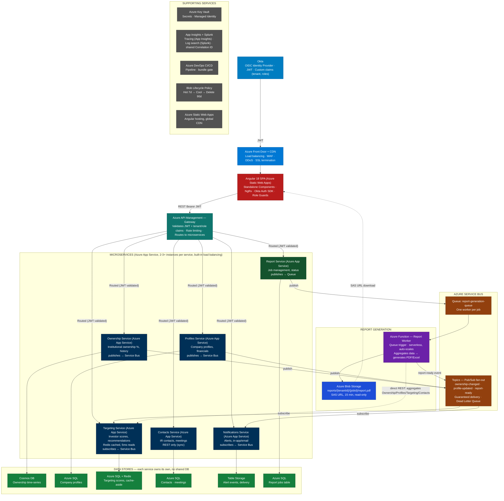

# Capital Access — Interview Story | S&P Global

> 📖 **How to use this documentation:**
> 
> 1. **Start here:** Read this file first — it's your interview narrative and architecture overview (concise, 30 min read)
> 2. **Prepare deep dives:** Study `capital-access-deep-dives.md` for technical details on each service/pattern (2-3 hours)
> 3. **Operational knowledge:** Review `capital-access-operations.md` for production-scale operations and CI/CD (1-2 hours)
> 4. **Practice STAR story:** Use "The STAR Story" section below to practice your 3-minute pitch

---

# Capital Access — Interview Story | S&P Global

## What is Capital Access?

**Capital Access** is S&P Global Market Intelligence's enterprise SaaS workflow platform for Investor Relations (IR) teams at publicly listed companies. Corporate IR officers use it to identify and target the right institutional investors, manage investor engagement and communications, monitor shareholder ownership, and measure IR programme effectiveness — all on a single platform. It is positioned under S&P's *Issuer Solutions* division.

> ⚠️
> **Key distinction for interviews:** Capital Access serves **corporate issuers** (public company IR teams), not institutional investors or buy-side firms. The IR team at, say, a FTSE 100 company logs in to find which hedge funds or mutual funds are likely buyers of their stock, then manages outreach and tracks results inside Capital Access.

| Module | What IR teams do |
| --- | --- |
| **Investor Targeting & Engagement** | Identify compatible institutional investors (by mandate, style, geography); run targeted outreach campaigns; track engagement |
| **Stock Surveillance / Capital Insight** | Real-time, self-service surveillance of ownership trends — who is buying, selling, likely to change position |
| **Capital Access Mail** | Purpose-built IR communication platform with seamless Outlook & Gmail sync, mass email to investor lists, and engagement analytics (opens, clicks) |
| **Shareholder Ownership Analytics** | Track institutional ownership %, historical trends by quarter, peer benchmarking, ownership change alerts |
| **IR CRM (BD Corporate)** | Investor contact management, meeting scheduling (roadshows, NDRs), relationship history, bulk profile management |
| **AI Textual Analytics** | Input earnings call scripts or investor communications; receive AI-generated sentiment scores and early feedback signals |
| **ESG & Governance Analytics** | Sustainability Fit Metric, Fund ESG Weighted Average — helps IR teams align sustainability narrative with investor priorities |
| **Reporting** | Board-level IR reports, Historical Ownership Report with trend analysis, customisable data-point-level layouts |

Capital Access integrates data from **S&P Capital IQ Pro** and **Visible Alpha** for financial intelligence, and syncs communications with **Outlook** and **Gmail** via Capital Access Mail.

2,500+ Corporate Issuers
8+ Feature Modules
Multi-tenant SaaS
Azure Hosted

> ℹ️
> **Why this matters for interviews:** Capital Access is not a simple CRUD app. It serves regulated public companies and their IR programmes with strict security (multi-tenant data isolation), high availability, performance requirements (real-time surveillance), and AI-driven analytics. That context makes your work on OIDC, microservices architecture, and multi-tenancy highly meaningful.

> 🗣️ **Say this:**
>
> Capital Access is a web platform used by Investor Relations (IR) teams in public companies. It helps them find and connect with investors, track who owns their company's shares, and manage investor communication — all in one place. The platform is used by over 2,500 companies worldwide and uses S&P Global data such as Capital IQ Pro and Visible Alpha.
>
> I work as a Lead Software Development Engineer on the frontend using Angular 18. I also work with Azure-based microservices, Okta authentication, and CI/CD pipelines.

## How to Explain the Full Project Flow Verbally (Interview Script)

**What is Capital Access:**
"Capital Access is an enterprise SaaS platform built by S&P Global for Investor Relations teams at publicly listed companies. Think of it as a CRM plus data intelligence platform — a corporate IR officer logs in and can see which institutional investors own their company's shares, identify new investors to target, manage meetings and roadshows, send communications, and generate board-level reports. It serves over 2,500 corporate clients and is a multi-tenant cloud platform hosted entirely on Azure."

**How a user logs in — Authentication flow:**
"When a user opens the application, they're redirected to Okta — our identity provider. Okta handles the login and issues a JWT token. What makes this interesting is that the JWT carries custom claims — specifically a tenant ID and the user's roles. The tenant ID is critical because this is a multi-tenant system — every API call must be scoped to the correct client's data, and the tenant ID in the token ensures that."

**How the frontend works:**
"The frontend is an Angular 18 single page application hosted on Azure Static Web Apps, which gives us global CDN distribution. Before the request even reaches our application, it passes through Azure Front Door, which handles load balancing, WAF protection, DDoS mitigation, and SSL termination. So the user gets a fast, secure experience from the edge before touching our backend at all."

**The API Gateway — single entry point:**
"Every API call from the Angular app goes to Azure API Management — our gateway. The SPA never talks directly to individual microservices. The gateway does three things: first, it validates the JWT token against Okta's public keys. Second, it checks the tenant and role claims — so a user from one company cannot access another company's data even if they have a valid token. Third, it applies rate limiting per tenant and routes the request to the correct downstream microservice."

**The Microservices:**
"Behind the gateway we have six microservices — each owns its own domain and its own database. We have an Ownership Service that tracks institutional ownership percentages and history, a Profiles Service for company financial data, a Targeting Service that scores and recommends investors, a Contacts Service for managing IR relationships and meetings, a Notifications Service for alerts, and a Reports Service that manages report generation jobs.

An important architectural decision here is that each service has its own database — they don't share one. The Ownership Service uses Cosmos DB because ownership data is high-volume time-series that changes constantly. The Targeting Service uses Azure SQL plus Redis because targeting scores are read very heavily and we cache them in Redis for sub-millisecond reads. Notifications uses Azure Table Storage because it's high-volume event writes that are cheap to store and query by user and time range."

**Async communication — Service Bus:**
"Services communicate asynchronously through Azure Service Bus Topics using a pub/sub pattern. For example — when the S&P data feed updates ownership data for a company, the Ownership Service saves it to Cosmos DB and publishes an OwnershipChanged event to a Service Bus Topic. The Targeting Service subscribes to that topic and recalculates its investor scores. The Notifications Service also subscribes and fires alerts to users who have set up ownership change alerts. The Ownership Service doesn't know or care that these other services exist — it just publishes the event. This is the pub/sub pattern — one event, many independent reactions, completely decoupled."

**Report generation — async queue flow:**
"Report generation is a special case because it's a long-running operation — generating a PDF report can take 30 to 60 seconds. So when a user requests a report, the Report Service doesn't process it synchronously. It puts a job message on a Service Bus Queue and immediately returns a job ID to the user. An Azure Function picks up the message from the queue, calls the Ownership, Profiles, Targeting, and Contacts services directly to aggregate the data, generates the PDF, and stores it in Azure Blob Storage. Once done, it publishes a report-ready event back to Service Bus, the Notifications Service alerts the user, and the Angular app downloads the report via a time-limited SAS URL — valid for 15 minutes, read-only. The user never waits on the screen — they get notified when it's ready."

**Caching — Redis:**
"Targeting scores are expensive to compute — they run through an ML scoring model on S&P's data. But the UI requests them constantly. So we use a cache-aside pattern with Redis. Every request checks Redis first — if the score is there, it comes back in under 5 milliseconds. If not, we fetch from Azure SQL, cache it in Redis with a one-hour TTL, and return it. When an OwnershipChanged event arrives, the Targeting Service invalidates the Redis key so the next request gets a fresh score. This gives us performance without serving stale data."

**Observability — App Insights and Splunk:**
"For observability we use two tools working together — Application Insights and Splunk, tied by a single Correlation ID. Every request gets a Correlation ID when it enters the system, and that ID travels across every service call and every Service Bus message. Application Insights gives us the distributed trace timeline — which service called which, how long each hop took, where an exception was thrown. Splunk gives us the log content — the full structured logs across all services searchable in one place. When something goes wrong in production, I take the Correlation ID, search it in Splunk, and I can see every log line from every service that touched that request — all in one view."

**One-line summary to close:**
"So in summary — Angular SPA on CDN, Azure Front Door for edge protection, APIM as the single gateway for auth and routing, six microservices each with their own database, async pub/sub via Service Bus for decoupled communication, Azure Functions for long-running report generation, Redis for performance-critical caching, and App Insights plus Splunk for full observability."

---

## Your Role & Ownership

You joined as **Lead Software Development Engineer** in December 2024. Your ownership spans three distinct areas:

| Area | What you own | Impact |
| --- | --- | --- |
| **Feature Development** | Angular 18 front-end features across 8+ modules | 2,500+ corporate IR teams consume what you build |
| **Authentication** | Full OIDC flow — token refresh, silent renewal, role-scoped access | Security foundation for the entire SaaS product |
| **Platform Modernisation** | Legacy webpack → Angular 18 standalone component migration | 30% bundle reduction, faster build pipeline |

> ✅
> **How to frame your seniority:** You are not just implementing tickets. You contribute to front-end technical decisions — performance strategy, accessibility standards (WCAG 2.1), multi-tenant architecture, and CI/CD deployment gates. This is lead-level ownership.

## Architecture Overview



| Service | Owns | Database | Why this DB? |
| --- | --- | --- | --- |
| **Ownership Service** | Institutional ownership % by company, quarterly history, change events | Azure Cosmos DB | High-volume time-series data — ownership changes constantly, needs fast writes and flexible schema per quarter |
| **Profiles Service** | Company profiles — financials, sector, market cap, IR team contacts | Azure SQL | Structured relational data, strong consistency, complex queries across company attributes |
| **Targeting Service** | Investor targeting scores, peer benchmarking, recommendations | Azure SQL + Redis Cache | Scores are read heavily by the UI — Redis caches top-N targeting results per company for sub-millisecond reads |
| **Contacts Service** | IR contacts, investor contacts, meeting history, relationships | Azure SQL | Relational by nature — contacts belong to companies, meetings belong to contacts |
| **Notifications Service** | Ownership change alerts, price movement alerts, delivery status | Azure Table Storage | High-volume write of alert events (cheap, scalable), reads are by user/timerange (partition key fits) |
| **Engagement & Activity Service** | IR engagement lifecycle — meetings, roadshows, outcomes, follow-up tasks, sentiment scores | Azure SQL (EF Core 8, Code-First) | Deeply relational data (Activity → Attendees → FollowUpTasks), complex aggregate queries for board reporting, ACID transactions for status transitions, EF Core migrations as CI/CD deployment step |

> ℹ️
> **The Angular SPA talks to a single API Gateway, not directly to individual microservices.** Every request from the SPA carries the Bearer JWT and is sent to the Gateway's URL. The Gateway (Azure API Management) validates the JWT signature against Okta's JWKS, checks the tenant and role claims, applies rate limiting, and routes the request to the correct downstream microservice. Individual microservices trust the Gateway for SPA-originated traffic and don't need to re-implement that check on every request. The exception is service-to-service traffic that bypasses the Gateway entirely — for example the Report Worker (Azure Function) calling Ownership/Profiles/Targeting/Contacts directly to aggregate data — those calls still validate the JWT independently against Okta's JWKS as a defense-in-depth measure, since they're not coming through the Gateway's boundary.

---

## Deep Dive — Azure App Service (Microservices Hosting)

Azure App Service is the compute tier where all 6 microservices (Ownership, Profiles, Targeting, Contacts, Notifications, Report) run. It is not a container orchestration platform like Kubernetes — it's a managed Platform-as-a-Service (PaaS) that handles the operational complexity of VMs, load balancing, patching, and auto-scaling transparently.

### Why Azure App Service Instead of AKS or VMs?

**Compared to VMs (Azure VMs):**
- VMs require manual OS patching, security updates, and dependency management — each patch is an operational decision and a risk vector
- Capital Access serves 2,500+ regulated clients; every unpatched VM is a compliance audit question
- VMs force you to manage infrastructure — provisioning, decommissioning, networking — that scales linearly with team size
- **App Service abstracts the OS away:** Microsoft patches automatically, certification is simpler, and you focus on code

> **Anticipate this follow-up:** *"But Virtual Machine Scale Sets (VMSS) can autoscale too — so why not VMs?"* — True, and worth saying so directly rather than getting caught out by it. VMSS gives metric-based and schedule-based autoscaling structurally similar to App Service's. **Autoscaling capability was never the differentiator.** The actual reason is *operational ownership of the layer underneath the scaling*: with VMSS you still own OS patching, VM image management, and networking/NSG configuration yourself. With App Service, Microsoft owns everything below the application layer. For a team serving 2,500+ regulated clients, that patching/compliance ownership — not scaling — is what tips the decision toward App Service.

**Compared to AKS (Azure Kubernetes Service):**
- AKS is optimized for systems with 50+ microservices, complex inter-service networking, and polyglot workloads
- Capital Access has 6 microservices, all C# / .NET — we don't need Kubernetes's flexibility
- AKS operators spend time on: service mesh configuration, RBAC policies, node auto-scaling, pod placement constraints, helm charts, network policies
- **App Service is simpler:** deploy a .NET app, it runs; add instances for load — done
- Kubernetes introduces operational risk: a misconfigured ingress, a CrashLoop pod, or a node-drain can cascade failures. Simpler systems have fewer failure modes.

**When to reconsider:**
- If you grow to 50+ services and need service-to-service mesh networking, AKS makes sense
- If you need OS-level customization (custom kernel settings, specialized drivers), VMs are required
- For this interview context at 6 services on a PaaS, App Service is the right call

### How App Service Hosting Works

**Deployment model:**
```
Your .NET 8 microservice (e.g., Ownership Service)
        ↓
Published as Azure App Service Plan (Linux, B2 instance type)
        ↓
App Service instances (2-3 baseline, auto-scale to 5-10)
        ↓
Built-in load balancer routes requests across instances
        ↓
Each instance runs your app in a Kestrel web server
        ↓
Database connections to Azure SQL via Entity Framework Core
```

**Instance types and scaling:**
```
B2 Instance Type (Burstable):
- 2 CPU cores
- 3.5 GB RAM
- Pricing: ~$44/month per instance

Standard Instance Type (S1):
- 1 CPU core
- 1.75 GB RAM  
- Pricing: ~$70/month per instance

P1V2 Instance Type (Premium):
- 1 CPU core
- 3.5 GB RAM
- Pricing: ~$100/month per instance
- Includes custom domains, staging slots, auto-scale

For Capital Access: Use S1 or B2 baseline (2-3 instances per service).
Each instance handles ~2,000-5,000 concurrent requests depending on workload.
With 6 microservices × 3 instances = 18 instances total for baseline HA.
During peak traffic (9:00 AM), scale to 6-8 instances per service = 36-48 instances total.
```

**Built-in load balancing:**
Azure App Service automatically distributes incoming requests across instances using round-robin:
```
Request 1 → Instance 1
Request 2 → Instance 2
Request 3 → Instance 3
Request 4 → Instance 1 (round-robin repeats)
```

This means APIM doesn't need to know about individual instances — it sends all requests to the single App Service DNS name (e.g., `ownership-service.azurewebsites.net`), and App Service handles the distribution internally. This is fundamentally different from Kubernetes, where you explicitly manage Service resources and selector labels.

**Health checks & auto-remediation:**
```csharp
// Every App Service app should expose a /health endpoint
[HttpGet("/health")]
public IActionResult HealthCheck()
{
    return Ok(new { status = "healthy", timestamp = DateTime.UtcNow });
}
```

App Service's built-in load balancer pings `/health` every 30 seconds per instance:
- If response is 200, instance is healthy → receives traffic
- If response is non-200 or timeout → instance is removed from the load balancer
- If an instance crashes or becomes unresponsive, it's automatically replaced (within a few minutes)

This is passive health checking — App Service doesn't take action if a single request fails, only if the entire instance becomes unhealthy.

**Auto-scaling configuration:**

```json
{
  "scaleRules": [
    {
      "metricName": "CpuPercentage",
      "threshold": 70,
      "scaleOutInterval": "PT5M",
      "scaleOutStepSize": 1,
      "maxInstances": 10
    },
    {
      "metricName": "CpuPercentage",
      "threshold": 30,
      "scaleInInterval": "PT10M",
      "scaleInStepSize": 1,
      "minInstances": 2
    }
  ]
}
```

Translation:
- When CPU > 70% for 5 minutes, add 1 instance (up to max 10)
- When CPU < 30% for 10 minutes, remove 1 instance (down to min 2)
- Min 2 instances ensures HA even at 0 traffic
- Max 10 instances caps runaway cost during unexpected spikes

**Custom scaling metrics (beyond just CPU):**

Instead of relying solely on CPU (which can be misleading — async code has low CPU but high latency), you can auto-scale on:

```csharp
// In your service, track custom metrics
public class OwnershipServiceHealthCheck : IHealthCheck
{
    public async Task<HealthCheckResult> CheckHealthAsync(HealthCheckContext context)
    {
        var queueDepth = await _serviceBus.GetQueueDepthAsync("ownership-recalc-queue");
        var telemetryClient = new TelemetryClient();
        telemetryClient.GetMetric("QueueDepth").TrackValue(queueDepth);
        
        if (queueDepth > 1000)
            return HealthCheckResult.Degraded("Queue backing up");
        
        return HealthCheckResult.Healthy();
    }
}

// Auto-scale rule: if QueueDepth > 500, scale out
// This scales preemptively before the queue overwhelms the system
```

### Deployment to App Service

**Via Azure CLI:**
```bash
# Build and publish your .NET app
dotnet publish -c Release -o ./publish

# Create a ZIP package
cd publish && zip -r ../app.zip . && cd ..

# Deploy to App Service
az webapp deployment source config-zip \
  --resource-group capital-access \
  --name ownership-service-app \
  --src app.zip

# Restart the app
az webapp restart \
  --resource-group capital-access \
  --name ownership-service-app
```

**Via Azure DevOps CI/CD pipeline (recommended for Capital Access):**
```yaml
trigger:
  - main

pool:
  vmImage: 'ubuntu-latest'

stages:
  - stage: Build
    jobs:
      - job: BuildAndPublish
        steps:
          - task: DotNetCoreCLI@2
            inputs:
              command: 'publish'
              projects: '**/OwnershipService.csproj'
              arguments: '--configuration Release'
              publishWebProjects: false
              outputDir: '$(Build.ArtifactStagingDirectory)'
          
          - task: PublishBuildArtifacts@1
            inputs:
              artifactName: 'drop'

  - stage: Deploy
    dependsOn: Build
    jobs:
      - deployment: DeployAppService
        displayName: 'Deploy to Ownership Service App'
        environment: 'Production'
        strategy:
          runOnce:
            deploy:
              steps:
                - task: AzureWebApp@1
                  inputs:
                    azureSubscription: 'Capital-Access-Production'
                    appType: 'webAppLinux'
                    appName: 'ownership-service-app'
                    package: '$(Pipeline.workspace)/drop/**/*.zip'
                    deploymentMethod: 'zipDeploy'
                
                - script: |
                    # Wait for deployment and verify
                    for i in {1..10}; do
                      STATUS=$(curl -s https://ownership-service-app.azurewebsites.net/health)
                      if [ "$STATUS" == "200" ]; then
                        echo "✅ Deployment successful"
                        exit 0
                      fi
                      sleep 5
                    done
                    echo "❌ Deployment health check failed"
                    exit 1
                  displayName: 'Post-deployment health check'
```

### Multi-tenancy on App Service

Capital Access is a multi-tenant system, but **multi-tenancy is not handled by infrastructure — it's enforced in code.**

```csharp
// In your middleware or service layer, enforce tenant isolation
public class TenantMiddleware
{
    public async Task InvokeAsync(HttpContext ctx, ILogger<TenantMiddleware> logger)
    {
        // Extract tenant from JWT claims
        var tenantId = ctx.User.FindFirst("tenant_id")?.Value;
        
        if (string.IsNullOrEmpty(tenantId))
        {
            logger.LogWarning("Request without tenant_id claim");
            ctx.Response.StatusCode = StatusCodes.Status401Unauthorized;
            return;
        }
        
        // Store in items so services can access
        ctx.Items["TenantId"] = tenantId;
        await _next(ctx);
    }
}

// In your DbContext, use global query filters to isolate data per tenant
public class OwnershipDbContext : DbContext
{
    private readonly IHttpContextAccessor _httpContextAccessor;
    
    protected override void OnModelCreating(ModelBuilder modelBuilder)
    {
        var tenantId = _httpContextAccessor.HttpContext?.Items["TenantId"]?.ToString();
        
        modelBuilder.Entity<Ownership>()
            .HasQueryFilter(o => o.TenantId == tenantId);
        
        // Every query on Ownership automatically filters by tenant
        // No way to query cross-tenant data, even by accident
    }
}
```

All 6 App Service instances run the same code but with the tenant ID enforced at the middleware and database layer. There's no need for separate App Service instances per tenant — one set of instances serves all 2,500 tenants.

### Networking & Security

**By default, App Service is internet-accessible.** Requests come through:
1. **Azure Front Door** (public entry point, WAF, DDoS)
2. **APIM** (JWT validation, rate limiting, routing)
3. **App Service** (your code)

**Optional: Virtual Network integration** — if you want to restrict App Service to private network traffic only:
```bash
# Add App Service to a Virtual Network subnet
az webapp vnet-integration add \
  --resource-group capital-access \
  --name ownership-service-app \
  --vnet myvnet \
  --subnet mysubnet

# Now the app can only be reached from within the VNet
# (APIM must also be in the VNet, or routable to it)
```

For Capital Access, we don't need VNet isolation because:
- All traffic through APIM is validated
- Tenant data is isolated in code (via global query filters)
- Azure SQL is protected by firewall rules that allow only App Service IPs

**Environment-specific config:**
```xml
<!-- .csproj -->
<ItemGroup>
  <None Update="appsettings.*.json" CopyToOutputDirectory="PreserveNewest" />
</ItemGroup>
```

```json
{
  "appsettings.production.json": {
    "KeyVault": "https://capital-access-kv.vault.azure.net/",
    "Database": "Server=capital-access-prod.database.windows.net;Database=OwnershipDb;",
    "Logging": {
      "LogLevel": {
        "Default": "Information",
        "Microsoft": "Warning"
      }
    }
  },
  "appsettings.staging.json": {
    "KeyVault": "https://capital-access-staging-kv.vault.azure.net/",
    "Database": "Server=capital-access-staging.database.windows.net;Database=OwnershipDb;",
    "Logging": {
      "LogLevel": {
        "Default": "Debug"
      }
    }
  }
}
```

App Service automatically picks the right config based on the `ASPNETCORE_ENVIRONMENT` variable (set in App Service settings).

### Common Interview Questions on App Service

**Q: What happens if an instance crashes?**
A: App Service's health check detects it's unhealthy (no 200 response on `/health`), removes it from the load balancer, and spins up a replacement instance from the App Service Plan. Requests in flight on the crashed instance fail (connections are severed), but new requests go to healthy instances. This is why you should make API calls idempotent or use distributed transactions (see Outbox Pattern).

**Q: Can two requests hit the same instance?**
A: Yes, round-robin is stateless. The same instance can handle consecutive requests from different users. This is fine as long as your app is stateless (which it should be) — store session data in Redis or cookies, not in-memory.

**Q: What's the difference between scaling up (bigger instance) and scaling out (more instances)?**
A:
- **Scale up:** B2 → S1 (more CPU/RAM per instance). Manual, requires restart.
- **Scale out:** 2 instances → 5 instances (more instances, same size). Automatic via auto-scale rules.
For Capital Access, prefer scaling out (auto-scale) over up (manual). Horizontal scaling is simpler to reason about and can handle traffic spikes automatically.

**Q: How do you do zero-downtime deployments?**
A: Use **slots** — App Service lets you have a "staging" slot running a previous version while you deploy the new code to a "production" slot, then swap them atomically:
```bash
# Deploy new code to staging slot
az webapp deployment source config-zip \
  --resource-group capital-access \
  --name ownership-service-app \
  --slot staging \
  --src app.zip

# Run smoke tests against staging
curl https://ownership-service-app-staging.azurewebsites.net/health

# If healthy, swap slots (production ← staging)
az webapp deployment slot swap \
  --resource-group capital-access \
  --name ownership-service-app \
  --slot staging

# Old code stays in staging, ready to swap back if issues
```

**Q: What's the difference between Restart, Stop, and Deallocate?**
A: 
- **Restart** — recycle the process but keep the VM running (seconds, you're still billed)
- **Stop** — gracefully shut down, VM still allocated (still billed, used for testing)
- **Deallocate** — turn off the VM, stop billing (used for dev/test to save money)

For production, you only use Restart (during deployments). Stop/Deallocate are for non-production to save costs.

---

## Service-to-Service Communication Patterns

The architecture diagram shows the SPA → Gateway → services path and the Service Bus fan-out clearly, but it deliberately doesn't draw a separate arrow for every direct service-to-service call — that would turn the diagram into spaghetti. There are really three distinct patterns in play, and which one applies depends on what kind of communication it is.

| Pattern | Where it's used | How it works | Trust / auth model |
| --- | --- | --- | --- |
| **Synchronous direct REST** | Report Worker (Azure Function) → Ownership, Profiles, Targeting, Contacts — aggregating data to build one report | The Function calls each service's REST endpoint directly, bypassing the Gateway entirely, and waits for the response before moving to the next step | Each call carries the JWT that originated the report request; since it didn't come through the Gateway, the receiving service validates that JWT itself against Okta's JWKS (defense-in-depth) |
| **Asynchronous pub/sub (Service Bus Topics)** | Ownership changes → Targeting + Notifications; profile updates → Targeting; report-ready → Notifications | Publisher fires one event to a Topic; every Subscription on that Topic gets its own independent copy — publisher and subscribers never call each other directly | No per-request JWT check between services — trust is the Service Bus namespace boundary itself (network/IAM), with tenant ID carried inside the event payload and re-validated wherever it's used downstream |
| **Task queue (Service Bus Queue)** | Report Service → report-generation-queue → Azure Function | Exactly one worker instance picks up and processes each queued job message | Same trust model as Topics — tenant ID and requesting user's context travel inside the queued message, not as a live JWT on a direct call |

> ℹ️
> **Why direct REST for the Report Worker specifically:** by the time the Function runs, it already has the full request context (tenant, jobId, which company) and needs synchronous answers right now to assemble one report — there's no "event" to publish, just data it needs to fetch immediately from four different owners. Pub/sub is reserved for the opposite case: multiple independent consumers reacting to a state change without being coupled to the producer or to each other.


---

## Angular 18 Standalone Components Migration

> 🚩
> **Before migration:** NgModule-based architecture → all components declared in modules → large shared NgModules pulled everything into initial bundle → slow first load. Webpack config was hand-written and not taking advantage of Angular 18 build optimisations.

```
BEFORE (NgModule architecture):
  AppModule
    ├── SharedModule (pulled in ALL shared components, even unused ones)
    ├── InvestorTargetingModule
    └── ShareholderModule
  Build: webpack manual config, no module federation
  Bundle size: 100% (baseline)

AFTER (Angular 18 Standalone):
  Each component declares its own imports
  ├── InvestorTargetingComponent (imports: [CommonModule, RouterModule, ChartComponent])
  ├── ShareholderComponent (imports: [CommonModule, TableComponent])
  └── ChartComponent (standalone, used only where needed)
  Build: Angular 18 esbuild (Vite-based) — dramatically faster
  Bundle size: -30% (only what each component actually needs is bundled)
```

- Tree-shaking works at component level — unused code eliminated per component, not per module
- Lazy routes now split at component boundary, not module boundary — finer-grained chunks
- esbuild (Angular 18 default) is 10–100x faster than webpack and produces smaller output
- Removed barrel files (index.ts re-exports) that prevented tree-shaking

1. Ran Angular's `ng generate @angular/core:standalone` schematics to auto-migrate leaf components first
2. Converted shared/library components next (most reused → highest impact)
3. Converted feature modules last (they depend on shared components being ready)
4. Updated routing to use `loadComponent` instead of `loadChildren` where possible
5. Removed empty NgModules and updated webpack/esbuild config to use native Angular 18 builder

> ✅
> **Result:** 30% bundle reduction + faster CI build pipeline (esbuild vs webpack) + simpler codebase with no NgModule ceremony.


---

## Multi-Tenancy in the Frontend

Capital Access serves 2,500+ corporate issuers from one codebase. Each client is a separate tenant with potentially different feature sets, branding, and data.

```
At login, the JWT access token contains:
  "tid" (tenant ID)  → identifies which client company the user belongs to
  "roles"            → which Capital Access features this tenant has subscribed to

Angular App Bootstrap:
  1. Decode JWT → extract tid + roles
  2. Load tenant config from API: { theme: 'default', features: ['investor_targeting'], locale: 'en-US' }
  3. Set feature flags in NgRx store
  4. Route guards use feature flags → users see only features their company pays for
  5. Theme variables applied globally (Azure client has different branding than bank client)
```

> ℹ️
> Every API call includes the tenant ID (from JWT). The backend microservices filter all data by tenant. A user from Client A can never see Client B's shareholder data. This is enforced at the API layer — the frontend is just the display. But the frontend must never expose tenant IDs or mix tenant contexts in the NgRx state.

Capital Access is an enterprise product used at institutional clients — legal requirement in many markets. Your contribution:

- ARIA labels on all interactive components, data tables, and charts
- Keyboard navigation on all modals, dropdowns, and data grids
- Colour contrast ratios meeting WCAG 2.1 AA (4.5:1 text, 3:1 UI components)
- Focus management — modal open/close, route changes restore focus correctly
- Screen reader testing with NVDA/VoiceOver as part of PR review gate


---

## The STAR Story — Say This in the Interview

> ⚠️
> **The most important section.** Practise this out loud until it flows naturally. Under 3 minutes. Don't read it — tell it.

> 🗣️ **Say this:**
>
> I currently work at S&P Global as a Lead Software Development Engineer on Capital Access — it's S&P's web platform for Investor Relations teams at publicly listed companies. The platform serves over 2,500 corporate issuers worldwide, helping them find and connect with investors, track ownership, and manage investor communications.
>
> The backend is a microservices architecture on Azure — five core services each with their own data store: an Ownership Service that holds institutional ownership percentages and historical data in Cosmos DB, a Profiles Service for company financials and metadata in Azure SQL, a Targeting Service for investor targeting scores backed by Azure SQL with Redis caching for fast reads, a Contacts Service for IR relationship management, and a Notifications Service for ownership change alerts. Services communicate asynchronously through Azure Service Bus Topics — when ownership data changes, the Service Bus event fans out to both the Targeting and Notifications services independently without any tight coupling between them.
>
> The frontend is Angular 18 — my primary area of ownership. I've worked on feature development across 10+ modules, owned the full OIDC authentication flow using Okta, and led the migration from our legacy NgModule architecture to Angular 18 standalone components.
>
> The standalone migration was the most impactful thing I've done. The old setup was pulling everything into the initial bundle regardless of what the user actually accessed. By moving to standalone components and switching to Angular 18's esbuild builder, we achieved a 30% reduction in bundle size. We then put a bundle size gate in our Azure DevOps pipeline so no future PR can silently re-inflate it.
>
> On auth — security is non-negotiable in regulated financial software. I implemented OIDC with Okta: the Angular app handles silent token renewal before expiry, role claims in the JWT control which features and data each tenant can access, and an HTTP interceptor retries on 401 after token refresh before forcing logout. Tokens live in memory, never localStorage.

> 🗣️ **Say this:**
>
> The trickiest part of the auth implementation was silent token renewal. When an access token is about to expire, the app needs to get a new one without interrupting the user. I set up a timer that fires 5 minutes before expiry and uses Okta's refresh token flow — completely invisible to the user. The edge case was handling what happens when the refresh call fails — for example if the user's network drops momentarily or if their Okta session itself has expired. I implemented a fallback: one retry, then a graceful redirect to the login page with the user's current route preserved so they land back where they were after re-authenticating. That kind of detail matters in an enterprise financial product where a user is mid-way through building an investor targeting list.

> 🗣️ **Say this:**
>
> The 30% bundle reduction meant the initial page load dropped noticeably for clients on slower enterprise networks. Beyond the number, the architectural shift to standalone components simplified onboarding of new features — engineers no longer had to think about which NgModule to add a component to. The CI pipeline now catches bundle regressions and accessibility failures automatically before they reach production. For an enterprise SaaS with 500+ clients, catching a regression in CI is infinitely better than discovering it in production.

## Follow-Up Questions & Answers

**Q: Q: You mentioned migrating from SAML to Okta — how did you handle the user migration?**

Answer:
        The user provisioning side — syncing existing accounts from SAML into Okta — was handled by a separate platform and infrastructure team. My ownership was purely on the frontend auth flow: replacing the SAML redirect with Okta OIDC, building the HTTP interceptor, silent token renewal, and the role guards. I also designed the per-tenant feature flag rollout so we could migrate one client at a time and roll back any individual tenant if something went wrong, without taking the whole platform down.

> 💡 This is the right answer — it's honest, shows you know the full picture, and keeps you on safe ground where you can answer every follow-up confidently.

**Q: Q: Why did you migrate from SAML to Okta OIDC? What was wrong with SAML?**

Answer:
        SAML wasn't wrong — it worked — but it had limitations for our use case. SAML tokens are XML-based and verbose, which added overhead on every request. More importantly, SAML sessions are server-managed, which doesn't fit a stateless microservices architecture — each service would need to call back to a session store to validate the user. With Okta OIDC, we get compact JWTs that each microservice validates locally using Okta's JWKS endpoint, with no shared session store needed. We also got fine-grained custom claims (tenant ID, roles) in the token itself, which SAML required more complex attribute mapping to achieve. And Okta gives us MFA, adaptive policies, and audit logging out of the box.

> 💡 SAML vs OIDC is a common deep-dive. Key points: XML vs JWT, server session vs stateless, and the microservices fit.

**Q: Q: Why OIDC instead of SAML for enterprise clients?**

Answer:
        SAML is XML-based and built for browser redirects — it works but is heavy and hard to use in SPAs. OIDC is JSON/JWT-based, designed for modern apps, and works natively with SPAs and mobile clients. Okta supports both SAML and OIDC, but we chose OIDC because it gives us cleaner token handling in Angular — we can decode JWT claims directly in the browser, attach Bearer tokens to every API call, and handle silent renewal without page redirects. Okta also has a well-maintained JavaScript SDK (okta-auth-js) that integrates cleanly with Angular. For a modern SaaS targeting institutional clients, OIDC is the right choice.

> 💡 Mention: JWT is stateless — backend microservices can validate it without a session store.

**Q: Q: How do you prevent token theft? XSS? CSRF?**

Answer:
        XSS: Tokens are stored in memory (JavaScript variable), never localStorage or sessionStorage. Okta's SDK keeps the access token in memory by default — we don't override that. Content Security Policy (CSP) headers prevent injected scripts from reaching external endpoints even if they execute. We also sanitise all dynamic HTML via Angular's built-in DomSanitizer. CSRF: Not a concern for Bearer token auth — CSRF exploits cookies, and we're not relying on cookies for authentication. The Bearer token has to be explicitly attached to each request by our HTTP interceptor, which a forged third-party page cannot do.

**Q: Q: What happens when a user's session expires mid-workflow?**

Answer:
        The silent renewal timer fires before expiry and gets a new access token invisibly via Okta's refresh token flow. If silent renewal fails — network issue or Okta session expired — the HTTP interceptor on the next API call catches the 401, attempts one token refresh, and if that fails, redirects to login. We preserve the current URL in state so after login the user is returned exactly to where they were. For a financial workflow like building an investor targeting list, losing progress on session expiry would be unacceptable.

**Q: Q: How does role-based access work across 2,500+ clients?**

Answer:
        Each client company is a separate application or group in Okta. When users from ClientA log in, Okta issues a JWT containing their tenant ID and the specific roles their company has subscribed to — configured as custom claims in Okta's authorization server. For example, roles: ["investor_targeting", "shareholder_analytics"]. The Angular route guards decode these claims and only allow access to matching routes. If Client B hasn't subscribed to Roadshow Management, that route is simply unreachable — the guard redirects them. This is enforced both client-side in routing and server-side in the API — the client-side guard is UX, the server-side check is the actual security boundary.

> 💡 Important: Always say "client-side is UX, server-side is security" — interviewers love this distinction.

**Q: Q: How did you achieve the 30% bundle reduction specifically?**

Answer:
        Three things. First, standalone components enable tree-shaking at the component level — each component declares exactly what it imports, so unused code from shared modules is eliminated. In NgModule architecture, a SharedModule that exports 50 components pulls all 50 into any module that imports SharedModule, even if you only used 2. Second, we switched from webpack to Angular 18's esbuild-based builder — esbuild is fundamentally faster and produces smaller output. Third, we removed barrel files (index.ts re-export patterns) that were preventing tree-shaking — bundlers couldn't tell which exports were actually used when everything was re-exported through a single index file.

**Q: Q: How do you ensure performance doesn't regress in future?**

Answer:
        We added a bundle size budget gate in the Azure DevOps CI pipeline. Every PR is built and the output bundle sizes are compared against a defined budget. If any chunk exceeds its budget, the pipeline fails and the PR cannot be merged. This means a developer can't accidentally import a heavy library without the team noticing. We also run Lighthouse in CI on key routes and track Core Web Vitals — First Contentful Paint and Total Blocking Time are tracked per release.

**Q: Q: How does the frontend communicate with microservices?**

Answer:
        The Angular SPA talks to an API Gateway — not directly to individual microservices. The gateway handles auth token validation, rate limiting, and routing to the correct downstream service. Every request from the SPA includes the Bearer JWT. The gateway validates the JWT signature and tenant claims, then forwards the request to the appropriate service. This means individual microservices don't need to re-implement auth — they trust the gateway. The Angular app doesn't know or care which microservice handles which endpoint — it just calls the API Gateway URL and the routing is transparent.

**Q: Q: How is state managed in a 10+ module Angular SPA?**

Answer:
        We use NgRx. Each feature module has its own slice of state — investor targeting state, shareholder state, etc. Global state — auth info, current tenant config, user preferences — lives in a root store. Feature stores are lazily loaded with their routes, so only the state for modules the user has actually visited is in memory. This keeps the state tree clean and prevents different features from accidentally sharing mutable state.

**Q: Q: What's your deployment strategy — how do you release without downtime?**

Answer:
        Blue/Green deployment on Azure. Two identical environments — Blue (current production) and Green (new version). We deploy to Green, run smoke tests, then switch the load balancer to Green. If anything goes wrong, we flip back to Blue in seconds — no rollback needed, Blue is still running. For an enterprise SaaS with financial clients who might be mid-workflow during a release, zero downtime is a hard requirement.

**Q: Q: Why Cosmos DB for the Ownership Service but Azure SQL for Profiles?**

Answer:
        Ownership data is fundamentally time-series — every quarter, thousands of companies have ownership percentages updated for potentially thousands of institutional investors. That's high-volume writes with a flexible schema that changes over time (new fields, new markets). Cosmos DB handles that natively — it's horizontally partitioned, you write at massive scale, and you query by company ID or time range which maps well to its partition key model. Company profiles are the opposite — structured, relational, change rarely, and get queried with JOINs across sector, market cap, geography. That's exactly what Azure SQL is optimised for. Picking the right database per service is one of the advantages of microservices — you're not forced into one-size-fits-all.

> 💡 This is a great answer that shows you understand data modelling trade-offs, not just that you used Azure services.

**Q: Q: Why Azure Service Bus and not Azure Event Grid or Azure Event Hubs?**

Answer:
        Three options, three different use cases. Event Grid is for reactive infrastructure events — "a blob was uploaded", "a VM was deallocated". Not suited for business domain events between services. Event Hubs is a high-throughput streaming platform — Kafka-compatible, designed for millions of events per second, ideal for telemetry or log ingestion. But we don't need that scale, and Event Hubs is pull-based with complex consumer group management. Service Bus is the right fit for us: it's a proper messaging broker with Topics for pub/sub fan-out, guaranteed at-least-once delivery, Dead Letter Queue for failed messages, and message ordering within sessions if we need it. Our ownership change events need reliable delivery to multiple subscribers — Service Bus Topics give us exactly that without the operational overhead of Kafka or Event Hubs.

**Q: How does APIM validate the JWT — does it call Okta on every request?**

Answer:
        No — calling Okta on every request would add 50 to 200 milliseconds of latency to every API call, and it would make our entire platform dependent on Okta's availability for every single request. Instead, APIM uses Okta's JWKS endpoint — JSON Web Key Set — which is a public URL where Okta publishes its signing public keys. When APIM starts up, it fetches those public keys and caches them locally. From that point, every incoming JWT is validated in memory using the cached public key — pure cryptographic signature verification, no network call to Okta needed. Along with the signature, APIM checks that the token hasn't expired, the issuer is correct, and the tenant and role claims are valid.

        Key rotation is handled gracefully — Okta rotates its signing keys periodically, and each JWT carries a `kid` (key ID) in its header. When APIM sees a `kid` it doesn't recognise in its cache, it automatically fetches fresh keys from the JWKS endpoint. No manual intervention needed.

        The one limitation of this stateless JWT approach is revocation — since validation is local, a stolen token stays valid until it expires. That's why access tokens are kept short-lived (15 to 60 minutes) and we use a refresh token to silently get a new access token before expiry. Short lifetime = small window of risk if a token is compromised.

**Q: Q: If the Gateway already validates the JWT, why do individual microservices still validate it too?**

Answer:
        Defense-in-depth. For SPA-originated traffic, the Azure API Management Gateway validates the JWT signature, issuer, expiry, and tenant/role claims before routing the request — microservices trust that for traffic that came through the Gateway. But not all traffic comes through the Gateway: the Report Worker (Azure Function) calls Targeting, Profiles, and Contacts services directly, server-to-server, to aggregate report data — that path never touches the Gateway. So every service still fetches Okta's JWKS (JSON Web Key Set) at startup and can independently validate a JWT's signature, issuer, expiry, and audience claim locally and statelessly. That means a service never blindly trusts an inbound request just because it's on the internal network — it can always verify the token itself, whether the caller is the Gateway-fronted SPA or another service calling it directly.

**Q: Q: How does Redis caching work in the Targeting Service? What about stale data?**

Answer:
        We use the Cache-Aside pattern. When the UI requests targeting scores for a company, the Targeting Service checks Redis first. Cache hit — returns in under 5ms. Cache miss — fetches from Azure SQL, returns the result, and writes it to Redis with a TTL of one hour. Staleness is the key concern. We solve it through event-driven invalidation: when the Ownership Service publishes an "OwnershipChanged" event to Service Bus, the Targeting Service receives it, recomputes the scores, writes the updated scores to SQL, and explicitly deletes the stale Redis key. The next request re-populates the cache with fresh data. So in the worst case, a score is stale for the time between the ownership change event and the Targeting Service processing it — which is seconds. That's acceptable for an investor targeting use case where data is inherently based on quarterly filings.

> 💡 Shows you understand cache invalidation — one of the hardest problems in distributed systems.

**Q: Q: What happens if the Notifications Service is down when a Service Bus event arrives?**

Answer:
        Azure Service Bus handles this transparently. The event is held in the subscription's message queue until the Notifications Service comes back online and picks it up. Service Bus guarantees at-least-once delivery. If the service fails while processing — say it crashes after receiving the message but before updating the database — the message lock expires and Service Bus re-delivers it. We handle idempotency in the Notifications Service: each event has a unique ID, and we check whether we've already processed it before sending an alert. If yes, we skip it. This prevents duplicate notifications to clients even if a message is delivered more than once. After a configurable number of failed attempts, Service Bus moves the message to the Dead Letter Queue where we can inspect and replay it manually.

**Q: Q: How do you trace a request across 3–4 microservices when debugging?**

Answer:
        Two tools working together. Azure Application Insights gives the timing view — every service is instrumented with the App Insights SDK, and when a request arrives it reads or creates a Correlation ID (W3C Trace Context header) that's passed through every downstream call, both synchronous REST calls and Service Bus messages. In App Insights I can search by Correlation ID and see the full end-to-end trace with timing: Angular SPA → Targeting Service (50ms) → Redis cache miss → Azure SQL query (120ms) → response. Splunk gives the content view — every service also ships structured logs tagged with that same Correlation ID, so I can search Splunk for that ID and pull the actual log lines, request/response payloads, and stack traces from every service involved, not just the timing graph. In practice: App Insights tells me which hop was slow, Splunk tells me exactly what happened on that hop.

**Q: Q: Why isn't every service-to-service call shown as its own arrow in the architecture diagram?**

Answer:
        To keep the diagram readable, but the calls are real and there are three distinct patterns. The Report Worker uses direct synchronous REST to Ownership, Profiles, Targeting, and Contacts — it bypasses the Gateway entirely because it's calling on behalf of an already-authenticated request and needs answers immediately to assemble a report; each of those services validates the JWT itself via Okta's JWKS since the call didn't come through the Gateway. Ownership and profile changes use Service Bus Topics — pub/sub, no direct call at all, just an event that Targeting and Notifications each independently subscribe to. Report generation uses a Service Bus Queue — a task handed to exactly one worker. I'd draw the distinction this way in an interview: direct REST when you need an answer right now and already have full context, pub/sub when multiple independent consumers need to react to a state change, a queue when exactly one worker should do a piece of work exactly once.

**Q: Q: How are secrets managed — connection strings, API keys?**

Answer:
        Azure Key Vault. No connection strings or secrets in code, config files, or environment variables in the deployment pipeline. Each microservice has a Managed Identity assigned to it on Azure. At startup, the service authenticates to Key Vault using its Managed Identity — no credentials needed — and fetches the secrets it needs: database connection string, Service Bus connection string, Okta client secret. Key Vault also handles certificate rotation. If we rotate the database password, we update it in Key Vault once and all services pick it up on their next restart or secret refresh cycle — no redeployment required.

**Q: Q: Tell me about a technical decision you pushed back on.**

Answer (adapt to your experience):
        When we were planning the standalone migration, there was a suggestion to do it all at once in one sprint. I pushed back — a "big bang" migration on a production SaaS with 500 clients was too risky. I proposed an incremental approach: migrate leaf components first (lowest dependency), then shared components, then feature modules. Each phase had its own PR, code review, and test cycle. It took longer but at no point was the application in a broken state. That mattered because our clients are financial institutions — a broken release isn't just a bad user experience, it can affect their business-critical workflows.

**Q: Q: How do you manage quality across 10+ feature modules?**

Answer:
        Automated gates in the CI pipeline first — lint, unit test coverage, build, and accessibility scan must all pass before a PR can merge. Beyond automation, I contribute to front-end architecture decisions that apply across all modules — things like the HTTP interceptor pattern, how route guards work, how components should handle loading and error states. Consistency in these patterns means every module works the same way, which makes debugging and code reviews much faster regardless of which module you're looking at.


---

## Deep Learning Resources

For comprehensive preparation, refer to the companion documents:

### [capital-access-deep-dives.md](capital-access-deep-dives.md)
Technical deep dives on all major patterns and services:
- Azure App Service hosting (scaling, multi-tenancy, deployment)
- Microservices patterns (SAGA, choreography vs orchestration, circuit breaker, idempotency)
- CQRS pattern (read/write separation, Cosmos DB + SQL)
- Okta OIDC authentication flow
- Azure Service Bus (topics, queues, dead-letter handling)
- Azure Functions (triggers, bindings, Durable Workflows)
- Cosmos DB (time-series data, partition keys)
- EF Core 8 (migrations, lazy loading, change tracking)

### [capital-access-operations.md](capital-access-operations.md)
Production operations and deployment strategies:
- Logging & observability (App Insights + Splunk, correlation IDs)
- Report generation architecture (serverless orchestration)
- CI/CD & DevOps pipeline (PR validation, multi-stage deployment)
- Feature toggles (gradual rollout, A/B testing, instant rollback)
- Complete CI/CD pipeline walkthrough (real-time execution traces)
- Advanced operations FAQ (10 production scenarios with code examples)

---

## Interview Preparation Checklist

- [ ] Read this file (30 min) — understand the narrative and architecture
- [ ] Study deep-dives.md (2-3 hours) — be ready to explain each service
- [ ] Study operations.md (1-2 hours) — understand how it runs in production
- [ ] Practice STAR story (The STAR Story section above) — until it flows naturally
- [ ] Prepare for follow-up questions (Follow-Up Questions section)
- [ ] Run through all patterns (SAGA, CQRS, Circuit Breaker, etc.) with Capital Access examples

---

🚀 **You're ready for the interview!** This is a production-grade, real-world system. Own it.
