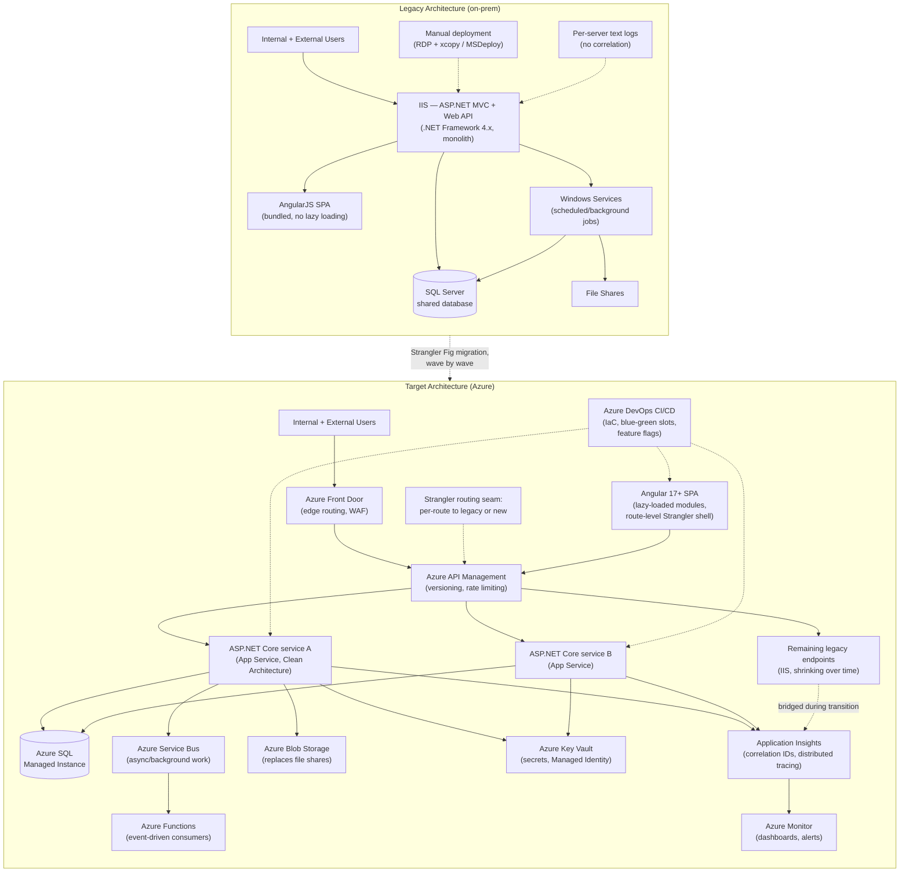

# Enterprise Modernization — Architecture & Migration Strategy (Reference)

**What this file is:** a generic technical reference on how to approach a large-scale ASP.NET Framework + AngularJS → ASP.NET Core + Angular + Azure modernization. It is written as "how you'd approach X," not as a personal incident — use it to answer architecture/design questions with real technical depth, not to claim a specific fabricated project happened. For your actual project experience, see the Wipro Cloud Migration Programme story in `behavioural/behavioural-answers.md`.

---

## 1. Legacy architecture — what typically accumulates

A business-critical enterprise platform that's run for 8-15 years on ASP.NET MVC (.NET Framework 4.x) + ASP.NET Web API + AngularJS + SQL Server + IIS typically accumulates the same failure modes regardless of the specific business domain:

- **Monolithic deployable** — one large IIS-hosted application, so a one-line fix requires a full redeploy and full regression risk.
- **Shared database** — multiple modules (sometimes multiple "logical services") read and write the same tables directly, so schema changes require coordinating every consumer, and there's no real service boundary, just a folder boundary.
- **Windows Services + file shares for background work** — scheduled/background processing implemented as Windows Services polling file shares or database tables, with no visibility into failures beyond a log file on a specific box.
- **AngularJS controllers doing too much** — two-way `$scope` binding encourages controllers that mix API calls, view logic, and business rules, making them hard to unit test and hard to reason about.
- **Static/tightly-coupled DI (or no DI)** — `Unity`/`Autofac` wired through `Global.asax` or, worse, direct `new`-ing of dependencies, making unit testing require standing up real dependencies.
- **`HttpContext.Current` reached directly from business logic** — couples business logic to the web pipeline, blocking any move toward background processing, testability, or async rewrites.
- **Blocking synchronous I/O** — `.Result` / `.Wait()` on what should be async calls, causing thread-pool starvation under load.
- **Manual deployments** — a runbook, not a pipeline; deployment risk and rollback risk are both high and both manual.
- **Minimal automated testing** — coverage concentrated (if anywhere) on utility code, not on the business logic that actually changes often.
- **Limited monitoring** — IIS logs and maybe a text log file per server; diagnosing a cross-cutting production issue means manually correlating timestamps across machines.

## 2. Why incremental modernization, not a rewrite

The standard trade-off, and the one worth being explicit about in an interview:

| | Big-bang rewrite | Incremental (Strangler Fig) modernization |
|---|---|---|
| Business continuity | High risk — nothing ships until the rewrite is "done" | Low risk — legacy keeps serving traffic throughout |
| Feature delivery during migration | Effectively frozen | Continues in parallel |
| Risk exposure | Concentrated at a single cutover | Spread across many small, reversible cutovers |
| Regression risk | High — reimplementing years of undocumented business rules from scratch | Lower — legacy behavior stays the reference implementation until each piece is proven |
| Time to first value | Long — nothing is better until the whole thing ships | Short — each migrated module is immediately better |
| Failure mode | Catastrophic — a failed rewrite can mean throwing away 12-18 months of work | Contained — a failed wave is one module, not the whole programme |

**The argument for incremental, stated plainly:** a big-bang rewrite bets the entire modernization on getting a full reimplementation right on the first try, with no production feedback until the end. An incremental approach trades a longer overall timeline for continuous validation — every wave either proves the target architecture works under real traffic or fails small and cheap. For a business-critical platform with thousands of users, the cost of being wrong at big-bang scale is almost always higher than the cost of a slower, staged migration — which is why Strangler Fig is the default recommendation for legacy modernization of live, revenue-critical systems, reserving full rewrites for genuinely small or already-decommissioned-in-spirit systems.

## 3. The Strangler Fig pattern, applied end to end

The pattern: put a routing seam in front of the legacy system, then incrementally replace pieces behind that seam, so callers never know (or need to know) whether they're hitting old or new.

**Where the seam goes, concretely:**
- **API layer** — introduce a reverse proxy / API gateway (Azure API Management, or Azure Front Door for edge routing) in front of both legacy and new endpoints. Initially, 100% of traffic routes to legacy. As each endpoint is reimplemented on ASP.NET Core, the gateway's routing rule for that specific endpoint flips to the new service — traffic is redirected per-route, not per-release.
- **UI layer** — for AngularJS → Angular, the seam is route-level: an outer shell (often kept deliberately thin) decides, per route, whether to load the legacy AngularJS bundle or the new Angular bundle for that page. Both can run side by side in the browser during the transition (see file 2 for the mechanics).
- **Data layer** — the hardest seam. Where a new service needs to own data currently in the shared database, the usual sequence is: (1) new service reads from the legacy shared tables directly at first (fastest to ship, keeps a single source of truth), (2) introduce a synchronization mechanism (change data capture, or dual-write with the legacy write path as source of truth) once the new service needs to write, (3) fully cut the legacy write path over once the new service is proven, (4) only then consider physically separating the data store. Skipping straight to "give the new service its own database" before establishing sync is the most common Strangler Fig failure mode — it silently reintroduces the two-databases-drift problem the pattern is supposed to avoid.

**Sequencing waves — the actual planning exercise:**
1. **Inventory and dependency-map** the whole application/module portfolio — what calls what, what shares a database table, what shares a deployment.
2. **Classify each piece** by business value and technical complexity (a 2x2: high-value/low-complexity pieces go first — they prove the pattern works and deliver visible wins early; low-value/high-complexity pieces go last or get explicitly descoped).
3. **Migrate leaf nodes before hubs** — a module with few dependents can move without much coordination; a module everything else depends on needs its consumers ready first, or it becomes the whole programme's bottleneck.
4. **Define a rollback path per wave before the wave starts** — the routing seam makes this cheap: if the new implementation of a route regresses, flip the gateway rule back to legacy immediately, no redeploy needed.
5. **Retire legacy code path only after the new path has run under full production load for a defined bake period** (commonly 2-4 weeks) with no rollback — not immediately on cutover.

## 4. Azure adoption strategy — what moves first, and why

The general sequencing logic, and the justification for each service:

**Move first: stateless, low-risk, high-leverage pieces**
- **Azure App Service** for the ASP.NET Core services as they're extracted — App Service is the right default over raw VMs because it removes OS/patching ownership and gives built-in deployment slots (critical for blue-green, see file 2), and it's the right default over AKS/containers unless the team already has strong container/orchestration maturity — introducing Kubernetes *and* a legacy modernization at the same time multiplies risk for limited incremental benefit at moderate scale.
- **Azure Key Vault** early, even before full migration — centralizing secrets (connection strings, API keys) out of `web.config`/`appsettings.json` is one of the highest-value, lowest-risk moves available, and it removes a real security liability (secrets in source control history, secrets duplicated across servers) independent of anything else in the migration.
- **Azure Application Insights** wired into the *legacy* app first, not just the new one — you want a monitoring baseline from the old system before cutover, so "is the new system actually better" is a measured claim, not a guess.

**Move next: the data tier — deliberately not first**
- **Azure SQL** (Managed Instance for close compatibility with on-prem SQL Server features, or single database for services that can tolerate the feature differences) — this is usually *not* the first move, because migrating data introduces cutover risk (data sync, downtime windows) that's better absorbed once the application layer's Strangler seams are already proven. Moving app tier first, database second, is the more common and lower-risk sequencing than the reverse.
- **Azure Storage** for file-share replacement (Blob Storage) — a low-risk, high-value move since file shares are usually just unstructured blob storage with extra operational overhead (Windows file server patching, backup, access management).

**Move as the architecture matures: integration and edge**
- **Azure Service Bus** to replace the Windows Services + file-share polling pattern for background/async work — justified specifically where work needs to survive a process restart, needs guaranteed delivery, or needs to decouple a slow consumer from a fast producer. Not justified as a blanket replacement for every background job — a simple scheduled task that just needs to run reliably is often better served by a Function on a Timer trigger than by introducing a message queue.
- **Azure Functions** for genuinely event-driven, bursty, or scheduled workloads (a file-uploaded trigger, a nightly batch, a webhook receiver) — the trade-off against App Service–hosted background workers is cold-start latency and execution-time limits versus not having to manage always-on compute for infrequent work. For anything latency-sensitive or continuously busy, a hosted background worker beats a Function.
- **Azure API Management** once there are enough services that consistent versioning, rate limiting, and a single external contract surface matter — introducing APIM on day one for a two-service system is usually premature; it earns its complexity once there are enough consumers and enough services that inconsistent per-service API conventions become the actual pain point.
- **Azure Front Door** at the edge once there's a real need for global routing, WAF, or multi-region failover — for a single-region enterprise app, this is often deferred until DR planning makes it necessary, not adopted reflexively.

**Alternatives considered and why they're usually rejected at this stage:**
- **AKS/Kubernetes instead of App Service** — rejected early in a modernization unless the org already runs Kubernetes elsewhere; the operational learning curve competes directly with the modernization's own risk budget.
- **A full data-store split (separate database per new service) from day one** — rejected in favor of shared-database-with-sync-then-split, per the Strangler data-layer discussion above; splitting too early either duplicates data with no sync (drift risk) or blocks the migration on solving distributed-data problems before there's evidence the service boundary is even right.
- **Rewriting the AngularJS UI entirely in one release** — rejected in favor of route-level Strangler migration (file 2), for the same continuity reasons as the backend.
- **"Lift and shift" (rehost on Azure VMs with no architecture change) as the whole strategy** — sometimes the *first* step for a piece under extreme time pressure (get off End-of-Life on-prem hardware fast), but explicitly a stopgap, not the target state — it moves the hosting risk without touching any of the technical debt described in section 1.

## 5. Reference architecture — legacy vs. target

**How to narrate this diagram in an interview:** don't read it left to right — narrate it as "here's the seam" (API Management sitting in front of both legacy and new, routing per-route), "here's what moved first and why" (App Service + Key Vault + Application Insights before the database), and "here's what's still legacy at this point in the migration" (the shrinking `T_Legacy` box) — that shows you understand it's a process with a state at any given time, not a diagram of a finished system.
