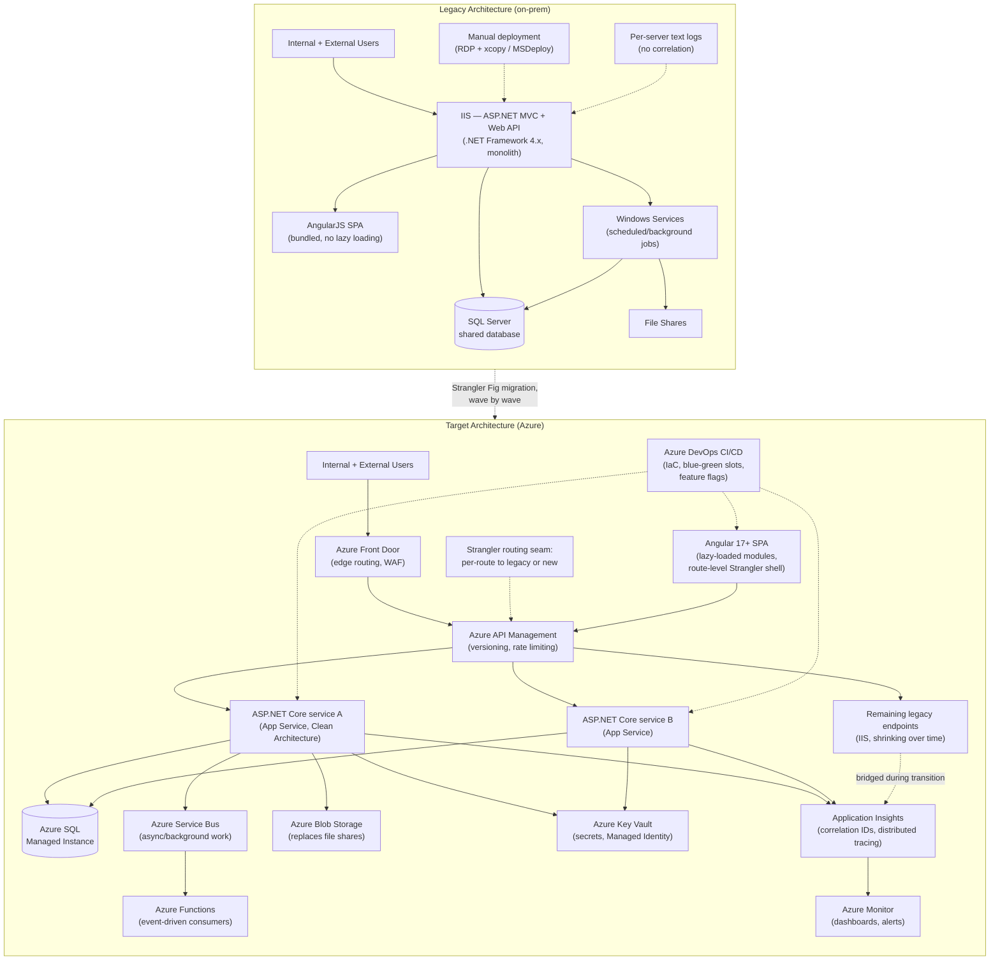

# Enterprise Modernization — Technical & Leadership Reference

**What this file is:** a generic technical and leadership reference on modernizing a large ASP.NET Framework + AngularJS enterprise platform to ASP.NET Core + Angular + Azure — architecture, migration mechanics, engineering excellence, observability, security, a 75-question technical bank, and a Principal Engineer leadership question bank. It is written as "how you'd approach X / how this works," not as a personal incident — use it for fluency. For your actual project experience, see the Wipro Cloud Migration Programme story (Q7, Q35) in `../behavioural/behavioural-answers.md`.

---

# Part 1 — The Full Story, In Order

*This part is deliberately structured the way an interview conversation actually flows — what the old system was, what it cost you day to day, how you got the money and the mandate to fix it, the big decisions (cloud, services, server vs. serverless), and only then the plan itself. Parts 2-5 are the depth underneath each of these, for when someone asks "how, exactly."*

## 1. What the old architecture looked like

A business-critical enterprise platform that's run for 8-15 years on ASP.NET MVC (.NET Framework 4.x) + ASP.NET Web API + AngularJS + SQL Server + IIS typically looks like this:

- **Monolithic deployable** — one large IIS-hosted application, so a one-line fix requires a full redeploy and full regression risk.
- **Shared database** — multiple modules (sometimes multiple "logical services") read and write the same tables directly, so schema changes require coordinating every consumer, and there's no real service boundary, just a folder boundary.
- **Windows Services + file shares for background work** — scheduled/background processing implemented as Windows Services polling file shares or database tables, with no visibility into failures beyond a log file on a specific box.
- **AngularJS controllers doing too much** — two-way `$scope` binding encourages controllers that mix API calls, view logic, and business rules, making them hard to unit test and hard to reason about.
- **Static/tightly-coupled DI (or no DI)** — `Unity`/`Autofac` wired through `Global.asax` or, worse, direct `new`-ing of dependencies, making unit testing require standing up real dependencies.
- **`HttpContext.Current` reached directly from business logic** — couples business logic to the web pipeline, blocking any move toward background processing, testability, or async rewrites.
- **Blocking synchronous I/O** — `.Result` / `.Wait()` on what should be async calls, causing thread-pool starvation under load.
- **Manual deployments** — a runbook, not a pipeline; deployment risk and rollback risk are both high and both manual.
- **Minimal automated testing** — coverage concentrated (if anywhere) on utility code, not on the business logic that actually changes often.
- **Limited monitoring** — IIS logs and maybe a text log file per server; diagnosing a cross-cutting production issue means manually correlating timestamps across machines.

## 2. The problems this actually caused, day to day

The architecture facts above aren't abstract — each one shows up as a specific, recurring operational pain, and this is the framing an interviewer wants to hear (symptoms and business impact, not just a list of legacy tech):

- **Every release was high-risk and slow.** Because the app is one monolithic deployable, even a one-line fix needs a full build, full regression pass, and a manual deployment window — so releases cluster into infrequent, large, high-blast-radius events instead of small, frequent, low-risk ones.
- **A schema change was a cross-team negotiation, every time.** The shared database meant no module could change its data shape without checking every other module that touches the same tables — slowing down even simple feature work.
- **Background job failures were invisible until someone complained.** Windows Services polling file shares had no centralized monitoring — the first sign of a failed nightly batch was often a business user asking why yesterday's data wasn't there.
- **Diagnosing a production issue took hours, not minutes.** With per-server text logs and no correlation IDs, root-causing anything that crossed more than one part of the system meant manually matching timestamps across machines — a slow, error-prone process during exactly the moments speed mattered most.
- **The team was afraid to touch large parts of the codebase.** Tight coupling (`HttpContext.Current` reached from business logic, no real DI) and minimal test coverage meant changes to core logic carried real regression risk, which made the team conservative — features that should've been quick took longer because nobody wanted to be the one who broke something load-bearing.
- **Scaling meant buying hardware, not clicking a button.** On-prem infrastructure sized for peak load sat mostly idle the rest of the time, and a genuine traffic spike (a seasonal peak, a marketing push) meant either over-provisioning permanently or risking a capacity crunch.
- **The talent cost was real too.** Engineers — especially newer hires — don't want to spend years maintaining AngularJS and .NET Framework; retention and hiring both get harder the longer a platform stays visibly behind current practice.

## 3. Building the business case — justifying the cost to senior management

Modernization competes for budget against visible feature work, so the pitch has to be a business case, not a technology upgrade request:

- **Frame it as total cost of ownership, not a one-time spend.** The real comparison isn't "$0 (do nothing)" vs. "$X (migrate)" — it's the *ongoing* cost of the status quo (rising infra/licensing spend on aging on-prem hardware, the incident/downtime cost from limited observability, the opportunity cost of slower feature delivery hurting competitive position) versus the migration's cost (cloud spend + engineering effort). Framed this way, "do nothing" has a cost too, it's just less visible because it's spread across many small line items instead of one big ask.
- **Anchor the "why now" to something already forcing a decision.** The strongest business cases don't ask for a discretionary modernization budget in isolation — they attach to a cost or a deadline that's already on the CFO's radar: an approaching hardware refresh cycle, an OS/SQL Server version reaching end of extended support (forcing a decision anyway), or a compliance requirement the legacy stack can't meet. That reframes the ask from "spend more to modernize" to "we have to spend money here regardless — this option spends it better."
- **Make the ask incremental, not a single large approval.** Tie the investment to the Strangler Fig plan itself (section 9) — ask for budget for the first wave, show the measured result (a concrete before/after: faster deploys, fewer incidents, a real infra cost delta), and use that evidence to justify the next tranche. This is a genuinely stronger pitch than a large upfront ask, because it gives leadership a cheap off-ramp if the approach isn't working, which paradoxically makes them more comfortable saying yes to the first step.
- **Quantify what you can, and say plainly what you can't yet.** Concrete, credible numbers land better than a vague "efficiency gains" — infra cost reduction from elastic vs. over-provisioned capacity, reduced hardware capital expense by not doing a like-for-like refresh, reduced incident/MTTR cost from better observability. Where a number isn't knowable yet (developer productivity gains, for instance), say so and describe how you'll measure it post-migration rather than guessing a number to sound complete — a business sponsor trusts an honest "we'll measure this" more than a suspiciously precise made-up figure.

## 4. Choosing the cloud provider

For an estate this deep in the Microsoft stack (.NET Framework, SQL Server, IIS, likely on-prem Active Directory), Azure is usually the pragmatic default over AWS or GCP — for reasons that are about the *existing* estate, not abstract platform quality:

- **Licensing continuity — Azure Hybrid Benefit.** If the organization already owns Windows Server and SQL Server licenses with Software Assurance, Azure Hybrid Benefit lets those licenses offset Azure compute/database costs directly — a real, quantifiable cost reduction that AWS/GCP can't match unless the org is willing to walk away from existing licensing investment entirely.
- **Identity continuity.** If the legacy app authenticates against on-prem Active Directory, Azure AD/Entra ID with Azure AD Connect gives a hybrid-identity path that's far less disruptive than re-platforming authentication onto a different provider's IAM from a standing start (see the security section in Part 3 for what the target auth model looks like once migrated).
- **Team skill continuity.** A team of .NET/Windows/SQL Server engineers ramps up on Azure's .NET-native tooling (App Service's first-class .NET support, Azure DevOps integration with Visual Studio) meaningfully faster than retraining onto AWS/GCP-native tooling and conventions — lower risk and higher velocity specifically *during* the migration, when the team is already absorbing a lot of change.
- **What AWS/GCP would have offered, honestly.** AWS has a broader and more mature container-native/Kubernetes ecosystem; GCP has stronger native data/analytics tooling. Both are legitimate strengths — they're just not the deciding factor for a .NET-heavy estate with an existing Microsoft licensing relationship, where the switching cost (retraining, losing licensing continuity, rebuilding identity integration from scratch) outweighs those benefits. The honest answer to "why not AWS" is economic and organizational fit, not a technical claim that Azure is universally superior.

## 5. Migration strategy — why incremental, not a rewrite, lift-and-shift, or full microservices

Three alternatives are worth explicitly rejecting, not just the rewrite:

| | Big-bang rewrite | Lift-and-shift only | Full microservices from day one | Incremental (Strangler Fig) |
|---|---|---|---|---|
| Business continuity | High risk — nothing ships until "done" | Low risk — but changes nothing underneath | Low risk to continuity, high risk to correctness | Low risk — legacy keeps serving traffic throughout |
| Addresses the technical debt (section 1)? | Eventually, all at once | No — moves hosting only, debt is unchanged | Yes, but before service boundaries are proven | Yes, incrementally, validated wave by wave |
| Regression risk | High — reimplementing undocumented business rules from scratch | Low — nothing changed | High — distributed-system bugs on unproven boundaries | Lower — legacy stays the reference until each piece is proven |
| Time to first real value | Long | Immediate, but shallow (hosting only) | Long, and risky | Short — each migrated module is immediately better |

**Why not a big-bang rewrite:** it bets the entire modernization on a full reimplementation being correct with no production feedback until the very end — for a business-critical platform with thousands of users, that's a bigger bet than the business needs to take.

**Why not lift-and-shift as the whole strategy:** it moves hosting risk off aging on-prem hardware, which can be a legitimate *first step* under extreme time pressure (e.g., escaping End-of-Life hardware fast), but it's explicitly a stopgap — every technical-debt item in section 1 remains exactly as it was, just now running on an Azure VM instead of on-prem.

**Why not decompose into full microservices immediately:** drawing fine-grained service boundaries before there's production evidence they're the *right* boundaries adds distributed-system complexity (network calls where there used to be function calls, eventual consistency, cross-service transactions) on top of a system you don't yet understand well enough to decompose correctly. The safer sequence is extracting coarser-grained services via Strangler Fig first, observing real coupling and usage patterns under production load, and only splitting a service further once there's a concrete trigger — a genuine independent-scaling need, an independent deployment-cadence need, or a team-ownership boundary that no longer matches the current service shape.

## 6. The Strangler Fig pattern, applied end to end

The pattern: put a routing seam in front of the legacy system, then incrementally replace pieces behind that seam, so callers never know (or need to know) whether they're hitting old or new.

**Where the seam goes, concretely:**
- **API layer** — introduce a reverse proxy / API gateway (Azure API Management, or Azure Front Door for edge routing) in front of both legacy and new endpoints. Initially, 100% of traffic routes to legacy. As each endpoint is reimplemented on ASP.NET Core, the gateway's routing rule for that specific endpoint flips to the new service — traffic is redirected per-route, not per-release.
- **UI layer** — for AngularJS → Angular, the seam is route-level: an outer shell (often kept deliberately thin) decides, per route, whether to load the legacy AngularJS bundle or the new Angular bundle for that page. Both can run side by side in the browser during the transition (see Part 2 for the mechanics).
- **Data layer** — the hardest seam. Where a new service needs to own data currently in the shared database, the usual sequence is: (1) new service reads from the legacy shared tables directly at first (fastest to ship, keeps a single source of truth), (2) introduce a synchronization mechanism (change data capture, or dual-write with the legacy write path as source of truth) once the new service needs to write, (3) fully cut the legacy write path over once the new service is proven, (4) only then consider physically separating the data store. Skipping straight to "give the new service its own database" before establishing sync is the most common Strangler Fig failure mode — it silently reintroduces the two-databases-drift problem the pattern is supposed to avoid.

## 7. Choosing which services to adopt, and when

The general sequencing logic, and the justification for each service:

**Move first: stateless, low-risk, high-leverage pieces**
- **Azure App Service** for the ASP.NET Core services as they're extracted — App Service is the right default over raw VMs because it removes OS/patching ownership and gives built-in deployment slots (critical for blue-green), and it's the right default over AKS/containers unless the team already has strong container/orchestration maturity — introducing Kubernetes *and* a legacy modernization at the same time multiplies risk for limited incremental benefit at moderate scale.
- **Azure Key Vault** early, even before full migration — centralizing secrets (connection strings, API keys) out of `web.config`/`appsettings.json` is one of the highest-value, lowest-risk moves available, and it removes a real security liability (secrets in source control history, secrets duplicated across servers) independent of anything else in the migration.
- **Azure Application Insights** wired into the *legacy* app first, not just the new one — you want a monitoring baseline from the old system before cutover, so "is the new system actually better" is a measured claim, not a guess.

**Move next: the data tier — deliberately not first**
- **Azure SQL** (Managed Instance for close compatibility with on-prem SQL Server features, or single database for services that can tolerate the feature differences) — this is usually *not* the first move, because migrating data introduces cutover risk (data sync, downtime windows) that's better absorbed once the application layer's Strangler seams are already proven. Moving app tier first, database second, is the more common and lower-risk sequencing than the reverse.
- **Azure Storage** for file-share replacement (Blob Storage) — a low-risk, high-value move since file shares are usually just unstructured blob storage with extra operational overhead (Windows file server patching, backup, access management).

**Move as the architecture matures: integration and edge**
- **Azure Service Bus** to replace the Windows Services + file-share polling pattern for background/async work — justified specifically where work needs to survive a process restart, needs guaranteed delivery, or needs to decouple a slow consumer from a fast producer.
- **Azure Functions** for genuinely event-driven, bursty, or scheduled workloads — see section 8 for the full server-vs-serverless decision framework.
- **Azure API Management** once there are enough services that consistent versioning, rate limiting, and a single external contract surface matter — introducing APIM on day one for a two-service system is usually premature; it earns its complexity once there are enough consumers and enough services that inconsistent per-service API conventions become the actual pain point.
- **Azure Front Door** at the edge once there's a real need for global routing, WAF, or multi-region failover — for a single-region enterprise app, this is often deferred until DR planning makes it necessary, not adopted reflexively.

**Alternatives considered and why they're usually rejected at this stage:**
- **AKS/Kubernetes instead of App Service** — rejected early in a modernization unless the org already runs Kubernetes elsewhere; the operational learning curve competes directly with the modernization's own risk budget.
- **A full data-store split (separate database per new service) from day one** — rejected in favor of shared-database-with-sync-then-split, per the Strangler data-layer discussion above.
- **Rewriting the AngularJS UI entirely in one release** — rejected in favor of route-level Strangler migration (Part 2), for the same continuity reasons as the backend.

## 8. Server vs. serverless — the decision framework

This is a decision made per-workload, not once for the whole platform — the question each time is which compute model actually fits that specific piece of work:

**Choose "server" (App Service, always-on compute) when:**
- Load is reasonably predictable and continuous — a main API surface receiving steady request traffic all day.
- Latency has to be consistently low — no tolerance for the cold-start delay a serverless function can incur on an infrequently-invoked path.
- The workload is fundamentally interactive/request-response and user-facing.

**Choose "serverless" (Azure Functions) when:**
- The workload is event-driven, bursty, or infrequent — a file-uploaded trigger, a webhook receiver, a nightly batch/reconciliation job, a Service-Bus-triggered consumer that doesn't need sub-second response.
- Paying for idle compute doesn't make sense — something that runs for two minutes a night shouldn't be backed by an always-on instance sitting idle the other 23 hours 58 minutes.
- Execution time fits within Functions' execution limits, and the occasional cold-start latency is genuinely acceptable for that workload.

**The honest trade-off, stated plainly:** serverless isn't cheaper by default — for a continuously busy workload, an always-on Function plan (or a poorly-utilized dedicated worker) can cost *more* than a right-sized App Service instance running the same logic. The real crossover factor is utilization, not a blanket "serverless = cheap" rule. Concretely, in this migration: the main ASP.NET Core services live on App Service (predictable, latency-sensitive, interactive), while specific bursty/event-driven pieces — a blob-triggered file processor, a Service-Bus-triggered notification consumer, a nightly reconciliation job — move to Functions.

## 9. The migration plan — sequencing the waves

The actual planning exercise, step by step:

1. **Inventory and dependency-map** the whole application/module portfolio — what calls what, what shares a database table, what shares a deployment.
2. **Classify each piece** by business value and technical complexity (a 2x2: high-value/low-complexity pieces go first — they prove the pattern works and deliver visible wins early; low-value/high-complexity pieces go last or get explicitly descoped).
3. **Migrate leaf nodes before hubs** — a module with few dependents can move without much coordination; a module everything else depends on needs its consumers ready first, or it becomes the whole programme's bottleneck.
4. **Define a rollback path per wave before the wave starts** — the routing seam makes this cheap: if the new implementation of a route regresses, flip the gateway rule back to legacy immediately, no redeploy needed.
5. **Retire legacy code path only after the new path has run under full production load for a defined bake period** (commonly 2-4 weeks) with no rollback — not immediately on cutover.
6. **Feed measured results from each wave back into the business case** (section 3) — each wave's real numbers are what justify budget for the next tranche.

## 10. Reference architecture — legacy vs. target

**How to narrate this diagram in an interview:** don't read it left to right — narrate it as "here's the seam" (API Management sitting in front of both legacy and new, routing per-route), "here's what moved first and why" (App Service + Key Vault + Application Insights before the database), and "here's what's still legacy at this point in the migration" (the shrinking `T_Legacy` box) — that shows you understand it's a process with a state at any given time, not a diagram of a finished system.

---

# Part 2 — Frontend & Backend Migration Mechanics

## Part A — AngularJS → Angular Migration

### Migration approach: `@angular/upgrade` hybrid, not a rewrite

The standard low-risk approach is the **hybrid/ngUpgrade pattern**: run AngularJS and Angular in the same browser session simultaneously during the transition, using `@angular/upgrade/static` to let the two frameworks interoperate — AngularJS components can be used inside Angular templates and vice versa via up/downgrade adapters. This is the Strangler Fig pattern applied to the frontend: the AngularJS app keeps running for routes not yet migrated, while migrated routes render Angular components, and users never see a seam.

**Practical sequencing:**
1. **Bootstrap Angular alongside AngularJS** in the same `index.html`, with a root `UpgradeModule` bridging the two.
2. **Migrate leaf components first** — components with few dependencies on shared AngularJS services are the cheapest to convert and prove the pattern works without much coordination.
3. **Migrate shared services next**, since once a service is downgraded for AngularJS consumption (or upgraded for Angular consumption), every component depending on it can be migrated independently afterward.
4. **Migrate routes last, module by module**, switching the router configuration to hand off to Angular's router for converted sections while AngularJS's `ngRoute`/`ui-router` continues to serve the rest.
5. **Remove the hybrid bridge only once 100% of the surface is Angular** — running two frameworks has a real bundle-size and performance cost, so the hybrid mode is explicitly temporary infrastructure, not a permanent target state.

### Why not a parallel rewrite instead?

A common alternative is building the new Angular app entirely separately and cutting over page-by-page via a reverse-proxy route split (no shared browser session, no hybrid bridge). This avoids the ngUpgrade complexity entirely, at the cost of: (1) duplicating shared state/session handling across two completely separate apps during the transition, and (2) losing any in-page component reuse between old and new during the migration window. The hybrid approach is generally preferred when the app has significant shared state (auth session, user context, in-flight form data) that would be painful to duplicate; the separate-apps approach is preferred when the legacy and target UIs are different enough (e.g., a full UX redesign alongside the framework migration) that sharing isn't valuable anyway.

### Key technical differences that drive the actual migration work

- **Two-way `$scope` binding → unidirectional data flow with `@Input()`/`@Output()`.** This is the single biggest source of real refactoring work, not a syntax change — an AngularJS controller that mutates `$scope` from multiple places (a child directive, a watch, an async callback) has to be redesigned around explicit inputs and emitted events. This is exactly where "modular, testable components" comes from: forcing explicit data flow is what makes a component unit-testable in isolation.
- **Controllers + `$scope` → component classes with TypeScript.** Adds compile-time type safety, which catches a category of runtime bugs AngularJS's dynamic `$scope` access couldn't.
- **`$http`/`$resource` → `HttpClient` with RxJS observables.** Requires rethinking callback-based async code as observable streams — a real learning curve for teams used to promise-based `$http`, especially around cancellation (`unsubscribe`) and operators (`switchMap`, `debounceTime`) replacing manual debounce/throttle logic.
- **`ngRoute`/`ui-router` → Angular Router.** Route guards (`CanActivate`) replace ad-hoc `resolve` + manual auth checks scattered in controllers — this is also where **authentication** gets centralized: a single `AuthGuard` protecting routes, rather than each controller independently checking a token.
- **No lazy loading in most AngularJS apps → route-level lazy loading with Angular modules.** AngularJS typically ships as one bundle; Angular's `loadChildren` lazy-loads feature modules on navigation. This is usually where the biggest measurable frontend performance win comes from — initial bundle size drops substantially because users only download the code for the section of the app they're actually using.
- **Ad-hoc shared code → shared libraries (Angular workspace / Nx-style libs).** Cross-cutting UI components (buttons, form controls, layout shells) and cross-cutting services (auth, API client wrappers, error interceptors) get extracted into a shared library consumed by every feature module — replacing what was often copy-pasted or globally-scoped code in the AngularJS app.

### Authentication during the transition

Because both frameworks run in the same browser session during the hybrid phase, the auth token/session needs to be readable by both — typically solved by keeping the token in a framework-agnostic store (a cookie, or `localStorage`/`sessionStorage`) rather than in either framework's internal state, with a downgraded Angular auth service exposed to AngularJS (or vice versa) so there's exactly one source of truth for "is the user logged in" regardless of which framework rendered the current view.

## Part B — ASP.NET Framework → ASP.NET Core Migration

### Middleware pipeline

ASP.NET Framework's `HttpModules`/`HttpHandlers` (configured in `web.config`, executed via a fairly opaque IIS pipeline) become an explicit, ordered middleware pipeline in `Program.cs` (`app.UseX()` calls). This is a real conceptual shift, not just a syntax port: middleware order is now explicit and visible in one place — exception handling, authentication, routing, and custom middleware (like correlation-ID stamping) all have a deliberate position in the pipeline, which is itself a code-review point ("why is this middleware before/after that one") rather than implicit IIS-module ordering.

### Dependency injection

ASP.NET Framework apps typically bolt on a third-party container (Unity, Autofac, Ninject) via a custom `DependencyResolver`, often inconsistently — some code resolves via the container, some code still `new`s dependencies directly. ASP.NET Core has DI built into the framework itself (`IServiceCollection`), which removes the "which resolution mechanism does this code path use" ambiguity and makes constructor injection the only path — a real forcing function for testability, since anything not injected can't be easily mocked in a test.

### Configuration

`web.config`'s XML-based `appSettings`/`connectionStrings`, environment-specific `web.Release.config` transforms → the Options pattern (`IOptions<T>`) backed by `appsettings.json` + `appsettings.{Environment}.json` + environment variables + (critically) Key Vault for secrets. The important behavior change: configuration becomes strongly typed and validated at startup (via `IValidateOptions<T>` or data annotations) instead of failing at first use somewhere deep in a request — misconfiguration surfaces as a startup failure, not a 2am production bug.

### Authentication

ASP.NET Framework commonly used Forms Authentication or a custom `OWIN` bearer-token setup. ASP.NET Core standardizes on the `Microsoft.AspNetCore.Authentication` middleware with JWT bearer tokens validated against an identity provider (Azure AD / Entra ID via `AddMicrosoftIdentityWebApi`, or a generic OIDC provider) — see Part 3 for the full security picture. The migration-specific detail: during the transition, both the legacy Forms-Auth-protected pages and the new JWT-protected API need to recognize the same authenticated session, usually solved by having the legacy app also issue/accept the same JWT (or by putting both behind a shared auth gateway that normalizes to one token format for downstream consumers).

### API versioning

ASP.NET Framework Web API often had no explicit versioning strategy — breaking changes just broke callers. ASP.NET Core's `Asp.Versioning` package (or a simple URL-segment convention, `/api/v2/...`) makes versioning explicit, which matters specifically during a Strangler migration: the API Management gateway (Part 1) needs to route `v1` calls to legacy and `v2` calls to the new service unambiguously, so versioning isn't optional once the Strangler pattern is in play — it's the mechanism the routing seam depends on.

### Background processing

Windows Services polling file shares/database tables → `IHostedService`/`BackgroundService` for in-process background work, or Azure Functions/Service Bus consumers for out-of-process, scalable async work (Part 1). The key trade-off to be able to articulate: an in-process `BackgroundService` is simpler and has no extra infrastructure, but it scales and fails with the web app itself (if the app restarts, the background work restarts too, and it competes for the same resources as request handling); a Service Bus + Function consumer is more infrastructure but scales independently and survives the web app being redeployed or scaled to zero.

### Logging

Per-server text files / `System.Diagnostics.Trace` → structured logging via `ILogger<T>` with a provider like Serilog, writing structured (not just string-interpolated) log events to Application Insights. The critical behavioral upgrade is **structured** logging — `logger.LogInformation("Order {OrderId} processed for {UserId}", orderId, userId)` produces queryable fields (`OrderId`, `UserId`) in the log backend, not just a formatted string, which is what makes "find every log line for this specific order" a query instead of a grep.

### Validation

Manual `if`-check validation scattered through controller actions and `ModelState.IsValid` checks → `FluentValidation` validators registered in DI and run automatically via a pipeline filter, keeping validation logic in one discoverable place per model instead of duplicated across every action that accepts that model.

### Exception handling

Framework's `Application_Error` in `Global.asax` (a single, coarse global handler, often just logging and showing a generic error page) → ASP.NET Core's exception-handling middleware (`UseExceptionHandler`) paired with `ProblemDetails` responses (RFC 7807) — giving API consumers a structured, machine-parseable error response (`type`, `title`, `status`, `detail`, `traceId`) instead of an HTML error page or an inconsistent ad-hoc JSON error shape per controller. The `traceId` in `ProblemDetails` is also the direct link to the observability story in Part 3 — a client-reported error can be traced straight to its distributed trace via that ID.

---

# Part 3 — Engineering Excellence, Observability & Security

## 1. Code quality

- **PR standards**: a template requiring what changed, why, how it was tested, and rollback plan for anything touching production paths; PRs capped at a reviewable size (large migrations get broken into small, reviewable slices — a 3,000-line PR migrating an entire module at once defeats the purpose of review).
- **Coding guidelines**: codified as an `.editorconfig` + analyzer ruleset enforced at build time (warnings-as-errors for the rules that matter), not a wiki page nobody reads — the goal is that violating a guideline fails CI, not that a reviewer has to remember to mention it.
- **Static analysis / SonarQube**: wired into the CI pipeline as a quality gate — new code below a coverage threshold, or introducing new critical/blocker issues, fails the build. The important nuance: gate *new* code strictly, but don't block the pipeline on pre-existing legacy-code debt (that would make the gate impossible to ship anything through) — track legacy debt as a visible, separately-prioritized backlog instead.
- **Technical debt reduction**: tracked as an explicit backlog with a rough cost/impact rating, and — critically — given a standing percentage of each sprint/release capacity (a common pattern is reserving a fixed slice, e.g., 15-20%, of engineering capacity per sprint for debt work) rather than being perpetually deprioritized against features, which is what lets debt reduction actually happen instead of remaining a permanent good intention.

## 2. Testing strategy

- **Unit tests**: fast, isolated, no I/O — cover business logic and edge cases. Target coverage is a *quality* signal, not a goal in itself: a common practical target is 80%+ on new/changed code specifically (not a blanket repo-wide number, since chasing coverage on legacy code with low change-frequency has poor ROI).
- **Integration tests**: exercise a real (or test-container) database and real DI wiring, catching the class of bug unit tests with mocked dependencies can't — a repository method that's individually correct but produces an N+1 query pattern in combination with a real EF Core context, for example.
- **API tests**: contract-level tests against a running instance (or in-memory `WebApplicationFactory`), verifying status codes, response shapes, and versioning behavior — these are what catch a breaking API change before a consumer does.
- **End-to-end tests**: a deliberately small, high-value set covering the critical user journeys only (login, the core transaction path) — E2E suites are slow and flaky at scale, so the guidance is to keep them thin and let unit/integration tests carry the bulk of coverage (the standard "testing pyramid" shape: many unit tests, fewer integration tests, few E2E tests).
- **Test automation**: all of the above run in CI on every PR, not on a schedule — a test suite that only runs nightly catches regressions a day late, after more code has already been built on top of the break.
- **Shift-left testing**: pushing quality checks (unit tests, static analysis, security scanning) as early as possible in the pipeline — ideally pre-commit or pre-PR-merge — rather than relying on a QA phase after development is "done." The economic argument: a bug caught by a unit test costs minutes to fix; the same bug caught in a manual QA pass costs hours; caught in production, it costs an incident.

## 3. Performance optimization

- **API response optimization**: return only what the client needs (`.Select()` projections instead of full entity graphs), enable response compression for large payloads, and set explicit response-size/pagination limits so no endpoint can return an unbounded payload.
- **Database tuning & SQL indexing**: profile actual production query patterns (via Query Store or Application Insights dependency tracking) before adding indexes — indexing blind is as likely to hurt write performance as help read performance. The recurring legacy-migration finding is usually N+1 queries (an EF Core `.Include()` missing, causing one query per row instead of one query total) and missing indexes on foreign-key/`WHERE`-clause columns that were never added because the legacy app's query patterns were never profiled.
- **Caching**: read-heavy, infrequently-changing data (reference/lookup data, user-profile summaries) moved to a distributed cache (Azure Cache for Redis) with an explicit invalidation strategy — the hard part of caching is never "add a cache," it's "how does this cache entry get invalidated when the underlying data changes," and that answer has to exist before the cache is added, not after a stale-data bug is reported.
- **Async programming**: converting blocking synchronous I/O (`.Result`, `.Wait()`) to `async`/`await` throughout the call chain — this is a real thread-pool-starvation fix, not a style preference: under load, blocking calls tie up threads that could otherwise be serving other requests, and the failure mode is the whole app slowing down or timing out under moderate load with CPU still low, which is a specific, recognizable symptom worth being able to describe.
- **Pagination**: every list endpoint gets a pagination contract (page size cap, cursor or keyset pagination for large tables instead of `OFFSET`, which degrades badly at high offsets) — this closes off the entire class of "someone eventually requests everything at once and the app falls over" incidents.
- **Bulk operations**: batch inserts/updates (`SqlBulkCopy`, EF Core's batching, or a stored procedure with a table-valued parameter) instead of row-by-row `SaveChanges()` calls in a loop — the difference between a nightly batch job finishing in minutes versus hours is almost always this.
- **Memory optimization**: bounding in-memory data structures by output size rather than input size (streaming/paging through large datasets instead of materializing a full `.ToList()`), disposing of unmanaged resources correctly, and watching for event-subscription leaks in long-lived services — the classic legacy-migration production incident is an unbounded in-memory aggregation in a background job that grows until the process runs out of memory.

## 4. Production readiness

- **CI/CD**: a pipeline with distinct build → test → static-analysis-gate → deploy-to-staging → automated-smoke-test → manual-approval-gate (for production) → deploy-to-production stages, triggered on every PR merge, not run manually per release.
- **Infrastructure as Code**: Bicep or Terraform defining every Azure resource (App Service plans, Azure SQL, Key Vault, networking) so environments are reproducible and reviewable via PR, instead of manually clicked together in the Azure Portal — the direct benefit is that "what does production actually look like" is answered by reading source control, not by auditing the portal.
- **Blue-green deployment**: using App Service deployment slots — deploy the new version to a staging slot, run smoke tests against it while production traffic still hits the current slot, then swap. The swap is close to instantaneous and trivially reversible (swap back) if something's wrong, which is what makes this meaningfully safer than deploying in place.
- **Feature flags**: decoupling deployment from release — a feature can be deployed to production dark (flag off) and enabled for a small percentage of users or a specific tenant first, which is especially valuable during a Strangler migration where "is the new implementation of this endpoint actually correct under real traffic" needs to be answered gradually, not all-at-once.
- **Rollback strategy**: defined *before* a release ships, not improvised during an incident — for a blue-green deployment, rollback is a slot-swap; for a database migration, rollback requires the migration to be backward-compatible with the previous app version for at least one release (never a same-release "deploy code + migrate schema in a way the old code can't run against," because that removes the ability to roll back the code without also reverting the schema).
- **Configuration management**: environment-specific configuration in `appsettings.{Environment}.json` + environment variables, with no environment-specific *logic* in code (no `if (environment == "Production")` branches) — the same binary should be deployable to any environment unchanged, with only configuration differing.
- **Secrets management**: no secret ever in source control or `appsettings.json` — Key Vault references injected via Managed Identity at runtime (see security section below), with automated secret rotation where the downstream service supports it.
- **Release approvals**: a required manual gate before production deployment for a business-critical system, with the pipeline enforcing it (not a process document asking humans to remember) — typically an Azure DevOps environment-level approval requiring a specific named approver or role.
- **Incident response**: an on-call rotation, a defined severity matrix (what makes something a Sev1 vs Sev3), and a documented runbook per known failure mode — the goal is that the *first* time someone encounters a given production issue is the worst time to be figuring out the response process from scratch, so the process needs to exist before the incident, not be invented during it.
- **Disaster recovery planning**: defined RTO (recovery time objective) and RPO (recovery point objective) per system tier, backed by actual tested failover — Azure SQL geo-replication/failover groups, App Service multi-region deployment behind Front Door for the highest-tier systems — and, critically, a DR plan that's periodically *tested* (a failover drill), since an untested DR plan is a hypothesis, not a capability.

## 5. Observability

- **Application Insights**: auto-instruments HTTP requests, dependency calls (SQL, HTTP, Service Bus), and exceptions with minimal setup, and is the natural first observability investment because it gives request-level visibility with almost no custom code.
- **Correlation IDs**: a unique ID generated (or propagated, if already present) in gateway/edge middleware on every inbound request, flowed through every downstream service call (via a header, e.g. `traceparent` per the W3C Trace Context standard, or a custom `X-Correlation-ID`) and stamped on every structured log line — this is what turns "search three different services' logs and manually match timestamps" into "search one ID and see the whole request's journey."
- **Distributed tracing**: the broader capability correlation IDs enable — a single trace showing every hop a request took across services, with per-hop latency, so "which service in the chain is actually slow" is a direct answer instead of a guess. Application Insights does this natively; OpenTelemetry is the vendor-neutral standard underneath it for teams that want portability across observability backends.
- **Structured logging**: log *events* with typed fields (`{OrderId}`, `{UserId}`, `{DurationMs}`), not formatted strings — the difference is queryability: "show me every failed order for this user in the last hour" is a structured query against fields, not a text search hoping the message format didn't change between versions.
- **Health checks**: a `/health` endpoint (ASP.NET Core's built-in `HealthChecks` middleware) checking the app's actual dependencies (database reachable, downstream service reachable, disk space) — consumed by the load balancer/App Service health-check feature to pull an unhealthy instance out of rotation automatically, and by deployment pipelines as an automated smoke-test gate.
- **Dashboards**: a small number of purpose-built dashboards per audience — an on-call dashboard (error rate, latency, saturation — the "four golden signals" shape), a business dashboard (transaction volume, conversion), and a cost dashboard — rather than one sprawling dashboard trying to serve everyone, which in practice serves no one well.
- **Alerting**: alerts on symptoms that require action (error rate above a threshold, p99 latency above a threshold, health check failing) routed to whoever's on call, not alerts on every anomaly — an alert that doesn't require someone to do something right now is noise that trains people to ignore the channel, which is how a genuinely important alert gets missed.
- **Root cause analysis**: distributed tracing plus correlation IDs is what makes RCA a matter of following one ID through Application Insights' end-to-end transaction view, rather than reconstructing a timeline by hand from disconnected server logs after the fact.

## 6. Security

- **Azure AD / Entra ID**: the identity provider for both user authentication (OIDC sign-in) and service-to-service authentication, replacing custom Forms Authentication or ad-hoc API keys with a standard, centrally-managed identity platform.
- **OAuth 2.0 / OIDC**: the authorization/authentication protocol underneath Azure AD integration — the authorization-code flow (with PKCE) for the Angular SPA, client-credentials flow for service-to-service calls.
- **JWT**: the bearer token format carrying the authenticated identity and claims (roles, tenant ID) between the SPA, the API gateway, and downstream services — validated (signature, expiry, audience, issuer) by ASP.NET Core's JWT bearer middleware on every request, not trusted implicitly.
- **Managed Identity**: Azure resources (App Service, Functions) authenticate to other Azure resources (Key Vault, Azure SQL, Service Bus) using an identity Azure itself manages — no credential is ever stored or rotated by the application, which eliminates an entire class of "a service principal secret expired and nobody rotated it" incidents.
- **Key Vault**: the single source of truth for secrets and certificates, referenced by App Service configuration (`@Microsoft.KeyVault(...)` references) so secrets are fetched at runtime via Managed Identity, never baked into a deployment artifact or checked into source control.
- **RBAC**: least-privilege role assignments at every layer — Azure resource-level RBAC (a service's Managed Identity gets exactly the Key Vault/SQL permissions it needs, not Contributor on the whole resource group), and application-level RBAC (role/claim checks on API endpoints, enforced via `[Authorize(Policy = ...)]` policies, not scattered ad-hoc `if (user.Role == "Admin")` checks).
- **Secret rotation**: Key Vault's rotation policies (or an Azure Function triggered on a schedule) rotating credentials automatically where the downstream service supports it (Azure SQL, storage account keys), with the application never needing a redeploy to pick up a rotated secret since it fetches the current value from Key Vault at runtime.

---

# Part 4 — 75-Question Technical Bank

Generic "how would you approach this" technical Q&A — trade-offs and alternatives included. Not tied to a specific claimed personal incident; use for fluency and to reason from principles under follow-up questioning.

## Migration Strategy & Strangler Pattern (1-10)

**1. Why choose incremental modernization over a full rewrite?**
A rewrite bets the whole programme on a single, late cutover with no production feedback until the end; incremental modernization validates the target architecture in small, reversible increments while the legacy system keeps serving traffic. The trade-off is timeline — incremental is usually slower to fully complete — for a large reduction in blast radius per mistake.

**2. When would a full rewrite actually be the right call?**
When the system is small enough that a rewrite's timeline is genuinely short, when the legacy system is already effectively decommissioned in spirit (low traffic, about to be replaced by a different product entirely), or when the legacy codebase is so entangled that incremental extraction costs more engineering effort than a clean rebuild — rare in practice for large, live, revenue-critical systems.

**3. How do you decide which modules migrate first?**
Dependency-map the portfolio, then prioritize high-business-value/low-technical-complexity modules first — they validate the pattern and deliver visible wins early. Leaf modules (few dependents) move before hub modules (many dependents), since a hub's consumers need to be ready first or it bottlenecks the whole programme.

**4. What's the biggest risk in the Strangler Fig data layer?**
Splitting the database too early, before establishing a sync mechanism — this creates silent data drift between old and new stores. The safer sequence is: new service reads shared tables directly first, then add sync (CDC or dual-write), then cut the write path over, and only then consider a fully separate store.

**5. How do you decide when to retire the legacy code path for a migrated module?**
Only after the new path has run under full production load for a defined bake period (commonly 2-4 weeks) with zero rollbacks — not immediately on cutover. Retiring too early removes the rollback safety net before you've actually proven you don't need it.

**6. How does API Management fit into a Strangler migration?**
It's the routing seam — a gateway in front of both legacy and new endpoints, routing per-route (not per-release) to whichever implementation currently owns that route. This is what makes cutover a config change (flip a routing rule) instead of a coordinated deployment.

**7. What's the rollback plan if a newly migrated module regresses in production?**
Flip the gateway routing rule for that specific route back to legacy — no redeploy needed, because the seam already knows how to reach both implementations. This is why the routing-seam pattern is preferred over a hard cutover with no seam.

**8. How do you handle a shared database table that three different modules still write to mid-migration?**
Identify which module should ultimately own that table, migrate the others to call that module's API instead of writing directly, one consumer at a time — effectively Strangler-Figging the data-write path itself, not just the API surface.

**9. What's the argument against "lift and shift" as the whole modernization strategy?**
It moves hosting risk (off aging on-prem hardware) without touching any of the actual technical debt — monolithic deployability, shared database, no automated testing, minimal observability all remain exactly as they were, just now running on a VM in Azure instead of on-prem.

**10. How do you keep business stakeholders confident during a multi-quarter incremental migration?**
Ship visible value every wave, not just at the end — each migrated module should be independently better (faster, more reliable, or newly testable) so stakeholders see continuous progress rather than a long quiet period followed by a single big reveal.

## AngularJS → Angular (11-20)

**11. What's the hybrid/ngUpgrade approach and why use it over a full separate rewrite?**
`@angular/upgrade/static` runs both frameworks in the same browser session, letting components interoperate via up/downgrade adapters, so shared state (auth session, user context) doesn't need to be duplicated across two separate apps during the transition. The cost is a real bundle-size/performance overhead while both frameworks run together — explicitly temporary infrastructure, removed once migration completes.

**12. Why is two-way `$scope` binding the hardest part of an AngularJS migration, not just a syntax change?**
It allows a controller to be mutated from multiple places (child directives, watches, async callbacks) with no explicit data-flow contract — migrating to Angular's `@Input()`/`@Output()` model forces an explicit, unidirectional contract, which usually means redesigning the component's responsibilities, not just translating syntax.

**13. What's the migration order — components, services, or routes first?**
Leaf components first (few dependencies, low coordination cost), shared services next (once downgraded/upgraded, dependents can migrate independently), routes last — switching the router to hand off migrated sections to Angular's router while `ngRoute`/`ui-router` still serves the rest.

**14. How do you handle authentication across the hybrid AngularJS/Angular boundary?**
Keep the token in a framework-agnostic store (cookie or `localStorage`), not inside either framework's internal state, with a single downgraded/upgraded auth service as the one source of truth for "is the user authenticated" — regardless of which framework rendered the current view.

**15. How does lazy loading actually reduce load time, mechanically?**
Angular's `loadChildren` splits feature modules into separate bundles fetched only on navigation to that route, instead of AngularJS's typical single-bundle-for-everything — so a user's initial load only downloads the code for the section they're actually using, not the entire application.

**16. What replaces `$http`/`$resource`, and what's the real migration challenge there?**
`HttpClient` returning RxJS observables — the challenge isn't syntax, it's the mental model shift from promise-based single-value async to observable streams, especially around cancellation (`unsubscribe`) and operators (`switchMap`, `debounceTime`) replacing manually-written debounce/throttle logic.

**17. How do route guards replace AngularJS's ad-hoc auth checks?**
`CanActivate` guards centralize authorization at the router level instead of each controller independently checking a token or role — a single point of truth for "can this user reach this route" instead of duplicated checks scattered through controllers.

**18. What are shared libraries for in this migration, and what goes in them?**
Cross-cutting UI components (buttons, form controls, layout shells) and cross-cutting services (auth, API client wrappers, HTTP error interceptors) extracted into a shared library consumed by every feature module — replacing code that was often copy-pasted or globally scoped in the AngularJS app.

**19. When would you choose a fully separate rewrite over the ngUpgrade hybrid approach for the frontend?**
When the migration is bundled with a full UX redesign anyway — if the new UI doesn't resemble the old one, there's little shared-component value to preserve, so the hybrid bridge's complexity isn't worth paying for.

**20. How do you validate that a migrated Angular component is functionally equivalent to its AngularJS predecessor before cutover?**
Side-by-side behavioral testing against the same test data/scenarios (ideally automated E2E coverage of the specific route), plus a feature-flagged gradual rollout so a small percentage of real traffic validates the new component before it's the only path.

## ASP.NET Framework → ASP.NET Core (21-30)

**21. What's the conceptual shift in the middleware pipeline, not just the syntax?**
`HttpModules`/`HttpHandlers` configured in `web.config` execute via an opaque IIS pipeline; ASP.NET Core's `app.UseX()` calls in `Program.cs` make pipeline order explicit and visible in one place — exception handling, auth, routing order become a deliberate, reviewable decision instead of implicit IIS-module ordering.

**22. Why does moving to built-in DI matter beyond just removing a third-party package?**
Framework apps often mix container-resolved and directly-`new`ed dependencies inconsistently; ASP.NET Core's `IServiceCollection` makes constructor injection the only path, which is a forcing function for testability — anything not injected can't be easily mocked.

**23. What's the practical benefit of the Options pattern over `web.config` `appSettings`?**
Strongly-typed, validated configuration — misconfiguration surfaces as a startup failure via `IValidateOptions<T>`, not as a runtime error the first time that setting is actually used, which could be days after a bad deploy.

**24. How do you handle authentication continuity during the migration, when legacy uses Forms Auth and the new API uses JWT?**
Either have the legacy app also issue/accept the same JWT format, or put both behind a shared auth gateway that normalizes to one token format for downstream consumers — the goal is one source of truth for "is this request authenticated," not two parallel auth systems.

**25. Why does API versioning become mandatory once Strangler Fig migration is in play, when it might have been optional before?**
The API gateway's routing seam needs to route `v1` calls to legacy and `v2` to the new service unambiguously — versioning is the mechanism the routing seam depends on, not a nice-to-have.

**26. What's the trade-off between an in-process `BackgroundService` and Service Bus + Function consumer for background work?**
`BackgroundService` is simpler with no extra infrastructure, but scales and fails with the web app — restarting or scaling the app restarts/impacts the background work too. Service Bus + Function decouples scaling and survives app redeploys, at the cost of added infrastructure and operational complexity.

**27. What does "structured logging" actually mean, concretely, versus what Framework apps typically had?**
`logger.LogInformation("Order {OrderId} processed", orderId)` produces a queryable field (`OrderId`) in the log backend, not just a formatted string — turning "find every log line for this order" into a structured query instead of a text search that breaks if the message format ever changes.

**28. Why move validation into FluentValidation instead of `ModelState.IsValid` checks scattered in controllers?**
Centralizes validation logic per model in one discoverable, testable place, instead of duplicating (and potentially inconsistently reimplementing) validation rules across every action that accepts that model.

**29. What's the practical value of `ProblemDetails` (RFC 7807) over a Framework app's typical error handling?**
A structured, machine-parseable error response (`type`, `title`, `status`, `detail`, `traceId`) that API consumers can handle programmatically, versus an HTML error page or an inconsistent ad-hoc JSON shape per controller — and the `traceId` links directly to the request's distributed trace for debugging.

**30. How do you migrate a Windows Service that polls a file share, specifically?**
Replace the polling loop with an event-driven trigger — a Blob Storage "blob created" trigger on an Azure Function if the file share is being replaced with Blob Storage, or a Service Bus message if the trigger is really "another part of the system finished its work" rather than "a file appeared."

## Azure Architecture & Service Selection (31-40)

**31. Why App Service over AKS for most of a legacy .NET modernization?**
App Service removes OS/patching ownership and gives built-in deployment slots for blue-green with no extra tooling. AKS adds real value once the team has genuine multi-service orchestration needs and existing Kubernetes operational maturity — introducing it *during* a legacy modernization multiplies risk for limited incremental benefit at moderate scale.

**32. Why migrate the application tier before the database tier, generally?**
Database migration introduces cutover risk (data sync, downtime windows) that's better absorbed once the Strangler routing seam is already proven at the application layer — sequencing the riskier move second, once the pattern and rollback mechanics are validated on lower-risk moves.

**33. Managed Instance vs. single database for Azure SQL — how do you decide?**
Managed Instance for close on-prem SQL Server feature compatibility (cross-database queries, SQL Agent jobs, certain security features) when the legacy app depends on those; single database (cheaper, simpler) when the app's SQL Server usage is already fairly standard and portable.

**34. When is Service Bus justified versus a simpler alternative?**
When work needs to survive a process restart, needs guaranteed delivery, or needs to decouple a slow consumer from a fast producer. A simple scheduled task that just needs to run reliably is often better served by a Function on a Timer trigger — Service Bus isn't a blanket replacement for every background job.

**35. When would you *not* introduce Azure Functions for background work?**
For latency-sensitive or continuously busy workloads — cold-start latency and execution-time limits make Functions a poor fit there; a hosted background worker (`BackgroundService` or a dedicated App Service) is better suited to constant, latency-sensitive load.

**36. What has to be true before API Management earns its complexity?**
Enough services and enough external consumers that inconsistent per-service API conventions (versioning, rate limiting, auth) become the actual pain point — introducing APIM for a two-service system is usually premature.

**37. When do you introduce Azure Front Door, and why not immediately?**
Once there's a real need for global routing, WAF, or multi-region failover — typically driven by DR requirements. For a single-region enterprise app, it's often deferred until DR planning makes it necessary rather than adopted reflexively.

**38. Why introduce Key Vault before the rest of the migration even starts?**
It's high-value, low-risk, and independent of everything else — centralizing secrets out of `web.config`/`appsettings.json` removes a real security liability (secrets in source-control history, duplicated across servers) regardless of what else has or hasn't migrated yet.

**39. How do you decide between Blob Storage and keeping file shares?**
File shares are usually just unstructured storage with extra operational overhead (Windows file server patching, backup, access management); Blob Storage removes that overhead with minimal application-code impact, making it a low-risk, high-value early move.

**40. What alternatives would you reject, and why, for the data-layer split?**
Rejecting a full database-per-service split from day one, in favor of shared-database-with-sync-then-split — splitting too early either duplicates data with no sync (drift risk) or blocks migration on solving distributed-data problems before there's evidence the service boundary is even right.

## Observability (41-48)

**41. Why is Application Insights usually the first observability investment?**
It auto-instruments HTTP requests, dependency calls, and exceptions with minimal setup, giving request-level visibility almost immediately — the fastest way to establish a monitoring baseline before deeper custom instrumentation.

**42. What problem do correlation IDs actually solve?**
They turn "search three services' separate logs and manually match timestamps" into "search one ID and see the request's full journey" — generated at the edge, propagated via a header through every downstream call, and stamped on every structured log line.

**43. What's the difference between correlation IDs and distributed tracing?**
Correlation IDs are the mechanism; distributed tracing is the capability they enable — a single trace view showing every hop a request took, with per-hop latency, so "which service in the chain is slow" is a direct answer instead of a guess.

**44. What makes a log "structured" versus just detailed?**
Typed fields (`{OrderId}`, `{DurationMs}`) that are independently queryable in the log backend, versus a formatted string that requires text search and breaks if the message format changes — structured logging is what makes "show me every failed order for this user in the last hour" a query, not a grep.

**45. What should a health check endpoint actually check?**
The app's real dependencies (database reachable, downstream service reachable, disk space) — not just "the process is running," since a process that's up but can't reach its database is not actually healthy and shouldn't stay in the load balancer's rotation.

**46. How many dashboards should a team maintain, and why?**
A small number, each purpose-built per audience — an on-call dashboard (error rate, latency, saturation), a business dashboard, a cost dashboard — rather than one sprawling dashboard trying to serve everyone, which in practice serves no one well.

**47. What's the criterion for whether something should page someone, versus just log?**
Whether it requires action right now. An alert that doesn't require someone to act immediately is noise that trains the team to ignore the channel — which is exactly how a genuinely important alert gets missed later.

**48. How does distributed tracing change the root-cause-analysis process?**
It replaces manually reconstructing a timeline from disconnected per-server logs with following one correlation ID through an end-to-end transaction view — RCA becomes "read the trace," not "detective work."

## CI/CD & Production Readiness (49-56)

**49. What are the essential stages of a production-grade CI/CD pipeline?**
Build → test → static-analysis gate → deploy-to-staging → automated smoke test → manual approval gate (for production) → deploy-to-production — triggered on every merge, not run manually per release.

**50. Why Infrastructure as Code instead of manually configuring Azure resources?**
Reproducibility and reviewability — "what does production actually look like" is answered by reading source control (and every change goes through PR review) instead of auditing the portal, where drift between environments accumulates invisibly.

**51. How does a blue-green deployment via App Service slots actually work, mechanically?**
Deploy the new version to a staging slot, run automated smoke tests against it while production traffic still hits the current slot, then swap — the swap is near-instantaneous and trivially reversible (swap back) if something's wrong.

**52. What's the difference between a feature flag and an environment-specific config value?**
A feature flag toggles behavior at runtime for specific users/percentages without a redeploy, decoupling deployment from release; environment config is fixed per environment at deploy time. Flags are what let you deploy a new implementation dark and validate it gradually under real traffic.

**53. Why must a database migration be backward-compatible with the previous app version for at least one release?**
So code and schema can be rolled back independently — if a release deploys code and migrates schema in a way the old code can't run against, you lose the ability to roll back code without also reverting the schema, which removes your fastest recovery option during an incident.

**54. What's wrong with environment-specific `if` branches in code (`if (environment == "Production")`)?**
The same binary should be deployable to any environment unchanged, with only configuration differing — environment-specific logic in code means you're not actually testing the same artifact you'll deploy to production, undermining the whole point of a staging environment.

**55. Why does an incident-response runbook need to exist before an incident, not be written during one?**
The first time someone encounters a given failure mode is the worst time to be inventing the response process from scratch, under pressure, often at 2am — the runbook needs to already answer "what do I check first" before that moment.

**56. What makes a DR plan trustworthy versus theoretical?**
It's been tested via an actual failover drill, not just documented — an untested DR plan is a hypothesis about what would happen, not a demonstrated capability, and failover mechanics have a way of breaking in ways nobody predicted until they're actually exercised.

## Security (57-64)

**57. Why move from Forms Authentication to Azure AD / Entra ID OIDC?**
Centralizes identity management on a standard, well-audited platform instead of custom authentication code the team has to secure and maintain themselves — and it's a prerequisite for consistent auth across a growing number of services, rather than each one reimplementing its own.

**58. What's the difference between the OAuth flows used for a SPA versus service-to-service calls?**
Authorization-code flow with PKCE for the Angular SPA (a public client, no stored secret) versus client-credentials flow for service-to-service calls (a confidential client that can hold a secret or, better, use Managed Identity instead of a secret at all).

**59. What does JWT validation actually check, and why does each check matter?**
Signature (was this token actually issued by our identity provider, not forged), expiry (is it still valid), audience (was it issued for this specific API, not a different one), and issuer (did it come from the expected identity provider) — skipping any one of these opens a specific, real attack.

**60. What problem does Managed Identity solve that a stored service-principal secret doesn't?**
It eliminates the entire class of "a secret expired and nobody rotated it" incidents — Azure manages the identity's credential lifecycle itself, so the application never stores, or needs to rotate, a credential for talking to other Azure resources.

**61. How do Key Vault references in App Service configuration actually work?**
The App Service configuration holds a reference (`@Microsoft.KeyVault(...)`), not the secret itself; at runtime, App Service fetches the current value from Key Vault using its Managed Identity — the secret is never baked into a deployment artifact or visible in the portal's configuration blade as plaintext.

**62. What's the difference between resource-level RBAC and application-level RBAC, and why do you need both?**
Resource-level RBAC controls what a service's identity can do to Azure resources (least-privilege Key Vault/SQL access); application-level RBAC controls what an authenticated user can do within the application (role/claim-based endpoint authorization) — one without the other leaves either the infrastructure or the application layer unprotected.

**63. Why is `[Authorize(Policy = ...)]` preferred over scattered `if (user.Role == "Admin")` checks?**
Centralizes authorization logic into named, testable policies defined once, instead of duplicating (and potentially inconsistently reimplementing) role checks across every endpoint that needs them — a policy change updates one place, not every scattered check.

**64. How does automated secret rotation actually avoid requiring a redeploy?**
The application fetches the current secret value from Key Vault at runtime (via Managed Identity) rather than reading it once at startup and caching it indefinitely — so when Key Vault rotates the underlying credential, the next fetch simply returns the new value.

## Performance (65-70)

**65. What's the actual mechanism behind async/await fixing a "slow under load, CPU low" symptom?**
Blocking calls (`.Result`, `.Wait()`) tie up thread-pool threads that could otherwise serve other requests; under load, the thread pool exhausts and requests queue waiting for a free thread even though the CPU itself isn't saturated — converting to true async frees threads to serve other work while waiting on I/O.

**66. Why can adding indexes based on a guess actually make things worse?**
Every index adds write overhead (the index has to be maintained on every insert/update) — indexing without profiling actual query patterns risks adding write cost for a read pattern that doesn't actually occur often, netting a performance loss rather than a gain.

**67. What's the actual problem with `OFFSET`-based pagination at scale, mechanically?**
The database still has to scan and discard all the skipped rows before returning the requested page — at high offsets (deep pagination), this scan cost grows with the offset itself. Keyset/cursor pagination (`WHERE Id > @lastSeenId`) avoids the scan entirely by seeking directly.

**68. What has to be decided before adding a cache, not after?**
The invalidation strategy — how does a cached entry get updated or removed when the underlying data changes. Adding a cache without deciding this first is how stale-data bugs happen; the caching mechanism itself is the easy part.

**69. Why is `SqlBulkCopy`/batched inserts dramatically faster than row-by-row `SaveChanges()` in a loop?**
Each `SaveChanges()` call is a separate round trip (and often a separate transaction) to the database; batching collapses many round trips into one, which is usually the dominant cost difference at scale, not raw insert speed.

**70. What's the risk of an unbounded in-memory aggregation in a background job, specifically?**
Memory grows with the size of the *input* dataset rather than the *output* — as the underlying table grows over time, the same job that worked fine for months eventually runs out of memory, often traced back to a `.ToList()` on an unbounded EF Core query.

## Testing & Code Quality (71-75)

**71. Why gate new code strictly on quality metrics but not pre-existing legacy code?**
Gating all code (including untouched legacy) on a coverage/quality threshold would make the pipeline impossible to ship anything through — legacy debt should be visible and tracked, but the gate needs to apply to what's actually changing, or teams will find ways to bypass a gate that blocks unrelated work.

**72. What's the testing-pyramid shape, and why keep E2E tests thin?**
Many fast, isolated unit tests; fewer integration tests exercising real dependencies; a small set of E2E tests covering only the critical user journeys — E2E suites are slow and flaky at scale, so they should validate the paths that matter most, not attempt full coverage.

**73. What's the economic argument for shift-left testing?**
A bug caught by a unit test costs minutes to fix; the same bug caught in manual QA costs hours; caught in production, it costs an incident — pushing checks earlier in the pipeline (ideally pre-merge) catches issues at their cheapest point to fix.

**74. Why should technical debt reduction get a reserved percentage of sprint capacity, rather than being prioritized ad hoc?**
Ad hoc prioritization against feature work almost always loses to features with visible business value — a reserved capacity slice (a common pattern is 15-20% per sprint) is what actually makes debt reduction happen consistently instead of remaining a permanent good intention that's never scheduled.

**75. What's the actual difference integration tests catch that unit tests with mocked dependencies can't?**
Behavior that only emerges from real component interaction — a repository method that's individually correct in isolation but produces an N+1 query pattern when it hits a real EF Core context and real relationships, for example, which a mocked-dependency unit test would never surface.

---

# Part 5 — Principal Engineer Leadership Question Bank

Generic leadership/architecture questions with a framework for answering each — not pre-written fake stories. Where a real story from your vault fits, it's pointed to directly so you use your actual experience, not an invented one. See `../behavioural/behavioural-answers.md` for the full real stories referenced here.

## Ownership & Architecture Governance

**"How do you own architecture for a system you don't have direct authority over every team building on?"**
*Framework:* separate "define the standard" from "enforce the standard." Definition is a design/writing exercise (a short doc, a reference implementation); enforcement works best as an objective gate (an architecture review checkpoint, a CI check) rather than a person having to personally approve every PR. Real material: the AIS Angular-standards-across-6-teams story, and the Wipro Cloud Migration Programme's governance-gate pattern (behavioural-answers.md, Story D and the Wipro story).

**"How do you decide what belongs in a shared platform/standard versus what each team should own independently?"**
*Framework:* shared when the cost of divergence is high (auth, observability, deployment pipeline shape — inconsistency here creates real operational risk) and low when the cost of divergence is low (internal implementation details within a team's own bounded context). Over-centralizing the latter creates unnecessary coordination overhead; under-centralizing the former creates the operational inconsistency a Principal Engineer is specifically supposed to prevent.

**"Tell me about a time you had to define an architecture with incomplete information."**
*Framework:* name the specific unknowns, describe how you designed for reversibility given those unknowns (a seam that could be changed later, a pilot before full rollout) rather than waiting for certainty that wasn't coming. Real material: the JTI-TERA offline-first sync story (Story E), or the Wipro Cloud Migration Programme's wave-based sequencing itself, which is inherently a bet under incomplete information about how each app in the portfolio will actually behave once touched.

## Influence Without Authority

**"How do you get multiple teams to align on a technical direction when you can't mandate it?"**
*Framework:* evidence over authority — a pilot with measured results beats an argument from seniority. Make adoption cheap (a starter template, a linting config) rather than costly (a rewrite), since teams say yes to low-friction asks even when unconvinced, and the results convince them afterward. Real material: Story D (AIS Angular standards across 6 teams).

**"Describe a disagreement with a peer at your level where you didn't have positional authority to just decide."**
*Framework:* agree in advance on what evidence would resolve it, rather than continuing to argue from priors — this reframes a disagreement from "whose opinion wins" to "what does the data say," which is resolvable, whereas the former often isn't. Real material: the Capital Access Service-Bus-vs-synchronous-call disagreement (behavioural-answers.md, Q16/Q26).

**"How do you handle a recommendation that gets rejected?"**
*Framework:* document the reasoning at the time (not to relitigate, but so it's available later), and don't keep pushing after a decision is made — if you were right, the evidence usually surfaces on its own, and having written it down earlier makes revisiting it easy rather than looking like hindsight. Real material: the Capital Access dedicated-database-rejected-then-revisited story (Q40).

## Engineering Strategy & Prioritization

**"How do you balance modernization work against feature delivery pressure?"**
*Framework:* avoid framing it as either/or — sequence debt-reduction work to run in parallel with feature work where possible (validate in the background, cut over without a freeze), and where a genuine trade-off exists, quantify the cost of *not* doing the modernization (rising incident rate, infrastructure cost, onboarding friction) so it's compared against feature value in the same terms instead of being an abstract "quality" argument. Real material: the AIS SQL-to-Azure-SQL-Managed-Instance migration run in parallel with feature delivery (Q5, Q30).

**"How do you decide the sequencing of a multi-quarter modernization roadmap?"**
*Framework:* dependency-map first (what blocks what), then within the resulting order, prioritize by business-value/technical-complexity — high-value, low-complexity pieces first to build momentum and prove the approach, genuinely hard or low-value pieces last or explicitly descoped. See Part 1 section 9 for the full sequencing logic.

**"How do you know when a modernization programme is actually done, or when to call it good enough?"**
*Framework:* tie "done" to measurable exit criteria defined at the start (every module through the routing seam, legacy code path fully retired, or a defined subset explicitly descoped with a documented reason) rather than an open-ended "keep improving" — an unscoped modernization effort never has a moment where stakeholders can confidently say it succeeded.

## Modernization-Specific Leadership

**"How do you convince a skeptical stakeholder that a migration is worth the risk and cost?"**
*Framework:* lead with the cost of the status quo in terms they already track (infrastructure spend, incident frequency, time-to-ship), not with a technical purity argument — "this reduces our infrastructure cost by X and lets us ship features Y% faster" lands with a business stakeholder in a way "this is cleaner architecture" doesn't. Real material: the AIS migration ROI framing (Q5), the Capital Access bundle-size business-impact framing (Q20).

**"How do you handle a team that's resistant to changing patterns they're comfortable with?"**
*Framework:* resistance is often really "I don't trust this won't break something" — address the trust gap directly (a scoped trial, a measured comparison, an easy rollback), rather than arguing the technical merits harder. Real material: Story A (AI-adoption trial with measured comparison), the AIS pilot-team pattern (Story D).

**"What's your approach to mentoring engineers through a modernization effort, specifically?"**
*Framework:* the skill gap in a modernization is usually conceptual (a new mental model — async streams instead of promises, unidirectional data flow instead of two-way binding), not syntactic — teach the mental model explicitly on a worked example before handing off ownership, rather than expecting the new pattern to be absorbed from a migration guide alone. See Part 2 for the specific conceptual shifts worth calling out by name (Angular standalone components, RxJS observables vs. promises, explicit middleware pipeline).

## Production Excellence

**"How do you build a culture where production readiness isn't an afterthought?"**
*Framework:* make readiness criteria a gate, not a checklist someone might skip under deadline pressure — health checks, rollback plan, and monitoring wired up as conditions of a release being marked deployable, enforced by the pipeline itself rather than trusted to a person remembering.

**"Tell me about driving an observability investment before there was a specific incident forcing it."**
*Framework:* frame the cost of *not* having it — mean-time-to-diagnose without correlation IDs/tracing versus with it — as the business case, since "we might need this someday" rarely wins budget on its own, but "our last three incidents each took 4+ hours to diagnose because we couldn't trace a request across services" does. Real material: the Capital Access correlation-ID/Application Insights story (Q12).

**"How do you run an incident postmortem so the same failure mode doesn't recur?"**
*Framework:* the postmortem output should be a specific, assigned, trackable change (a code-review checklist item, a new alert, a pagination fix) — not just a narrative of what happened. A postmortem that ends at "we understand what went wrong" without a structural change is a missed opportunity. Real material: the Capital Access production-outage postmortem (Q24).

**"How do you decide what deserves a page versus just a logged event?"**
*Framework:* whether it requires action right now, from a specific person, immediately — anything else is a dashboard metric or a next-business-day review item. Over-paging trains people to ignore the channel, which is how a real incident gets missed later. See Part 3 section 5.

## Closing the Interview Strong

**"What would you do in your first 90 days on a legacy modernization programme like this one?"**
*Framework, in order:* (1) establish an observability baseline on the *legacy* system first, so "is the new system actually better" is measurable, not assumed; (2) inventory and dependency-map the application portfolio; (3) pick one high-value, low-complexity module as the first Strangler wave, to prove the pattern end-to-end (routing seam, rollback, bake period) before scaling it across the whole portfolio; (4) only then build the multi-quarter roadmap, informed by what the first wave actually taught you — not before.
