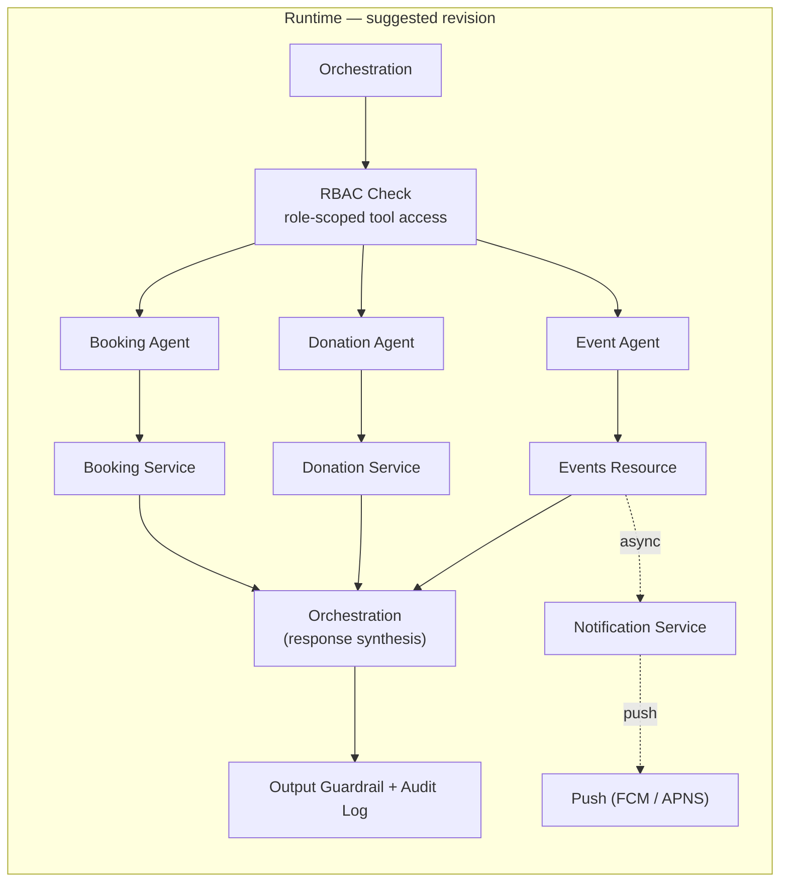

# Aagam Mitra — System Design Review Notes

> Companion to `aagam-mitra-system-design.md`. Original items are kept exactly as shared; suggested improvements are called out separately below each one — nothing here is merged back into the main doc automatically.

---

## Functional Requirements — as shared, with suggestions

1. Ingestion pipeline should be able to read PDFs and text documents.
2. Extracted text should be chunked, embedded, and stored in a vector DB.
3. User should be able to submit natural-language chat in a textbox.
4. User can ask questions about Jain scripture.
5. User can write a prompt to book a poojan slot in the chat box.
6. User can donate by writing in the chatbox.
7. User should get notified when an event is about to take place.
8. User can see a list of events happening in the temple.
9. For payment handling, there should be a human in the loop.

**Suggested additions:**
- Scripture/RAG answers (item 4) should decline or hedge when retrieval confidence is below a defined threshold, rather than hallucinate — currently unstated.
- Since chat is the only entry point, consider whether a small set of high-value reads (e.g. "my bookings," temple timings) need a fallback path if the LLM/agent layer is degraded — otherwise an LLM outage takes down everything, including things that don't need generation.

## Non-Functional Requirements — as shared, with suggestions

1. System should be highly available — targeting 99.99%.
   - *Suggestion:* consider splitting this — 99.99% for booking/donation, but the chat/RAG path (dependent on a third-party LLM vendor) may only realistically hold 99.9%. One blended number may hide that dependency.
2. System should have low latency.
   - *Suggestion:* no target is stated. An interviewer will ask for a number — and it should likely differ for chat (LLM-bound, seconds) vs. booking/donation (DB-bound, milliseconds).
3. System should have strong consistency, since it provides a booking system.
   - *Suggestion:* strong consistency fits slot booking, but donation/payment usually wants idempotent-at-least-once, not strict consistency — worth stating which model applies to which action.
4. System should be able to handle concurrency for the booking system.
   - *Suggestion:* names the problem but not the mechanism. Pick one (optimistic locking with a version column is the common default) and be ready to justify it.
5. System should be secure enough — input guardrails and output guardrails required.
   - *Suggestion:* also consider RBAC before tool dispatch (should a devotee reach admin-only tools?) and PII-masked audit logging, both implied by "secure enough" but not stated.
6. Data isolation — separate databases for knowledge base, context history, and chat history.
   - *Suggestion:* booking and donation/payment aren't mentioned here — confirm whether they're covered under "knowledge base" separation or need their own line.
7. Payments must handle idempotency.
   - *Suggestion:* state the mechanism — e.g. a server-issued idempotency key with a TTL, checked before the payment gateway call executes.
8. System should be scalable enough.
   - *Suggestion:* specify what scales independently — e.g. stateless orchestration/API tier vs. vector DB vs. payment DB.
9. System should be cost-effective.
   - *Suggestion:* name the actual cost driver (LLM + vector DB calls, not compute) so this requirement is testable rather than aspirational.
10. Observability for every agent and every flow in the system.
    - *Suggestion:* specify what "observability" includes — structured audit logs (PII-masked), distributed tracing across orchestration → agent → service hops.

## Diagram — suggested revision

The shared diagram has one ambiguous element: a single `Guardrails` box between `Orchestration` and the three agents, with the pre/post intent unclear. Suggested revision, splitting it into three concrete touchpoints (matching the pattern already built in Aagam Mitra's own `security.py`):

Why:
- **RBAC Check** before tool dispatch — a devotee shouldn't be able to reach an admin-only tool via a crafted prompt.
- **Output Guardrail + Audit Log** after the orchestration layer composes its final reply — catches unsafe/leaky output and logs every request, separate from the input-side guardrail already in the shared diagram.
- **Notification Service** — FR7 (event notifications) is a proactive push, not something that fits inside the request/response loop, so it's drawn as an async fan-out from `Events Resource` rather than a chat response.
- A cache in front of the vector DB is also worth considering for repeated/hot queries, tying back to the cost-effectiveness NFR — not drawn here to keep this revision focused on the guardrail ambiguity.
