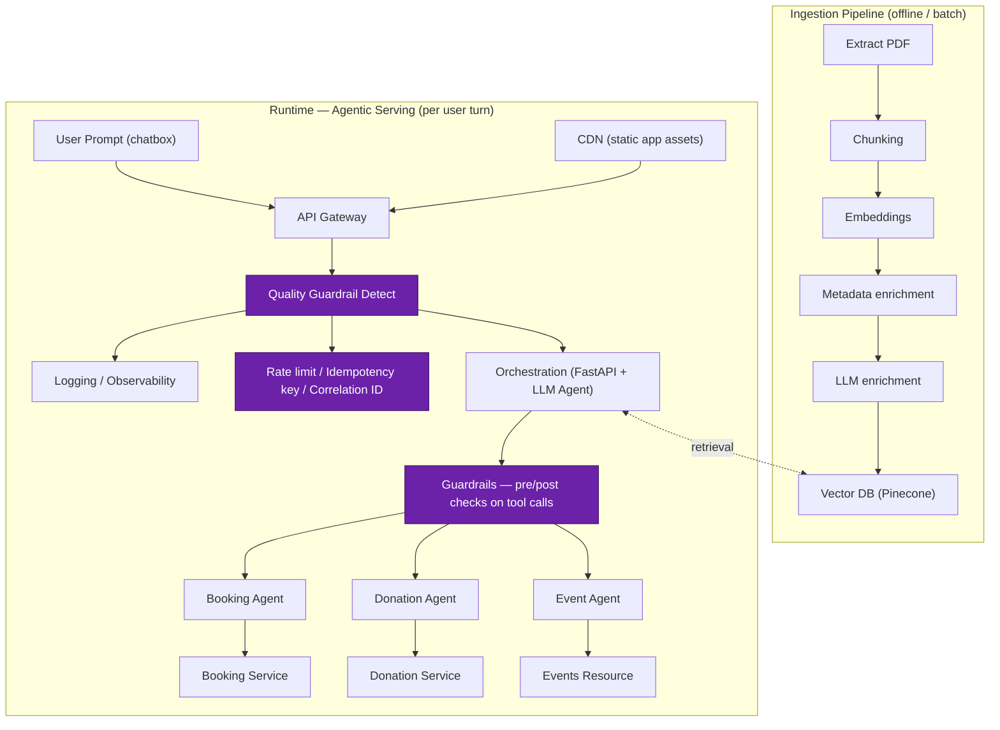

# Aagam Mitra — System Design (Interview Prep Draft)

> Working draft for system design interview practice, modeled on the Aagam Mitra RAG + agentic assistant.

---

## Functional Requirements

1. Ingestion pipeline should be able to read PDFs and text documents.
2. Extracted text should be chunked, embedded, and stored in a vector DB.
3. User should be able to submit natural-language chat in a textbox.
4. User can ask questions about Jain scripture.
5. User can write a prompt to book a poojan slot in the chat box.
6. User can donate by writing in the chatbox.
7. User should get notified when an event is about to take place.
8. User can see a list of events happening in the temple.
9. For payment handling, there should be a human in the loop.

## Non-Functional Requirements

1. System should be highly available — targeting 99.99%.
2. System should have low latency.
3. System should have strong consistency, since it provides a booking system.
4. System should be able to handle concurrency for the booking system.
5. System should be secure enough — input guardrails and output guardrails required.
6. Data isolation — separate databases for knowledge base, context history, and chat history.
7. Payments must handle idempotency.
8. System should be scalable enough.
9. System should be cost-effective.
10. Observability for every agent and every flow in the system.

**Scope note:** chat is the only entry point (chatbox only, no separate UI actions). WhatsApp integration is a future channel, deferred for now.

## Back-of-the-Envelope Math

**Traffic**
- Population: 40M Jains in India. Realistic adoption for estimation → DAU = 4M (10%).
- 100 req/day/user → Total = 4M × 100 = 400M req/day.
- Avg QPS = 400M / 86,400 ≈ 4,630 QPS.
- Peak (×4 for evening aarti/prayer-time concentration) ≈ 18,500 QPS.

Since chat is the only entry point, every request passes through the orchestration/LLM hop — no per-feature traffic split.

**Sizing the orchestration/LLM tier — Little's Law**
- A chat turn holds ~2.5s end-to-end (embedding + vector retrieval + LLM generation).
- `L = λ × W` → Concurrent in-flight requests at peak = 18,500 × 2.5 ≈ 46,000 concurrent requests.
- Reality check: managed LLM APIs (e.g. Groq) cap out far below this in requests/minute on a given tier — **the real ceiling is third-party rate limits (Groq, Pinecone), not your own server count.** Options: self-hosted inference, multi-vendor fallback, aggressive caching, or a phased rollout instead of provisioning for 100% adoption on day one.

**Downstream tool execution (qualitative — cost diverges after the LLM picks a tool)**
- Booking: needs locking (optimistic or row-level) to prevent double-booking under concurrent requests.
- Donation: needs idempotency key + external payment-gateway round trip + human confirmation step.
- Scripture / system info: cache-friendly, cheap once intent is classified.

**Storage**
- Corpus: 100K PDFs, ~100K chars/doc extractable text → ~1×10¹⁰ chars total.
- At ~2.5 bytes/char (Devanagari/Gujarati script in UTF-8, not 1 byte/char ASCII) → **~25GB raw text.**
- Chunking: 800-char chunks, 100 overlap → stride 700 → ~143 chunks/doc × 100K docs ≈ **14.3M chunks.**
- Vector storage: 14.3M × 8KB (2048-dim float32 vector) ≈ 114GB + ~14GB metadata ≈ 128GB, × 1.5 index overhead (HNSW) ≈ **~190GB vector index.**

## Architecture Diagram

> Note: `Guardrails` is placed between `Orchestration` and the three agents (gating tool calls before execution) — this was ambiguous in the original sketch and may need correcting once confirmed.
