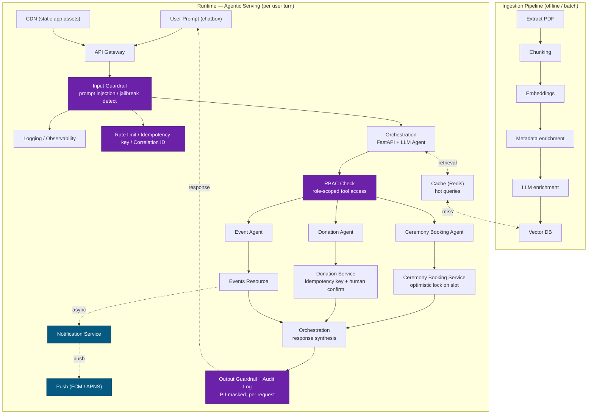

# System Design — Scripture Sage

*Part of the System Design Interview Playbook*

> A chat-only RAG + agentic assistant for a place of worship: scripture Q&A grounded in retrieval, ceremony-slot booking, and donations — all through natural-language chat, no separate UI actions. (Modeled on a real Jain-temple assistant; renamed and de-jargoned here so the design reads clearly to any interviewer, regardless of background.)

---

## Table of Contents

1. [Functional Requirements](#1-functional-requirements)
2. [Non-Functional Requirements](#2-non-functional-requirements)
3. [Back-of-the-Envelope Math](#3-back-of-the-envelope-math)
4. [Architecture Diagram](#4-architecture-diagram)

---

## 1. Functional Requirements

1. Ingestion pipeline should be able to read PDFs and text documents.
2. Extracted text should be chunked, embedded, and stored in a vector DB.
3. User should be able to submit natural-language chat in a textbox.
4. User can ask questions about scripture, answered from retrieved source text.
5. User can write a prompt to book a ceremony slot in the chat box.
6. User can donate by writing in the chatbox.
7. User should get notified when an event is about to take place.
8. User can see a list of events happening at the temple.
9. For payment handling, there must be a human in the loop before the transaction executes.
10. Scripture answers must decline or hedge when retrieval confidence is below a defined threshold, rather than hallucinate.
11. If the LLM/agent layer is degraded or unavailable, a small set of high-value read queries (e.g. "my bookings," temple timings) should still be answerable via a lightweight fallback path — since chat is the only entry point, this is the only way those reads survive an LLM outage.

**Scope note:** chat is the only entry point (chatbox only, no separate UI actions/forms). A messaging-platform channel (e.g. WhatsApp) is a future extension, deferred for now.

---

## 2. Non-Functional Requirements

| # | Requirement | Detail |
|---|---|---|
| 1 | Availability | 99.99% for the booking/donation path; 99.9% acceptable for the chat/RAG path — an LLM vendor outage shouldn't take down transactions. |
| 2 | Latency | Chat/RAG p99 ≤ 3s; transactional (booking, donation, event listing) p99 ≤ 300ms. |
| 3 | Consistency | Strong consistency + locking on slot inventory (no double-booking); at-least-once with an idempotency key on payment (retries must be safe, not blocked); eventual consistency acceptable for chat history and audit logs. |
| 4 | Concurrency | Optimistic locking (version column, retry-on-conflict) on slot inventory by default; a short-lived distributed lock only if a small number of slots see disproportionate contention. |
| 5 | Security | Input guardrails (prompt injection/jailbreak detection) before any LLM call; RBAC before tool dispatch; output guardrails + PII-masked audit logging on every response. |
| 6 | Data isolation | Four separate stores: booking DB, donation/payment DB, chat/context history DB, and the vector DB — no shared schema or instance. |
| 7 | Idempotency | Every payment request carries a server-issued idempotency key with a TTL, checked before the payment gateway call executes. |
| 8 | Scalability | Orchestration/API tier is stateless and horizontally scalable; vector DB and payment DB scale independently of chat traffic. |
| 9 | Cost-effectiveness | LLM and vector DB calls are the dominant marginal cost, not compute — mitigate with caching on repeated queries and a smaller/cheaper model for intent classification vs. a larger model only for generation. |
| 10 | Observability | Structured, PII-masked audit log per tool invocation; distributed tracing across the orchestration → agent → service hops. |

---

## 3. Back-of-the-Envelope Math

**Traffic**
- Population: 40M in the target community. Realistic adoption for estimation → DAU = 4M (10%), not 100%.
- 100 req/day/user → Total = 4M × 100 = 400M req/day.
- Avg QPS = 400M / 86,400 ≈ 4,630 QPS.
- Peak (×4 for evening prayer-time concentration) ≈ 18,500 QPS.

Since chat is the only entry point, every request passes through the orchestration/LLM hop — no per-feature traffic split.

**Sizing the orchestration/LLM tier — Little's Law**
- A chat turn holds ~2.5s end-to-end (embedding + vector retrieval + LLM generation).
- `L = λ × W` → Concurrent in-flight requests at peak = 18,500 × 2.5 ≈ 46,000 concurrent requests.
- Reality check: managed LLM APIs cap out far below this in requests/minute on a given tier — **the real ceiling is third-party rate limits (LLM provider, vector DB), not your own server count.** Options: self-hosted inference, multi-vendor fallback, aggressive caching, or a phased rollout instead of provisioning for 100% adoption on day one.

**Downstream tool execution (qualitative — cost diverges after the LLM picks a tool)**
- Booking: needs locking to prevent double-booking under concurrent requests.
- Donation: needs idempotency key + external payment-gateway round trip + human confirmation step.
- Scripture / event listing: cache-friendly, cheap once intent is classified.
- At ~1,000 QPS/server for lightweight CRUD, the post-agent execution layer needs only a handful of servers even at peak — the bottleneck stays the orchestration/LLM hop above, not this tier.

**Storage**
- Corpus: 100K source documents, ~100K chars/doc extractable text → ~1×10¹⁰ chars total.
- At ~2.5 bytes/char (non-Latin script in UTF-8, not 1 byte/char ASCII) → **~25GB raw text.**
- Chunking: 800-char chunks, 100 overlap → stride 700 → ~143 chunks/doc × 100K docs ≈ **14.3M chunks.**
- Vector storage: 14.3M × 8KB (2048-dim float32 vector) ≈ 114GB + ~14GB metadata ≈ 128GB, × 1.5 index overhead (HNSW) ≈ **~190GB vector index.**

---

## 4. Architecture Diagram

**Key design decisions reflected above:**
- **Input guardrail** right after the gateway (catches injection/jailbreak before any LLM call), separate from **RBAC check** before tool dispatch (role-scoped access), separate again from **output guardrail + audit log** after the orchestration layer composes its final reply.
- **Notification Service** is an async fan-out from `Events Resource` — event alerts are a proactive push, not a chat response, so they don't sit inside the request/response loop.
- **Cache** in front of the vector DB for repeated/hot queries, directly supporting the cost-effectiveness NFR.
- The full agent loop is drawn explicitly: services return to `Orchestration`, which synthesizes the final reply before the output guardrail runs — not left as an implicit return path.
