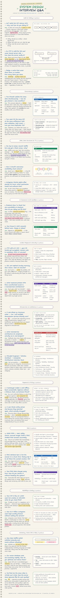

# System Design Interview Q&A — Handwritten Notes

<picture>
  <source media="(prefers-color-scheme: dark)" srcset="handwritten-notes/qa-notes-dark.png">
  <source media="(prefers-color-scheme: light)" srcset="handwritten-notes/qa-notes-light.png">
  
</picture>

---

*Condensed from [system-design-interview-answers.md](../system-design-interview-answers.md) — short answer + core mechanism per question, not the full technical depth. Editable source lives at [`handwritten-notes/qa-source.html`](handwritten-notes/qa-source.html) — open it in a browser to view/update it directly (append `?theme=dark` or `?theme=light` to the URL to preview a specific theme); regenerate the PNGs above after edits.*
